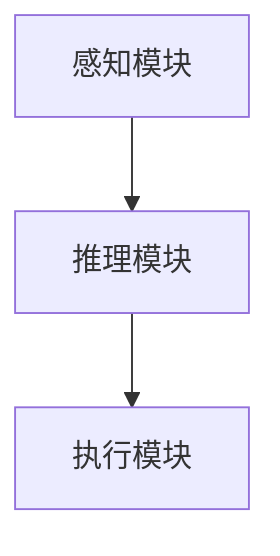
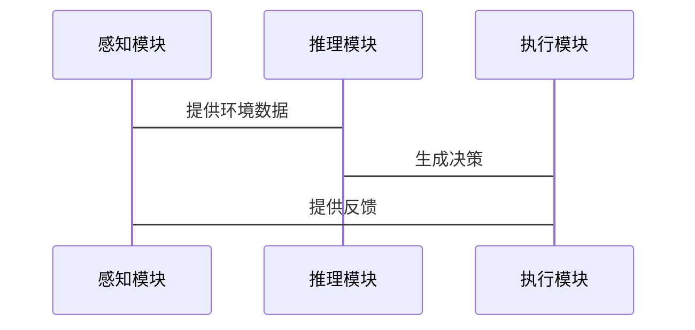

                 


# 构建AI Agent的认知计算神经网络

> 关键词：认知计算，AI Agent，神经网络，深度学习，注意力机制，强化学习，系统架构

> 摘要：认知计算神经网络是实现AI Agent的核心技术，本文将从基础概念、算法原理、系统设计、项目实战到高级主题，全面解析如何构建具备认知能力的AI Agent。通过详细讲解认知计算神经网络的原理、算法实现、系统架构及实际应用，帮助读者掌握构建智能Agent的必备知识和技能。

---

# 第1章: 认知计算神经网络概述

## 1.1 认知计算的基本概念

### 1.1.1 认知计算的定义
认知计算是一种模拟人类认知过程的计算范式，旨在通过神经网络等技术实现类似人类的学习、推理和决策能力。

### 1.1.2 认知计算的核心特征
- **生物启发性**：模拟人脑神经网络的结构和功能。
- **自适应性**：能够根据环境变化调整自身行为。
- **分布式计算**：信息处理分布在多个节点或层次中。

### 1.1.3 认知计算与传统计算的对比
| 特性             | 传统计算         | 认知计算         |
|------------------|------------------|------------------|
| 数据处理方式     | 线性、规则驱动   | 非线性、经验驱动 |
| 学习能力         | 无               | 有               |
| 环境适应性       | 低               | 高               |

## 1.2 AI Agent的基本概念

### 1.2.1 AI Agent的定义
AI Agent是一种能够感知环境、自主决策并采取行动的智能实体。

### 1.2.2 AI Agent的分类
- **简单反射型Agent**：基于简单的规则做出反应。
- **基于模型的反射型Agent**：使用内部模型来规划和推理。
- **目标驱动型Agent**：根据目标选择最优行动。
- **实用驱动型Agent**：通过效用函数优化决策。

### 1.2.3 AI Agent的核心能力
- **感知能力**：通过传感器获取环境信息。
- **推理能力**：基于感知信息进行逻辑推理。
- **决策能力**：根据推理结果做出最优决策。
- **学习能力**：通过经验改进性能。

## 1.3 认知计算神经网络的背景

### 1.3.1 神经科学的启发
认知计算神经网络的设计灵感来源于人脑的神经网络结构，例如神经元和突触的连接方式。

### 1.3.2 人工智能的发展历程
从符号逻辑推理到连接主义，再到深度学习，认知计算神经网络是人工智能发展的最新阶段。

### 1.3.3 认知计算的兴起
随着神经科学、计算机科学和数学的进步，认知计算逐渐成为AI领域的研究热点。

## 1.4 本章小结
本章介绍了认知计算的基本概念、AI Agent的定义及其核心能力，并探讨了认知计算神经网络的背景和发展趋势。

---

# 第2章: 认知计算神经网络的核心原理

## 2.1 神经网络的基本结构

### 2.1.1 神经元模型
神经元模型是认知计算神经网络的基础，常用的模型包括：

- **Perceptron（感知器）**：单层神经网络，用于线性分类。
- **Sigmoid神经元**：引入非线性激活函数，能够表示复杂的决策边界。
- **ReLU神经元**：解决梯度消失问题，提高训练效率。

### 2.1.2 神经网络的层次结构
神经网络通常由输入层、隐藏层和输出层组成，每层之间通过权重矩阵连接。

### 2.1.3 神经网络的激活函数
激活函数决定了神经网络的非线性性质，常见的激活函数包括Sigmoid、ReLU和Tanh。

## 2.2 注意力机制与记忆机制

### 2.2.1 注意力机制的原理
注意力机制通过计算输入序列中每个位置的重要性，聚焦于关键信息。其数学表达式如下：
$$
\text{Attention}(Q, K, V) = \text{softmax}\left(\frac{QK^T}{\sqrt{d_k}}\right)V
$$

### 2.2.2 记忆机制的实现
记忆机制通过记忆单元（如LSTM中的记忆单元）存储长期信息，帮助模型处理序列数据中的长程依赖。

### 2.2.3 注意力与记忆的结合
通过将注意力机制嵌入到记忆单元中，可以实现更强大的信息处理能力，例如Transformer架构。

## 2.3 认知计算神经网络的信息处理流程

### 2.3.1 输入处理
输入数据通常经过预处理（如归一化、特征提取）后输入网络。

### 2.3.2 网络计算
神经网络通过前向传播计算输出结果，每层的输出为下一层的输入。

### 2.3.3 输出解释
输出结果需要根据具体任务进行解释，例如分类任务的输出概率分布。

## 2.4 本章小结
本章详细讲解了神经网络的基本结构、注意力机制和记忆机制，以及认知计算神经网络的信息处理流程。

---

# 第3章: 深度学习模型的算法原理

## 3.1 深度学习的基本概念

### 3.1.1 深度学习的定义
深度学习是一种基于人工神经网络的机器学习方法，通过多层非线性变换提取数据特征。

### 3.1.2 深度学习的核心算法
- **卷积神经网络（CNN）**：适用于图像处理。
- **循环神经网络（RNN）**：适用于序列数据处理。
- **Transformer模型**：基于注意力机制的深度学习模型。

### 3.1.3 深度学习与浅层学习的对比
浅层学习依赖人工特征工程，而深度学习能够自动提取特征。

## 3.2 神经网络的训练过程

### 3.2.1 前向传播
输入数据通过网络层进行计算，得到输出结果。

### 3.2.2 损失函数
损失函数衡量预测值与真实值的差距，常用的损失函数包括交叉熵损失和均方误差。

### 3.2.3 反向传播与梯度下降
通过链式法则计算梯度，并利用优化算法（如随机梯度下降）更新权重参数。

## 3.3 常见的深度学习模型

### 3.3.1 卷积神经网络
CNN通过卷积层提取空间特征，常用于图像分类任务。

### 3.3.2 循环神经网络
RNN通过循环层处理序列数据，常用于自然语言处理任务。

### 3.3.3 Transformer模型
Transformer基于自注意力机制，广泛应用于机器翻译和文本生成任务。

## 3.4 本章小结
本章介绍了深度学习的基本概念、神经网络的训练过程，以及常见的深度学习模型。

---

# 第4章: AI Agent的系统功能设计

## 4.1 问题场景介绍

### 4.1.1 AI Agent的应用场景
- **自然语言处理**：文本分类、机器翻译。
- **计算机视觉**：图像识别、目标检测。
- **机器人控制**：自主导航、人机交互。

### 4.1.2 认知计算神经网络的系统目标
设计一个能够感知环境、自主决策并采取行动的智能系统。

### 4.1.3 系统的输入输出描述
- **输入**：环境感知数据（如图像、文本）。
- **输出**：决策结果（如动作、预测值）。

## 4.2 系统功能设计

### 4.2.1 系统功能模块划分
- **感知模块**：负责获取环境信息。
- **推理模块**：负责逻辑推理和决策。
- **执行模块**：负责执行决策结果。

### 4.2.2 功能模块之间的关系
感知模块向推理模块提供数据，推理模块根据数据生成决策，执行模块根据决策采取行动。

### 4.2.3 功能模块的实现方式
- **感知模块**：使用深度学习模型进行特征提取。
- **推理模块**：基于认知计算神经网络进行决策。
- **执行模块**：通过控制接口执行动作。

## 4.3 系统架构设计

### 4.3.1 系统架构图


### 4.3.2 模块内部结构
- **感知模块**：包括数据采集、预处理和特征提取。
- **推理模块**：包括特征匹配、注意力计算和决策生成。
- **执行模块**：包括动作规划、执行控制和结果反馈。

## 4.4 本章小结
本章详细描述了AI Agent的系统功能设计，包括功能模块划分、模块关系和系统架构设计。

---

# 第5章: 系统接口设计与交互

## 5.1 系统接口设计

### 5.1.1 接口定义
- **输入接口**：接收环境感知数据。
- **输出接口**：输出决策结果。

### 5.1.2 接口协议
常用的接口协议包括HTTP、WebSocket和RPC。

## 5.2 系统交互设计

### 5.2.1 交互流程
1. 感知模块接收环境数据。
2. 推理模块根据数据进行推理。
3. 执行模块根据推理结果采取行动。

### 5.2.2 交互顺序


## 5.3 本章小结
本章介绍了系统接口设计与交互流程，包括接口定义、协议选择和交互顺序。

---

# 第6章: 项目实战与实现

## 6.1 环境安装

### 6.1.1 安装Python
```bash
python --version
```

### 6.1.2 安装深度学习框架
```bash
pip install tensorflow
pip install keras
pip install numpy
pip install matplotlib
```

## 6.2 系统核心实现

### 6.2.1 感知模块实现
```python
import numpy as np
import tensorflow as tf

# 定义感知模型
model = tf.keras.Sequential([
    tf.keras.layers.Conv2D(32, (3,3), activation='relu', input_shape=(224,224,3)),
    tf.keras.layers.MaxPooling2D((2,2)),
    tf.keras.layers.Conv2D(64, (3,3), activation='relu'),
    tf.keras.layers.MaxPooling2D((2,2)),
    tf.keras.layers.Flatten(),
    tf.keras.layers.Dense(128, activation='relu'),
    tf.keras.layers.Dense(1, activation='sigmoid')
])
```

### 6.2.2 推理模块实现
```python
# 定义注意力机制
def attention(query, key, value):
    scores = tf.matmul(query, key, transpose_b=True)
    scores = scores / tf.sqrt(tf.cast(value.shape[-1], tf.float32))
    attention_weights = tf.nn.softmax(scores, axis=-1)
    output = tf.matmul(attention_weights, value)
    return output
```

### 6.2.3 执行模块实现
```python
# 定义执行策略
def execute_action(action):
    if action == 'forward':
        # 前进
        print("Moving forward")
    elif action == 'backward':
        # 后退
        print("Moving backward")
    # 其他动作类似
```

## 6.3 案例分析

### 6.3.1 图像分类案例
使用CNN模型对图像进行分类，输出类别概率。

### 6.3.2 机器翻译案例
使用Transformer模型对文本进行翻译，输出目标语言文本。

## 6.4 本章小结
本章通过实际项目案例，详细讲解了认知计算神经网络的实现过程，包括环境安装、核心代码实现和案例分析。

---

# 第7章: 高级主题与最佳实践

## 7.1 认知神经网络的前沿技术

### 7.1.1 图神经网络
图神经网络用于处理图结构数据，能够有效捕捉数据之间的关系。

### 7.1.2 多模态学习
多模态学习通过结合多种数据类型（如文本、图像）提高模型的表达能力。

## 7.2 系统优化与调优

### 7.2.1 模型优化
- **参数调整**：优化学习率、批量大小等超参数。
- **模型剪枝**：去除冗余参数，减少计算量。

### 7.2.2 性能调优
- **并行计算**：利用多GPU加速训练。
- **模型压缩**：通过量化等技术减少模型体积。

## 7.3 部署与应用

### 7.3.1 模型部署
将训练好的模型部署到实际应用中，例如通过API提供服务。

### 7.3.2 应用案例
- **自动驾驶**：实时感知环境并做出决策。
- **智能助手**：通过自然语言处理提供服务。

## 7.4 本章小结
本章探讨了认知神经网络的前沿技术、系统优化方法和实际应用案例。

---

# 附录: 常用工具与库

## 附录A: 深度学习框架
- TensorFlow
- Keras
- PyTorch

## 附录B: 可视化工具
- TensorBoard
- Visdom
- Plotly

---

# 参考文献

1. LeCun, Y., Bengio, Y., & Hinton, G. (2015). Deep learning.nature.
2. Vaswani, A., et al. (2017). Attention is all you need.NeurIPS.
3. Goodfellow, I., Bengio, Y., & Courville, A. (2016).Deep learning.MIT Press.

---

# 作者

作者：AI天才研究院/AI Genius Institute & 禅与计算机程序设计艺术 /Zen And The Art of Computer Programming

