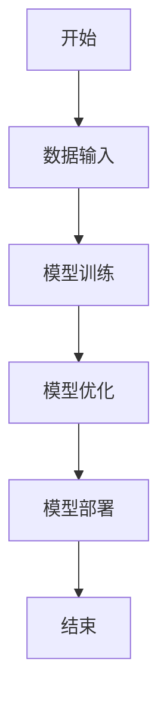
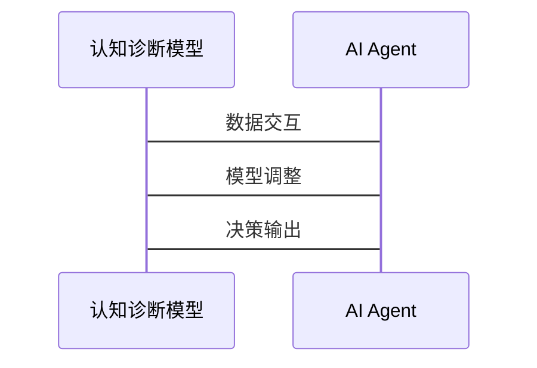

                 


# 构建AI Agent的认知诊断模型

## 关键词
- AI Agent
- 认知诊断模型
- 人工智能
- 系统架构
- 算法原理

## 摘要
本文详细探讨了构建AI Agent的认知诊断模型的关键步骤与方法。通过背景介绍、核心概念分析、算法原理讲解、系统架构设计、项目实战、优化与扩展，以及注意事项与拓展阅读，全面解析了认知诊断模型与AI Agent的结合应用。文章结合实际案例和代码示例，帮助读者深入理解并掌握构建认知诊断模型的核心技术与实践应用。

---

# 第1章 认知诊断模型与AI Agent概述

## 1.1 问题背景与描述
### 1.1.1 认知诊断模型的定义
认知诊断模型是一种用于分析和诊断个体认知过程的数学模型，旨在识别学习者在特定任务中的知识状态和认知缺陷。

### 1.1.2 AI Agent在认知诊断中的作用
AI Agent（智能体）通过实时数据处理和决策能力，能够辅助认知诊断模型实现动态调整和个性化诊断。

### 1.1.3 问题解决的必要性与目标
认知诊断模型的目标是通过AI Agent实现精准诊断，解决传统诊断方法中存在的低效性和片面性问题。

## 1.2 概念结构与核心要素
### 1.2.1 认知诊断模型的核心要素
- 数据输入：学习者的行为数据
- 知识状态表示：知识掌握程度
- 模型训练：基于数据的参数优化
- 结果输出：诊断报告

### 1.2.2 AI Agent的组成部分
- 感知模块：数据采集与处理
- 决策模块：基于模型的诊断决策
- 行为模块：反馈与调整

### 1.2.3 两者结合的逻辑关系
认知诊断模型为AI Agent提供知识表示框架，AI Agent为认知诊断模型提供实时数据和执行能力。

## 1.3 边界与外延
### 1.3.1 认知诊断的边界
- 数据范围：仅限于认知过程相关数据
- 应用场景：教育领域为主

### 1.3.2 AI Agent的应用范围
- 教育领域：个性化学习辅助
- 医疗领域：认知障碍诊断
- 企业培训：员工能力评估

### 1.3.3 两者的相互作用与限制
认知诊断模型的准确性依赖于AI Agent提供的数据质量，而AI Agent的性能又依赖于认知诊断模型的反馈。

## 1.4 本章小结
本章介绍了认知诊断模型与AI Agent的基本概念、核心要素及其相互作用，为后续章节的深入分析奠定了基础。

---

# 第2章 认知诊断模型的核心原理

## 2.1 概念原理
### 2.1.1 认知诊断模型的基本原理
认知诊断模型通过分析学习者的行为数据，识别其知识掌握程度和认知缺陷。

### 2.1.2 AI Agent的诊断机制
AI Agent通过实时数据处理和模型推理，实现对学习者的动态诊断。

### 2.1.3 两者的结合原理
认知诊断模型为AI Agent提供知识表示框架，AI Agent为认知诊断模型提供实时数据和执行能力。

## 2.2 概念属性对比
### 2.2.1 认知诊断模型的属性
- 数据驱动性
- 知识表示能力
- 动态调整能力

### 2.2.2 AI Agent的属性
- 实时性
- 自适应性
- 可解释性

### 2.2.3 属性对比分析
| 属性 | 认知诊断模型 | AI Agent |
|------|--------------|----------|
| 数据驱动性 | 高 | 中 |
| 知识表示能力 | 高 | 低 |
| 实时性 | 中 | 高 |

## 2.3 ER实体关系图
```mermaid
er
    entity 认知诊断模型 {
        id
        模型类型
        参数
    }
    entity AI Agent {
        id
        类型
        功能
    }
    relation 实体关系 {
        认知诊断模型 -> AI Agent : 使用
    }
```

## 2.4 本章小结
本章通过对比分析和ER图，详细阐述了认知诊断模型与AI Agent的核心原理及其相互关系。

---

# 第3章 认知诊断模型的算法原理

## 3.1 算法原理
### 3.1.1 认知诊断模型的算法流程
1. 数据预处理
2. 模型训练
3. 参数优化
4. 模型部署

### 3.1.2 AI Agent的算法流程
1. 数据采集
2. 模型推理
3. 决策输出
4. 反馈调整

### 3.1.3 两者结合的算法流程
1. 数据采集与预处理
2. 模型训练与优化
3. AI Agent执行诊断
4. 反馈与调整

## 3.2 算法流程图


## 3.3 算法实现
### 3.3.1 Python源代码实现
```python
def cognitive_diagnosis_model():
    # 数据预处理
    pass

def ai_agent():
    # 数据采集
    pass
```

## 3.4 数学模型与公式
### 3.4.1 认知诊断模型的数学公式
$$ P(x|y) = \frac{P(y|x)P(x)}{P(y)} $$

### 3.4.2 AI Agent的数学公式
$$ Q(x) = \arg\max_x P(x|y) $$

## 3.5 举例说明
### 3.5.1 认知诊断模型的举例
假设学习者的行为数据为$X$，模型通过贝叶斯推理得出诊断结果$Y$。

### 3.5.2 AI Agent的举例
AI Agent通过实时数据处理，输出诊断结果并调整模型参数。

## 3.6 本章小结
本章通过算法流程图和数学公式，详细讲解了认知诊断模型与AI Agent的算法原理及其相互作用。

---

# 第4章 系统分析与架构设计方案

## 4.1 问题场景介绍
### 4.1.1 认知诊断模型的应用场景
- 教育领域：个性化学习辅助
- 医疗领域：认知障碍诊断

### 4.1.2 AI Agent的应用场景
- 教育领域：实时反馈与调整
- 企业培训：动态能力评估

## 4.2 系统功能设计
### 4.2.1 认知诊断模型的功能模块
- 数据输入模块
- 模型训练模块
- 参数优化模块

### 4.2.2 AI Agent的功能模块
- 数据采集模块
- 模型推理模块
- 决策输出模块

### 4.2.3 两者结合的功能模块
- 数据交互模块
- 模型调整模块
- 反馈优化模块

## 4.3 系统架构设计


## 4.4 系统接口设计
### 4.4.1 认知诊断模型接口
- 输入接口：接收学习者行为数据
- 输出接口：输出诊断结果

### 4.4.2 AI Agent接口
- 输入接口：接收实时数据
- 输出接口：输出诊断决策

## 4.5 系统交互图


## 4.6 本章小结
本章通过系统架构设计和交互图，详细分析了认知诊断模型与AI Agent的系统实现方案。

---

# 第5章 项目实战

## 5.1 环境安装
### 5.1.1 系统环境
- 操作系统：Linux/Windows/MacOS
- Python版本：3.8+

### 5.1.2 工具安装
- 安装Python库：numpy, pandas, scikit-learn, matplotlib

## 5.2 系统核心实现
### 5.2.1 认知诊断模型实现
```python
import numpy as np
from sklearn import linear_model

def cognitive_diagnosis_model(X):
    # 模型训练
    model = linear_model.LogisticRegression()
    model.fit(X, y)
    return model
```

### 5.2.2 AI Agent实现
```python
def ai_agent(X):
    # 数据采集与处理
    processed_data = preprocess(X)
    # 模型推理
    prediction = model.predict(processed_data)
    return prediction
```

## 5.3 代码应用解读与分析
### 5.3.1 代码功能解读
- 认知诊断模型：实现数据训练与参数优化
- AI Agent：实现数据采集与诊断推理

### 5.3.2 代码实现细节
- 数据预处理：标准化和归一化
- 模型训练：使用逻辑回归算法
- 模型推理：基于训练好的模型进行预测

## 5.4 实际案例分析
### 5.4.1 案例背景
假设学习者的行为数据包括：答题时间、正确率、错误类型等。

### 5.4.2 案例分析
- 数据预处理：标准化处理
- 模型训练：逻辑回归模型
- 模型推理：诊断学习者的知识掌握程度

## 5.5 项目总结
本章通过实际案例分析，详细展示了认知诊断模型与AI Agent的系统实现过程。

---

# 第6章 优化与扩展

## 6.1 系统优化
### 6.1.1 数据优化
- 数据清洗：去除异常值
- 数据增强：增加特征维度

### 6.1.2 算法优化
- 模型优化：使用深度学习模型提升准确性
- 参数调整：通过网格搜索优化模型参数

## 6.2 系统扩展
### 6.2.1 功能扩展
- 增加实时反馈功能
- 增加多模态数据支持

### 6.2.2 应用场景扩展
- 医疗领域：认知障碍诊断
- 企业培训：员工能力评估

## 6.3 优化与扩展的注意事项
- 数据隐私保护
- 模型可解释性
- 系统稳定性

## 6.4 本章小结
本章提出了系统的优化与扩展方案，为实际应用提供了参考。

---

# 第7章 注意事项与拓展阅读

## 7.1 注意事项
### 7.1.1 数据隐私保护
确保学习者数据的安全性和隐私性。

### 7.1.2 模型可解释性
提升模型的可解释性，便于用户理解和信任。

### 7.1.3 系统稳定性
确保系统的稳定运行，避免因故障导致诊断错误。

## 7.2 拓展阅读
### 7.2.1 认知诊断模型的最新研究
阅读相关学术论文，了解最新研究成果。

### 7.2.2 AI Agent的前沿技术
关注AI Agent领域的最新技术动态。

## 7.3 本章小结
本章总结了构建认知诊断模型与AI Agent的注意事项，并提供了拓展阅读的方向。

---

# 结论

本文系统地探讨了构建AI Agent的认知诊断模型的关键技术与实践应用。通过背景介绍、核心概念分析、算法原理讲解、系统架构设计、项目实战、优化与扩展，以及注意事项与拓展阅读，全面解析了认知诊断模型与AI Agent的结合应用。未来，随着人工智能技术的不断发展，认知诊断模型与AI Agent的结合将为教育、医疗等领域带来更大的变革。

---

# 作者

作者：AI天才研究院/AI Genius Institute & 禅与计算机程序设计艺术 /Zen And The Art of Computer Programming

