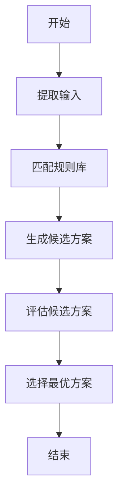
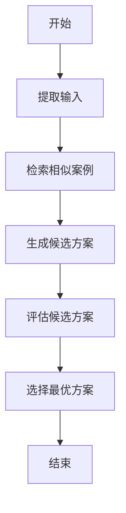
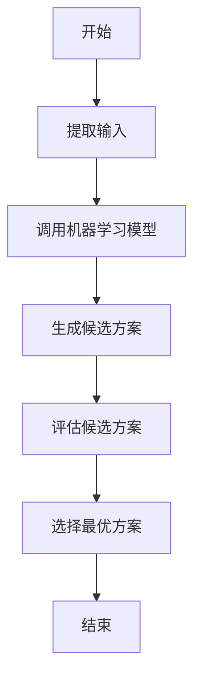
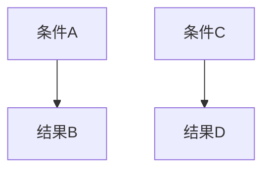
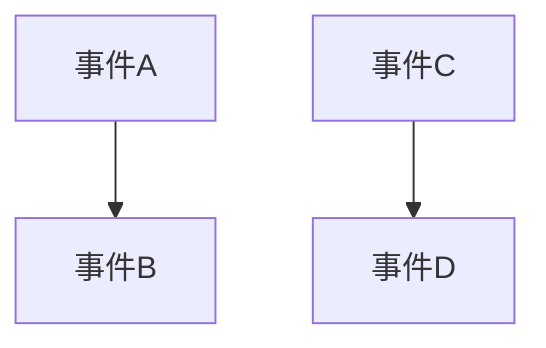
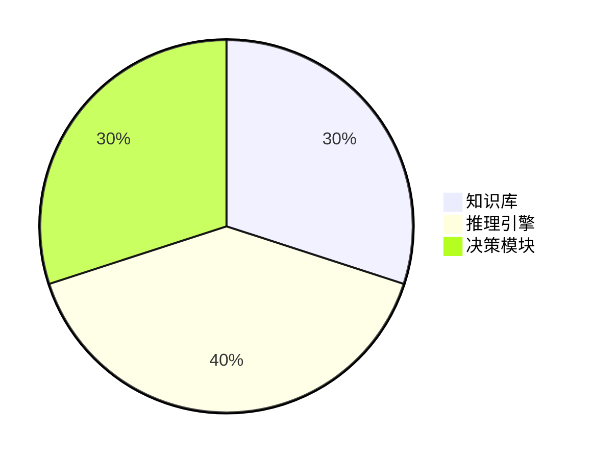
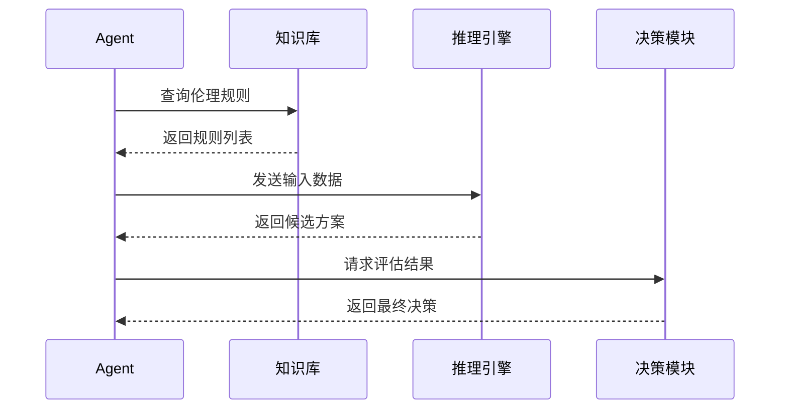

                 


# 构建AI Agent的道德推理与决策系统

## 关键词：AI Agent，道德推理，决策系统，伦理决策，人工智能

## 摘要：本文详细探讨了构建具备道德推理能力的AI Agent决策系统的各个方面。首先介绍了AI Agent和道德推理的基本概念，分析了当前AI Agent在决策系统中的问题与挑战。接着，详细讲解了道德推理的算法原理，包括基于规则、案例和学习的推理方法，并给出了相应的mermaid流程图和Python代码示例。然后，从数学模型的角度，分析了逻辑框架和概率模型在道德推理中的应用。通过系统架构设计，展示了知识库、推理引擎和决策模块的构成，并用mermaid类图描述了各模块之间的关系。最后，通过一个医疗诊断中的伦理决策案例，详细说明了系统实现、功能解读和实际应用，总结了构建AI Agent道德推理与决策系统的最佳实践和未来研究方向。

---

# 第一章: AI Agent与道德推理的背景介绍

## 1.1 问题背景与描述

### 1.1.1 人工智能与AI Agent的发展现状

人工智能（AI）技术近年来取得了飞速发展，AI Agent作为人工智能的核心组成部分，广泛应用于自动驾驶、医疗诊断、金融投资等领域。然而，随着AI Agent在复杂场景中的应用增多，其决策的道德性和伦理性问题日益凸显。例如，在自动驾驶中，AI Agent在紧急情况下的决策可能涉及到生命的选择；在医疗领域，AI Agent的诊断建议可能影响患者的治疗方案。

### 1.1.2 道德推理在AI Agent中的重要性

AI Agent的决策不仅仅需要考虑技术可行性，还需要考虑道德和伦理因素。例如，在自动驾驶中，AI Agent需要在碰撞不可避免时，优先保护谁的生命？在医疗诊断中，AI Agent需要在有限的医疗资源下，如何分配才能最大化患者的利益？这些问题的解决需要AI Agent具备道德推理能力，能够在复杂场景中做出符合伦理的决策。

### 1.1.3 当前AI Agent在决策系统中的问题与挑战

当前，许多AI Agent的决策系统主要基于数据驱动的方法，缺乏对道德和伦理因素的考虑。这导致在某些情况下，AI Agent的决策可能违背人类的道德标准，引发伦理争议。例如，AI Agent可能因为训练数据中的偏差，导致决策结果不公平。此外，如何将道德规范融入AI Agent的决策系统，使其在不同文化、法律和伦理背景下保持一致性，也是一个亟待解决的问题。

## 1.2 核心概念与问题解决

### 1.2.1 AI Agent的基本概念与定义

AI Agent是指具有感知环境、自主决策、执行任务能力的智能体。AI Agent可以是软件程序，也可以是机器人或其他智能设备。AI Agent的核心能力包括感知、推理、规划和执行。

### 1.2.2 道德推理的定义与核心要素

道德推理是指AI Agent在决策过程中，基于伦理规范和道德准则，对可能的决策进行分析和选择的过程。道德推理的核心要素包括：伦理规范的表示、道德准则的推理、决策结果的评估等。

### 1.2.3 问题解决的目标与边界

构建AI Agent的道德推理与决策系统的目标是，使AI Agent在决策过程中能够遵循伦理规范，做出符合人类道德标准的决策。系统的边界包括：仅考虑道德推理相关的决策，不涉及技术实现的细节；仅考虑明确的伦理规范，不涉及复杂的法律问题。

## 1.3 问题的外延与核心要素

### 1.3.1 道德推理系统的组成部分

道德推理系统主要包括：伦理规范库、推理引擎、决策评估模块等部分。

### 1.3.2 决策系统的功能模块

决策系统的主要功能模块包括：环境感知、目标设定、决策推理、决策执行和结果评估。

### 1.3.3 系统的核心属性与特征

系统的核心属性包括：伦理一致性、决策透明性、可解释性等。这些属性确保AI Agent的决策既符合伦理规范，又能够被人类理解和信任。

---

# 第二章: 道德推理与决策系统的概念结构

## 2.1 核心概念原理

### 2.1.1 道德推理的基本原理

道德推理基于伦理规范和道德准则，通过逻辑推理和权衡，选择最优的决策方案。例如，在自动驾驶中，AI Agent需要根据伦理规范，权衡保护车内人员和路边行人的生命价值。

### 2.1.2 决策系统的逻辑框架

决策系统的逻辑框架包括：输入处理、规则匹配、候选方案生成、方案评估和结果输出等步骤。例如，在医疗诊断中，AI Agent需要根据患者的症状，匹配可能的诊断规则，生成候选诊断方案，并根据诊断结果对患者进行治疗建议。

### 2.1.3 AI Agent的行为准则与伦理规范

AI Agent的行为准则包括：诚实守信、公平公正、以人为本等。这些准则为AI Agent的决策提供了道德指南。

## 2.2 概念属性特征对比表

### 表2-1: 道德推理与传统决策系统的属性对比

| 属性 | 道德推理 | 传统决策 |
|------|---------|----------|
| 输入 | 道德规范 | 业务规则 |
| 输出 | 合理决策 | 优化结果 |
| 方法 | 伦理评估 | 数据分析 |
| 目标 | 道德合规 | 效率优化 |

## 2.3 ER实体关系图

### 图2-1: 道德推理与决策系统的ER实体关系图

```mermaid
er
    actor(Agent)
    actor(道德规则库)
    actor(决策模块)
    actor(知识库)
    relation(属于)
    relation(依赖)
    relation(调用)
```

---

# 第三章: 道德推理算法的原理与实现

## 3.1 基于规则的推理算法

### 3.1.1 算法原理

基于规则的推理算法通过匹配输入与预定义的伦理规则，生成候选决策方案。例如，在自动驾驶中，AI Agent需要根据碰撞不可避免的情况，匹配优先保护车内人员的规则，生成紧急刹车的决策方案。

### 3.1.2 mermaid流程图



### 3.1.3 代码实现

```python
def moral_reasoning(rules, input):
    candidates = []
    for rule in rules:
        if rule.matches(input):
            candidates.append(rule.apply(input))
    return select_best_candidate(candidates)
```

---

## 3.2 基于案例的推理算法

### 3.2.1 算法原理

基于案例的推理算法通过相似案例的匹配，生成决策方案。例如，在医疗诊断中，AI Agent需要根据患者的症状，匹配类似病例的诊断结果，生成诊断建议。

### 3.2.2 mermaid流程图



---

## 3.3 基于学习的推理算法

### 3.3.1 算法原理

基于学习的推理算法通过机器学习模型，从历史数据中学习道德决策模式。例如，在金融投资中，AI Agent需要根据历史投资数据，学习在利益相关者之间公平分配投资收益的模式。

### 3.3.2 mermaid流程图



---

# 第四章: 道德推理的数学模型

## 4.1 道德推理的逻辑框架

### 4.1.1 基于逻辑的推理模型

基于逻辑的推理模型通过逻辑表达式，描述道德决策的条件和结果。例如，$如果条件A满足，则结果B发生$。

### 4.1.2 mermaid逻辑图



---

## 4.2 道德推理的概率模型

### 4.2.1 基于概率的推理模型

基于概率的推理模型通过概率分布，评估不同决策方案的风险和收益。例如，$P(A|B) = \frac{P(B|A)P(A)}{P(B)}$。

### 4.2.2 mermaid概率图



---

# 第五章: 系统分析与架构设计

## 5.1 问题场景介绍

### 5.1.1 系统功能描述

系统功能描述包括：环境感知、目标设定、决策推理、决策执行和结果评估。

### 5.1.2 系统功能需求

系统功能需求包括：伦理规范库的构建、推理引擎的实现、决策评估模块的开发等。

## 5.2 系统架构设计

### 5.2.1 系统架构图



---

## 5.3 系统交互设计

### 5.3.1 系统交互序列图



---

# 第六章: 项目实战

## 6.1 环境配置与安装

### 6.1.1 系统环境

建议使用Python 3.8及以上版本，安装必要的库，如`numpy`, `pandas`, `scikit-learn`等。

### 6.1.2 代码实现

```python
class MoralReasoningSystem:
    def __init__(self, rules):
        self.rules = rules

    def reason(self, input):
        candidates = []
        for rule in self.rules:
            if rule.matches(input):
                candidates.append(rule.apply(input))
        return self.select_best_candidate(candidates)
```

---

## 6.2 功能解读与分析

### 6.2.1 功能解读

系统功能包括：环境感知、目标设定、决策推理、决策执行和结果评估。

### 6.2.2 功能分析

功能分析包括：伦理规范的匹配、决策方案的生成、决策结果的评估等。

---

# 第七章: 总结与展望

## 7.1 最佳实践 tips

### 7.1.1 注意事项

在构建AI Agent的道德推理与决策系统时，需要注意伦理规范的多样性、决策系统的透明性和可解释性。

### 7.1.2 注意事项

确保系统的可扩展性，以便在不同文化和法律背景下进行调整。

## 7.2 小结

本文详细探讨了构建具备道德推理能力的AI Agent决策系统的各个方面，包括核心概念、算法原理、系统架构和实际应用。

## 7.3 注意事项

在实际应用中，需要结合具体场景，灵活调整系统的参数和规则。

## 7.4 拓展阅读

推荐阅读相关书籍和论文，深入了解道德推理和AI决策系统的前沿研究。

---

# 作者

作者：AI天才研究院/AI Genius Institute & 禅与计算机程序设计艺术 /Zen And The Art of Computer Programming

---

**本文为构建AI Agent的道德推理与决策系统提供了一个全面的技术框架和实现方案，通过理论分析和实际案例的结合，深入探讨了AI Agent在道德推理和决策系统中的核心问题。**

