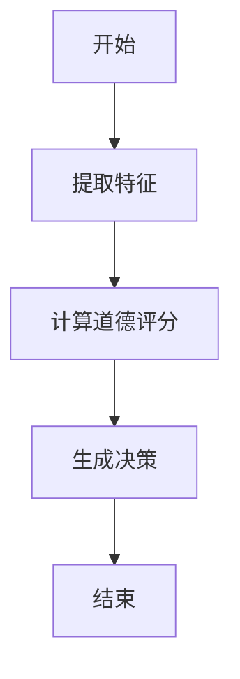
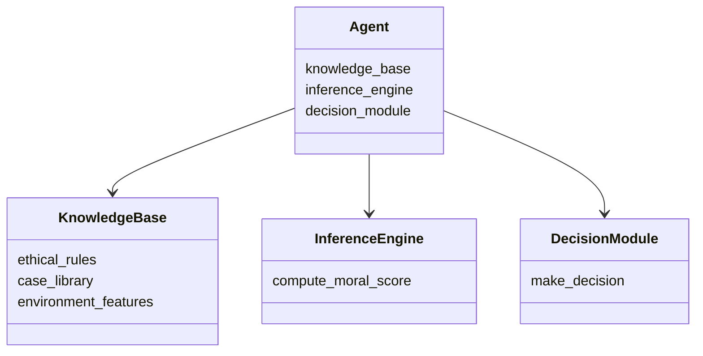
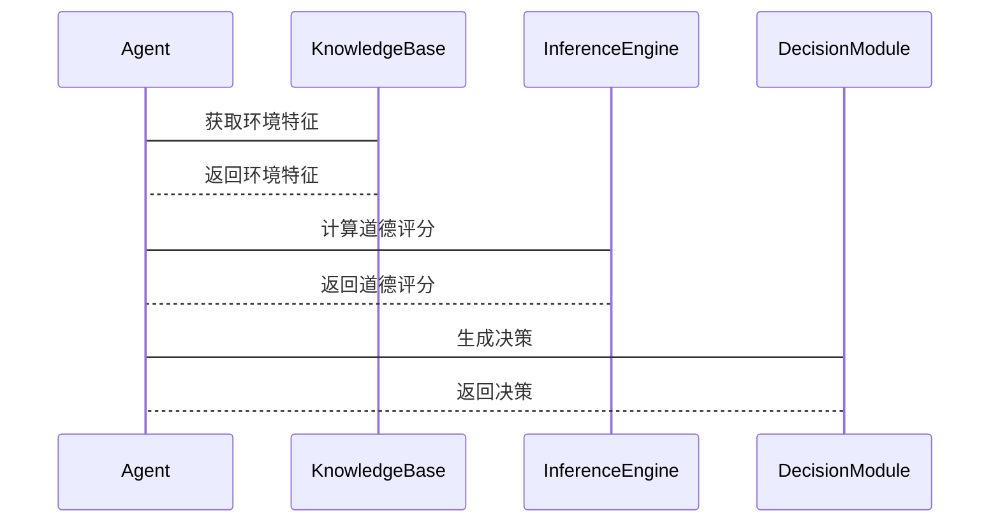

                 


# 构建AI Agent的道德推理框架

## 关键词：AI Agent, 道德推理, 伦理规则, 决策系统, 人工智能, 系统架构

## 摘要：
本文系统地探讨了构建AI Agent道德推理框架的各个方面。从基本概念到算法实现，从系统架构到项目实战，详细阐述了AI Agent如何进行道德推理。通过介绍不同类型的道德推理模型、算法流程图、系统架构图和代码实现，本文为读者提供了一个全面的理解框架，帮助构建具备道德推理能力的AI Agent。

---

# 第一部分: AI Agent的道德推理框架概述

## 第1章: AI Agent与道德推理概述

### 1.1 AI Agent的基本概念
AI Agent（人工智能代理）是指能够感知环境、自主决策并采取行动以实现目标的智能实体。其核心特征包括自主性、反应性、目标导向和社交能力。

#### 1.1.1 AI Agent的定义
AI Agent是一个能够感知环境、做出决策并执行动作的智能系统。它可以分为简单反射型Agent和目标驱动型Agent。

#### 1.1.2 AI Agent的核心特征
- **自主性**：能够在没有外部干预的情况下独立运作。
- **反应性**：能够根据环境变化实时调整行为。
- **目标导向**：基于目标驱动决策和行动。
- **社交能力**：能够与其他Agent或人类进行交互和协作。

#### 1.1.3 道德推理在AI Agent中的作用
道德推理是AI Agent在复杂环境中做出符合伦理决策的关键能力。它确保AI Agent在行动时考虑伦理规则和潜在的伦理冲突。

### 1.2 道德推理的背景与重要性
道德推理是指在决策过程中考虑伦理原则和价值观，以确保行为符合社会规范和道德标准。

#### 1.2.1 道德推理的定义
道德推理是通过伦理原则和价值观来评估和选择决策的过程，旨在实现道德上的正确性。

#### 1.2.2 AI Agent中道德推理的必要性
- **伦理合规性**：确保AI Agent的行为符合法律和伦理标准。
- **社会接受度**：提升AI Agent在人类社会中的信任度和接受度。
- **风险规避**：减少AI Agent在决策过程中可能引发的伦理风险。

#### 1.2.3 道德推理的边界与外延
- **边界**：道德推理主要关注AI Agent的行为后果和伦理影响，不涉及技术实现细节。
- **外延**：道德推理涉及伦理学、社会学和法学等多个领域，是一个多学科交叉的研究方向。

### 1.3 AI Agent道德推理的历史发展
AI Agent的道德推理经历了从简单规则到复杂模型的演变过程。

#### 1.3.1 早期AI Agent的发展
早期AI Agent主要基于简单的规则进行决策，缺乏复杂的道德推理能力。

#### 1.3.2 道德推理在AI Agent中的应用
随着AI技术的进步，道德推理逐渐成为AI Agent研究的重要方向，尤其是在自动驾驶、医疗诊断等领域。

#### 1.3.3 当前AI Agent道德推理的研究现状
当前研究主要集中在如何将道德原则转化为可计算的模型，以及如何在实际场景中实现伦理决策。

### 1.4 本章小结
本章介绍了AI Agent的基本概念、道德推理的重要性以及其历史发展，为后续章节奠定了基础。

---

## 第2章: 道德推理的核心概念与联系

### 2.1 道德推理的核心原理
道德推理的核心在于将伦理原则转化为可计算的模型，以便AI Agent能够基于这些模型做出决策。

#### 2.1.1 道德推理的基本原理
- **伦理规则**：如“不伤害他人”。
- **价值观**：如“追求最大公共利益”。
- **决策模型**：如基于规则的推理、基于案例的推理等。

#### 2.1.2 道德推理的特征对比
| 特性       | 基于规则的推理 | 基于案例的推理 | 基于情感的推理 |
|------------|----------------|----------------|----------------|
| 决策依据   | 预定义规则     | 类似案例的特征 | 情感倾向和权重 |
| 处理方式   | 刚性            | 类比推理         | 情感分析和权重计算 |

#### 2.1.3 道德推理与AI Agent的结合
AI Agent通过将道德推理模型嵌入到决策系统中，实现伦理决策。

### 2.2 道德推理的ER实体关系图
```mermaid
er
  actor(Agent)
  actor(伦理规则)
  actor(决策)
  relation(属于)
  relation(基于)
```

### 2.3 道德推理的核心要素
#### 2.3.1 伦理规则
伦理规则是道德推理的基础，定义了AI Agent在不同情境下的行为准则。

#### 2.3.2 决策目标
决策目标是指AI Agent希望通过决策实现的具体目标。

#### 2.3.3 环境特征
环境特征包括AI Agent所处环境中的各种因素，如时间、地点、人物等。

### 2.4 本章小结
本章分析了道德推理的核心概念和其与AI Agent的联系，为后续算法实现提供了理论基础。

---

## 第3章: AI Agent道德推理的算法原理

### 3.1 道德推理算法的原理
AI Agent的道德推理算法主要包括特征提取、伦理评分计算和决策生成三个步骤。

#### 3.1.1 基于规则的道德推理
基于规则的道德推理通过预定义的伦理规则进行决策。

##### 算法流程
1. 提取环境特征。
2. 将特征与预定义规则进行匹配。
3. 根据匹配规则生成决策。

##### 代码示例
```python
def rule_based_moral_inference(features):
    rules = {
        "不伤害他人": 0.9,
        "追求最大公共利益": 0.8,
        "诚实守信": 0.7
    }
    scores = {}
    for rule in rules:
        score = sum([1 for f in features if rule in f]) * rules[rule]
        scores[rule] = score
    return max(scores, key=lambda k: scores[k])
```

#### 3.1.2 基于案例的道德推理
基于案例的道德推理通过类似案例的特征进行类比推理。

##### 算法流程
1. 提取环境特征。
2. 在案例库中寻找与当前特征最相似的案例。
3. 根据相似案例生成决策。

##### 代码示例
```python
def case_based_moral_inference(features, cases):
    similarities = []
    for case in cases:
        similarity = sum([1 for f in features if f in case['features']]) 
                    * case['weight']
        similarities.append(similarity)
    max_index = similarities.index(max(similarities))
    return cases[max_index]['decision']
```

#### 3.1.3 基于情感的道德推理
基于情感的道德推理通过分析情感倾向进行决策。

##### 算法流程
1. 提取环境特征。
2. 计算情感倾向。
3. 根据情感倾向生成决策。

##### 代码示例
```python
def emotion_based_moral_inference(features):
    emotion_weights = {
        "anger": -0.5,
        "happiness": 0.8,
        "fear": -0.3
    }
    total = sum([abs(emotion_weights[f]) for f in features])
    return "positive" if total > 0 else "negative"
```

### 3.2 道德推理算法的流程图


---

## 第4章: AI Agent道德推理的系统架构设计

### 4.1 问题场景介绍
以自动驾驶为例，设计一个具备道德推理能力的AI Agent。

### 4.2 系统功能设计
系统功能模块包括知识库、推理引擎和决策模块。

#### 4.2.1 知识库
知识库存储伦理规则、案例库和环境特征。

#### 4.2.2 推理引擎
推理引擎负责根据知识库生成道德评分。

#### 4.2.3 决策模块
决策模块根据道德评分生成最终决策。

### 4.3 系统架构图


### 4.4 系统接口设计
系统接口包括特征提取接口、道德评分计算接口和决策生成接口。

### 4.5 系统交互流程图


---

## 第5章: 项目实战——构建AI Agent道德推理框架

### 5.1 环境安装
安装Python和相关库，如numpy、scikit-learn。

### 5.2 核心实现
实现特征提取、道德评分计算和决策生成的代码。

#### 5.2.1 特征提取
```python
def extract_features(environment):
    features = []
    for f in environment:
        if f == "行人":
            features.append("不伤害他人")
        elif f == "紧急情况":
            features.append("追求最大公共利益")
    return features
```

#### 5.2.2 道德评分计算
```python
def compute_moral_score(features):
    rules = {
        "不伤害他人": 0.9,
        "追求最大公共利益": 0.8,
        "诚实守信": 0.7
    }
    scores = {}
    for rule in rules:
        score = sum([1 for f in features if rule in f]) * rules[rule]
        scores[rule] = score
    return max(scores, key=lambda k: scores[k])
```

#### 5.2.3 决策生成
```python
def make_decision(score):
    decisions = {
        "不伤害他人": "紧急制动",
        "追求最大公共利益": "转向避让",
        "诚实守信": "继续前行"
    }
    return decisions[score]
```

### 5.3 案例分析
以自动驾驶场景为例，分析不同环境特征下的决策。

### 5.4 项目总结
总结项目实现过程中的经验教训，优化建议。

---

## 第6章: 总结与展望

### 6.1 总结
本文系统地介绍了构建AI Agent道德推理框架的各个方面，从理论到实践，提供了全面的指导。

### 6.2 当前挑战
当前主要挑战包括如何处理复杂的伦理冲突和如何确保决策的透明性。

### 6.3 未来展望
未来研究方向包括动态伦理规则、多Agent协作和人机交互中的道德推理。

### 6.4 最佳实践 tips
- **明确伦理规则**：确保伦理规则清晰且可执行。
- **数据多样性**：使用多样化的数据和案例进行训练。
- **透明性**：确保决策过程透明，便于审查和改进。

### 6.5 小结
构建AI Agent的道德推理框架是一个复杂而重要的任务，需要多学科的合作和持续的研究。

---

## 作者：AI天才研究院 & 禅与计算机程序设计艺术

---

通过以上详细的内容结构，读者可以系统地学习和理解如何构建具备道德推理能力的AI Agent，从理论到实践，全面掌握相关知识和技能。

