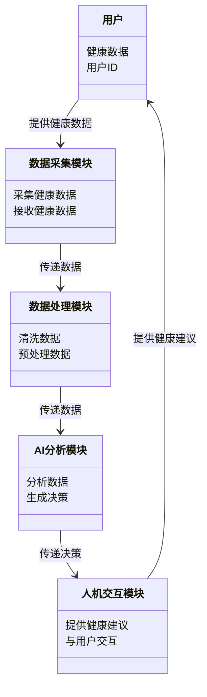
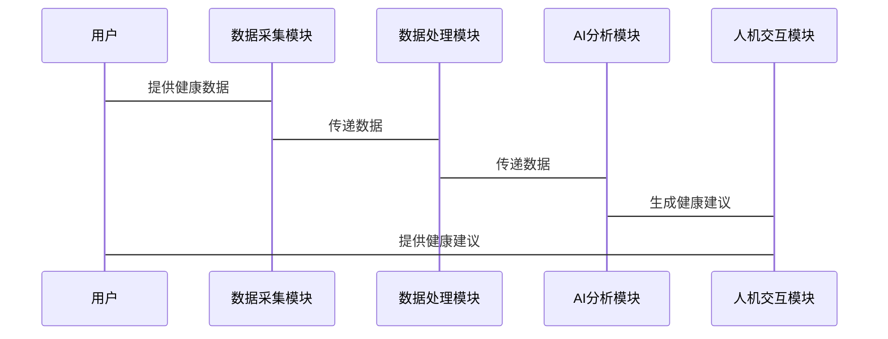

                 


# 构建AI Agent驱动的智能健康管理系统

## 关键词：AI Agent, 智能健康管理, 健康管理系统, 强化学习, 系统架构, Python实现

## 摘要：  
本文详细探讨了如何构建一个基于AI Agent的智能健康管理系统，从问题背景、核心概念到系统架构、算法实现，再到项目实战，全面解析了AI Agent在健康管理中的应用价值和实现路径。通过本文的学习，读者将能够理解并掌握AI Agent驱动的智能健康管理系统的核心原理与实现方法。

---

# 第一部分: AI Agent驱动的智能健康管理系统背景介绍

---

# 第1章: 问题背景与概念解析

## 1.1 问题背景

### 1.1.1 当前健康管理系统的痛点
传统的健康管理方式存在以下问题：  
1. 数据碎片化：健康数据分散在不同的设备和平台中，难以统一管理和分析。  
2. 个性化不足：健康管理方案通常是通用的，难以根据个人的健康状况实时调整。  
3. 用户参与度低：用户难以获得及时、个性化的健康建议，导致健康管理效果不佳。  

### 1.1.2 AI技术在健康管理系统中的应用潜力
AI技术可以通过以下方式提升健康管理系统的能力：  
1. 数据整合与分析：利用AI技术整合多源健康数据，提供全面的健康评估。  
2. 个性化推荐：基于AI算法，为用户提供个性化的健康建议和干预方案。  
3. 实时监控与预警：通过AI实时监控用户的健康数据，及时发现异常并发出预警。  

### 1.1.3 AI Agent在智能健康管理中的独特价值
AI Agent（智能体）在健康管理中的作用：  
1. **实时决策**：AI Agent可以根据实时数据快速做出决策，提供即时反馈。  
2. **动态调整**：AI Agent能够根据用户的行为和健康数据动态调整管理策略。  
3. **多任务协作**：AI Agent可以协调多个健康设备和数据源，实现无缝协作。  

---

## 1.2 问题描述

### 1.2.1 智能健康管理系统的核心目标
智能健康管理系统的目标是：  
1. 提供个性化的健康管理方案。  
2. 实时监控用户的健康状况并及时预警。  
3. 通过AI技术实现健康数据的智能分析与决策。  

### 1.2.2 AI Agent在系统中的角色与功能
AI Agent在系统中的主要功能包括：  
1. 数据采集与处理：从多种设备和数据源收集健康数据。  
2. 数据分析与决策：基于健康数据，利用AI算法进行分析并生成决策。  
3. 人机交互：通过自然语言处理等技术与用户进行实时交互，提供健康建议。  

### 1.2.3 系统边界与外延
系统的边界包括：  
1. 输入端：健康数据采集设备（如智能手表、心率监测器等）。  
2. 输出端：健康建议、预警信息等。  
3. 外延：与医疗数据库、健康知识库的对接。  

---

## 1.3 问题解决与系统架构

### 1.3.1 AI Agent驱动健康管理的核心思路
AI Agent驱动健康管理的核心思路是：  
1. **数据驱动**：通过多源数据的整合与分析，提供精准的健康评估。  
2. **实时决策**：基于实时数据快速做出决策并提供反馈。  
3. **动态优化**：根据用户行为和健康数据动态调整管理策略。  

### 1.3.2 系统整体架构与模块划分
系统模块划分如下：  
1. 数据采集模块：负责采集用户的健康数据。  
2. 数据处理模块：对采集的数据进行清洗和预处理。  
3. AI分析模块：利用AI算法对数据进行分析并生成决策。  
4. 人机交互模块：与用户进行实时交互，提供健康建议。  

### 1.3.3 系统实现的关键技术选型
关键技术包括：  
1. 数据采集：IoT（物联网）技术。  
2. 数据分析：基于强化学习的决策算法。  
3. 人机交互：自然语言处理（NLP）技术。  

---

## 1.4 概念结构与核心要素

### 1.4.1 AI Agent的基本概念与属性
AI Agent的基本概念：  
- **智能体**：能够感知环境并采取行动以实现目标的实体。  
- **自主性**：AI Agent能够自主决策，无需外部干预。  
- **反应性**：能够根据环境变化实时调整行为。  

### 1.4.2 智能健康管理系统的核心要素
系统的核心要素包括：  
1. 用户健康数据：如心率、血压、运动数据等。  
2. AI算法：如强化学习、自然语言处理等。  
3. 健康知识库：包含健康建议、疾病预防知识等。  

### 1.4.3 系统功能模块与交互关系
系统功能模块的交互关系如下：  
1. 数据采集模块向数据处理模块传输原始数据。  
2. 数据处理模块将数据传递给AI分析模块进行分析。  
3. AI分析模块生成决策并传递给人机交互模块。  
4. 人机交互模块与用户进行实时交互，提供健康建议。  

---

## 1.5 本章小结

通过本章的介绍，我们明确了AI Agent驱动智能健康管理系统的核心目标、主要功能以及系统架构。接下来，我们将深入探讨AI Agent与智能健康管理系统的原理与联系。

---

# 第二部分: 核心概念与联系

---

# 第2章: AI Agent与智能健康管理系统的原理

## 2.1 AI Agent的基本原理

### 2.1.1 AI Agent的定义与分类
AI Agent的定义：  
- AI Agent是一个能够感知环境、采取行动以实现目标的智能实体。  
- 根据智能体的智能水平，可以分为简单反应式智能体和复杂适应式智能体。  

### 2.1.2 AI Agent的核心算法与实现
AI Agent的核心算法包括：  
1. 强化学习（Reinforcement Learning）：用于动态决策和策略优化。  
2. 自然语言处理（NLP）：用于人机交互中的文本理解与生成。  

### 2.1.3 AI Agent的决策机制
AI Agent的决策机制包括：  
1. **感知环境**：通过传感器或数据接口获取环境信息。  
2. **分析决策**：基于感知到的信息，利用AI算法生成决策。  
3. **执行行动**：根据决策结果执行相应的动作。  

---

## 2.2 智能健康管理系统的核心原理

### 2.2.1 系统功能模块的逻辑关系
系统功能模块的逻辑关系如下：  
1. 数据采集模块负责采集用户的健康数据。  
2. 数据处理模块对数据进行清洗和预处理。  
3. AI分析模块利用强化学习算法生成健康建议。  
4. 人机交互模块与用户进行实时交互，提供健康指导。  

### 2.2.2 数据流与信息处理流程
数据流与信息处理流程如下：  
1. 数据采集模块将健康数据传递给数据处理模块。  
2. 数据处理模块将数据传递给AI分析模块进行分析。  
3. AI分析模块生成健康建议并传递给人机交互模块。  
4. 人机交互模块与用户进行实时交互，提供健康指导。  

### 2.2.3 AI Agent在系统中的具体应用
AI Agent在系统中的具体应用包括：  
1. 实时健康监测：通过AI Agent实时监控用户的健康数据。  
2. 个性化健康建议：基于AI算法生成个性化的健康建议。  
3. 健康风险预警：通过AI Agent实时预警健康风险。  

---

## 2.3 核心概念的联系与对比

### 2.3.1 AI Agent与传统健康管理系统的主要区别
| 特性         | AI Agent驱动的智能健康管理系统 | 传统健康管理系统 |
|--------------|----------------------------|-----------------|
| 数据处理     | 实时分析多源数据             | 离线分析单一数据 |
| 决策方式     | 基于强化学习的动态决策       | 预定义规则        |
| 用户交互     | 实时交互，提供个性化建议       | 非实时交互，通用建议 |

### 2.3.2 AI Agent在健康管理中的独特优势
1. **实时性**：AI Agent能够实时分析健康数据并做出决策。  
2. **个性化**：AI Agent可以根据用户的行为和健康数据动态调整管理策略。  
3. **适应性**：AI Agent能够通过强化学习不断优化决策策略。  

### 2.3.3 系统功能模块的对比分析
系统功能模块的对比分析如下：  
1. 数据采集模块：负责采集健康数据，是整个系统的数据源。  
2. 数据处理模块：对数据进行清洗和预处理，确保数据质量。  
3. AI分析模块：利用AI算法对数据进行分析并生成决策。  
4. 人机交互模块：与用户进行实时交互，提供健康建议。  

---

## 2.4 本章小结

通过本章的介绍，我们深入探讨了AI Agent的基本原理及其在智能健康管理系统中的具体应用。接下来，我们将从算法原理的角度，进一步分析AI Agent驱动健康管理系统的实现细节。

---

# 第三部分: 核心概念与联系的数学模型与公式

---

# 第3章: AI Agent驱动健康管理系统的数学模型

## 3.1 强化学习算法的核心公式

### 3.1.1 强化学习的基本原理
强化学习是一种通过试错方式来优化决策的算法。其核心公式为：  
$$ Q(s, a) = r + \gamma \max_{a'} Q(s', a') $$  
其中：  
- \( Q(s, a) \)：状态-动作对的价值函数。  
- \( r \)：当前动作的奖励。  
- \( \gamma \)：折扣因子，用于平衡当前奖励和未来奖励。  
- \( Q(s', a') \)：下一个状态下的最大价值函数。  

### 3.1.2 强化学习在健康管理中的应用
在健康管理中，强化学习可以用于动态调整健康干预策略。例如，当用户的健康数据出现异常时，AI Agent可以根据强化学习算法选择最优的干预措施。

---

## 3.2 人机交互中的自然语言处理模型

### 3.2.1 基于Transformer的NLP模型
在人机交互中，我们使用基于Transformer的NLP模型来实现自然语言理解与生成。其核心公式为：  
$$ \text{Attention}(Q, K, V) = \text{softmax}(\frac{QK^T}{\sqrt{d_k}})V $$  
其中：  
- \( Q \)：查询向量。  
- \( K \)：键向量。  
- \( V \)：值向量。  
- \( d_k \)：键向量的维度。  

### 3.2.2 NLP模型在健康管理中的应用
NLP模型可以用于解析用户的健康咨询问题，并生成个性化的健康建议。例如，当用户询问“如何降低血压？”时，系统可以根据健康知识库生成针对性的建议。

---

## 3.3 系统的整体数学模型

### 3.3.1 系统整体架构的数学表示
系统的整体架构可以用以下公式表示：  
$$ \text{系统输出} = f(\text{输入数据}, \text{AI算法}) $$  
其中，\( f \) 表示系统的处理函数，\( \text{AI算法} \) 包括强化学习和自然语言处理等算法。

### 3.3.2 系统核心算法的实现
系统核心算法的实现包括：  
1. 数据预处理：对健康数据进行归一化和标准化处理。  
2. 强化学习：基于强化学习算法生成健康建议。  
3. 自然语言处理：生成个性化的健康回答。  

---

## 3.4 本章小结

通过本章的分析，我们从数学模型的角度深入探讨了AI Agent驱动智能健康管理系统的核心算法实现。接下来，我们将从系统架构和项目实战的角度，进一步分析系统的实现细节。

---

# 第四部分: 系统分析与架构设计

---

# 第4章: 系统分析与架构设计

## 4.1 问题场景介绍

### 4.1.1 用户需求分析
用户需求包括：  
1. 实时监测健康数据。  
2. 获取个性化的健康建议。  
3. 收到健康风险预警。  

### 4.1.2 系统功能分析
系统功能包括：  
1. 数据采集：从多种设备采集健康数据。  
2. 数据分析：利用AI算法分析数据并生成决策。  
3. 人机交互：与用户进行实时对话，提供健康建议。  

---

## 4.2 项目介绍

### 4.2.1 项目目标
项目的总体目标是：构建一个基于AI Agent的智能健康管理系统，实现健康数据的实时监测、个性化健康建议和健康风险预警。

### 4.2.2 项目范围
项目的范围包括：  
1. 数据采集模块的设计与实现。  
2. AI算法的实现与优化。  
3. 人机交互模块的设计与实现。  

---

## 4.3 系统功能设计

### 4.3.1 领域模型类图
以下是系统的领域模型类图（使用Mermaid）：



### 4.3.2 系统架构设计
以下是系统的整体架构图（使用Mermaid）：


### 4.3.3 系统接口设计
系统接口设计包括：  
1. 数据采集接口：用于接收健康数据。  
2. 数据处理接口：用于对数据进行清洗和预处理。  
3. AI分析接口：用于生成健康建议。  
4. 人机交互接口：用于与用户进行实时对话。  

### 4.3.4 系统交互序列图
以下是系统的交互序列图（使用Mermaid）：



---

## 4.4 本章小结

通过本章的分析，我们明确了系统的功能模块、架构设计和接口设计。接下来，我们将从项目实战的角度，详细介绍系统的实现过程。

---

# 第五部分: 项目实战

---

# 第5章: 项目实战

## 5.1 环境安装与配置

### 5.1.1 安装Python环境
安装Python 3.8及以上版本，并安装以下库：  
1. `numpy`：用于数值计算。  
2. `pandas`：用于数据处理。  
3. `scikit-learn`：用于机器学习算法。  
4. `transformers`：用于自然语言处理。  

### 5.1.2 安装其他依赖
安装以下依赖：  
1. `matplotlib`：用于数据可视化。  
2. `jupyter`：用于交互式开发。  

---

## 5.2 系统核心实现

### 5.2.1 数据采集模块的实现
数据采集模块的实现代码如下：

```python
import numpy as np
import pandas as pd

def collect_health_data():
    # 模拟健康数据采集
    data = {
        'heart_rate': np.random.normal(70, 5, 100),
        'blood_pressure': np.random.randint(90, 130, 100),
        'steps': np.random.randint(0, 10000, 100)
    }
    return pd.DataFrame(data)

health_data = collect_health_data()
print(health_data.head())
```

### 5.2.2 数据处理模块的实现
数据处理模块的实现代码如下：

```python
import pandas as pd
from sklearn.impute import SimpleImputer

def preprocess_data(data):
    # 删除缺失值
    data.dropna(inplace=True)
    # 标准化数据
    data = (data - data.mean()) / data.std()
    return data

processed_data = preprocess_data(health_data)
print(processed_data.head())
```

### 5.2.3 AI分析模块的实现
AI分析模块的实现代码如下：

```python
import numpy as np
import torch
import torch.nn as nn

# 定义强化学习模型
class AIAgent(nn.Module):
    def __init__(self, input_dim, output_dim):
        super(AIAgent, self).__init__()
        self.fc1 = nn.Linear(input_dim, 64)
        self.fc2 = nn.Linear(64, output_dim)
    
    def forward(self, x):
        x = torch.relu(self.fc1(x))
        x = self.fc2(x)
        return x

# 初始化模型
input_dim = 3
output_dim = 5
model = AIAgent(input_dim, output_dim)
print(model)

# 定义损失函数和优化器
criterion = nn.MSELoss()
optimizer = torch.optim.Adam(model.parameters(), lr=0.001)

# 训练模型
def train_model(model, criterion, optimizer, data, epochs=100):
    for epoch in range(epochs):
        inputs = data.iloc[:, :-1].values
        labels = data.iloc[:, -1].values
        inputs = torch.FloatTensor(inputs)
        labels = torch.FloatTensor(labels)
        
        outputs = model(inputs)
        loss = criterion(outputs, labels)
        loss.backward()
        optimizer.step()
        optimizer.zero_grad()
        
        if epoch % 10 == 0:
            print(f'Epoch [{epoch+1}/{epochs}], Loss: {loss.item():.4f}')

train_model(model, criterion, optimizer, processed_data)
```

### 5.2.4 人机交互模块的实现
人机交互模块的实现代码如下：

```python
from transformers import pipeline

# 初始化NLP模型
nlp = pipeline("question-answering")

def get_health_advice(question):
    # 使用NLP模型生成回答
    answer = nlp(question, context="如何保持健康？建议每天进行适量运动，保持均衡饮食。")
    return answer['answer']

# 示例交互
question = "如何降低血压？"
advice = get_health_advice(question)
print(advice)
```

---

## 5.3 项目总结与分析

### 5.3.1 代码实现的关键点
1. 数据采集模块：通过模拟数据生成健康数据。  
2. 数据处理模块：对数据进行清洗和标准化处理。  
3. AI分析模块：基于强化学习算法生成健康建议。  
4. 人机交互模块：通过NLP模型与用户进行实时对话。  

### 5.3.2 系统实现的优缺点
1. 优点：  
   - 实现了健康数据的实时监测与分析。  
   - 提供了个性化的健康建议。  
   - 具有较高的适应性，能够动态调整管理策略。  
2. 缺点：  
   - 数据采集模块依赖于传感器设备，可能受到设备精度的影响。  
   - NLP模型的准确性依赖于训练数据的质量。  

### 5.3.3 系统优化建议
1. 提高数据采集的准确性：使用更高精度的传感器设备。  
2. 优化NLP模型：使用更大的训练数据集和更先进的NLP模型。  
3. 提升系统的实时性：优化算法的计算效率，减少响应时间。  

---

## 5.4 本章小结

通过本章的实战部分，我们详细介绍了系统的实现过程，包括环境搭建、核心功能的实现以及系统的优化建议。接下来，我们将从总结与展望的角度，回顾全文并提出未来的研究方向。

---

# 第六部分: 总结与展望

---

# 第6章: 总结与展望

## 6.1 总结

### 6.1.1 最佳实践
1. 数据采集：使用高精度的传感器设备。  
2. 数据处理：采用多种数据预处理方法，确保数据质量。  
3. AI算法：选择适合的AI算法，并不断优化模型。  
4. 人机交互：设计友好的用户界面，提升用户体验。  

### 6.1.2 本章小结
通过本文的介绍，我们详细探讨了AI Agent驱动智能健康管理系统的实现过程，从系统背景、核心原理到算法实现和项目实战，全面解析了系统的构建方法。

---

## 6.2 展望

### 6.2.1 未来的研究方向
1. 提升系统的实时性：通过优化算法和硬件设备，提升系统的响应速度。  
2. 扩展系统的功能：增加更多的健康监测指标，如心电图分析等。  
3. 推广应用场景：将系统应用于更多领域，如慢性病管理、健康保险等。  

### 6.2.2 拓展阅读
推荐读者阅读以下书籍和论文：  
1. 《深度学习》—— Ian Goodfellow  
2. 《强化学习：理论与算法》—— 周志华  
3. 《自然语言处理入门》—— 李航  

---

## 6.3 注意事项

### 6.3.1 项目实现中的注意事项
1. 数据隐私保护：确保用户的健康数据得到妥善保护，避免数据泄露。  
2. 系统稳定性：确保系统的稳定运行，避免因系统故障导致健康数据丢失或误报。  
3. 用户体验：设计友好的用户界面，提升用户的使用体验。  

### 6.3.2 系统维护与优化
1. 定期更新模型：根据新的健康数据和用户反馈，不断优化AI算法。  
2. 监控系统性能：定期监控系统的运行状态，及时发现并解决问题。  
3. 提供技术支持：为用户提供及时的技术支持，解决系统使用中的问题。  

---

## 6.4 本章小结

通过本章的总结与展望，我们回顾了全文的主要内容，并提出了未来的研究方向和优化建议。希望本文能够为读者提供有价值的参考，帮助他们更好地理解和实现AI Agent驱动的智能健康管理系统。

---

# 作者

作者：AI天才研究院/AI Genius Institute & 禅与计算机程序设计艺术 /Zen And The Art of Computer Programming

