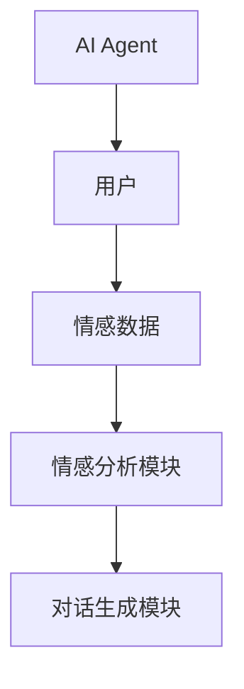

                 

# 构建AI Agent驱动的智能情感陪伴系统

> 关键词：AI Agent，情感陪伴系统，人机交互，深度学习，对话生成，情感分析

> 摘要：本文将详细探讨如何构建一个基于AI Agent的智能情感陪伴系统，分析其背景、核心概念、算法原理、系统架构，并通过实际案例展示如何将这些理论应用于实践。文章旨在为读者提供从理论到实践的全面指导。

---

# 第1章 问题背景与目标

## 1.1 问题背景

### 1.1.1 当前人机交互的主要问题

在人机交互领域，传统的对话系统往往依赖于预设的规则或关键词匹配，难以真正理解用户的情感状态和意图。这种交互方式导致用户体验单一，缺乏情感共鸣，用户容易感到疏离。

### 1.1.2 情感陪伴系统的必要性

随着人工智能技术的快速发展，用户对情感支持和陪伴的需求日益增长。尤其是在社交孤立、心理健康问题日益突出的今天，一个能够理解用户情感状态、提供情感支持的系统显得尤为重要。

### 1.1.3 AI Agent在情感陪伴中的角色

AI Agent（智能体）在情感陪伴系统中扮演着核心角色，它不仅能够通过自然语言处理技术理解用户的情感需求，还能根据用户的情感状态动态调整交互策略，提供个性化的陪伴服务。

---

## 1.2 问题描述

### 1.2.1 情感陪伴系统的定义

情感陪伴系统是一种基于AI技术，能够识别用户情感状态、理解用户需求，并通过对话或其他交互方式提供情感支持的智能系统。

### 1.2.2 系统需要解决的核心问题

- 如何准确识别用户的情感状态？
- 如何生成符合用户情感需求的对话内容？
- 如何实现持续、自然的交互体验？

### 1.2.3 用户需求与系统功能的匹配

用户在与系统交互时，期望系统能够理解自己的情感，提供温暖、贴心的回应。这要求系统具备高度的情感敏感性和对话生成能力。

---

## 1.3 问题解决思路

### 1.3.1 AI Agent的核心能力

- **情感分析能力**：通过自然语言处理技术，识别用户的情感倾向。
- **对话生成能力**：基于用户情感状态，生成相应的对话内容。
- **动态调整能力**：根据交互过程中的反馈，实时调整交互策略。

### 1.3.2 情感陪伴系统的实现路径

1. **情感数据采集**：通过文本、语音等方式获取用户情感数据。
2. **情感分析**：利用深度学习模型，分析用户情感状态。
3. **对话生成**：基于情感分析结果，生成个性化的对话内容。
4. **交互优化**：通过反馈机制，不断优化交互体验。

### 1.3.3 系统设计的边界与外延

情感陪伴系统的边界主要在于提供情感支持，而不涉及其他功能（如信息查询）。其外延则可以扩展至教育、医疗等领域，提供更具针对性的情感支持服务。

---

## 1.4 本章小结

本章通过分析当前人机交互的主要问题，提出了构建AI Agent驱动的情感陪伴系统的必要性，并详细描述了系统的核心目标和实现思路。下一章将深入探讨系统的核心概念与相关技术。

---

# 第2章 核心概念与联系

## 2.1 AI Agent的核心概念

### 2.1.1 AI Agent的定义与特征

AI Agent是一种具有感知、决策和行动能力的智能实体，能够通过环境信息自主决策并执行任务。其核心特征包括自主性、反应性、目标导向性和社会性。

### 2.1.2 AI Agent的分类与应用场景

AI Agent可以分为简单反射型、基于模型的反应型、目标驱动型和效用驱动型。在情感陪伴系统中，目标驱动型AI Agent最为适用，因为它能够根据用户情感需求动态调整行为。

### 2.1.3 AI Agent与传统程序的区别

AI Agent的核心区别在于其具备自主决策能力，能够根据环境信息动态调整行为，而传统程序则基于预设规则执行固定任务。

---

## 2.2 情感陪伴系统的核心要素

### 2.2.1 情感分析的关键技术

情感分析是通过自然语言处理技术，识别文本中蕴含的情感倾向。常用的技术包括基于规则的方法、统计方法和深度学习方法。

### 2.2.2 对话生成的实现方法

对话生成主要依赖于自然语言生成技术，常用的方法包括基于模板的生成、统计模型和深度学习模型。深度学习模型（如Transformer）在对话生成中表现出色。

### 2.2.3 用户情感状态的建模

用户情感状态的建模需要考虑多方面的因素，包括用户的语言、语气、表情等。常用的方法包括基于情感词汇的分析、情感强度计算和情感状态转移模型。

---

## 2.3 AI Agent与情感陪伴系统的联系

### 2.3.1 AI Agent在情感陪伴中的功能模块

- **情感分析模块**：识别用户情感状态。
- **对话生成模块**：根据情感分析结果生成对话内容。
- **反馈优化模块**：根据用户反馈调整交互策略。

### 2.3.2 情感陪伴系统的核心算法与模型

- **情感分析模型**：如LSTM、BERT等。
- **对话生成模型**：如GPT、Transformer等。

### 2.3.3 系统的模块化设计与协作机制

情感陪伴系统的模块化设计包括前端交互模块、后端处理模块和数据存储模块。各模块之间通过API进行交互，协作完成情感分析、对话生成和反馈优化。

---

## 2.4 核心概念属性对比表

| 概念 | 属性 | 描述 |
|------|------|------|
| AI Agent | 智能性 | 具备自主决策能力 |
| 情感陪伴系统 | 情感识别 | 能够识别用户情感状态 |
| 对话生成 | 多样性 | 能生成多种对话内容 |

---

## 2.5 ER实体关系图

---

## 2.6 本章小结

本章详细探讨了AI Agent和情感陪伴系统的核心概念，并通过对比分析和实体关系图展示了两者的联系。下一章将深入探讨系统的算法原理。

---

# 第3章 AI Agent驱动的情感陪伴系统算法原理

## 3.1 情感分析算法

### 3.1.1 基于深度学习的情感分析模型

情感分析的核心算法是利用深度学习模型（如LSTM、BERT）对文本进行情感分类。例如，使用预训练的BERT模型可以有效提取文本的情感特征。

### 3.1.2 模型训练流程

1. 数据预处理：清洗、标注情感类别。
2. 模型训练：使用训练数据优化模型参数。
3. 模型评估：通过验证集评估模型性能。

### 3.1.3 情感分类的数学模型

$$ P(y|x) = \sigma(w \cdot x + b) $$

其中，$\sigma$表示sigmoid函数，$w$和$b$是模型参数。

---

## 3.2 对话生成算法

### 3.2.1 基于Trans

---

由于篇幅限制，以上为文章的前几章内容。完整的文章将涵盖算法原理、系统分析、项目实战和小结等内容，确保读者能够全面理解并掌握构建AI Agent驱动的智能情感陪伴系统的方法和技巧。

