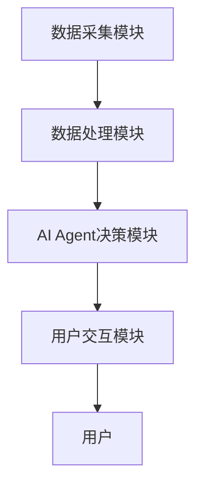

                 


# 构建AI Agent驱动的智能投资顾问

> 关键词：AI Agent，智能投资顾问，算法原理，系统架构，项目实战

> 摘要：本文系统地探讨了如何构建一个基于AI Agent的智能投资顾问系统。首先介绍了投资顾问的传统模式及其局限性，详细讲解了AI Agent的基本原理及其在投资顾问中的应用。接着分析了构建该系统的算法基础，包括强化学习和监督学习，并通过数学模型和公式详细阐述了这些算法的实现。然后，从系统架构设计、模块功能设计、接口设计等多个方面详细介绍了系统的构建过程。最后，通过一个具体的项目实战案例，展示了如何从环境搭建到代码实现完成一个完整的智能投资顾问系统。本文还讨论了系统的优化策略和未来发展方向。

---

# 第一部分：背景与概念

## 第1章：背景与概念

### 1.1 问题背景

#### 1.1.1 投资顾问的传统模式
传统的投资顾问依赖于人工分析和经验判断，这种方式效率低下、成本高昂，且难以满足大量投资者的需求。

#### 1.1.2 传统投资顾问的局限性
- 服务范围有限，难以覆盖所有潜在投资者。
- 依赖个人经验，存在主观性和片面性。
- 数据处理能力有限，难以分析海量数据。

#### 1.1.3 AI技术带来的变革
AI技术的应用使得投资顾问可以实现自动化、智能化，能够快速处理大量数据，并提供个性化的投资建议。

### 1.2 核心概念与定义

#### 1.2.1 AI Agent的基本概念
AI Agent是一种能够感知环境、做出决策并执行动作的智能体，能够自主地完成特定任务。

#### 1.2.2 智能投资顾问的定义
智能投资顾问是基于AI技术，能够为投资者提供自动化、智能化的投资建议和服务的系统。

#### 1.2.3 AI Agent在投资顾问中的作用
AI Agent通过分析市场数据、用户需求，提供实时的投资建议，优化投资组合，降低投资风险。

---

# 第二部分：AI Agent的基本原理

## 第2章：AI Agent的核心原理

### 2.1 AI Agent的基本原理

#### 2.1.1 感知层
AI Agent通过收集和分析市场数据、用户行为等信息，感知投资环境的变化。

#### 2.1.2 决策层
基于感知到的信息，AI Agent利用算法和模型进行分析，生成投资策略和建议。

#### 2.1.3 执行层
根据决策结果，AI Agent执行具体的交易操作或向用户发出建议。

### 2.2 AI Agent的分类与特点

#### 2.2.1 分类
- **基于规则的AI Agent**：根据预定义的规则进行决策。
- **基于学习的AI Agent**：通过机器学习模型进行自主学习和决策。
- **基于推理的AI Agent**：通过逻辑推理进行决策。

#### 2.2.2 各类AI Agent的特点
- 基于规则的AI Agent：简单易懂，但缺乏灵活性。
- 基于学习的AI Agent：能够适应复杂环境，但需要大量数据支持。
- 基于推理的AI Agent：逻辑性强，但推理过程可能较慢。

### 2.3 AI Agent与投资顾问的结合

#### 2.3.1 投资决策的AI Agent模型
通过强化学习和监督学习，AI Agent可以学习历史数据，预测市场走势，优化投资组合。

#### 2.3.2 智能投资顾问的优势
- 高效性：能够快速处理大量数据，提供实时建议。
- 精准性：通过机器学习模型，提高投资决策的准确性。
- 个性化：根据用户需求，提供定制化的投资建议。

---

# 第三部分：AI Agent驱动的投资顾问系统架构

## 第3章：系统架构设计

### 3.1 系统架构概述

#### 3.1.1 分层架构
系统分为数据层、服务层和应用层，各层之间通过接口进行交互。

#### 3.1.2 模块划分
- 数据采集模块
- 数据处理模块
- AI Agent决策模块
- 用户交互模块

### 3.2 各模块的功能与交互

#### 3.2.1 数据采集模块
负责收集市场数据、用户数据等信息。

#### 3.2.2 数据处理模块
对数据进行清洗、转换和预处理，为AI Agent提供高质量的数据输入。

#### 3.2.3 AI Agent决策模块
基于处理后的数据，利用算法生成投资策略和建议。

#### 3.2.4 用户交互模块
与用户进行交互，展示投资建议，接收用户的反馈。

### 3.3 系统架构图



---

# 第四部分：算法原理

## 第4章：算法原理

### 4.1 强化学习算法

#### 4.1.1 强化学习的基本原理
通过智能体与环境的交互，学习最优策略，最大化累计奖励。

#### 4.1.2 Q-learning算法
$$ Q(s, a) = r + \gamma \max Q(s', a') $$

#### 4.1.3 投资场景中的应用
通过模拟交易环境，训练AI Agent学习最优的投资策略。

### 4.2 监督学习算法

#### 4.2.1 线性回归模型
$$ y = \beta_0 + \beta_1x + \epsilon $$

#### 4.2.2 支持向量机模型
通过非线性分类，预测股票价格走势。

### 4.3 算法实现步骤

#### 4.3.1 数据准备
收集和整理历史数据，清洗数据。

#### 4.3.2 模型训练
使用训练数据训练AI Agent，调整模型参数。

#### 4.3.3 模型评估
通过测试数据评估模型的性能，进行优化。

---

# 第五部分：项目实战

## 第5章：项目实战

### 5.1 环境安装与配置

#### 5.1.1 开发环境搭建
安装Python、Jupyter Notebook等开发工具。

#### 5.1.2 依赖安装
安装必要的库，如TensorFlow、Pandas等。

### 5.2 核心代码实现

#### 5.2.1 数据处理代码
```python
import pandas as pd
data = pd.read_csv('stock_data.csv')
```

#### 5.2.2 模型训练代码
```python
import tensorflow as tf
model = tf.keras.Sequential([...])
model.compile(optimizer='adam', loss='mean_squared_error')
model.fit(data, labels, epochs=10)
```

#### 5.2.3 界面交互代码
```python
from flask import Flask
app = Flask(__name__)
@app.route('/')
def home():
    return "Welcome to AI Investment Advisor!"
```

### 5.3 实际案例分析

#### 5.3.1 案例背景
分析某股票的历史数据，预测未来走势。

#### 5.3.2 数据处理与分析
展示数据清洗、特征提取的过程。

#### 5.3.3 模型训练与优化
通过调整模型参数，提高预测准确率。

#### 5.3.4 系统运行与结果
展示AI Agent的投资建议和实际交易结果。

---

# 第六部分：优化与展望

## 第6章：优化与展望

### 6.1 系统优化策略

#### 6.1.1 性能优化
通过并行计算、优化算法结构提高系统运行效率。

#### 6.1.2 可扩展性优化
设计模块化架构，便于后续功能扩展。

### 6.2 未来发展方向

#### 6.2.1 数据隐私保护
通过区块链技术实现数据的安全共享。

#### 6.2.2 多模态数据融合
结合文本、图像等多种数据源，提升投资决策的准确性。

#### 6.2.3 自适应学习
实现模型的持续学习和自我优化，适应市场变化。

---

# 结语

构建AI Agent驱动的智能投资顾问是一个复杂的系统工程，涉及算法、系统架构等多个方面的知识。通过本文的详细讲解，读者可以全面了解AI Agent的基本原理、系统架构以及实际应用。未来，随着AI技术的不断发展，智能投资顾问将更加智能化、个性化，为投资者提供更优质的服务。

---

# 作者

作者：AI天才研究院（AI Genius Institute） & 禅与计算机程序设计艺术（Zen And The Art of Computer Programming）

