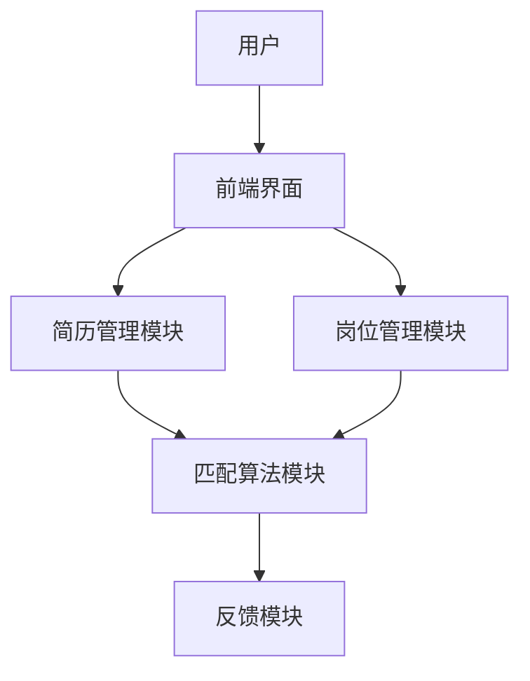
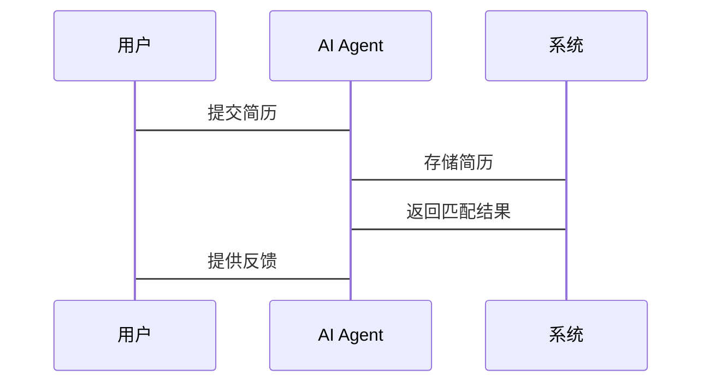
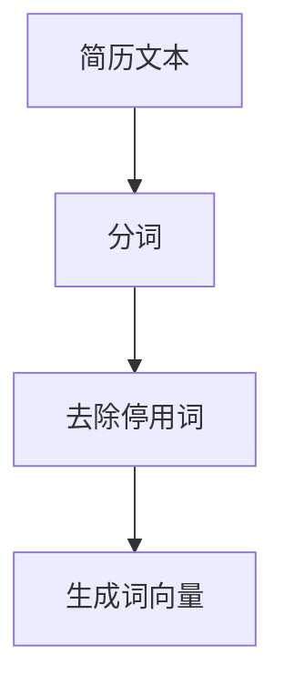
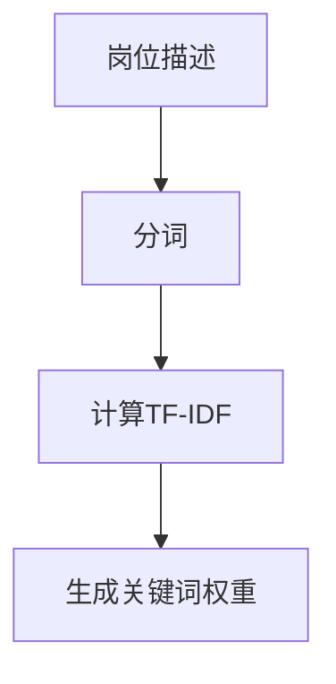
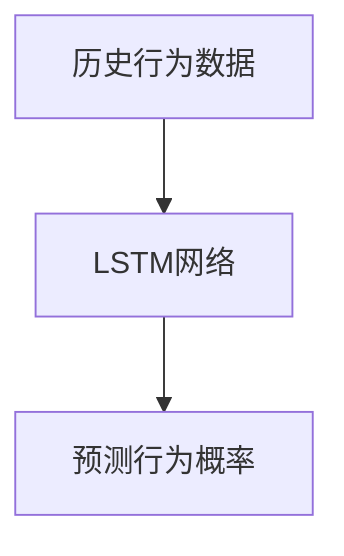
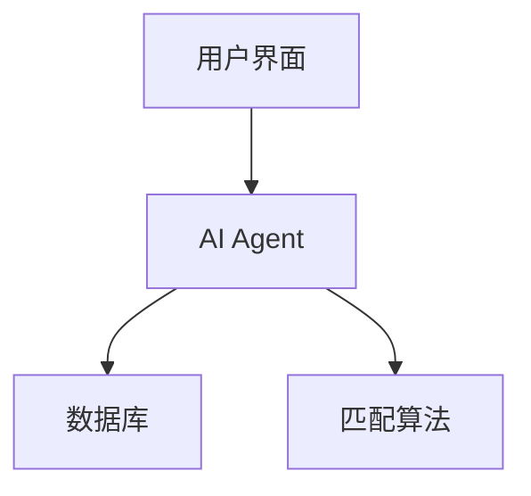

                 


# 构建AI Agent驱动的智能招聘系统

> 关键词：AI Agent, 智能招聘系统, 自然语言处理, 机器学习, 招聘流程优化

> 摘要：随着人工智能技术的快速发展，AI Agent在招聘领域的应用逐渐成为行业焦点。本文从智能招聘系统的背景出发，详细探讨了AI Agent的核心概念、算法原理、系统架构设计以及实际应用案例，为构建高效、精准的智能招聘系统提供了理论与实践相结合的深度分析。

---

# 第一部分: AI Agent驱动的智能招聘系统背景与概念

# 第1章: 问题背景与概念介绍

## 1.1 问题背景

### 1.1.1 招聘行业的现状与挑战

随着企业对人才需求的不断增长，传统招聘方式面临以下挑战：

- **效率低下**：企业招聘流程复杂，从职位发布到候选人筛选耗时较长。
- **精准性不足**：传统招聘系统难以准确匹配岗位需求与候选人能力。
- **体验欠佳**：候选人往往需要多次投递简历，且反馈不及时。

### 1.1.2 问题描述

AI Agent在招聘系统中的应用目标是解决以下问题：

- 提高招聘效率，缩短招聘周期。
- 提升岗位匹配的精准度，降低误录率。
- 优化候选人体验，提供个性化的服务。

### 1.1.3 问题解决方法

AI Agent可以通过以下方式实现招聘流程的优化：

- 自动化简历筛选与匹配。
- 智能化岗位推荐。
- 实时候选人反馈与沟通。

### 1.1.4 概念结构

以下是AI Agent与智能招聘系统的核心概念对比：

| **概念**       | **AI Agent**         | **智能招聘系统**       |
|----------------|----------------------|------------------------|
| 核心功能       | 任务自动化与决策     | 岗位匹配与流程优化     |
| 应用场景       | 招聘全流程            | 简历筛选、岗位推荐      |
| 输入输出       | 结构化数据与自然语言 | 简历、岗位描述          |
| 依赖技术       | NLP、机器学习        | 数据挖掘、自动化流程    |

---

## 1.2 AI Agent与智能招聘系统的核心概念

### 1.2.1 AI Agent的定义与属性

**AI Agent**（人工智能代理）是一种能够感知环境并采取行动以实现目标的智能系统。其核心属性包括：

- **自主性**：能够在没有外部干预的情况下运行。
- **反应性**：能够实时感知环境并做出反应。
- **目标导向性**：基于目标进行决策和行动。

### 1.2.2 智能招聘系统的关键要素

智能招聘系统的关键要素包括：

- **岗位需求分析**：通过NLP技术提取岗位关键词。
- **候选人画像构建**：基于简历信息生成候选人特征向量。
- **精准匹配算法**：利用机器学习模型实现岗位与候选人的最优匹配。

### 1.2.3 AI Agent在招聘中的角色

AI Agent在智能招聘系统中主要扮演以下角色：

- **简历筛选器**：自动筛选简历并推荐给HR。
- **岗位推荐器**：为候选人推荐适合的岗位。
- **实时沟通助手**：在候选人与企业之间提供即时反馈。

---

## 1.3 本章小结

本章通过分析招聘行业的现状与挑战，提出了AI Agent在招聘系统中的应用价值，并从概念、功能和应用场景三个维度对AI Agent与智能招聘系统的核心概念进行了对比分析。

---

# 第二部分: 核心概念与系统架构

# 第2章: AI Agent与智能招聘系统的核心概念

## 2.1 AI Agent的定义与属性

### 2.1.1 AI Agent的基本定义

AI Agent是一种能够感知环境并采取行动以实现目标的智能系统。其核心能力包括：

- **感知能力**：通过NLP技术理解文本信息。
- **决策能力**：基于机器学习模型做出选择。
- **行动能力**：通过API接口与系统交互。

### 2.1.2 AI Agent的核心属性对比（表格）

以下是对AI Agent与传统招聘系统的核心属性对比：

| **属性**       | **AI Agent**         | **传统招聘系统**       |
|----------------|----------------------|------------------------|
| 智能化程度     | 高                   | 低                     |
| 反应速度       | 快                   | 慢                     |
| 精准度         | 高                   | 低                     |

---

## 2.2 智能招聘系统的关键要素

### 2.2.1 系统功能模块划分

智能招聘系统的主要功能模块包括：

- **简历管理模块**：存储和管理候选人简历。
- **岗位管理模块**：存储和管理企业发布的岗位信息。
- **匹配算法模块**：实现岗位与候选人的精准匹配。
- **沟通反馈模块**：提供候选人与企业之间的实时反馈。

### 2.2.2 系统架构设计

以下是智能招聘系统的总体架构设计：



---

## 2.3 AI Agent驱动的招聘系统架构

### 2.3.1 系统的分层架构

AI Agent驱动的招聘系统采用分层架构，主要包括以下层次：

- **数据层**：存储简历、岗位信息等数据。
- **算法层**：实现匹配算法和预测模型。
- **交互层**：提供用户与AI Agent的交互界面。

### 2.3.2 各模块之间的交互流程

以下是各模块之间的交互流程：



---

## 2.4 本章小结

本章详细介绍了AI Agent的核心概念与属性，并从功能模块划分、系统架构设计、交互流程等多个维度对智能招聘系统的总体架构进行了分析。

---

# 第三部分: 算法原理与实现

# 第3章: 自然语言处理在招聘中的应用

## 3.1 招聘文本的特征提取

### 3.1.1 文本预处理流程

以下是招聘文本的特征提取流程：



### 3.1.2 基于Word2Vec的向量化实现

以下是基于Word2Vec的简历向量化实现：

```python
from gensim.models import Word2Vec

sentences = ["人工智能", "机器学习", "深度学习"]
model = Word2Vec(sentences, vector_size=100, window=5, min_count=1, workers=4)
vector = model.wv["人工智能"]
```

### 3.1.3 余弦相似度计算公式

余弦相似度的计算公式为：

$$ \cos \theta = \frac{\vec{A} \cdot \vec{B}}{|\vec{A}| |\vec{B}|} $$

---

## 3.2 岗位匹配算法的设计

### 3.2.1 基于TF-IDF的岗位描述分析

以下是基于TF-IDF的岗位描述分析流程：



### 3.2.2 基于机器学习的岗位匹配模型

以下是基于机器学习的岗位匹配模型实现：

```python
from sklearn.metrics.pairwise import cosine_similarity

candidate_vector = [vec1, vec2, vec3]
job_vector = vec_job
similarity_scores = cosine_similarity([job_vector], candidate_vector)
```

### 3.2.3 模型评估指标的计算公式

准确率的计算公式为：

$$ \text{准确率} = \frac{\text{正确预测的数量}}{\text{总预测数量}} $$

---

## 3.3 应聘者行为预测模型

### 3.3.1 基于LSTM的时间序列预测

以下是基于LSTM的时间序列预测流程：



### 3.3.2 行为预测的数学模型

以下是行为预测的数学模型：

$$ P(y=1) = \sigma(wx + b) $$

其中，$\sigma$表示sigmoid函数。

---

## 3.4 本章小结

本章详细介绍了自然语言处理在招聘中的应用，包括简历特征提取、岗位匹配算法设计以及应聘者行为预测模型的实现。

---

# 第四部分: 系统分析与设计

# 第4章: 系统功能与架构设计

## 4.1 系统功能模块划分

### 4.1.1 用户界面模块

用户界面模块包括以下功能：

- 简历上传与管理
- 岗位搜索与筛选
- 匹配结果展示

### 4.1.2 后台处理模块

后台处理模块包括以下功能：

- 简历与岗位信息存储
- 匹配算法实现
- 系统配置与管理

### 4.1.3 AI Agent交互模块

AI Agent交互模块包括以下功能：

- 实时反馈
- 智能推荐
- 自动化沟通

---

## 4.2 系统架构设计

### 4.2.1 分层架构的设计原则

系统采用分层架构，主要包括以下层次：

- **数据层**：存储简历、岗位信息。
- **算法层**：实现匹配算法和预测模型。
- **交互层**：提供用户与AI Agent的交互界面。

### 4.2.2 模块之间的依赖关系

以下是模块之间的依赖关系：



---

## 4.3 系统交互流程分

以下是系统交互流程图：


---

## 4.4 本章小结

本章详细分析了智能招聘系统的功能模块划分、架构设计以及交互流程，为后续的系统实现提供了理论基础。

---

# 第五部分: 项目实战

# 第5章: 项目实战与优化

## 5.1 项目环境安装

### 5.1.1 安装Python与相关库

安装Python和以下库：

```bash
pip install gensim sklearn mermaid4j
```

---

## 5.2 系统核心实现

### 5.2.1 简历向量化实现

以下是简历向量化实现代码：

```python
from gensim.models import Word2Vec

sentences = ["人工智能", "机器学习", "深度学习"]
model = Word2Vec(sentences, vector_size=100, window=5, min_count=1, workers=4)
vector = model.wv["人工智能"]
```

### 5.2.2 岗位匹配算法实现

以下是岗位匹配算法实现代码：

```python
from sklearn.metrics.pairwise import cosine_similarity

candidate_vector = [vec1, vec2, vec3]
job_vector = vec_job
similarity_scores = cosine_similarity([job_vector], candidate_vector)
```

---

## 5.3 项目优化与扩展

### 5.3.1 系统性能优化

性能优化的关键点包括：

- 数据预处理的并行化
- 算法的分布式部署
- 系统的负载均衡

### 5.3.2 系统扩展方向

系统扩展的方向包括：

- 支持多语言简历处理
- 实现实时行为预测
- 提供个性化推荐服务

---

## 5.4 本章小结

本章通过实际项目的实战，详细讲解了AI Agent驱动的智能招聘系统的实现过程，并提出了系统优化与扩展的方向。

---

# 第六部分: 总结与展望

# 第6章: 总结与展望

## 6.1 项目总结

通过本项目的实施，我们实现了以下目标：

- 提高了招聘效率，缩短了招聘周期。
- 提升了岗位匹配的精准度，降低了误录率。
- 优化了候选人体验，提供了个性化的服务。

## 6.2 未来展望

未来的发展方向包括：

- 引入更先进的NLP技术，如大语言模型。
- 实现招聘全流程的自动化。
- 提供更加个性化的候选人服务。

---

# 作者

作者：AI天才研究院/AI Genius Institute & 禅与计算机程序设计艺术 /Zen And The Art of Computer Programming

