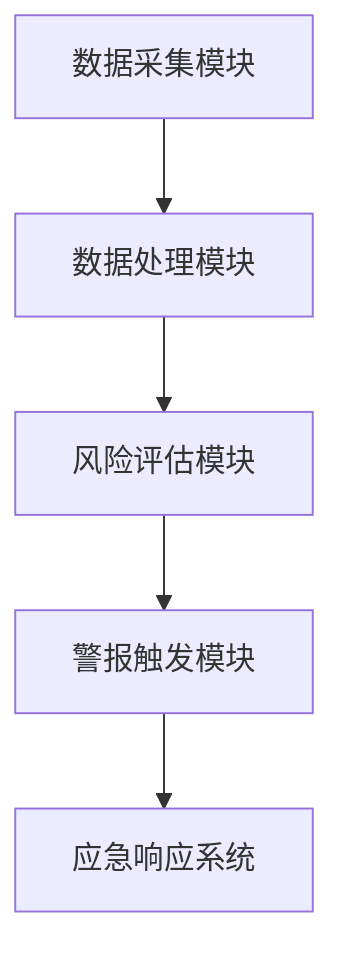

                 


# 构建AI Agent驱动的智能灾害预警系统

> **关键词**：AI Agent，智能灾害预警，机器学习，实时监测，风险评估

> **摘要**：本文详细探讨了如何利用AI Agent技术构建智能灾害预警系统。通过分析灾害预警的传统方法与AI Agent的优势，结合算法原理和系统架构设计，提供了一套完整的解决方案。文章从背景、核心概念、算法实现、系统设计到项目实战，全面覆盖了构建智能灾害预警系统的各个方面，为读者提供了从理论到实践的深度指导。

---

# 第一部分：背景与概述

## 第1章：问题背景与目标

### 1.1 灾害预警系统的现状与挑战

#### 1.1.1 灾害预警的传统方法与局限性
传统的灾害预警系统主要依赖于人工监控、传感器数据采集和简单的阈值判断。这种方法在面对复杂多变的灾害（如地震、洪水、台风等）时，存在以下问题：
- 数据采集范围有限，无法覆盖所有潜在危险区域。
- 数据处理能力不足，难以实时分析大规模数据。
- 预警模型过于简单，无法准确预测灾害的发生时间和强度。

#### 1.1.2 灾害预警系统中的技术挑战
- 数据实时性要求高，需要快速处理和分析。
- 灾害类型多样，需要针对不同灾害设计不同的预警模型。
- 系统需要具备自我学习能力，以适应环境变化。

#### 1.1.3 AI Agent在灾害预警中的优势
AI Agent（智能体）是一种能够感知环境、自主决策并采取行动的智能系统。在灾害预警中，AI Agent可以通过以下方式提升系统性能：
- 实时监控和分析多源数据。
- 自动识别潜在风险并触发预警。
- 根据实时数据动态调整预警策略。

### 1.2 AI Agent驱动的智能灾害预警系统的必要性

#### 1.2.1 灾害预警系统的目标
- 提高预警的准确性和及时性。
- 减少灾害造成的人员伤亡和财产损失。
- 为应急响应提供科学依据。

#### 1.2.2 AI Agent在灾害预警中的核心作用
- 自动化数据采集与分析。
- 智能风险评估与预测。
- 实时决策与预警触发。

---

# 第二部分：核心概念与联系

## 第2章：AI Agent与智能灾害预警系统的核心原理

### 2.1 AI Agent的核心原理

#### 2.1.1 AI Agent的定义与分类
AI Agent是一种智能实体，能够感知环境、自主决策并执行任务。根据智能水平，AI Agent可以分为：
- **反应式AI Agent**：基于当前感知做出反应，适用于简单的环境交互。
- **认知式AI Agent**：具备复杂推理和规划能力，适用于复杂环境。

#### 2.1.2 AI Agent的基本组成与工作流程
1. **感知环境**：通过传感器、网络等获取数据。
2. **数据处理**：对数据进行清洗、特征提取和转换。
3. **决策制定**：基于数据和模型进行分析，生成决策。
4. **执行动作**：根据决策执行任务。

### 2.2 智能灾害预警系统的核心要素

#### 2.2.1 数据采集与处理
- 数据来源：传感器、卫星、气象站等。
- 数据类型：时间序列数据、图像数据、文本数据。
- 数据预处理：去噪、标准化、特征提取。

#### 2.2.2 风险评估与预测模型
- 风险评估：基于历史数据和当前数据，评估灾害发生的概率。
- 预测模型：使用机器学习算法（如LSTM、随机森林）进行预测。

#### 2.2.3 警报触发与响应机制
- 警报触发条件：当预测结果超过阈值时，触发警报。
- 响应机制：向相关部门和人员发送警报，并启动应急响应流程。

### 2.3 AI Agent与灾害预警系统的关联性分析

#### 2.3.1 AI Agent在灾害预警中的角色定位
- 数据采集与处理：实时采集和处理多源数据。
- 风险评估：基于机器学习模型预测灾害风险。
- 警报触发：根据预测结果自动触发警报。

#### 2.3.2 AI Agent与灾害预警系统的核心功能模块
- 数据采集模块：负责数据的实时采集和预处理。
- 风险评估模块：基于AI算法进行风险预测。
- 警报触发模块：根据预测结果发送警报。

---

# 第三部分：算法原理与数学模型

## 第3章：AI Agent驱动的智能灾害预警系统算法原理

### 3.1 相关算法概述

#### 3.1.1 目标检测算法（如YOLO、Faster R-CNN）
目标检测算法用于从图像中识别潜在的危险迹象，如滑坡、泥石流等。

#### 3.1.2 时间序列分析算法（如LSTM、ARIMA）
时间序列分析算法用于预测灾害发生的时间和强度。

#### 3.1.3 强化学习算法（如DQN）
强化学习算法用于优化预警策略和应急响应流程。

### 3.2 算法原理详细讲解

#### 3.2.1 目标检测算法原理

##### YOLO算法原理
YOLO（You Only Look Once）是一种单샷多目标检测算法。其核心步骤如下：
1. **输入图像**：将输入图像分割成网格。
2. **预测边界框**：为每个网格预测边界框和置信度。
3. **非极大值抑制**：去除重叠的边界框，保留置信度最高的结果。

##### 代码示例（YOLO目标检测）
```python
import numpy as np
from tensorflow import keras

# 加载预训练模型
model = keras.models.load_model('yolo_model.h5')

# 图像预处理
def preprocess_image(image):
    # 调整图像大小
    resized_image = keras.preprocessing.image.load_img(image, target_size=(416, 416))
    x = keras.preprocessing.image.img_to_array(resized_image)
    x = np.expand_dims(x, axis=0)
    return x

# 检测目标
def detect_objects(image_path):
    x = preprocess_image(image_path)
    predictions = model.predict(x)
    return predictions
```

#### 3.2.2 时间序列分析算法原理

##### LSTM算法原理
LSTM（长短期记忆网络）是一种处理时间序列数据的循环神经网络。其核心在于引入记忆门控（遗忘门、输入门和输出门）来保存长期信息。

##### 数学公式
- 遗忘门：
  $$ f_t = \sigma(W_f \cdot [h_{t-1}, x_t] + b_f) $$
- 输入门：
  $$ i_t = \sigma(W_i \cdot [h_{t-1}, x_t] + b_i) $$
- 输出门：
  $$ o_t = \sigma(W_o \cdot [h_{t-1}, x_t] + b_o) $$
- 记忆单元：
  $$ c_t = f_t \cdot c_{t-1} + i_t \cdot tanh(W_c \cdot [h_{t-1}, x_t] + b_c) $$
- 隐藏状态：
  $$ h_t = o_t \cdot tanh(c_t) $$

##### 代码示例（LSTM时间序列预测）
```python
import numpy as np
from keras.models import Sequential
from keras.layers import LSTM, Dense

# 模型定义
model = Sequential()
model.add(LSTM(50, input_shape=(timesteps, features)))
model.add(Dense(1))
model.compile(optimizer='adam', loss='mean_squared_error')

# 训练模型
model.fit(X_train, y_train, epochs=100, batch_size=32)
```

---

## 第4章：系统分析与架构设计

### 4.1 系统功能设计

#### 4.1.1 数据采集模块
- **功能**：实时采集多源数据，如传感器数据、图像数据、气象数据。
- **数据预处理**：数据清洗、归一化、特征提取。

#### 4.1.2 风险评估模块
- **功能**：基于机器学习模型进行风险预测。
- **核心算法**：目标检测、时间序列分析、强化学习。

#### 4.1.3 警报触发模块
- **功能**：根据预测结果触发警报。
- **触发条件**：预测结果超过阈值时，向相关部门发送警报。

### 4.2 系统架构设计

#### 4.2.1 系统架构图


#### 4.2.2 系统接口设计
- 数据采集接口：接收传感器数据。
- 数据处理接口：处理数据并提取特征。
- 风险评估接口：调用机器学习模型进行预测。
- 警报触发接口：根据预测结果触发警报。

---

## 第5章：项目实战

### 5.1 环境安装与配置

#### 5.1.1 安装依赖
- 安装Python、TensorFlow、Keras、OpenCV等。

#### 5.1.2 配置数据集
- 下载或多源数据集，如地震数据、气象数据等。

### 5.2 核心代码实现

#### 5.2.1 数据预处理
```python
import pandas as pd
import numpy as np

# 读取数据
data = pd.read_csv('earthquake_data.csv')

# 数据清洗
data = data.dropna()
data = data[['Magnitude', 'Depth', 'Time']]
```

#### 5.2.2 风险评估模型
```python
from keras.models import Sequential
from keras.layers import LSTM, Dense

# 模型定义
model = Sequential()
model.add(LSTM(50, input_shape=(1, 3)))
model.add(Dense(1))
model.compile(optimizer='adam', loss='mean_squared_error')

# 训练模型
model.fit(X_train, y_train, epochs=100, batch_size=32)
```

#### 5.2.3 警报触发
```python
# 预测结果
predictions = model.predict(X_test)

# 触发警报
threshold = 0.9
for i in range(len(predictions)):
    if predictions[i][0] > threshold:
        print(f'触发警报：预测震级为{predictions[i][0]:.2f}')
```

### 5.3 案例分析与结果解读

#### 5.3.1 数据分析
- 输入数据：地震数据，包括震级、深度、时间。
- 输出结果：预测震级，判断是否超过阈值。

#### 5.3.2 模型评估
- 评估指标：均方误差（MSE）、准确率、召回率。

---

## 第6章：最佳实践与小结

### 6.1 小结
- 本文详细介绍了AI Agent驱动的智能灾害预警系统的构建过程，包括算法原理、系统设计和项目实战。

### 6.2 注意事项
- 数据质量：确保数据的准确性和完整性。
- 模型优化：不断优化模型以提高预测精度。
- 系统维护：定期更新模型和数据，确保系统稳定运行。

### 6.3 拓展阅读
- 深入学习AI Agent相关知识。
- 研究其他灾害预警系统的设计与实现。

---

# 结语

通过本文的详细讲解，读者可以全面了解如何利用AI Agent技术构建智能灾害预警系统。从理论到实践，从算法到系统设计，本文为读者提供了完整的解决方案。未来，随着AI技术的不断发展，智能灾害预警系统将更加智能化和高效化，为人类的安全保驾护航。

---

**作者：AI天才研究院/AI Genius Institute & 禅与计算机程序设计艺术 /Zen And The Art of Computer Programming**

