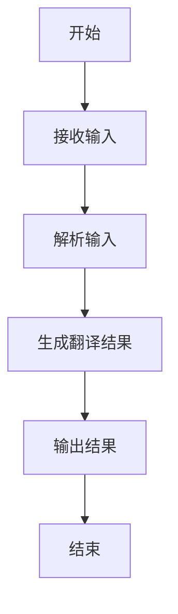
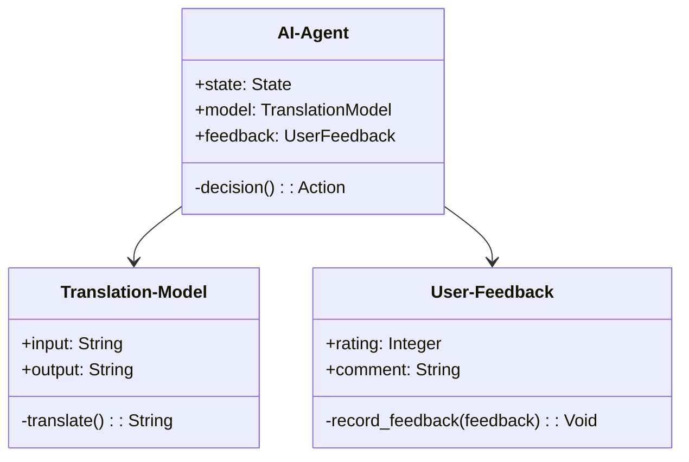
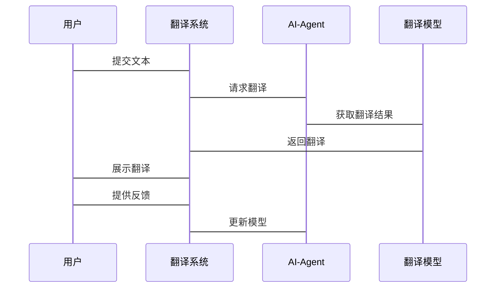

                 


# 构建AI Agent驱动的智能翻译系统

## 关键词：AI Agent，智能翻译系统，自然语言处理，机器学习，深度学习

## 摘要：本文将详细探讨如何构建一个基于AI Agent的智能翻译系统，解决传统翻译工具的局限性，通过逐步分析系统架构、算法原理和项目实现，提供专业的技术见解。

---

## 第一章：AI Agent与智能翻译系统概述

### 1.1 问题背景与描述

#### 1.1.1 翻译技术的发展历程
翻译技术从最初的机械翻译到基于规则的系统，再到统计机器翻译和神经机器翻译，不断演进。当前，翻译技术在处理复杂语境和语义理解方面仍存在不足。

#### 1.1.2 当前翻译技术的局限性
现有翻译系统常依赖固定的规则或预训练模型，难以处理动态语境和用户反馈，缺乏自适应能力。

#### 1.1.3 AI Agent在翻译中的潜力
AI Agent具备动态决策和自适应能力，能根据上下文和用户反馈优化翻译结果，提升用户体验。

### 1.2 AI Agent的核心概念

#### 1.2.1 AI Agent的定义与特点
AI Agent是具有感知环境、自主决策和执行任务的智能实体，具备主动性、反应性和社会性。

#### 1.2.2 智能翻译系统的定义与目标
智能翻译系统通过AI技术提供高质量的翻译服务，目标是实现自然流畅的翻译，理解上下文和用户意图。

#### 1.2.3 AI Agent与智能翻译系统的结合方式
AI Agent作为翻译系统的决策核心，动态优化翻译过程，提升准确性。

### 1.3 问题解决与边界

#### 1.3.1 AI Agent在翻译中的问题解决
AI Agent能处理动态语境，优化翻译质量，提供个性化服务。

#### 1.3.2 系统的边界与外延
系统专注于翻译任务，边界包括输入解析、翻译生成和结果输出，不涉及翻译记忆库的管理。

#### 1.3.3 核心要素与组成结构
核心要素包括AI Agent、翻译模型、用户反馈机制。

## 第二章：AI Agent驱动的智能翻译系统核心概念

### 2.1 核心概念原理

#### 2.1.1 AI Agent的基本原理
AI Agent通过感知环境、生成目标、规划和执行动作，实现动态决策。

#### 2.1.2 智能翻译系统的原理
系统接收输入，解析内容，AI Agent生成翻译结果，输出。

#### 2.1.3 AI Agent驱动翻译的核心机制
AI Agent通过分析上下文和用户反馈，优化翻译模型，动态调整输出。

### 2.2 核心概念的ER实体关系图

```mermaid
er
actor: 用户
agent: AI Agent
system: 智能翻译系统
document: 文档
translation: 翻译结果
```

### 2.3 核心概念的数学模型与公式

#### 2.3.1 AI Agent的决策模型
$$ P(a|s) = \text{argmax}_a \sum_{o} P(o|s,a)U(o,a) $$

#### 2.3.2 翻译模型的概率分布
$$ P(t|x) = \prod_{i=1}^{n} P(t_i|x_{\leq i}) $$

---

## 第三章：AI Agent驱动的智能翻译系统算法原理

### 3.1 算法原理概述

#### 3.1.1 基于大语言模型的翻译算法
采用预训练语言模型进行翻译，结合上下文生成准确译文。

#### 3.1.2 基于强化学习的AI Agent算法
通过强化学习训练AI Agent，使其在动态环境中优化翻译结果。

#### 3.1.3 算法的结合与优化
结合大语言模型和强化学习，提升翻译的准确性和适应性。

### 3.2 算法流程图



### 3.3 算法实现代码示例

#### 3.3.1 AI Agent的决策模型
```python
def ai_agent_decision(state):
    # 计算每个动作的期望效用
    max_utility = -float('inf')
    best_action = None
    for action in possible_actions:
        utility = calculate_utility(state, action)
        if utility > max_utility:
            max_utility = utility
            best_action = action
    return best_action
```

#### 3.3.2 翻译模型的概率分布
```python
def translate_model(input_text):
    # 解码过程
    decoded_output = []
    for i in range(len(input_text)):
        next_word = decoder(input_text[:i+1])
        decoded_output.append(next_word)
    return decoded_output
```

---

## 第四章：AI Agent驱动的智能翻译系统系统分析与架构设计

### 4.1 系统分析

#### 4.1.1 问题场景介绍
用户输入文本，系统生成翻译，考虑上下文和反馈。

#### 4.1.2 项目介绍
构建一个基于AI Agent的智能翻译系统，提升翻译质量。

### 4.2 系统功能设计

#### 4.2.1 领域模型类图



### 4.3 系统架构设计

#### 4.3.1 系统架构图


### 4.4 系统接口设计

#### 4.4.1 系统接口设计
提供API接口，接收文本，返回翻译结果和反馈。

#### 4.4.2 系统交互流程图



---

## 第五章：AI Agent驱动的智能翻译系统项目实战

### 5.1 项目实战概述

#### 5.1.1 环境安装
安装Python、TensorFlow、Hugging Face库。

#### 5.1.2 系统核心实现

##### 5.1.2.1 翻译模型实现
```python
class TranslationModel:
    def __init__(self):
        self.tokenizer = AutoTokenizer.from_pretrained('facebook/m2m100')
        self.model = AutoModelForTranslation.from_pretrained('facebook/m2m100')
    
    def translate(self, input_text, target_lang):
        inputs = self.tokenizer(input_text, return_tensors='np')
        outputs = self.model.generate(inputs.input_ids, max_length=50)
        translated = self.tokenizer.decode(outputs[0], skip_special_tokens=True)
        return translated
```

##### 5.1.2.2 AI Agent实现
```python
class AI-Agent:
    def __init__(self):
        self.state = State()
    
    def decide_action(self, context):
        # 分析上下文，生成最佳动作
        best_action = self.analyze(context)
        return best_action
```

#### 5.1.3 代码应用解读与分析
解读关键代码，说明其功能和作用。

#### 5.1.4 实际案例分析
分析一个具体案例，展示系统如何工作。

#### 5.1.5 项目小结
总结项目实现的关键点和成果。

---

## 第六章：AI Agent驱动的智能翻译系统优化与部署

### 6.1 系统优化

#### 6.1.1 模型优化
优化翻译模型，提升准确性和速度。

#### 6.1.2 系统性能调优
优化内存使用，提升处理效率。

### 6.2 系统部署

#### 6.2.1 本地部署
配置环境，安装依赖，部署系统。

#### 6.2.2 云服务部署
利用云平台部署，确保高可用性。

---

## 第七章：总结与展望

### 7.1 总结
回顾文章内容，强调AI Agent驱动翻译系统的重要性。

### 7.2 未来展望
探讨未来的改进方向，如多模态翻译和实时协作。

---

## 作者信息

作者：AI天才研究院 & 禅与计算机程序设计艺术

---

以上是构建AI Agent驱动的智能翻译系统的详细内容，涵盖了从背景到实现的各个方面，确保读者能够全面理解和构建该系统。

