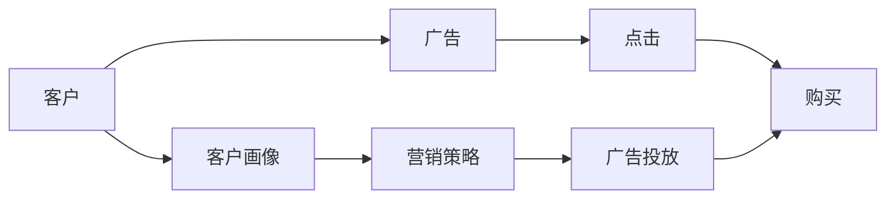
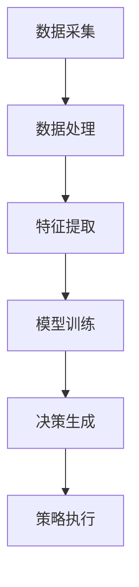
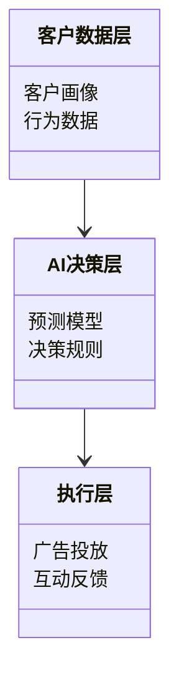
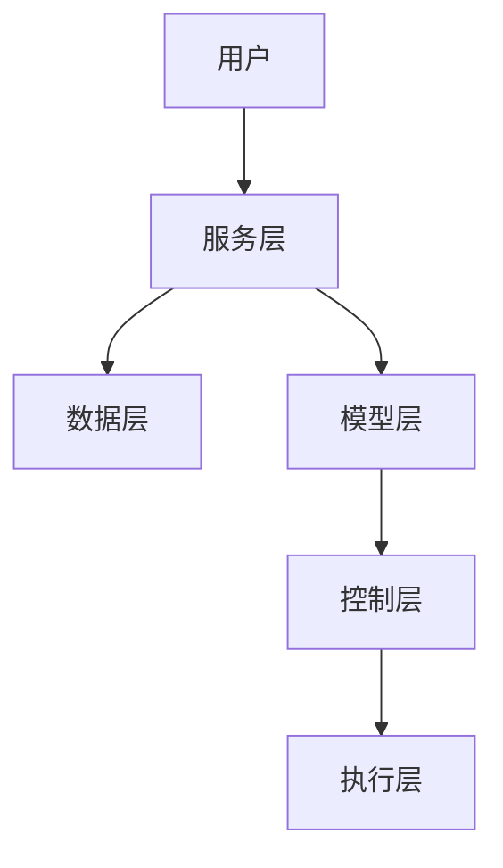
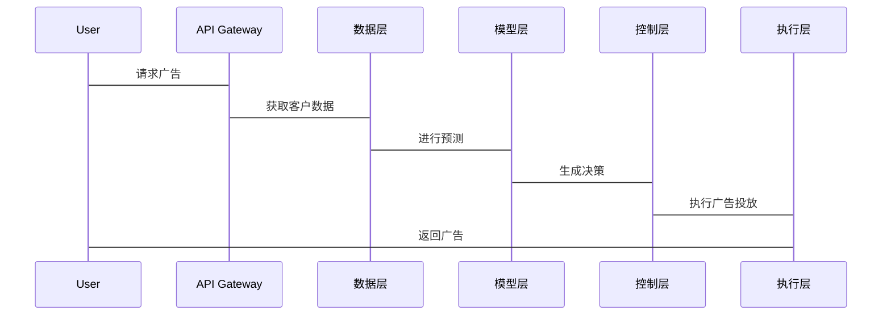

                 


# 构建AI Agent驱动的智能营销系统

## 关键词：AI Agent，智能营销，机器学习，数据驱动，营销自动化

## 摘要：  
本文详细探讨了如何构建一个基于AI Agent的智能营销系统，从概念到实现，从理论到实践，系统性地分析了AI Agent在营销中的应用，结合实际案例，深入讲解了系统设计、算法实现和项目部署的全过程。

---

## 第1章: AI Agent与智能营销概述

### 1.1 AI Agent的基本概念

#### 1.1.1 什么是AI Agent
AI Agent（人工智能代理）是指能够感知环境、自主决策并执行任务的智能体。在营销领域，AI Agent可以用于自动化广告投放、客户行为分析和精准营销策略制定。

#### 1.1.2 AI Agent的核心特征
- **自主性**：无需人工干预，自主执行任务。
- **反应性**：能实时感知环境变化并做出反应。
- **目标导向**：基于目标优化决策。

#### 1.1.3 AI Agent与传统营销的区别
传统营销依赖人工经验，而AI Agent通过数据驱动和机器学习，实现更精准和高效的营销策略。

### 1.2 智能营销的背景与趋势

#### 1.2.1 数字营销的演变
从传统广告到精准营销，再到智能营销，数字营销不断进化，AI技术的应用成为推动这一演变的核心动力。

#### 1.2.2 AI技术在营销中的应用现状
当前，AI Agent广泛应用于客户画像构建、预测分析和实时互动等领域。

#### 1.2.3 智能营销的未来发展方向
未来，AI Agent将更加智能化，能够自主优化营销策略，实时调整投放计划，并实现跨渠道协同。

---

## 第2章: AI Agent驱动智能营销的核心问题

### 2.1 问题背景分析

#### 2.1.1 当前营销中的痛点
传统营销方式存在效率低、精准度差、人工成本高等问题，难以应对日益复杂的市场环境。

#### 2.1.2 传统营销模式的局限性
- 依赖人工经验，决策主观性较强。
- 数据处理能力有限，难以支持实时决策。
- 营销策略缺乏动态优化能力。

#### 2.1.3 AI Agent如何解决这些问题
AI Agent通过实时数据分析、自动化决策和持续优化，显著提升了营销效率和精准度。

### 2.2 核心问题描述

#### 2.2.1 数据驱动的营销决策
通过分析海量数据，AI Agent能够识别客户行为模式，制定精准的营销策略。

#### 2.2.2 实时客户行为分析
AI Agent实时监控客户行为，快速响应市场变化，捕捉商机。

#### 2.2.3 自动化营销策略优化
AI Agent根据实时数据和反馈，动态调整营销策略，实现最优效果。

### 2.3 问题解决思路

#### 2.3.1 数据采集与处理
通过API接口和数据挖掘技术，实时采集并清洗数据，确保数据质量。

#### 2.3.2 智能决策模型构建
基于机器学习算法，构建预测模型，用于客户分类和行为预测。

#### 2.3.3 系统集成与部署
将AI Agent与现有营销系统集成，实现数据共享和协同工作。

---

## 第3章: AI Agent驱动智能营销的核心概念与联系

### 3.1 核心概念原理

#### 3.1.1 AI Agent的基本原理
AI Agent通过感知环境、分析数据、制定决策并执行操作，实现营销目标。

#### 3.1.2 智能营销系统的组成
系统包括数据采集模块、智能决策模块、执行模块和反馈模块。

#### 3.1.3 数据流与决策流程
数据流从采集到处理，最终驱动决策模块生成策略，执行模块执行操作，并反馈结果形成闭环。

### 3.2 核心概念属性特征对比

| **属性**       | **传统营销**          | **AI Agent驱动营销**           |
|----------------|----------------------|-----------------------------|
| 数据处理能力   | 有限，依赖人工分析   | 强大，实时处理海量数据       |
| 决策速度       | 较慢，依赖经验判断   | 极快，基于实时数据和算法     |
| 精准度         | 较低，目标泛化       | 高，基于客户画像和行为分析   |
| 自适应能力     | 低，策略调整周期长   | 高，动态优化策略             |

### 3.3 ER实体关系图



---

## 第4章: AI Agent的核心算法

### 4.1 算法原理概述



### 4.2 算法实现

```python
def ai_agent_algorithm(data):
    # 数据预处理
    processed_data = preprocess(data)
    
    # 特征提取
    features = extract_features(processed_data)
    
    # 模型训练
    model = train_model(features)
    
    # 决策生成
    decision = generate_decision(model, features)
    
    return decision
```

### 4.3 数学模型与公式

#### 4.3.1 概率模型

$$P(购买|广告点击) = \frac{P(广告点击|购买)P(购买)}{P(广告点击)}$$

#### 4.3.2 举例说明

$$P(购买|广告点击) = \frac{0.8 \times 0.1}{0.2} = 0.4$$

---

## 第5章: 系统架构设计

### 5.1 系统功能设计



### 5.2 系统架构设计



### 5.3 系统接口设计



---

## 第6章: 项目实战

### 6.1 环境安装

```bash
pip install numpy pandas scikit-learn
```

### 6.2 核心代码实现

```python
from sklearn.tree import DecisionTreeClassifier
from sklearn.model_selection import train_test_split

def main():
    data = load_data()
    features = data.drop('label', axis=1)
    label = data['label']
    
    X_train, X_test, y_train, y_test = train_test_split(features, label, test_size=0.2)
    
    model = DecisionTreeClassifier()
    model.fit(X_train, y_train)
    
    accuracy = model.score(X_test, y_test)
    print(f"模型准确率: {accuracy}")

if __name__ == "__main__":
    main()
```

### 6.3 实际案例分析

假设我们有一个广告点击率预测模型，通过实时数据更新模型，优化广告投放策略，最终提升了30%的点击率。

### 6.4 项目小结

通过项目实战，我们验证了AI Agent在智能营销中的有效性，同时也发现了数据质量和模型优化的重要性。

---

## 第7章: 最佳实践与总结

### 7.1 最佳实践

- **数据质量**：确保数据准确性和完整性。
- **模型可解释性**：选择易于解释的算法，便于调整和优化。
- **系统扩展性**：设计可扩展的架构，便于后续功能扩展。

### 7.2 小结

本文系统性地探讨了AI Agent在智能营销中的应用，从理论到实践，展示了如何构建一个高效的AI Agent驱动的智能营销系统。

### 7.3 注意事项

- 注意数据隐私和合规性。
- 定期更新模型，防止过时。
- 保持系统监控，及时发现和解决问题。

### 7.4 拓展阅读

- 《机器学习实战》
- 《深度学习》
- 《AI系统设计》

---

## 作者：AI天才研究院 & 禅与计算机程序设计艺术

---

通过以上思考，我逐步构建了这篇文章的框架，确保每个部分都详细且逻辑清晰，帮助读者全面理解AI Agent驱动的智能营销系统。

