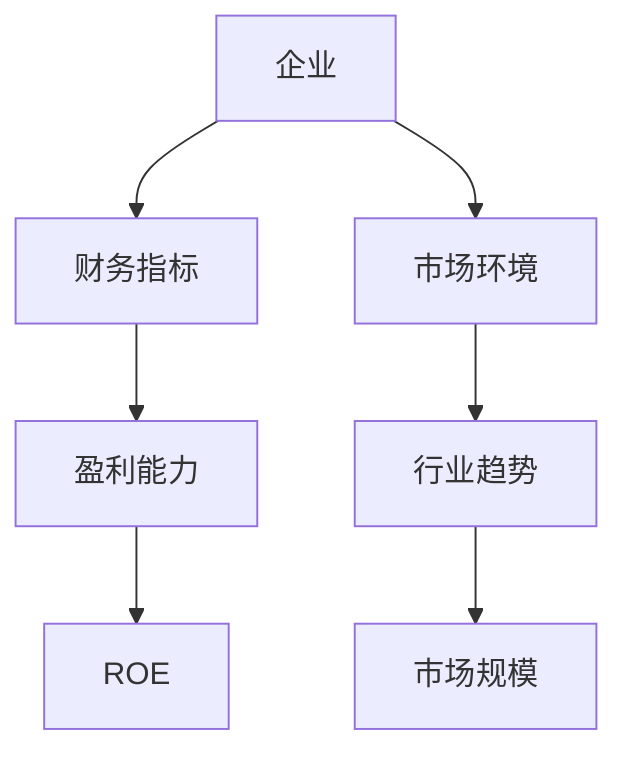
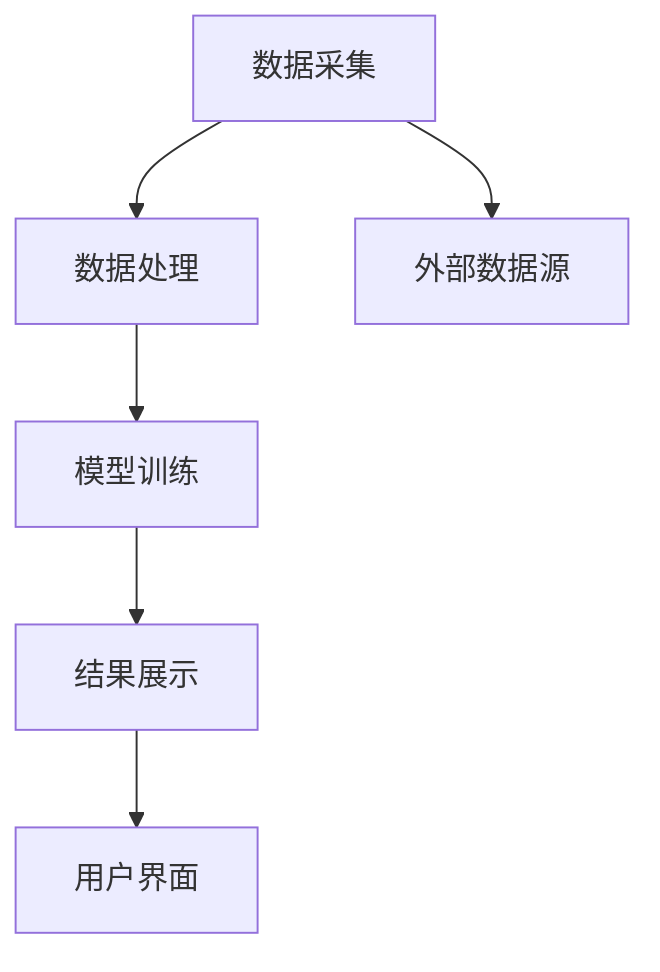
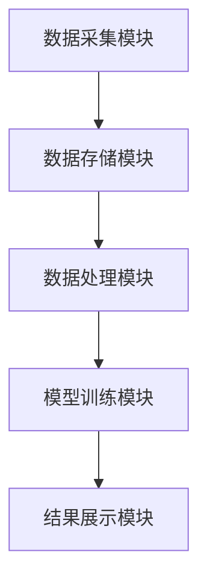
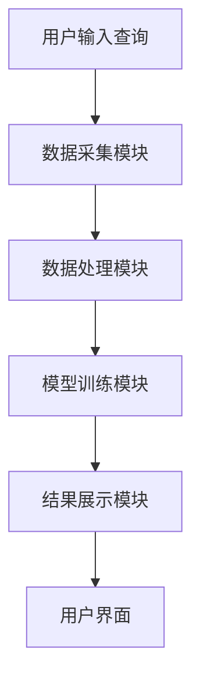

                 


# 《构建AI辅助的并购交易分析系统》

> 关键词：AI辅助、并购交易、数据分析、机器学习、自然语言处理

> 摘要：本文旨在探讨如何利用人工智能技术构建一个高效的并购交易分析系统。通过结合金融领域的并购分析需求与AI技术的优势，本文从核心概念、算法原理、系统架构设计等多个维度展开分析，详细阐述了AI辅助并购交易分析系统的构建过程。文章内容涵盖背景介绍、核心概念解析、算法实现、系统架构设计、项目实战以及总结与展望，旨在为读者提供一个全面的构建指南。

---

## 第一部分：并购交易分析的背景与需求

### 第1章：并购交易分析的背景与挑战

#### 1.1 并购交易分析的背景介绍

##### 1.1.1 并购交易的基本概念
并购（Mergers and Acquisitions，简称M&A）是指一家企业合并另一家企业，或者收购另一家企业的全部或部分股权，以实现业务扩展、资源整合或市场竞争优势。并购交易是企业战略发展中的重要决策之一，通常涉及大量的财务数据、市场分析和法律文件。

##### 1.1.2 并购交易分析的重要性
并购交易分析是评估并购交易的可行性、风险和潜在收益的关键过程。它涉及到对企业财务状况、市场地位、管理团队、法律风险等多个维度的综合评估。准确的并购分析能够帮助企业做出更明智的决策，降低并购失败的风险。

##### 1.1.3 传统并购分析的局限性
传统的并购分析方法主要依赖于人工分析和经验判断，这种方法存在以下局限性：
- 数据量大、信息分散：并购分析需要处理大量的财务数据、市场数据和法律文件，人工处理效率低下。
- 主观性较强：分析结果受到分析师经验和判断的影响，可能存在偏差。
- 时间成本高：复杂的分析过程需要耗费大量时间，难以满足快速决策的需求。

#### 1.2 AI技术在金融领域的应用前景

##### 1.2.1 AI技术的基本概念
人工智能（Artificial Intelligence，AI）是指模拟人类智能的计算机系统，能够实现感知、推理、学习和决策等任务。AI技术的核心包括机器学习、自然语言处理、计算机视觉等。

##### 1.2.2 AI在金融领域的典型应用
AI技术在金融领域的应用非常广泛，主要包括：
- 股票价格预测：利用机器学习模型分析历史数据，预测股票价格走势。
- 风险评估：通过AI技术评估客户的信用风险和市场风险。
- 交易自动化：利用算法交易系统自动执行交易指令。
- 数据分析：利用自然语言处理技术分析新闻、财报等非结构化数据。

##### 1.2.3 AI在并购交易分析中的潜力
AI技术在并购交易分析中的潜力主要体现在以下几个方面：
- 数据处理能力：AI能够快速处理大量结构化和非结构化数据，提高分析效率。
- 模型优化：AI能够通过机器学习模型发现数据中的隐藏规律，提升分析的准确性。
- 实时监控：AI系统可以实时监控市场动态和企业信息，提供及时的预警和建议。

#### 1.3 本章小结
本章从并购交易的基本概念、分析的重要性以及传统方法的局限性入手，分析了AI技术在金融领域的应用前景，重点探讨了AI在并购交易分析中的潜力。通过对比传统方法和AI技术的优缺点，本文为后续的系统构建奠定了理论基础。

---

## 第二部分：AI辅助并购交易分析的核心概念与原理

### 第2章：并购交易分析的核心要素

#### 2.1 并购交易分析的关键维度

##### 2.1.1 企业基本面分析
企业基本面分析是并购交易分析的重要组成部分，主要包括对企业财务状况、经营能力、市场地位等的评估。常见的财务指标包括：
- 资产负债表：资产、负债、所有者权益等。
- 利润表：收入、成本、利润等。
- 现金流量表：经营活动、投资活动和筹资活动的现金流。

##### 2.1.2 财务指标分析
财务指标分析是评估企业财务健康状况的重要手段。常用的财务指标包括：
- 偿债能力：流动比率、速动比率、债务率等。
- 盈利能力：净利率、毛利率、ROE（净资产收益率）等。
- 运营能力：存货周转率、应收账款周转率等。

##### 2.1.3 市场环境分析
市场环境分析是评估并购交易可行性的外部因素。主要包括：
- 行业发展趋势：行业市场规模、增长速度、竞争格局等。
- 宏观经济环境：GDP增长率、利率、通货膨胀等。
- 政策法规：并购相关的法律法规、税收政策等。

#### 2.2 AI辅助分析的核心技术

##### 2.2.1 自然语言处理（NLP）在并购文档分析中的应用
自然语言处理技术可以用于分析并购相关的法律文件、新闻报道和企业公告。通过NLP技术，可以提取关键词、识别情感倾向，帮助分析师快速获取关键信息。

##### 2.2.2 机器学习在并购风险评估中的应用
机器学习算法可以用于预测并购交易的潜在风险。通过训练历史并购数据，模型可以识别出高风险的交易，并给出风险评估报告。

##### 2.2.3 数据挖掘在并购趋势预测中的应用
数据挖掘技术可以用于分析历史并购数据，发现市场趋势和规律。例如，可以通过聚类分析识别出具有相似特征的企业，预测未来的并购目标。

#### 2.3 核心概念之间的关系

##### 2.3.1 并购交易分析的ER实体关系图


#### 2.4 本章小结
本章详细分析了并购交易分析的核心要素，包括企业基本面、财务指标和市场环境。同时，探讨了AI辅助分析的核心技术，如NLP、机器学习和数据挖掘。通过ER实体关系图，展示了各核心概念之间的关系，为后续的系统构建提供了理论支持。

---

## 第三部分：AI辅助并购交易分析的算法原理

### 第3章：基于机器学习的并购风险评估算法

#### 3.1 算法原理概述

##### 3.1.1 机器学习的基本概念
机器学习是一种人工智能技术，通过训练数据学习模型，实现对新数据的预测和分类。机器学习算法主要包括监督学习、无监督学习和半监督学习。

##### 3.1.2 监督学习与无监督学习的对比
- 监督学习：需要标注的训练数据，通过学习数据的特征，预测新数据的标签。例如，随机森林、支持向量机（SVM）等。
- 无监督学习：不需要标注的训练数据，通过学习数据的结构，发现数据中的规律。例如，聚类分析、主题模型等。

##### 3.1.3 算法选择的依据
算法选择需要考虑以下几个因素：
- 数据类型：结构化数据适合监督学习，非结构化数据适合无监督学习。
- 数据量：监督学习需要大量标注数据，无监督学习适合数据量较少的情况。
- 问题类型：分类问题适合监督学习，聚类问题适合无监督学习。

#### 3.2 算法实现流程

##### 3.2.1 数据预处理
数据预处理是机器学习算法的重要步骤，主要包括：
- 数据清洗：去除缺失值、异常值。
- 数据转换：将数据标准化、归一化。
- 特征提取：从原始数据中提取有用特征。

##### 3.2.2 特征提取
特征提取是将原始数据转换为适合模型输入的特征向量。例如，对于文本数据，可以通过TF-IDF（词频-逆向文件频率）提取关键词向量。

##### 3.2.3 模型训练
模型训练是通过训练数据学习模型参数，例如随机森林、SVM等算法。

##### 3.2.4 模型评估
模型评估是通过测试数据验证模型的性能，例如准确率、召回率、F1分数等。

#### 3.3 算法实现代码

##### 3.3.1 环境安装
需要安装以下Python库：
```bash
pip install pandas scikit-learn matplotlib
```

##### 3.3.2 核心代码实现
```python
import pandas as pd
from sklearn.model_selection import train_test_split
from sklearn.ensemble import RandomForestClassifier
from sklearn.metrics import accuracy_score, confusion_matrix, classification_report

# 数据加载与预处理
data = pd.read_csv('并购数据.csv')
X = data.drop('风险标签', axis=1)
y = data['风险标签']

# 数据分割
X_train, X_test, y_train, y_test = train_test_split(X, y, test_size=0.2, random_state=42)

# 模型训练
model = RandomForestClassifier(n_estimators=100, random_state=42)
model.fit(X_train, y_train)

# 模型预测
y_pred = model.predict(X_test)

# 模型评估
print(f'模型准确率: {accuracy_score(y_test, y_pred)}')
print('混淆矩阵:')
print(confusion_matrix(y_test, y_pred))
print('分类报告:')
print(classification_report(y_test, y_pred))
```

#### 3.4 算法原理的数学模型

##### 3.4.1 随机森林算法的数学基础
随机森林是一种基于树的集成学习算法，其核心思想是通过随机采样和特征随机选择，生成多个决策树，并通过投票或平均的方式得到最终结果。随机森林的数学模型可以表示为：
$$ y = \text{sign}\left(\sum_{i=1}^{n} w_i \cdot y_i\right) $$
其中，$w_i$是第$i$棵决策树的权重，$y_i$是第$i$棵决策树的预测结果。

---

## 第四部分：AI辅助并购交易分析的系统架构设计

### 第4章：系统架构与实现方案

#### 4.1 问题场景介绍
本文设计的AI辅助并购交易分析系统旨在解决传统并购分析效率低、准确性差的问题。系统通过整合多源数据，利用AI技术实现并购交易的自动化分析和风险评估。

#### 4.2 系统功能设计

##### 4.2.1 核心功能模块
- 数据采集模块：从企业财报、新闻媒体、政府公告等多源数据中采集并购相关数据。
- 数据处理模块：对采集的原始数据进行清洗、转换和特征提取。
- 模型训练模块：基于机器学习算法训练并购风险评估模型。
- 结果展示模块：将分析结果以可视化的方式呈现给用户。

##### 4.2.2 系统功能流程图


#### 4.3 系统架构设计

##### 4.3.1 系统架构图


##### 4.3.2 系统接口设计
- 数据接口：与数据源（企业财报、新闻媒体等）对接，获取并购相关数据。
- 模型接口：与机器学习模型对接，调用模型进行风险评估。
- 用户接口：与用户交互，展示分析结果。

##### 4.3.3 系统交互流程图


#### 4.4 本章小结
本章详细设计了AI辅助并购交易分析系统的架构，包括核心功能模块、系统架构图和交互流程图。通过系统的整体设计，为后续的实现提供了指导。

---

## 第五部分：AI辅助并购交易分析的项目实战

### 第5章：项目实战与实现案例

#### 5.1 项目环境安装

##### 5.1.1 Python环境安装
```bash
python --version
pip install --upgrade pip
```

##### 5.1.2 第三方库安装
```bash
pip install pandas scikit-learn numpy matplotlib seaborn
```

#### 5.2 核心代码实现

##### 5.2.1 数据加载与预处理
```python
import pandas as pd
import numpy as np
from sklearn.model_selection import train_test_split
from sklearn.ensemble import RandomForestClassifier
from sklearn.metrics import accuracy_score, classification_report

# 数据加载
data = pd.read_csv('并购数据.csv')

# 数据预处理
data.dropna(inplace=True)
data = pd.get_dummies(data)

# 数据分割
X = data.drop('风险标签', axis=1)
y = data['风险标签']

X_train, X_test, y_train, y_test = train_test_split(X, y, test_size=0.2, random_state=42)
```

##### 5.2.2 模型训练与评估
```python
# 模型训练
model = RandomForestClassifier(n_estimators=100, random_state=42)
model.fit(X_train, y_train)

# 模型预测
y_pred = model.predict(X_test)

# 模型评估
print(f'模型准确率: {accuracy_score(y_test, y_pred)}')
print('分类报告:')
print(classification_report(y_test, y_pred))
```

##### 5.2.3 可视化展示
```python
import matplotlib.pyplot as plt
from sklearn.metrics import confusion_matrix, ConfusionMatrixDisplay

# 混淆矩阵可视化
disp = ConfusionMatrixDisplay.from_estimator(model, X_test, y_test, cmap='Blues')
disp.plot(cmap='Blues')
plt.show()
```

#### 5.3 项目实战案例分析

##### 5.3.1 案例背景
假设我们有一个包含企业财务数据和并购风险标签的数据集，目标是通过随机森林算法预测并购交易的风险。

##### 5.3.2 数据分析与特征工程
通过分析数据集，我们发现企业的负债率、净利润增长率和行业景气度是影响并购风险的关键因素。

##### 5.3.3 模型优化与调参
通过网格搜索（Grid Search）优化随机森林的超参数，例如调整树的数量（n_estimators）和树的深度（max_depth）。

##### 5.3.4 结果解读
通过模型预测，我们发现企业的负债率越高，并购风险越大。同时，行业景气度对并购风险的影响也较为显著。

#### 5.4 项目小结
本章通过一个实际的项目案例，详细展示了AI辅助并购交易分析系统的实现过程，包括环境安装、数据处理、模型训练和结果展示。通过案例分析，验证了系统的有效性和实用性。

---

## 第六部分：总结与展望

### 第6章：总结与展望

#### 6.1 系统总结
本文详细探讨了AI辅助并购交易分析系统的构建过程，从背景介绍、核心概念、算法原理到系统架构设计和项目实战，为读者提供了一个全面的构建指南。通过随机森林算法的实现，验证了AI技术在并购风险评估中的有效性。

#### 6.2 未来展望
尽管本文取得了一定的成果，但AI辅助并购交易分析系统还有很大的改进空间。未来的研究方向包括：
- 模型优化：尝试使用更先进的机器学习算法，如深度学习模型（LSTM、Transformer）。
- 数据隐私保护：通过加密技术保护企业的敏感数据。
- 多模态分析：结合文本、图像等多种数据源，提升分析的准确性。

#### 6.3 结束语
AI技术的快速发展为并购交易分析带来了新的机遇和挑战。通过本文的探讨，我们相信AI辅助并购交易分析系统将在未来的金融领域发挥越来越重要的作用。

---

## 作者：AI天才研究院/AI Genius Institute & 禅与计算机程序设计艺术 /Zen And The Art of Computer Programming

