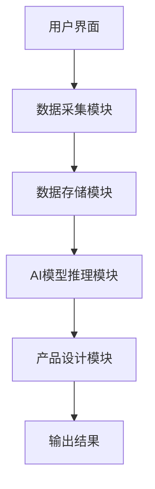
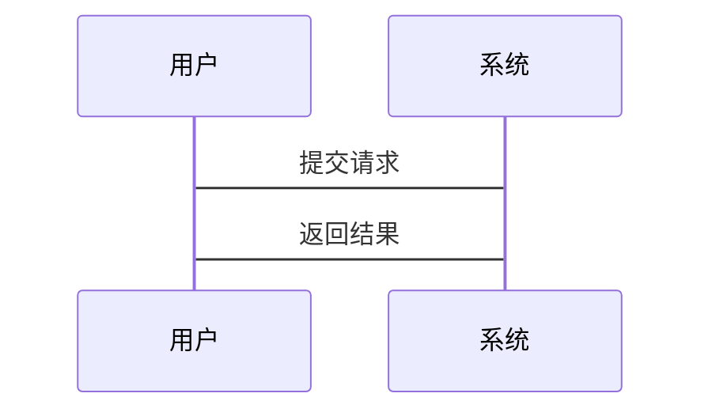

                 


# 构建AI辅助的金融产品设计系统

> 关键词：AI，金融产品，设计系统，机器学习，大模型，金融创新

> 摘要：本文详细探讨如何构建一个AI辅助的金融产品设计系统，从背景介绍到系统架构设计，再到项目实战，全面分析AI技术在金融产品设计中的应用。通过案例分析和算法原理的深入解读，展示如何利用AI技术优化设计流程，提升产品创新能力和风险管理能力。

---

## 第1章 问题背景与核心概念

### 1.1 问题背景

#### 1.1.1 传统金融产品设计的痛点
传统金融产品设计流程复杂且耗时，依赖大量人工分析和经验判断。市场变化快，产品更新迭代慢，难以满足多样化的市场需求。此外，传统方法在风险评估和创新设计方面存在局限性，导致产品同质化严重，难以精准匹配客户需求。

#### 1.1.2 AI技术在金融领域的应用潜力
AI技术，尤其是大模型，具备强大的数据处理和模式识别能力。通过自然语言处理、机器学习和深度学习等技术，AI能够从海量数据中提取有价值的信息，辅助金融产品设计中的市场分析、风险评估和创新设计。

#### 1.1.3 构建AI辅助金融产品设计系统的必要性
随着金融市场的竞争加剧，快速响应市场变化和创新产品设计成为制胜关键。AI技术的引入可以显著提升设计效率和产品质量，帮助金融机构在竞争中占据优势。

### 1.2 核心概念

#### 1.2.1 AI辅助设计的定义
AI辅助设计是指利用人工智能技术，通过自动化或半自动化的方式，辅助完成金融产品的设计、优化和创新。它结合了AI模型的分析能力和人类专家的创造力，实现更高效的设计流程。

#### 1.2.2 金融产品设计的核心要素
金融产品设计涉及市场需求分析、产品结构设计、风险评估与管理、合规性检查等多个方面。每个环节都需要精准的数据支持和高效的决策能力。

#### 1.2.3 系统边界与外延
系统边界包括数据输入、模型训练、产品设计输出等核心环节。外延则涉及数据源的获取、外部API的调用、用户反馈的收集与处理等。

### 1.3 问题描述与解决

#### 1.3.1 传统设计流程的效率瓶颈
传统设计流程依赖大量人工操作，信息孤岛和数据碎片化导致效率低下。AI辅助系统可以整合数据、自动化分析，显著提升设计效率。

#### 1.3.2 AI如何优化设计流程
AI技术可以通过预测市场趋势、识别潜在风险、推荐创新设计等方式，优化设计流程。例如，利用自然语言处理分析市场报告，生成产品设计方案。

#### 1.3.3 系统目标与功能定位
系统目标是通过AI技术辅助完成金融产品的设计、优化和创新。功能定位是提供智能化的设计工具，帮助金融机构快速响应市场变化，提升产品竞争力。

### 1.4 本章小结
本章介绍了构建AI辅助金融产品设计系统的背景，明确了核心概念和系统目标，为后续章节的深入分析奠定了基础。

---

## 第2章 AI大模型的核心原理

### 2.1 AI大模型的基本原理

#### 2.1.1 模型结构与训练方法
大模型通常采用Transformer架构，包含编码器和解码器。编码器负责将输入数据转换为高维向量，解码器则生成输出结果。

#### 2.1.2 大模型的特征提取能力
通过多层自注意力机制，大模型能够捕捉数据中的长距离依赖关系，有效提取特征。

#### 2.1.3 基于大模型的推理机制
大模型通过自注意力机制和前馈网络进行推理，生成与输入相关的输出。

#### 2.1.4 模型训练的超参数优化
包括学习率、批次大小、优化器选择等，通过网格搜索或随机搜索优化模型性能。

#### 2.1.5 模型评估与调优
通过验证集评估模型性能，调整模型结构和超参数，优化泛化能力。

### 2.2 AI大模型的训练与优化

#### 2.2.1 数据预处理与特征工程
对数据进行清洗、特征提取和标准化处理，确保输入数据的质量和一致性。

#### 2.2.2 模型训练的超参数优化
使用交叉验证和网格搜索方法，寻找最佳超参数组合，提升模型性能。

#### 2.2.3 模型评估与调优
通过准确率、召回率、F1分数等指标评估模型性能，进行模型调优和集成优化。

### 2.3 AI大模型的推理与应用

#### 2.3.1 基于大模型的生成式推理
利用生成模型，生成符合要求的产品设计方案，如产品说明书和营销文案。

#### 2.3.2 模型的可解释性问题
通过可视化工具分析模型决策过程，提升用户对AI输出的信任度。

#### 2.3.3 模型的实时性与响应速度
优化模型部署方式，采用分布式计算和并行处理，提升模型推理效率。

### 2.4 本章小结
本章详细介绍了AI大模型的基本原理和训练优化方法，为后续章节的系统设计提供了理论基础。

---

## 第3章 AI大模型与金融产品设计的结合

### 3.1 金融产品设计的流程分析

#### 3.1.1 需求分析与市场定位
通过市场调研和数据分析，确定目标客户群体和产品需求。

#### 3.1.2 产品设计与风险评估
设计产品结构，评估潜在风险，确保产品合规性和可行性。

#### 3.1.3 产品优化与迭代
根据市场反馈和数据分析，持续优化产品设计。

### 3.2 AI在金融产品设计中的应用场景

#### 3.2.1 市场趋势预测
利用AI模型分析市场数据，预测未来市场趋势，指导产品设计。

#### 3.2.2 产品创新设计
通过生成模型，提出创新的产品设计方案，提升产品差异化竞争力。

#### 3.2.3 风险评估与优化
AI模型可以帮助识别潜在风险，优化产品结构，降低风险敞口。

### 3.3 系统设计的核心要素

#### 3.3.1 数据源的选择与整合
整合市场数据、客户反馈、竞争对手信息等多源数据，为系统提供丰富的输入。

#### 3.3.2 模型选择与部署
选择合适的AI模型，部署到系统中，实现自动化设计流程。

#### 3.3.3 系统的可扩展性与灵活性
设计模块化架构，便于后续功能扩展和模型更新。

### 3.4 本章小结
本章分析了金融产品设计的流程，探讨了AI技术的应用场景，为系统设计提供了方向。

---

## 第4章 系统架构与功能设计

### 4.1 系统架构设计

#### 4.1.1 系统整体架构图


#### 4.1.2 数据流与功能模块划分
数据流包括数据采集、存储、处理、分析和输出。功能模块包括数据采集、模型推理、产品设计和结果输出。

#### 4.1.3 系统的高可用性设计
采用分布式架构和负载均衡技术，确保系统稳定运行。

### 4.2 系统功能模块设计

#### 4.2.1 数据采集与处理模块
负责采集市场数据、客户反馈等，进行预处理和特征提取。

#### 4.2.2 AI模型推理模块
加载预训练好的AI模型，进行推理，生成设计建议。

#### 4.2.3 产品设计与优化模块
根据AI输出结果，进行产品设计和优化，生成最终方案。

### 4.3 系统接口设计

#### 4.3.1 API接口定义
定义RESTful API接口，供外部系统调用。

#### 4.3.2 接口交互流程
用户通过API提交请求，系统返回设计结果。

### 4.4 系统交互流程

#### 4.4.1 交互流程图


### 4.5 本章小结
本章详细设计了系统架构，明确了功能模块和接口设计，为后续开发奠定了基础。

---

## 第5章 项目实战

### 5.1 环境安装

#### 5.1.1 安装Python和相关库
```bash
pip install numpy pandas matplotlib transformers
```

#### 5.1.2 安装深度学习框架
```bash
pip install tensorflow keras
```

### 5.2 核心代码实现

#### 5.2.1 数据预处理代码
```python
import pandas as pd

def preprocess_data(data):
    # 数据清洗和特征提取
    data = data.dropna()
    data['label'] = data['label'].astype(int)
    return data
```

#### 5.2.2 模型训练代码
```python
from tensorflow.keras.models import Model
from tensorflow.keras.layers import Input, Dense

input_layer = Input(shape=(input_dim,))
dense_layer = Dense(64, activation='relu')(input_layer)
output_layer = Dense(1, activation='sigmoid')(dense_layer)
model = Model(inputs=input_layer, outputs=output_layer)
model.compile(optimizer='adam', loss='binary_crossentropy', metrics=['accuracy'])
model.fit(X_train, y_train, epochs=10, batch_size=32)
```

### 5.3 实际案例分析

#### 5.3.1 案例背景
假设我们设计一款创新型金融产品，目标客户是年轻投资者，风险偏好较高。

#### 5.3.2 数据分析与建模
通过AI模型分析市场数据，生成产品设计方案，包括产品结构、风险评估和营销策略。

#### 5.3.3 结果解读与优化
根据模型输出结果，优化产品设计，降低风险敞口，提升产品吸引力。

### 5.4 本章小结
本章通过实际案例，展示了AI辅助金融产品设计系统的应用，验证了系统的可行性和有效性。

---

## 第6章 总结与展望

### 6.1 最佳实践 Tips

#### 6.1.1 数据质量管理
确保数据质量，提升模型性能。

#### 6.1.2 模型可解释性
通过可视化工具，提升用户对模型决策的信任度。

#### 6.1.3 系统安全性
加强数据保护和系统安全性，防止数据泄露和攻击。

### 6.2 本章小结
总结本文的主要内容，强调AI技术在金融产品设计中的重要性，展望未来的发展方向。

### 6.3 注意事项
在实际应用中，需注意数据隐私保护和模型的实时性问题。

### 6.4 拓展阅读
推荐相关领域的书籍和论文，供读者深入学习。

---

## 作者：AI天才研究院/AI Genius Institute & 禅与计算机程序设计艺术/Zen And The Art of Computer Programming

---

本文通过系统化的分析和实践，详细探讨了AI辅助金融产品设计系统的构建过程，从理论到实践，为金融机构和技术开发者提供了有价值的参考。

