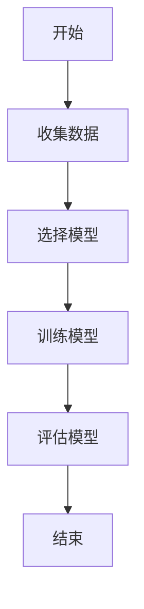
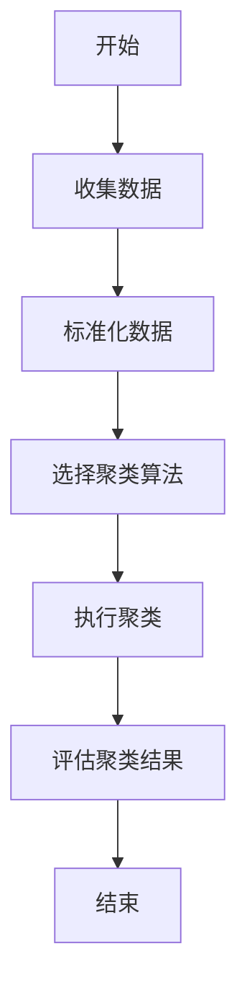
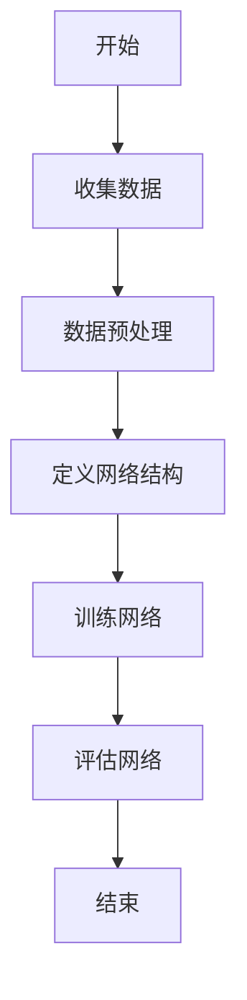
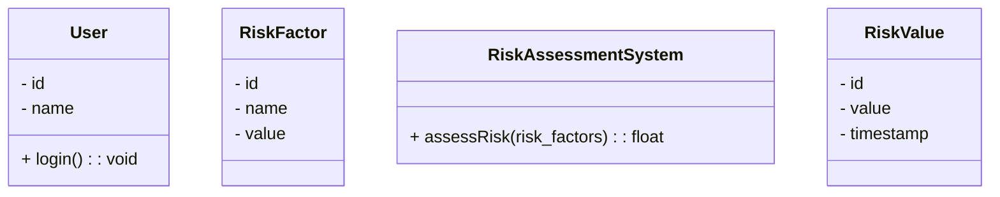
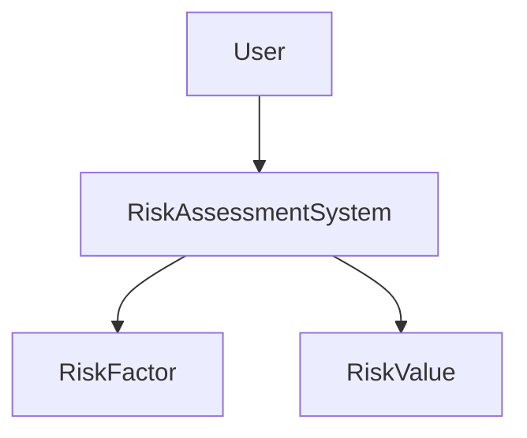
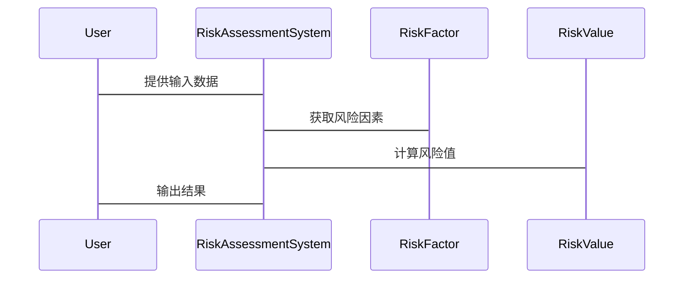

                 


# 构建AI辅助的金融风险度量系统

> 关键词：AI辅助，金融风险，风险度量，系统构建，算法原理，系统架构

> 摘要：本文详细探讨了如何利用人工智能技术构建金融风险度量系统，从理论到实践，系统地分析了AI在金融风险管理中的应用价值和实现方法。文章首先介绍了金融风险度量的基本概念和挑战，然后深入分析了AI技术在其中的核心作用，通过具体的算法实现和系统设计，展示了如何构建一个高效、可靠的AI辅助金融风险度量系统。最后，本文还结合实际案例，总结了系统构建的关键点和未来的发展方向。

---

# 第1章: 金融风险度量系统概述

## 1.1 问题背景与描述

### 1.1.1 金融风险的定义与分类
金融风险是指在金融活动中，由于各种不确定因素的影响，可能导致资金损失或收益波动的可能性。常见的金融风险包括市场风险、信用风险、流动性风险和操作风险等。

### 1.1.2 问题描述
随着金融市场的复杂化和全球化，传统的金融风险度量方法逐渐暴露出效率低、精度差的缺陷。如何利用现代技术，特别是人工智能技术，来提升金融风险度量的效率和准确性，成为当前金融领域的研究热点。

### 1.1.3 问题解决
AI技术的引入，尤其是机器学习和深度学习算法，为金融风险度量提供了新的解决方案。通过分析历史数据和实时信息，AI系统可以快速识别潜在风险，并提供个性化的风险管理建议。

### 1.1.4 边界与外延
本系统主要关注市场风险和信用风险的度量，暂不考虑操作风险和法律风险。系统的输入包括历史价格数据、财务报表和市场指标，输出包括风险值（VaR）和信用评分。

### 1.1.5 核心要素
- 数据源：历史价格、市场指标、财务数据
- AI算法：回归分析、聚类分析、神经网络
- 系统架构：模块化设计，包括数据采集、模型训练和风险评估模块

## 1.2 核心概念与联系

### 1.2.1 金融风险度量的基本原理
金融风险度量的核心是通过量化分析，评估资产或投资组合在特定时间段内的潜在损失。常用的度量方法包括VaR（Value at Risk）和CVaR（Conditional Value at Risk）。

### 1.2.2 AI辅助的实现方式
AI技术通过机器学习算法，从海量数据中提取特征，并构建预测模型，帮助金融机构更准确地评估风险。

### 1.2.3 系统架构的核心组成
- 数据采集模块：负责收集和预处理数据
- 模型训练模块：利用机器学习算法训练风险预测模型
- 风险评估模块：基于模型输出风险评估结果

---

# 第2章: 核心概念与联系

## 2.1 核心概念原理

### 2.1.1 金融风险度量的数学模型
VaR的计算公式为：
$$ \text{VaR} = \mu + z \cdot \sigma $$
其中，$\mu$是均值，$z$是标准正态分布的分位数，$\sigma$是标准差。

### 2.1.2 AI辅助的核心算法
神经网络模型通过多层感知机（MLP）结构，能够捕捉数据中的非线性关系，提升风险预测的准确性。

### 2.1.3 两者的结合方式
通过将AI算法嵌入到金融风险度量模型中，实现对风险的实时监控和动态调整。

## 2.2 核心概念对比分析

### 2.2.1 传统方法与AI方法的对比
| 特性 | 传统方法 | AI方法 |
|------|----------|--------|
| 精度 | 较低     | 较高   |
| 效率 | 较慢     | 较快   |
| 可扩展性 | 有限     | 优秀   |

### 2.2.2 各种AI算法的优缺点
| 算法 | 优点 | 缺点 |
|------|------|------|
| 回归分析 | 简单易懂 | 易受异常值影响 |
| 聚类分析 | 无监督学习 | 需要大量数据 |
| 神经网络 | 高精度 | 需要大量计算资源 |

### 2.2.3 系统性能对比的特征表格
| 性能指标 | 传统方法 | AI方法 |
|----------|----------|--------|
| 计算速度 | 较慢     | 较快   |
| 预测精度 | 一般     | 高     |
| 扩展性   | 有限     | 优秀   |

## 2.3 ER实体关系图

```mermaid
erd
actor: User
actor --> risk_assessment_system: 提供输入数据
risk_assessment_system --> risk_factors: 获取风险因素
risk_factors --> risk_values: 计算风险值
risk_values --> output: 输出结果
```

---

# 第3章: 算法原理与实现

## 3.1 算法原理

### 3.1.1 传统回归分析
回归分析是一种统计学方法，用于分析变量之间的关系。线性回归的公式为：
$$ y = \beta_0 + \beta_1 x + \epsilon $$
其中，$\epsilon$是误差项。

### 3.1.2 聚类分析
聚类分析用于将数据分成不同的类别。K-means算法的目标是最小化平方误差之和：
$$ \sum_{i=1}^{k} \sum_{j=1}^{n} (x_{i,j} - c_j)^2 $$
其中，$k$是聚类数，$n$是数据点数量，$c_j$是第$j$个聚类的中心。

### 3.1.3 神经网络模型
神经网络通过多层感知机结构，能够捕捉数据中的非线性关系。典型的神经网络结构包括输入层、隐藏层和输出层。

## 3.2 算法流程图

### 3.2.1 回归分析流程图



### 3.2.2 聚类分析流程图



### 3.2.3 神经网络流程图



## 3.3 Python实现代码

### 3.3.1 回归分析代码

```python
import numpy as np
from sklearn.linear_model import LinearRegression

# 创建数据集
X = np.array([[1], [2], [3], [4]])
y = np.array([2, 4, 6, 8])

# 训练模型
model = LinearRegression()
model.fit(X, y)

# 输出系数
print(model.coef_)
```

### 3.3.2 聚类分析代码

```python
from sklearn.cluster import KMeans

# 创建数据集
X = np.array([[1, 2], [3, 4], [5, 6], [7, 8]])

# 训练模型
model = KMeans(n_clusters=2)
model.fit(X)

# 输出聚类结果
print(model.labels_)
```

---

# 第4章: 系统分析与架构设计

## 4.1 问题场景介绍
本系统旨在帮助金融机构实时监控和评估市场风险和信用风险。

## 4.2 项目介绍
本项目的目标是构建一个基于AI的金融风险度量系统，实现对金融资产风险的实时评估和预测。

## 4.3 系统功能设计

### 4.3.1 领域模型类图


### 4.3.2 系统架构图


## 4.4 系统接口设计
系统接口包括数据输入接口、模型训练接口和结果输出接口。

## 4.5 系统交互序列图



---

# 第5章: 项目实战

## 5.1 环境安装
需要安装Python、NumPy、Scikit-learn和Mermaid工具。

## 5.2 系统核心实现

### 5.2.1 数据采集与预处理
使用Yahoo Finance API获取股票价格数据，并进行标准化处理。

### 5.2.2 模型训练
使用神经网络模型训练风险预测模型。

### 5.2.3 系统集成
将各个模块集成到一个完整的系统中。

## 5.3 案例分析与结果解读
以某股票为例，展示系统如何进行风险评估。

## 5.4 项目小结
总结项目实现的关键点和经验教训。

---

# 第6章: 总结与展望

## 6.1 总结
本文详细探讨了如何利用AI技术构建金融风险度量系统，从理论到实践，系统地分析了AI在金融风险管理中的应用价值和实现方法。

## 6.2 展望
未来的研究方向包括开发更高效的算法、引入更多的数据源以及提升系统的实时性。

## 6.3 最佳实践 Tips
- 数据预处理是关键，需仔细清洗数据
- 算法选择需结合具体场景和数据特点
- 系统架构设计需注重模块化和可扩展性

---

# 作者：AI天才研究院/AI Genius Institute & 禅与计算机程序设计艺术 /Zen And The Art of Computer Programming

