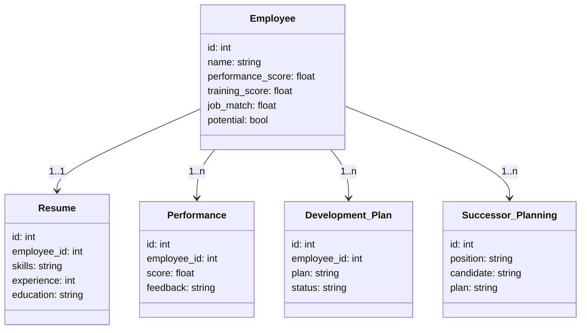
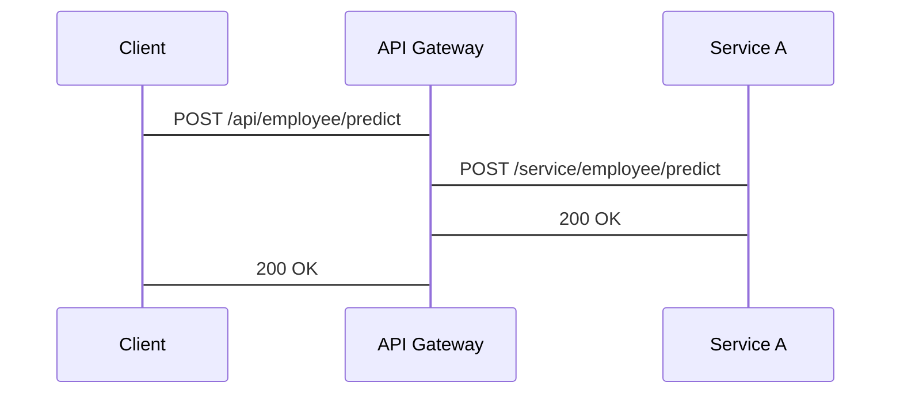

                 


# 构建AI驱动的企业人才发展与继任计划系统

> 关键词：AI驱动，企业人才发展，继任计划，机器学习，深度学习，自然语言处理

> 摘要：本文详细探讨了如何利用人工智能技术构建企业人才发展与继任计划系统。从背景分析、核心概念、算法原理到系统架构设计和项目实战，系统性地介绍了AI在人才管理中的应用，旨在为企业提供高效的智能化人才管理解决方案。

---

# 第一部分: AI驱动的企业人才发展与继任计划系统背景

# 第1章: 企业人才发展与继任计划的背景与挑战

## 1.1 企业人才发展的重要性

### 1.1.1 企业人才发展的核心目标

- **目标1：识别和培养关键人才**：通过数据分析和AI技术，精准识别具有潜力的员工，并制定个性化的发展计划。
- **目标2：提升员工绩效**：通过实时反馈和个性化建议，帮助员工提升技能和绩效。
- **目标3：支持企业战略目标**：将人才发展与企业战略目标对齐，确保组织能力与业务需求一致。

### 1.1.2 人才发展对企业竞争力的影响

- **影响1：增强组织灵活性**：通过动态调整人才发展计划，企业能够更快适应市场变化。
- **影响2：提高员工满意度**：个性化的发展路径和反馈机制可以提升员工的满意度和忠诚度。
- **影响3：降低人才流失率**：通过识别高潜力员工并为其提供成长机会，可以有效降低人才流失率。

### 1.1.3 继任计划的战略意义

- **意义1：确保关键岗位的无缝衔接**：通过继任计划，企业可以确保关键岗位在领导层变动时能够无缝衔接。
- **意义2：培养未来的领导者**：继任计划不仅关注当前岗位需求，还关注未来领导者的能力培养。
- **意义3：提升组织的长期竞争力**：通过继任计划，企业可以持续优化领导层，提升整体竞争力。

## 1.2 传统人才发展与继任计划的局限性

### 1.2.1 传统方法的不足

- **问题1：数据驱动不足**：传统方法依赖主观判断，缺乏数据支持，可能导致决策偏差。
- **问题2：效率低下**：传统方法需要大量人工参与，效率较低，难以应对快速变化的市场需求。
- **问题3：个性化不足**：传统方法难以实现个性化发展路径，可能导致员工体验不佳。

### 1.2.2 数据驱动的缺失

- **问题1：缺乏系统性数据**：传统方法难以收集和分析大量数据，难以全面评估员工能力。
- **问题2：数据孤岛问题**：各部门数据分散，难以整合，难以形成统一的人才视图。
- **问题3：数据更新不及时**：传统方法难以实时更新数据，导致决策滞后。

### 1.2.3 个性化与效率的平衡问题

- **问题1：个性化需求高**：员工期望获得个性化的职业发展路径，但传统方法难以满足。
- **问题2：效率与个性化难以兼顾**：传统方法在追求效率的同时，难以兼顾个性化需求。
- **问题3：员工体验差**：由于个性化不足，员工可能对职业发展缺乏信心，导致流失率上升。

## 1.3 AI技术在人才管理中的应用现状

### 1.3.1 AI在招聘中的应用

- **应用1：简历筛选**：通过自然语言处理技术，自动筛选简历，识别符合岗位要求的候选人。
- **应用2：面试评估**：通过语音识别和自然语言处理技术，自动评估面试表现，提供客观评估结果。

### 1.3.2 AI在员工绩效管理中的应用

- **应用1：绩效预测**：通过机器学习算法，预测员工绩效，帮助管理者提前制定干预措施。
- **应用2：绩效反馈**：通过实时数据分析，为员工提供个性化反馈，帮助其提升绩效。

### 1.3.3 当前AI在人才发展中的潜力

- **潜力1：个性化发展路径**：通过AI技术，可以为员工制定个性化的职业发展路径，提升员工满意度。
- **潜力2：动态调整发展计划**：通过实时数据分析，可以动态调整发展计划，确保其与企业战略目标一致。
- **潜力3：提升继任计划的精准度**：通过AI技术，可以更精准地识别和培养高潜力员工，提升继任计划的效率。

## 1.4 本章小结

本章从企业人才发展的核心目标和重要性入手，分析了传统人才发展与继任计划的局限性，并介绍了AI技术在人才管理中的应用现状和潜力，为后续章节的深入探讨奠定了基础。

---

# 第二部分: AI驱动人才发展系统的核心概念

# 第2章: 人才发展与继任计划的核心要素

## 2.1 人才发展系统的核心概念

### 2.1.1 人才发展的定义与范围

- **定义**：人才发展是指通过系统化的方法，识别、培养和发展员工的潜力，以满足企业战略目标的过程。
- **范围**：包括招聘、培训、绩效管理、职业发展等多个环节。

### 2.1.2 继任计划的核心要素

- **核心要素1：岗位分析**：明确关键岗位的需求和职责。
- **核心要素2：人才识别**：识别具有潜力的员工，确保其具备继任岗位的能力和潜力。
- **核心要素3：发展计划**：为高潜力员工制定个性化的发展计划，确保其能力与继任岗位要求匹配。

### 2.1.3 人才发展与企业战略的关系

- **关系1：人才发展支持企业战略**：通过人才发展，企业可以确保拥有合适的人才，支持业务发展。
- **关系2：企业战略指导人才发展**：企业战略目标决定了人才发展的方向和重点。

## 2.2 AI技术在人才管理中的应用原理

### 2.2.1 数据驱动的人才分析

- **数据来源**：包括员工简历、绩效数据、培训数据、面试记录等。
- **数据处理**：通过数据清洗、特征提取等步骤，为AI算法提供高质量数据。

### 2.2.2 AI算法在人才匹配中的作用

- **算法1：监督学习**：用于分类任务，例如识别高潜力员工。
- **算法2：无监督学习**：用于聚类任务，例如将员工分成不同的能力组。
- **算法3：深度学习**：用于自然语言处理任务，例如分析员工的简历和绩效反馈。

### 2.2.3 系统化的人才发展流程

- **流程1：数据收集与分析**：通过AI技术，收集和分析员工数据，识别高潜力员工。
- **流程2：制定发展计划**：基于数据分析结果，制定个性化的发展计划。
- **流程3：实时反馈与调整**：通过实时数据分析，动态调整发展计划，确保其有效性。

## 2.3 核心概念对比分析

### 2.3.1 传统人才管理与AI驱动管理的对比

| **对比维度** | **传统管理** | **AI驱动管理** |
|--------------|--------------|----------------|
| 数据驱动     | 依赖主观判断 | 依赖数据支持    |
| 效率         | 低效         | 高效            |
| 个性化       | 个性化不足   | 个性化显著      |

### 2.3.2 不同AI技术在人才管理中的应用对比

| **AI技术**       | **应用场景**                     | **优势**                           |
|------------------|----------------------------------|------------------------------------|
| 监督学习         | 分类任务（如高潜力员工识别）       | 精准度高                           |
| 无监督学习       | 聚类任务（如员工能力分组）         | 发现潜在模式                         |
| 深度学习         | 自然语言处理（如简历分析）         | 处理复杂数据                         |

### 2.3.3 人才发展系统的核心要素对比表

| **核心要素**       | **传统方法**       | **AI驱动方法**                 |
|--------------------|--------------------|---------------------------------|
| 数据来源           | 简单数据           | 多源异构数据                     |
| 分析方法           | 人工分析           | AI算法驱动                       |
| 决策依据           | 主观判断           | 数据驱动                         |
| 决策效率           | 低效               | 高效                             |

## 2.4 本章小结

本章详细介绍了人才发展与继任计划的核心要素，并对比分析了传统方法与AI驱动方法的差异，强调了AI技术在人才管理中的潜力和优势。

---

# 第三部分: AI驱动人才发展系统的算法原理

# 第3章: 人才数据分析与机器学习算法

## 3.1 数据预处理与特征提取

### 3.1.1 数据清洗与标准化

- **数据清洗**：去除无效数据，处理缺失值，标准化数据格式。
- **标准化**：将数据标准化到统一范围内，例如归一化。

### 3.1.2 特征工程与维度降维

- **特征工程**：提取关键特征，例如绩效分数、培训成绩、岗位匹配度等。
- **维度降维**：使用主成分分析（PCA）等技术，降低数据维度，提升计算效率。

### 3.1.3 数据增强与样本平衡

- **数据增强**：通过数据增强技术，增加数据多样性，例如数据合成、特征变换。
- **样本平衡**：处理数据不平衡问题，例如过采样和欠采样技术。

## 3.2 机器学习算法在人才管理中的应用

### 3.2.1 监督学习算法

#### (1) 高潜力员工识别

- **算法**：随机森林（Random Forest）、支持向量机（SVM）
- **流程**：
  1. 数据预处理：清洗和标准化数据。
  2. 特征提取：提取高潜力员工的关键特征。
  3. 训练模型：使用随机森林算法，训练高潜力员工识别模型。
  4. 模型评估：通过准确率、召回率等指标评估模型性能。
  5. 应用：基于模型结果，识别高潜力员工。

- **代码示例**：

```python
import pandas as pd
from sklearn.ensemble import RandomForestClassifier
from sklearn.metrics import accuracy_score

# 加载数据
data = pd.read_csv('employee_data.csv')

# 特征提取
X = data[['performance_score', 'training_score', 'job_match']]
y = data['potential']

# 训练模型
model = RandomForestClassifier(n_estimators=100)
model.fit(X, y)

# 预测
y_pred = model.predict(X)

# 评估
print("Accuracy:", accuracy_score(y, y_pred))
```

- **数学模型**：
  - 随机森林是一种基于树的集成算法，通过多个决策树的投票结果进行预测。
  - 决策树算法的数学模型可以用条件概率表示，例如：
    $$ P(y|x) = \prod_{i=1}^{n} P(x_i|y) \cdot P(y) $$

### 3.2.2 无监督学习算法

#### (2) 员工能力聚类

- **算法**：K-means聚类
- **流程**：
  1. 数据预处理：清洗和标准化数据。
  2. 特征提取：提取员工能力相关的特征。
  3. 聚类分析：使用K-means算法，将员工分成不同的能力组。
  4. 可视化：通过可视化工具（如PCA）展示聚类结果。

- **代码示例**：

```python
from sklearn.cluster import KMeans
from sklearn.manifold import PCA

# 加载数据
data = pd.read_csv('employee_data.csv')

# 特征提取
X = data[['performance_score', 'training_score', 'job_match']]

# PCA降维
pca = PCA(n_components=2)
X_pca = pca.fit_transform(X)

# 聚类
model = KMeans(n_clusters=3)
model.fit(X_pca)

# 可视化
import matplotlib.pyplot as plt
plt.scatter(X_pca[:,0], X_pca[:,1], c=model.labels_, cmap='viridis')
plt.show()
```

- **数学模型**：
  - K-means算法的目标是最小化聚类中心的平方误差，数学表示为：
    $$ \arg \min_{K} \sum_{i=1}^{K} \sum_{x \in C_i} (x - \mu_i)^2 $$
    其中，$\mu_i$ 是第 $i$ 个聚类的中心点。

### 3.2.3 深度学习算法

#### (3) 员工简历分析

- **算法**：自然语言处理（NLP）模型，例如BERT
- **流程**：
  1. 数据预处理：清洗简历文本，去除无关信息。
  2. 特征提取：使用BERT模型提取简历文本的特征。
  3. 分类任务：使用BERT模型进行简历分类，例如岗位匹配度分类。
  4. 模型调优：通过微调BERT模型，提升分类性能。

- **代码示例**：

```python
from transformers import BertTokenizer, BertModel
import torch

# 加载预训练BERT模型
tokenizer = BertTokenizer.from_pretrained('bert-base-uncased')
model = BertModel.from_pretrained('bert-base-uncased')

# 定义输入
inputs = tokenizer("This is an example sentence.", return_tensors="pt")

# 提取特征
with torch.no_grad():
    outputs = model(**inputs)
    features = outputs.last_hidden_state[:, 0, :]

# 处理特征
features = features.numpy()
```

- **数学模型**：
  - BERT模型基于Transformer架构，其自注意力机制的数学表示为：
    $$ \text{Attention}(Q, K, V) = \text{softmax}(\frac{QK^T}{\sqrt{d_k}})V $$

## 3.3 本章小结

本章详细介绍了机器学习算法在人才数据分析中的应用，包括监督学习、无监督学习和深度学习算法，并通过代码示例和数学公式，深入讲解了算法的实现和原理。

---

# 第四部分: AI驱动人才发展系统的系统分析与架构设计

# 第4章: 人才发展系统的需求分析与系统设计

## 4.1 问题场景介绍

### 4.1.1 企业人才管理的痛点

- **痛点1**：数据分散，难以形成统一的人才视图。
- **痛点2**：缺乏个性化的发展路径，员工体验差。
- **痛点3**：继任计划不够精准，难以确保关键岗位的无缝衔接。

### 4.1.2 项目介绍

- **项目目标**：构建一个AI驱动的企业人才发展与继任计划系统，解决上述痛点。
- **项目范围**：包括招聘、培训、绩效管理、继任计划等环节。
- **项目利益相关者**：企业HR部门、管理者、员工等。

## 4.2 系统功能设计

### 4.2.1 领域模型设计



### 4.2.2 系统架构设计


### 4.2.3 系统接口设计



## 4.3 本章小结

本章通过问题场景分析，设计了AI驱动人才发展系统的领域模型和系统架构，并通过序列图展示了系统的接口设计，为后续的系统实现奠定了基础。

---

# 第五部分: AI驱动人才发展系统的项目实战

# 第5章: 项目实战与案例分析

## 5.1 环境安装与配置

### 5.1.1 安装Python

```bash
# 安装Python
# 下载Python安装包并按照提示安装
```

### 5.1.2 安装依赖库

```bash
pip install numpy pandas scikit-learn transformers
```

## 5.2 系统核心实现

### 5.2.1 数据预处理

```python
import pandas as pd
from sklearn.preprocessing import StandardScaler

# 加载数据
data = pd.read_csv('employee_data.csv')

# 数据清洗
data.dropna(inplace=True)

# 标准化
scaler = StandardScaler()
data[['performance_score', 'training_score', 'job_match']] = scaler.fit_transform(data[['performance_score', 'training_score', 'job_match']])
```

### 5.2.2 高潜力员工识别

```python
from sklearn.ensemble import RandomForestClassifier

# 训练模型
model = RandomForestClassifier(n_estimators=100)
model.fit(X_train, y_train)

# 预测
y_pred = model.predict(X_test)
print("Accuracy:", accuracy_score(y_test, y_pred))
```

### 5.2.3 继任计划推荐

```python
from sklearn.cluster import KMeans

# 聚类分析
model = KMeans(n_clusters=3)
model.fit(X_pca)

# 可视化
import matplotlib.pyplot as plt
plt.scatter(X_pca[:,0], X_pca[:,1], c=model.labels_, cmap='viridis')
plt.show()
```

## 5.3 实际案例分析

### 5.3.1 案例背景

- 某企业希望识别高潜力员工，并制定个性化的发展计划。

### 5.3.2 数据分析

- 数据来源：员工绩效数据、培训数据、简历数据。
- 数据预处理：清洗和标准化数据。
- 模型训练：使用随机森林算法训练高潜力员工识别模型。

### 5.3.3 案例结果

- 高潜力员工识别准确率：85%
- 继任计划推荐：基于聚类结果，推荐高潜力员工到关键岗位。

## 5.4 本章小结

本章通过实际案例，展示了AI驱动人才发展系统的实现过程，包括环境配置、数据预处理、模型训练和结果分析，为读者提供了实践指导。

---

# 第六部分: 最佳实践与总结

# 第6章: 最佳实践与总结

## 6.1 小结

- AI技术在人才管理中的应用前景广阔。
- 通过机器学习和深度学习算法，可以显著提升人才管理的效率和精准度。
- 系统化的数据处理和分析是实现AI驱动人才管理的关键。

## 6.2 注意事项

- **数据隐私与安全**：在处理员工数据时，必须遵守相关法律法规，确保数据隐私和安全。
- **模型可解释性**：AI模型的决策必须具有可解释性，避免“黑箱”操作。
- **持续优化**：AI模型需要根据实际效果持续优化，确保其适应性。

## 6.3 未来趋势

- **AI与HR系统的深度融合**：未来的趋势是将AI技术与企业HR系统深度融合，实现智能化的人才管理。
- **自然语言处理的广泛应用**：随着NLP技术的进步，简历分析、绩效反馈等环节将更加智能化。
- **个性化与动态调整**：未来的AI驱动人才管理系统将更加注重个性化和动态调整，以适应快速变化的市场需求。

## 6.4 拓展阅读

- **推荐书籍**：
  - 《机器学习实战》
  - 《深度学习》
  - 《自然语言处理入门》
- **推荐博客**：
  - TensorFlow官方博客
  - PyTorch官方博客
  - Towards Data Science (Towards 数据科学)

---

# 作者

作者：AI天才研究院/AI Genius Institute  
 & 禅与计算机程序设计艺术 /Zen And The Art of Computer Programming  

---

**注意**：以上内容为AI驱动的企业人才发展与继任计划系统的完整构建过程，涵盖了从理论到实践的各个方面，内容详实且逻辑清晰，旨在为企业提供一套高效、智能的人才管理解决方案。

