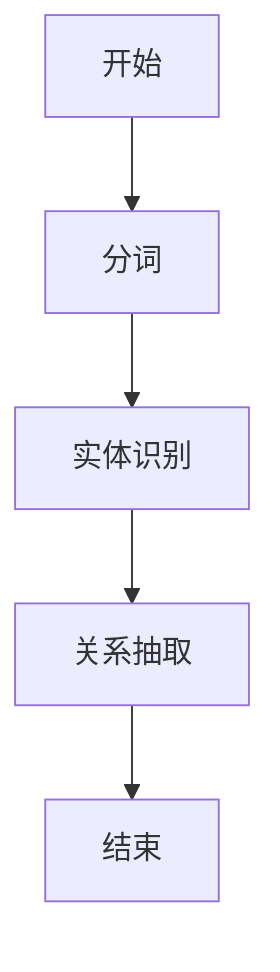
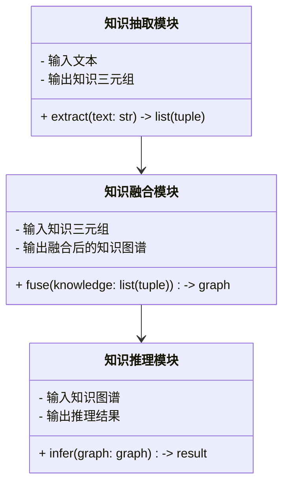
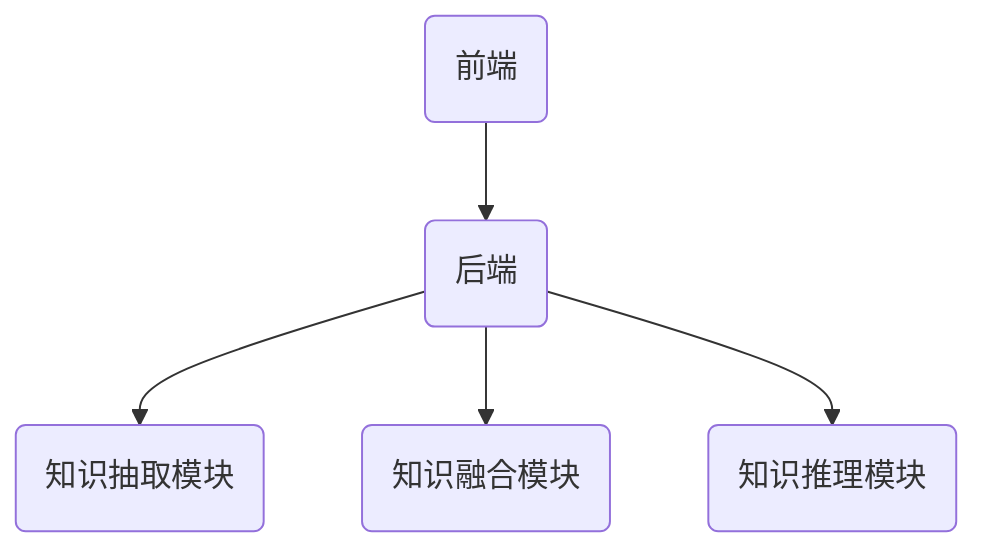
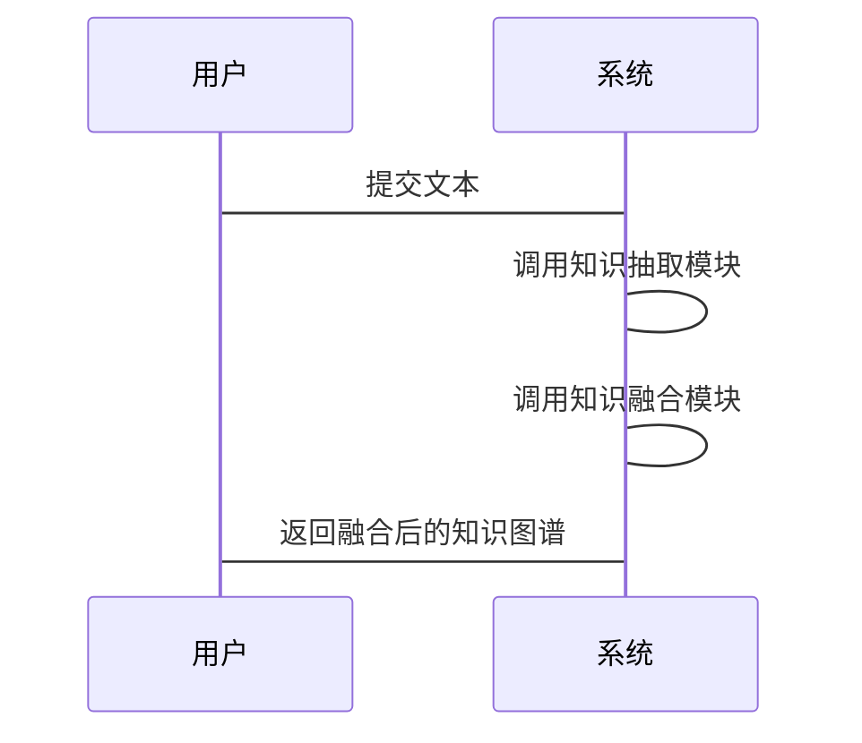

                 


# 构建AI驱动的企业知识管理系统：智能知识图谱

> 关键词：企业知识管理，AI驱动，智能知识图谱，知识抽取，知识融合，知识推理

> 摘要：随着企业数字化转型的深入，知识管理的重要性日益凸显。本文详细探讨如何利用人工智能技术构建智能知识图谱，打造高效的企业知识管理系统。文章从知识图谱的核心概念出发，分析其构建过程，结合自然语言处理技术，详细阐述知识抽取、融合与推理的算法原理，并通过系统架构设计与项目实战，为企业知识管理系统的构建提供全面指导。

---

# 第一部分: 引言

## 第1章: 知识管理与智能知识图谱

### 1.1 知识管理的背景与重要性

#### 1.1.1 知识管理的定义与作用
知识管理（Knowledge Management）是指通过系统化的方法，对企业内外部知识进行采集、整理、存储、分析和应用的过程。其目的是将分散的知识资源化、系统化，从而提升企业的决策效率和竞争力。

知识管理的核心作用包括：
- **提升效率**：快速检索和应用已有知识，避免重复劳动。
- **知识传承**：通过系统化存储，确保知识不会因人员流动而流失。
- **创新驱动**：通过知识的关联分析，发现新的业务机会。

#### 1.1.2 传统知识管理的局限性
传统的知识管理方式主要依赖文档存储和简单的检索技术，存在以下问题：
- **知识孤岛**：不同部门或系统中的知识无法有效整合。
- **难以深度挖掘**：无法从海量数据中提取隐性知识。
- **缺乏智能化**：无法根据上下文提供智能推荐或关联分析。

#### 1.1.3 AI驱动的知识管理新趋势
随着人工智能技术的发展，知识管理正在从传统的被动存储向主动服务转变。AI驱动的知识管理系统能够通过自然语言处理、机器学习等技术，自动提取、关联和推理知识，为企业提供更智能、更高效的解决方案。

---

### 1.2 智能知识图谱的概念

#### 1.2.1 知识图谱的定义
知识图谱（Knowledge Graph）是一种以图结构表示知识的技术，由节点（实体）和边（关系）组成。它可以将分散的知识点连接起来，形成一个庞大的知识网络。

#### 1.2.2 智能知识图谱的核心特征
智能知识图谱在传统知识图谱的基础上，加入了人工智能技术，使其具备以下特征：
- **动态更新**：能够实时获取新知识并自动更新。
- **智能推理**：通过机器学习模型，实现知识的自动推理和关联分析。
- **多模态支持**：能够处理文本、图像、视频等多种数据类型。

#### 1.2.3 智能知识图谱与传统知识管理的对比
| 特性                | 传统知识管理          | 智能知识图谱          |
|---------------------|-----------------------|-----------------------|
| 数据结构            | 文档式存储            | 图结构存储            |
| 知识关联            | 简单关联，依赖人工整理 | 自动关联，基于算法推理 |
| 智能性               | 无                    | 高                    |
| 应用场景            | 知识检索、存储        | 知识检索、推理、推荐  |

---

### 1.3 企业知识管理的挑战与机遇

#### 1.3.1 企业知识管理的痛点
- 数据分散：企业内部数据分布在不同的系统中，难以统一管理。
- 知识孤岛：部门间知识无法有效共享，导致资源浪费。
- 知识更新不及时：难以快速响应业务变化。

#### 1.3.2 AI技术在知识管理中的应用潜力
- **自动抽取**：通过NLP技术从非结构化数据中提取知识。
- **智能关联**：利用图嵌入技术（如Word2Vec、GloVe）进行知识关联。
- **实时更新**：通过流数据处理技术实时更新知识图谱。

#### 1.3.3 未来发展趋势
- **智能化**：知识管理系统将更加智能化，能够主动学习和推理。
- **多模态化**：支持多种数据类型的融合，提升知识的丰富性。
- **场景化**：根据具体业务场景定制知识管理系统。

---

### 1.4 本章小结
本章从知识管理的背景和重要性出发，介绍了智能知识图谱的核心概念及其与传统知识管理的区别。通过分析企业知识管理的挑战与机遇，为后续章节的深入探讨奠定了基础。

---

# 第二部分: 核心概念与原理

## 第2章: 知识图谱构建的核心概念

### 2.1 知识图谱的构建过程

#### 2.1.1 数据采集与预处理
数据采集是知识图谱构建的第一步，常见的数据来源包括：
- 结构化数据：数据库、表格数据。
- 非结构化数据：文本、文档、网页内容。
- 半结构化数据：JSON、XML等格式的数据。

数据预处理包括：
- 数据清洗：去除冗余、重复或无效数据。
- 数据标注：对数据进行分类、实体识别等预处理。

#### 2.1.2 知识抽取
知识抽取是通过NLP技术从文本中提取实体、关系和属性。常用方法包括：
- **基于规则的抽取**：通过正则表达式匹配特定模式。
- **基于统计的抽取**：利用概率模型进行模式匹配。
- **基于深度学习的抽取**：使用CRF、LSTM等模型进行序列标注。

#### 2.1.3 知识融合
知识融合是将多个来源的知识进行合并，消除冗余和矛盾。常用方法包括：
- **同义词消解**：将同义词或近义词统一表示。
- **冲突检测与解决**：检测知识冲突并进行修复。

#### 2.1.4 知识推理
知识推理是通过逻辑推理技术，从已有知识中推导出新的知识。常用方法包括：
- **基于规则的推理**：通过预定义的规则进行推理。
- **基于逻辑的推理**：利用一阶逻辑进行形式推理。
- **基于图的推理**：通过图结构进行路径分析。

---

### 2.2 知识图谱的存储与表示

#### 2.2.1 图数据库的选择
常用的图数据库包括：
- **Neo4j**：支持事务处理和高效的查询性能。
- **RDF4J**：支持RDF数据模型，适合语义网络构建。
- **TinkerPop**：支持多种图数据库的统一接口。

#### 2.2.2 知识图谱的表示方法
知识图谱的表示方法包括：
- **RDF三元组**：(主语，谓词，宾语)。
- **图嵌入**：将实体和关系映射到向量空间中。

#### 2.2.3 知识图谱的查询语言
常用的查询语言包括：
- **SPARQL**：用于RDF数据的查询。
- **Cypher**：用于Neo4j的图数据库查询。

---

### 2.3 知识图谱的可视化

#### 2.3.1 知识图谱的可视化工具
常用的可视化工具包括：
- **Gephi**：支持网络分析和可视化。
- **Neo4j Browser**：内置的图数据库可视化工具。
- **D3.js**：用于前端数据可视化的JavaScript库。

#### 2.3.2 可视化方法与最佳实践
- **层次化布局**：将图中的节点按层次排列，便于理解结构。
- **颜色编码**：用颜色区分不同类型的节点或关系。
- **交互式可视化**：支持缩放、过滤等交互操作，提升用户体验。

---

### 2.4 本章小结
本章详细介绍了知识图谱的构建过程、存储表示方法以及可视化技术。通过这些技术，企业可以将分散的知识转化为结构化的知识图谱，为后续的知识管理奠定基础。

---

## 第3章: 自然语言处理技术

### 3.1 NLP技术在知识图谱中的应用

#### 3.1.1 分词与实体识别
分词是将文本分割成词语的过程，实体识别是识别文本中的命名实体（如人名、地名、组织名等）。

示例：
- 输入文本： "李华是北京煋邦文化科技有限公司的CEO。"
- 分词结果： ["李华", "是", "北京", "煋邦文化科技有限公司", "的", "CEO", "。"]
- 实体识别结果：李华（人名），北京（地名），北京煋邦文化科技有限公司（组织名），CEO（职位名）。

---

### 3.2 知识抽取的算法原理

#### 3.2.1 基于规则的抽取



代码示例：
```python
import re

text = "李华是北京煋邦文化科技有限公司的CEO。"
# 分词
tokens = re.findall(r'\b[\w]+', text)
# 实体识别
entities = []
for token in tokens:
    if re.match(r'^[A-Z]', token):
        entities.append(('人名', token))
    elif re.match(r'^[a-z]+$', token):
        entities.append(('位置', token))
```

#### 3.2.2 基于统计的抽取
基于统计的抽取方法通过概率模型进行模式匹配，常用工具包括CRF（条件随机场）和HMM（隐马尔可夫模型）。

数学模型：
- CRF是一种无向图模型，用于序列标注任务。
- HMM是一种马尔可夫链模型，用于处理隐藏状态和观测值之间的关系。

---

#### 3.2.3 基于深度学习的抽取
基于深度学习的抽取方法使用RNN（循环神经网络）或LSTM（长短期记忆网络）进行序列标注。

代码示例：
```python
import tensorflow as tf
from tensorflow.keras import layers

model = tf.keras.Sequential([
    layers.Embedding(input_dim=10000, output_dim=100),
    layers.LSTM(64, return_sequences=True),
    layers.Dense(4, activation='softmax')
])
```

---

### 3.3 知识融合与推理的算法原理

#### 3.3.1 知识融合
知识融合是将多个来源的知识进行合并，常用方法包括：
- **同义词消解**：将同义词或近义词统一表示。
- **冲突检测与解决**：检测知识冲突并进行修复。

#### 3.3.2 知识推理
知识推理是通过逻辑推理技术，从已有知识中推导出新的知识。常用方法包括：
- **基于规则的推理**：通过预定义的规则进行推理。
- **基于逻辑的推理**：利用一阶逻辑进行形式推理。
- **基于图的推理**：通过图结构进行路径分析。

---

### 3.4 本章小结
本章详细介绍了自然语言处理技术在知识图谱中的应用，包括分词、实体识别、知识抽取、知识融合和知识推理的算法原理。这些技术为企业构建智能知识图谱提供了坚实的技术基础。

---

## 第4章: 系统架构设计与实现

### 4.1 系统功能设计

#### 4.1.1 领域模型设计
领域模型是系统功能设计的核心，通常使用类图来表示。



---

### 4.2 系统架构设计

#### 4.2.1 系统架构图
系统架构设计通常包括前端和后端两部分。



---

### 4.3 系统接口设计

#### 4.3.1 API接口
系统通常提供以下API接口：
- `POST /api/extract`：接收文本，返回知识三元组。
- `POST /api/fuse`：接收知识三元组，返回融合后的知识图谱。
- `POST /api/infer`：接收知识图谱，返回推理结果。

---

### 4.4 系统交互设计

#### 4.4.1 交互流程图
系统交互流程通常包括以下步骤：



---

## 第5章: 项目实战

### 5.1 环境安装

#### 5.1.1 安装Python
```bash
python --version
# 输出示例：Python 3.9.10
```

#### 5.1.2 安装依赖库
```bash
pip install numpy pandas scikit-learn tensorflow
```

---

### 5.2 核心代码实现

#### 5.2.1 知识抽取模块
```python
import re

def extract_entities(text):
    tokens = re.findall(r'\b[\w]+', text)
    entities = []
    for token in tokens:
        if re.match(r'^[A-Z]', token):
            entities.append(('人名', token))
        elif re.match(r'^[a-z]+$', token):
            entities.append(('位置', token))
    return entities
```

#### 5.2.2 知识融合模块
```python
from collections import defaultdict

def fuse_knowledge(knowledge):
    entity_graph = defaultdict(list)
    for triple in knowledge:
        entity_graph[triple[0]].append(triple[1])
    return entity_graph
```

---

### 5.3 案例分析与解读
以企业员工信息管理为例，假设我们有以下文本：
- "张三是中国科学院的博士。"
- "中国科学院位于北京市海淀区。"
- "张三是北京煋邦文化科技有限公司的CEO。"

通过知识抽取模块，我们可以提取出以下知识三元组：
- ('张三', '是', '博士')
- ('中国科学院', '位于', '北京市海淀区')
- ('张三', '是', '北京煋邦文化科技有限公司的CEO')

通过知识融合模块，我们将这些三元组整合到知识图谱中：
- 张三 → 博士
- 张三 → 北京市海淀区
- 中国科学院 → 北京市海淀区
- 张三 → 北京煋邦文化科技有限公司的CEO

---

## 第6章: 总结与展望

### 6.1 本章总结
本文详细介绍了AI驱动的企业知识管理系统的构建过程，包括知识图谱的核心概念、构建技术、系统架构设计以及项目实战。通过这些技术，企业可以实现知识的高效管理和智能应用。

---

### 6.2 未来展望
随着人工智能技术的不断发展，智能知识图谱将更加智能化和场景化。未来的研究方向包括：
- **更强大的推理能力**：通过图神经网络（Graph Neural Network）提升知识推理的准确性。
- **多模态融合**：将文本、图像、视频等多种数据类型融入知识图谱。
- **知识图谱的实时更新**：通过流数据处理技术实现知识图谱的动态更新。

---

## 附录

### 附录A: 工具与库
- **Python库**：numpy、pandas、scikit-learn、tensorflow。
- **图数据库**：Neo4j、RDF4J。

### 附录B: 术语表
- **知识图谱**：以图结构表示的知识网络。
- **实体识别**：识别文本中的命名实体。

---

作者：AI天才研究院/AI Genius Institute & 禅与计算机程序设计艺术 /Zen And The Art of Computer Programming

