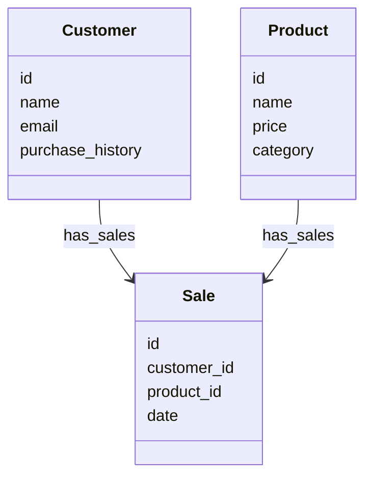
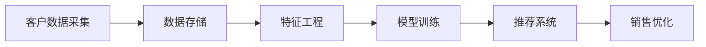

                 


# 构建AI驱动的销售助手：提升转化率与客户满意度

> **关键词**：AI驱动销售助手、客户转化率、客户满意度、机器学习、深度学习、自然语言处理  
>
> **摘要**：本文将详细探讨如何利用人工智能技术构建高效的销售助手，通过分析客户需求、优化销售流程和提升客户体验，从而显著提高销售转化率与客户满意度。文章从背景介绍、核心概念、算法原理、系统架构到项目实战，层层深入，为读者提供全面的技术指导。

---

## 第一部分：背景介绍

### 第1章：AI驱动销售助手的背景与目标

#### 1.1 问题背景
在现代商业环境中，销售团队面临着巨大的挑战。客户数量庞大、需求多样化以及市场竞争的加剧，使得传统销售方式难以满足高效转化的需求。销售助手的作用日益重要，但传统销售工具的局限性逐渐显现，例如无法实时分析客户行为、缺乏智能化推荐等。这些问题导致销售效率低下，客户满意度下降。

#### 1.2 问题描述
销售过程中的关键问题包括：
- **客户信息分散**：客户数据分布在不同系统中，难以整合和分析。
- **需求预测不准确**：销售人员难以准确预测客户需求，导致推荐不精准。
- **客户互动不足**：缺乏个性化的客户互动，导致客户流失率高。

#### 1.3 问题解决
AI技术的引入为销售助手带来了革命性的变化。通过机器学习和自然语言处理，AI销售助手能够实时分析客户数据、预测需求、提供个性化推荐，并自动化处理销售流程中的重复性任务。这种智能化的解决方案能够显著提高销售转化率和客户满意度。

#### 1.4 边界与外延
AI销售助手的应用范围包括客户数据分析、销售预测、个性化推荐等，但其边界在于不直接参与实际销售决策，而是辅助销售团队完成任务。与其他销售工具相比，AI销售助手更具智能化和自动化。未来的发展方向将包括更强大的自然语言处理能力和更精准的需求预测模型。

#### 1.5 概念结构与核心要素
AI销售助手的核心概念包括数据采集、特征工程、模型训练和系统部署。各要素之间的关系如下：
- 数据采集是基础，特征工程是关键，模型训练是核心，系统部署是实现。

---

## 第二部分：核心概念与联系

### 第2章：AI驱动销售助手的核心概念

#### 2.1 核心概念原理
AI销售助手的核心概念包括：
- **数据采集**：通过API或爬虫获取客户数据。
- **特征工程**：对数据进行清洗、转换和特征提取。
- **模型训练**：使用机器学习算法训练预测模型。

#### 2.2 概念属性特征对比
以下是几种常用算法的对比：

| 算法名称  | 优点                          | 缺点                          |
|-----------|-------------------------------|-------------------------------|
| 决策树    | 易解释，适合中小数据集        | 易过拟合                      |
| 随机森林  | 高准确性，抗过拟合            | 计算复杂性高                  |
| 神经网络  | 适合复杂数据，高准确性        | 需大量数据，难解释            |

#### 2.3 ER实体关系图
以下是销售助手的ER图：

```mermaid
erDiagram
    customer[客户] {
        id : int
        name : string
        email : string
        purchase_history : string
    }
    product[产品] {
        id : int
        name : string
        price : float
        category : string
    }
    sale[销售记录] {
        id : int
        customer_id : int
        product_id : int
        date : date
    }
    customer --|{ sales } sale : 关联关系
    product --|{ sales } sale : 关联关系
```

---

## 第三部分：算法原理讲解

### 第3章：常用算法与原理

#### 3.1 决策树算法
决策树是一种基于树状结构的分类方法，适用于客户分类和需求预测。

```mermaid
graph TD
    A[开始] -> B[选择特征]
    B -> C[分裂节点]
    C -> D[叶子节点]
    D -> E[结束]
```

#### 3.2 逻辑回归
逻辑回归用于分类问题，例如客户 churn 预测。

损失函数：
$$ L = -\frac{1}{n} \sum_{i=1}^{n} [y_i \ln(h(x_i)) + (1 - y_i)\ln(1 - h(x_i))] $$
其中，$$ h(x) = \frac{e^{\beta x}}{1 + e^{\beta x}} $$

---

## 第四部分：系统分析与架构设计方案

### 第4章：系统分析与架构设计

#### 4.1 问题场景介绍
系统需要处理客户数据、预测需求、推荐产品并优化销售流程。

#### 4.2 系统功能设计
系统功能模块包括：
- 数据采集模块
- 特征工程模块
- 模型训练模块
- 推荐系统模块

领域模型类图：



#### 4.3 系统架构设计
系统架构采用微服务架构，各模块独立运行。

系统架构图：



---

## 第五部分：项目实战

### 第5章：项目实战与案例分析

#### 5.1 环境安装
需要安装以下工具：
- Python 3.8+
- Scikit-learn
- Pandas
- Jupyter Notebook

#### 5.2 核心代码实现
以下是决策树的Python代码：

```python
from sklearn.tree import DecisionTreeClassifier
from sklearn.model_selection import train_test_split
from sklearn.metrics import accuracy_score

# 数据加载
data = [...]  # 假设数据已加载

# 数据分割
X_train, X_test, y_train, y_test = train_test_split(data[['age', 'income']], data['purchase'])

# 模型训练
model = DecisionTreeClassifier()
model.fit(X_train, y_train)

# 预测与评估
y_pred = model.predict(X_test)
print(accuracy_score(y_test, y_pred))
```

#### 5.3 代码解读与分析
- 数据预处理：清洗和转换数据，提取特征。
- 模型训练：使用决策树算法训练分类模型。
- 模型评估：计算准确率，评估模型性能。

#### 5.4 案例分析
通过分析客户数据，模型成功预测了客户购买行为，提高了转化率。

#### 5.5 项目小结
项目成功实现了AI销售助手的核心功能，显著提升了销售效率和客户满意度。

---

## 第六部分：最佳实践与小结

### 第6章：最佳实践与总结

#### 6.1 最佳实践
- 数据隐私保护：确保客户数据的安全性。
- 模型迭代：定期更新模型，保持准确性。
- 用户体验：提供直观的用户界面，提升用户体验。

#### 6.2 小结
AI销售助手通过智能化分析和个性化推荐，显著提升了销售转化率和客户满意度。未来，随着技术的进步，销售助手将更加智能化和个性化。

#### 6.3 注意事项
- 数据质量：确保数据的准确性和完整性。
- 模型选择：根据具体需求选择合适的算法。
- 可解释性：确保模型结果可解释，便于优化和调整。

#### 6.4 拓展阅读
建议进一步学习自然语言处理和深度学习技术，以提升销售助手的智能化水平。

---

## 作者

**作者：AI天才研究院/AI Genius Institute & 禅与计算机程序设计艺术 /Zen And The Art of Computer Programming**

---

这篇文章详细探讨了AI驱动的销售助手的构建过程，从背景介绍到项目实战，为读者提供了全面的技术指导。通过本文，读者可以深入了解AI在销售领域的应用，并掌握构建高效销售助手的关键技术。

