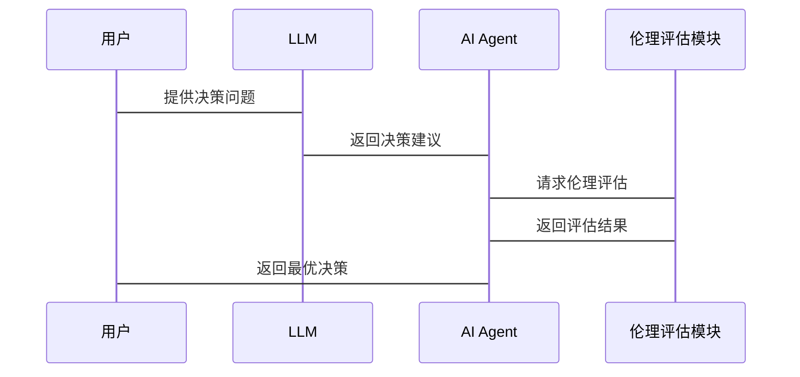

                 


# 构建LLM支持的AI Agent伦理决策系统

> 关键词：LLM，AI Agent，伦理决策系统，决策算法，系统架构，项目实战

> 摘要：本文详细探讨了如何构建一个基于大语言模型（LLM）的AI Agent伦理决策系统，从背景分析到系统架构设计，再到项目实战，系统地阐述了该系统的构建过程。文章内容包括伦理决策系统的核心概念、算法原理、系统架构设计、项目实现和实际案例分析，为读者提供了从理论到实践的全面指导。

---

## 第一部分：背景介绍

### 第1章：问题背景与目标

#### 1.1 问题背景
随着AI技术的迅速发展，AI Agent在各种应用场景中被广泛应用。然而，AI Agent在做出决策时，可能会面临复杂的伦理问题，例如隐私泄露、责任归属、公平性等。如何在AI Agent的决策过程中融入伦理考量，成为一个亟待解决的问题。

#### 1.2 问题描述
伦理决策系统需要在AI Agent的决策过程中，引入伦理评估机制，确保决策的合法性和道德性。本文将探讨如何利用大语言模型（LLM）来支持AI Agent的伦理决策，构建一个高效、可靠的伦理决策系统。

#### 1.3 问题解决思路
通过结合LLM的强大生成能力和AI Agent的执行能力，构建一个能够理解、分析和评估伦理问题的决策系统。本文将详细分析系统的构建过程，包括算法设计、系统架构和项目实现。

---

## 第二部分：核心概念与联系

### 第2章：伦理决策系统的核心概念

#### 2.1 伦理决策的基本原理
伦理决策是指在决策过程中考虑伦理因素，确保决策符合社会道德和法律法规。本文将从以下几个方面分析伦理决策的基本原理：
- **伦理决策的定义**：伦理决策是指在决策过程中，不仅要考虑决策的后果，还要考虑决策是否符合伦理规范。
- **伦理决策的核心要素**：包括决策主体、决策客体、决策环境、伦理准则等。
- **伦理决策的实现路径**：通过算法和模型，将伦理准则转化为决策依据。

#### 2.2 决策框架分析
决策框架是伦理决策系统的核心部分，它包括以下几个关键步骤：
1. **问题识别**：识别需要决策的问题。
2. **伦理准则提取**：从问题中提取相关的伦理准则。
3. **决策生成**：基于伦理准则生成多个决策方案。
4. **方案评估**：对决策方案进行伦理评估，选择最优方案。

#### 2.3 LLM与AI Agent的协作机制
LLM（大语言模型）具有强大的自然语言处理能力，可以用于生成决策建议和分析伦理问题。AI Agent则负责执行决策。两者的协作机制如下：
1. **LLM生成决策建议**：LLM根据输入的问题生成多个决策建议。
2. **AI Agent分析与优化**：AI Agent对决策建议进行分析，优化决策方案。
3. **人机协作**：用户可以根据实际情况，对AI Agent的决策进行调整和补充。

#### 2.4 伦理评估指标
为了确保决策的伦理合规性，我们需要制定一系列评估指标，例如：
- **公平性**：确保决策对所有相关方都是公平的。
- **透明性**：决策过程必须透明，可追溯。
- **可解释性**：决策结果必须能够被人类理解和解释。

---

## 第三部分：算法原理

### 第3章：伦理决策的数学模型与算法

#### 3.1 基于LLM的生成式决策
基于LLM的生成式决策是一种基于生成模型的决策方法。其核心思想是利用LLM生成多个决策方案，然后通过评估选择最优方案。具体步骤如下：
1. **问题输入**：将决策问题输入LLM，生成多个决策方案。
2. **方案评估**：对每个决策方案进行伦理评估，计算其伦理得分。
3. **决策选择**：选择伦理得分最高的方案作为最终决策。

#### 3.2 基于规则的决策算法
基于规则的决策算法是一种通过预定义规则进行决策的方法。其核心思想是将伦理准则转化为具体的规则，并在决策过程中遵循这些规则。具体步骤如下：
1. **规则定义**：定义一组伦理准则，例如“隐私保护”、“公平性”等。
2. **规则匹配**：根据输入的问题，匹配相关的规则。
3. **决策生成**：根据匹配的规则生成决策方案。

#### 3.3 算法实现
以下是一个基于规则的决策算法的示例代码：

```python
def ethical_decision(rules, problem):
    # 从规则中匹配与问题相关的规则
    matched_rules = [rule for rule in rules if rule_matches(problem, rule)]
    
    # 根据匹配的规则生成决策方案
    decisions = generate_decisions(matched_rules)
    
    # 对决策方案进行评估，选择最优方案
    return select_best_decision(decisions)
```

---

## 第四部分：系统分析与架构设计

### 第4章：系统分析与架构设计

#### 4.1 问题场景介绍
本文将构建一个基于LLM的AI Agent伦理决策系统，应用于医疗领域。系统需要帮助医生在诊断过程中做出伦理决策，例如在治疗方案的选择上，确保患者的隐私和权益得到保护。

#### 4.2 系统功能设计
系统功能设计包括以下几个方面：
1. **问题输入**：用户输入需要决策的问题。
2. **决策生成**：系统生成多个决策方案。
3. **伦理评估**：系统对决策方案进行伦理评估。
4. **决策输出**：系统输出最优决策方案。

#### 4.3 系统架构设计
系统架构设计包括以下几个部分：
- **前端界面**：用户输入问题和查看决策结果。
- **LLM服务**：生成决策建议。
- **AI Agent**：执行决策。
- **伦理评估模块**：对决策方案进行伦理评估。

#### 4.4 接口设计
系统接口设计包括以下几个部分：
1. **输入接口**：用户输入决策问题。
2. **输出接口**：输出决策结果。
3. **LLM接口**：与LLM服务进行交互。
4. **评估接口**：对决策方案进行评估。

#### 4.5 交互流程
以下是一个交互流程的Mermaid序列图：



---

## 第五部分：项目实战

### 第5章：项目实战

#### 5.1 环境安装
为了实现伦理决策系统，需要安装以下工具和库：
- Python 3.8+
- LLM模型（例如GPT-3）
- AI Agent框架（例如Python中的一个实现）

#### 5.2 核心实现
以下是伦理决策系统的核心实现代码：

```python
def main():
    # 初始化LLM
    llm = initialize_llm()
    
    # 用户输入问题
    problem = input("请输入决策问题：")
    
    # 生成决策建议
    suggestions = llm.generate_suggestions(problem)
    
    # 伦理评估
    evaluations = evaluate_ethically(suggestions)
    
    # 选择最优方案
    best_decision = select_best_evaluation(evaluations)
    
    # 输出结果
    print("最优决策方案：", best_decision)

if __name__ == "__main__":
    main()
```

#### 5.3 代码解读
1. `initialize_llm()`：初始化LLM模型。
2. `llm.generate_suggestions(problem)`：根据问题生成决策建议。
3. `evaluate_ethically(suggestions)`：对决策建议进行伦理评估。
4. `select_best_evaluation(evaluations)`：选择最优的决策方案。

#### 5.4 实际案例分析
以下是一个实际案例分析：
假设有一个医疗场景，患者需要选择不同的治疗方案。系统会根据患者的病情和伦理准则，生成多个治疗方案，并对每个方案进行伦理评估，最终选择最优的治疗方案。

#### 5.5 项目小结
通过上述步骤，我们可以成功构建一个基于LLM的AI Agent伦理决策系统。该系统能够帮助用户在决策过程中考虑伦理因素，确保决策的合法性和道德性。

---

## 第六部分：总结与展望

### 第6章：总结与展望

#### 6.1 最佳实践
- 在构建伦理决策系统时，需要充分考虑伦理准则的全面性和可操作性。
- 确保系统的透明性和可解释性，以便用户能够理解和信任系统。
- 定期更新和优化伦理准则，以适应社会的发展和变化。

#### 6.2 小结
本文详细探讨了如何构建一个基于LLM的AI Agent伦理决策系统，从背景分析到系统架构设计，再到项目实现，为读者提供了全面的指导。

#### 6.3 注意事项
- 在实际应用中，需要根据具体场景调整系统的参数和算法。
- 确保系统的安全性和稳定性，防止数据泄露和系统崩溃。

#### 6.4 拓展阅读
- 《伦理与人工智能》
- 《大语言模型的应用与挑战》
- 《AI Agent的理论与实践》

---

## 作者信息

作者：AI天才研究院/AI Genius Institute & 禅与计算机程序设计艺术 /Zen And The Art of Computer Programming

---

**附录：**

- 代码示例的详细解释
- 系统架构图的详细说明
- 伦理评估指标的具体实现

---

**结束**

