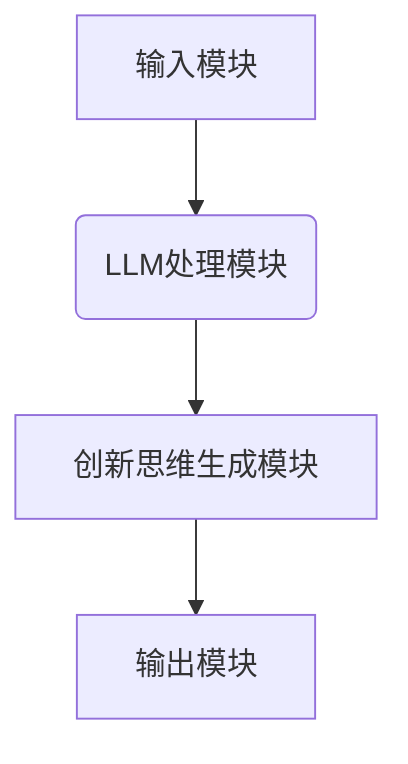
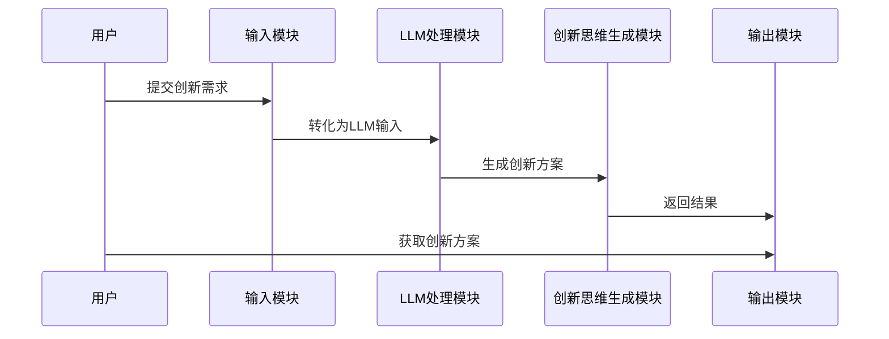
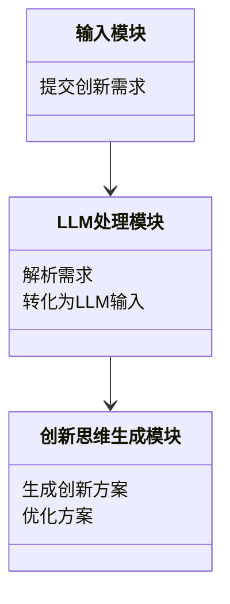

                 


# 构建LLM支持的AI Agent创新思维系统

---

## 关键词：
- LLM (Large Language Model)
- AI Agent
- 创新思维系统
- 人工智能
- 自然语言处理

---

## 摘要：
本文详细探讨了构建基于大语言模型（LLM）支持的AI Agent创新思维系统的各个方面，从背景和重要性出发，逐步分析了核心概念、算法原理、系统架构设计、项目实战以及总结与扩展。通过对比分析、图表展示、代码实现和案例研究，深入浅出地阐述了如何利用LLM技术构建具备创新思维的AI代理系统，并为读者提供了实践指导和未来研究方向的建议。

---

# 第一部分: 引言

## 第1章: 构建LLM支持的AI Agent概述

### 1.1 问题背景与重要性

#### 1.1.1 当前AI技术的发展现状
近年来，人工智能（AI）技术飞速发展，尤其是大语言模型（LLM）的崛起，为AI Agent的构建提供了强大的技术支持。LLM能够理解和生成自然语言，具备强大的上下文理解和推理能力，使其在AI Agent中的应用成为可能。

#### 1.1.2 LLM与AI Agent结合的必要性
传统的AI Agent通常依赖于规则引擎或简单的决策树，难以应对复杂的创新性问题。而LLM的强大能力可以弥补这一不足，使得AI Agent能够更灵活地处理多样化的任务，尤其是在创新思维领域，LLM的支持使得AI Agent能够生成创意、解决问题、提供建议等。

#### 1.1.3 创新思维系统的核心价值
创新思维系统的核心价值在于帮助用户打破思维定式，提供独特的解决方案。通过LLM的支持，AI Agent能够生成多样化的思路，激发用户的创造力，从而在商业、科技、教育等领域发挥重要作用。

### 1.2 核心概念与系统目标

#### 1.2.1 LLM支持的AI Agent定义
LLM支持的AI Agent是一种结合了大语言模型和人工智能代理技术的系统，能够通过自然语言处理技术与用户交互，并利用LLM的强大能力提供创新性的解决方案。

#### 1.2.2 创新思维系统的功能目标
创新思维系统的主要功能目标包括：
1. 提供多维度的创新思路。
2. 支持用户在不同场景下的创意生成。
3. 帮助用户克服思维定式，提供独特的解决方案。

#### 1.2.3 系统边界与外延
系统边界主要集中在LLM与AI Agent的结合，外延则包括与其它AI技术（如计算机视觉）的集成，以及在不同领域的应用扩展。

### 1.3 本章小结

#### 1.3.1 核心概念总结
本章主要介绍了构建LLM支持的AI Agent的背景、重要性和核心概念，为后续章节奠定了基础。

#### 1.3.2 系统目标与架构方向
通过本章的分析，明确了系统的功能目标和架构方向，为后续的系统设计和实现提供了指导。

---

## 第2章: LLM与AI Agent的核心联系

### 2.1 LLM的基本原理

#### 2.1.1 大语言模型的定义
大语言模型（LLM）是一种基于深度学习的自然语言处理模型，通常基于Transformer架构，通过大量数据的预训练，具备理解和生成自然语言的能力。

#### 2.1.2 LLM的核心算法特点
1. **自注意力机制**：允许模型关注输入序列中的不同位置，从而捕捉长距离依赖关系。
2. **序列到序列模型**：通过编码器-解码器结构，将输入序列映射为输出序列。
3. **多层网络结构**：通过多层堆叠，提升模型的表达能力。

#### 2.1.3 LLM与传统NLP模型的区别
| 特性       | 传统NLP模型       | LLM                     |
|------------|--------------------|--------------------------|
| 模型复杂度   | 较低               | 极高                     |
| 数据需求     | 较小               | 需要大量标注数据         |
| 上下游任务   | 专注于特定任务     | 适用于广泛任务，包括生成 |

### 2.2 AI Agent的基本原理

#### 2.2.1 AI Agent的定义与分类
AI Agent是一种能够感知环境、自主决策并执行任务的智能体。根据智能水平，可以分为简单反射式、基于模型的反射式、目标驱动式和实用驱动式Agent。

#### 2.2.2 基于LLM的AI Agent特点
1. **自然语言交互**：支持通过自然语言与用户交互。
2. **动态推理能力**：能够根据上下文进行推理和决策。
3. **创新性输出**：利用LLM的生成能力，提供创新性的解决方案。

#### 2.2.3 LLM在AI Agent中的作用
LLM为AI Agent提供了强大的语言理解和生成能力，使其能够更好地理解用户需求，并生成多样化的创新性输出。

### 2.3 创新思维系统的构建逻辑

#### 2.3.1 创新思维的定义与特点
创新思维是指打破常规思维模式，提出新颖解决方案的能力。其特点包括多样性、灵活性和创造性。

#### 2.3.2 LLM支持下创新思维的实现路径
1. **输入需求分析**：解析用户的创新需求。
2. **生成创新方案**：利用LLM生成多样化的解决方案。
3. **优化与反馈**：根据用户反馈优化输出结果。

#### 2.3.3 系统整体架构与核心模块
系统整体架构包括输入模块、LLM处理模块、创新思维生成模块和输出模块。

---

## 第3章: 核心概念对比与系统架构

### 3.1 核心概念对比分析

#### 3.1.1 LLM与传统NLP模型对比
1. **模型复杂度**：LLM模型复杂度高，传统NLP模型复杂度低。
2. **数据需求**：LLM需要大量数据，传统NLP数据需求较小。
3. **任务适用性**：LLM适用于广泛任务，传统NLP适用于特定任务。

#### 3.1.2 AI Agent与传统代理对比
| 特性       | 传统代理             | 基于LLM的AI Agent       |
|------------|----------------------|--------------------------|
| 智能水平     | 简单反射式           | 高级动态推理             |
| 交互方式     | 基于规则             | 基于自然语言             |
| 创新性       | 低                   | 高                       |

#### 3.1.3 创新思维系统与传统思维辅助系统对比
| 特性       | 传统思维辅助系统      | 基于LLM的创新思维系统    |
|------------|-----------------------|--------------------------|
| 思维模式     | 基于规则和经验         | 基于生成和创新             |
| 技术基础     | 传统算法             | 大语言模型               |
| 应用场景     | 单一任务             | 多场景、多领域            |

### 3.2 系统架构设计

#### 3.2.1 问题场景介绍
本系统旨在帮助用户在多种场景下进行创新思维，包括商业策略制定、产品设计、学术研究等。

#### 3.2.2 系统功能设计
系统功能包括需求分析、创新方案生成、优化与反馈三个模块。

#### 3.2.3 系统架构设计


#### 3.2.4 系统接口设计
系统提供API接口，支持与第三方应用的集成。

#### 3.2.5 系统交互流程


---

## 第4章: 算法原理讲解

### 4.1 大语言模型的训练过程

#### 4.1.1 Transformer模型结构
Transformer模型由编码器和解码器组成，编码器负责将输入序列编码为上下文向量，解码器负责根据编码结果生成输出序列。

#### 4.1.2 自注意力机制
自注意力机制通过计算输入序列中每个位置与其他位置的相关性，生成位置权重，从而得到位置编码。

#### 4.1.3 编码器-解码器结构
编码器将输入序列映射为一个固定长度的向量，解码器根据编码结果生成输出序列。

### 4.2 AI Agent的决策机制

#### 4.2.1 基于LLM的推理方法
通过LLM生成多样化的解决方案，利用上下文信息进行推理和选择。

#### 4.2.2 多轮对话机制
支持多轮对话，逐步细化用户需求，生成更精准的创新方案。

---

## 第5章: 系统分析与架构设计

### 5.1 问题场景介绍
系统主要用于帮助用户在商业、教育、科技等领域进行创新思维，解决复杂问题。

### 5.2 项目介绍
本项目旨在构建一个基于LLM的AI Agent创新思维系统，提供创新方案生成、优化与反馈功能。

### 5.3 系统功能设计
系统功能模块包括：
1. 输入模块：接收用户需求。
2. LLM处理模块：解析需求并生成创新方案。
3. 创新思维生成模块：优化方案并返回结果。

### 5.4 系统架构设计


### 5.5 系统接口设计
系统提供RESTful API接口，支持JSON格式的数据交互。

### 5.6 系统交互流程


---

## 第6章: 项目实战

### 6.1 环境配置

#### 6.1.1 安装Python
```bash
python --version
```

#### 6.1.2 安装依赖
```bash
pip install transformers
pip install torch
```

### 6.2 核心代码实现

#### 6.2.1 输入模块实现
```python
def submit_request(user_input):
    # 处理用户输入
    pass
```

#### 6.2.2 LLM处理模块实现
```python
from transformers import pipeline

llm_pipeline = pipeline('text-generation', model='gpt2')
```

#### 6.2.3 创新思维生成模块实现
```python
def generate创新方案(llm_output):
    # 优化和生成最终方案
    pass
```

### 6.3 代码应用解读与分析
解释上述代码的功能，包括输入处理、LLM调用和创新方案生成。

### 6.4 实际案例分析
通过具体案例，展示系统如何生成创新方案，包括输入、处理和输出的全过程。

### 6.5 项目小结
总结项目实现的关键点和经验教训。

---

## 第7章: 总结与扩展

### 7.1 最佳实践 tips

#### 7.1.1 数据隐私
确保用户数据的安全和隐私。

#### 7.1.2 模型训练效率
优化模型训练过程，提高效率。

#### 7.1.3 系统可扩展性
设计系统时考虑未来的扩展性。

### 7.2 小结
总结全文，强调构建LLM支持的AI Agent创新思维系统的重要性和实现方法。

### 7.3 注意事项
在系统设计和实现过程中，需注意数据安全、系统稳定性和用户体验。

### 7.4 拓展阅读
推荐相关领域的书籍和论文，供读者深入学习。

---

## 作者：AI天才研究院 & 禅与计算机程序设计艺术

---

本文通过详细分析和实际案例，全面探讨了构建基于LLM的AI Agent创新思维系统的各个方面，为读者提供了理论支持和实践指导。希望本文能为相关领域的研究和应用提供有价值的参考。

