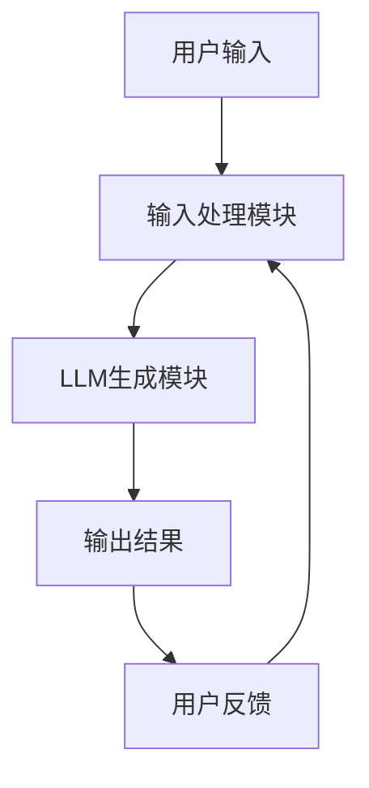
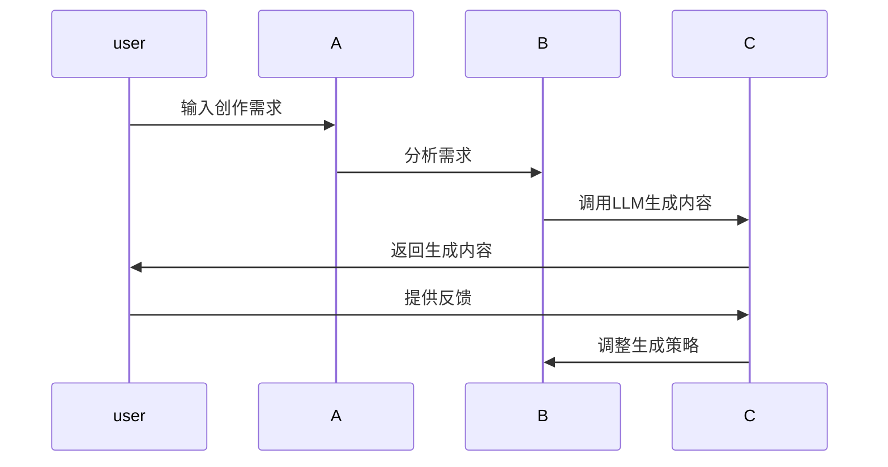

                 


# 《构建LLM支持的AI Agent创造性写作系统》

---

## 关键词：
- LLM (Large Language Model)
- AI Agent
- 创造性写作系统
- 自然语言处理
- AI驱动的创作工具
- 人机协作
- 生成式AI

---

## 摘要：
本文将详细介绍如何构建一个基于大语言模型（LLM）的AI代理，使其能够支持创造性写作。通过分析LLM和AI Agent的核心原理、系统架构设计以及实际项目实现，本文旨在为读者提供一个全面的技术指南，帮助他们理解并构建一个高效、灵活且具有创造性的AI写作系统。文章内容包括背景介绍、核心概念、算法原理、系统架构、项目实战以及最佳实践等部分。

---

# 第一部分: 背景与概述

## 第1章: 构建LLM支持的AI Agent创造性写作系统的背景与目标

### 1.1 问题背景与目标
#### 1.1.1 当前AI技术在创造性写作中的应用现状
随着大语言模型（LLM）的快速发展，AI在创造性写作中的应用越来越广泛。然而，现有的AI写作工具往往缺乏灵活性和深度，无法真正理解用户需求并生成高质量的创造性内容。此外，现有的工具通常仅支持单向的生成，缺乏与用户的深度交互能力。

#### 1.1.2 构建LLM支持的AI Agent的必要性
为了克服现有工具的局限性，我们需要构建一个基于LLM的AI Agent，使其能够理解用户需求、生成创造性内容，并与用户进行实时交互。这种AI Agent不仅可以提高写作效率，还能为用户提供更加个性化的创作体验。

#### 1.1.3 本项目的具体目标与意义
本项目的目标是设计并实现一个支持创造性写作的AI Agent系统，该系统能够：
- 理解用户的创作需求并生成高质量的内容。
- 与用户进行实时交互，根据用户反馈调整生成内容。
- 支持多种创作模式，如小说、诗歌、技术文档等。

通过实现这一系统，我们可以为用户提供一种全新的创作方式，同时推动AI技术在创造性领域的进一步发展。

---

## 第2章: LLM与AI Agent的基本概念

### 2.1 LLM的基本原理
#### 2.1.1 变压量模型（Transformer）的结构
大语言模型（LLM）通常基于Transformer架构。Transformer由编码器和解码器两部分组成。编码器负责将输入文本转化为一种高维的向量表示，解码器则根据编码器的输出生成目标文本。

#### 2.1.2 注意力机制（Attention）的实现原理
注意力机制是Transformer模型的核心。通过计算输入序列中每个词与其他词的相关性，模型可以更好地捕捉上下文信息。注意力机制的实现通常涉及计算查询（Query）、键（Key）和值（Value）向量，并通过点积和归一化操作生成注意力权重。

#### 2.1.3 LLM的训练与推理过程
LLM的训练过程通常包括以下步骤：
1. 数据预处理：将大规模文本数据进行分词、去除停用词等预处理。
2. 模型初始化：随机初始化模型参数。
3. 训练：通过最小化预测与真实值之间的误差来优化模型参数。
4. 推理：在训练好的模型基础上，根据输入生成目标文本。

### 2.2 AI Agent的核心功能
#### 2.2.1 AI Agent的定义与特点
AI Agent是一种能够感知环境、执行任务并做出决策的智能体。它可以通过与用户的交互，理解用户需求并执行相应的操作。

#### 2.2.2 LLM与AI Agent的结合方式
通过将LLM集成到AI Agent中，我们可以使其具备自然语言理解与生成能力。AI Agent可以利用LLM生成文本，并根据用户反馈调整生成内容。

#### 2.2.3 LLM在AI Agent中的应用场景
- 自然语言理解：理解用户输入的文本内容。
- 文本生成：根据用户需求生成创造性内容。
- 交互式写作：与用户进行实时交互，提供创作建议和修改意见。

---

## 第3章: 创造性写作系统的构建目标

### 3.1 系统的功能定位
创造性写作系统的目标是为用户提供一个高效、灵活的创作工具。该系统可以通过AI Agent理解用户需求，并生成高质量的创造性内容。

### 3.2 用户需求分析
用户需求分析是系统设计的第一步。我们需要了解用户在创作过程中可能遇到的问题，如灵感不足、创作效率低下等，并设计相应的解决方案。

### 3.3 系统的预期应用场景
- 创作辅助：帮助用户快速生成创意内容。
- 教育培训：为写作教学提供支持。
- 内容生成：为企业提供定制化的内容生成服务。

---

# 第二部分: 核心概念与原理

## 第4章: 大语言模型（LLM）的核心原理

### 4.1 LLM的基本原理
#### 4.1.1 Transformer模型的结构
Transformer模型由编码器和解码器组成。编码器负责将输入文本转化为向量表示，解码器则根据编码器的输出生成目标文本。

#### 4.1.2 注意力机制的实现细节
注意力机制通过计算查询、键和值向量，生成注意力权重。这些权重用于指导模型关注输入序列中的重要部分。

#### 4.1.3 LLM的训练与推理过程
训练过程包括数据预处理、模型初始化、参数优化等步骤。推理过程则是根据输入生成目标文本。

---

## 第5章: AI Agent的核心功能与实现

### 5.1 AI Agent的功能模块
AI Agent通常包括感知模块、决策模块和执行模块。感知模块负责理解用户输入，决策模块根据感知结果做出决策，执行模块则执行相应的操作。

### 5.2 LLM在AI Agent中的应用
通过集成LLM，AI Agent可以具备自然语言理解与生成能力。例如，AI Agent可以根据用户输入生成文本，并根据用户反馈调整生成内容。

---

# 第三部分: 系统架构与实现

## 第6章: 系统架构设计

### 6.1 系统功能设计
创造性写作系统的功能模块包括：
- 用户输入模块：接收用户的输入文本。
- 文本生成模块：利用LLM生成创造性内容。
- 用户反馈模块：根据用户反馈调整生成内容。

### 6.2 系统架构图
以下是系统架构的Mermaid图：



### 6.3 系统接口设计
系统接口包括：
- 用户输入接口：接收用户的输入文本。
- LLM生成接口：调用LLM生成文本。
- 用户反馈接口：接收用户的反馈信息。

### 6.4 系统交互流程
以下是系统交互流程的Mermaid图：



---

## 第7章: 项目实战

### 7.1 环境安装
- Python 3.8+
- 必要的Python库（如：transformers, torch）

### 7.2 核心代码实现
以下是一个简单的LLM生成模块的Python代码示例：

```python
from transformers import AutoModelForCausalLM, AutoTokenizer

model_name = "gpt2"
tokenizer = AutoTokenizer.from_pretrained(model_name)
model = AutoModelForCausalLM.from_pretrained(model_name)

def generate_text(prompt, max_length=50):
    inputs = tokenizer.encode(prompt, return_tensors="pt")
    outputs = model.generate(inputs, max_length=max_length, do_sample=True)
    return tokenizer.decode(outputs[0], skip_special_tokens=True)
```

### 7.3 实际案例分析
以下是一个生成小说片段的实际案例：

```python
prompt = "在一个遥远的星球上，有一个年轻的冒险家..."
generated_text = generate_text(prompt)
print(generated_text)
```

### 7.4 项目总结
通过以上步骤，我们可以实现一个基本的创造性写作系统。未来可以进一步优化模型性能，增加更多功能模块，如用户反馈机制等。

---

# 第四部分: 最佳实践与总结

## 第8章: 最佳实践与总结

### 8.1 最佳实践
- 定期更新模型，以保持生成内容的质量。
- 提供多种创作模式，满足不同用户的需求。
- 注意数据隐私和模型安全。

### 8.2 小结
本文详细介绍了如何构建一个基于LLM的AI Agent创造性写作系统。通过分析核心概念、系统架构设计以及实际项目实现，我们可以为用户提供一个高效、灵活且具有创造性的写作工具。

### 8.3 注意事项
- 确保模型的可解释性，避免生成不当内容。
- 保护用户数据隐私，防止数据泄露。

### 8.4 拓展阅读
- 《Deep Learning》 - Ian Goodfellow
- 《Transformer-Based Models for NLP》 - 明略科技

---

## 作者：
AI天才研究院/AI Genius Institute & 禅与计算机程序设计艺术/Zen And The Art of Computer Programming

