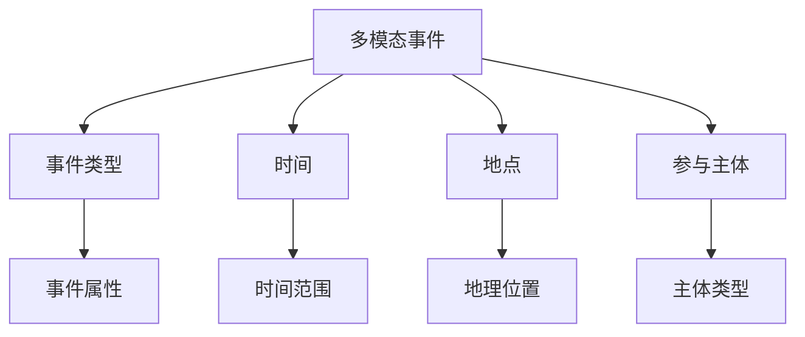
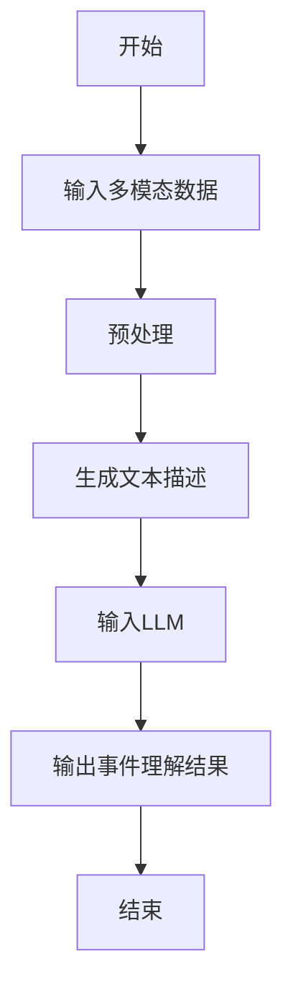
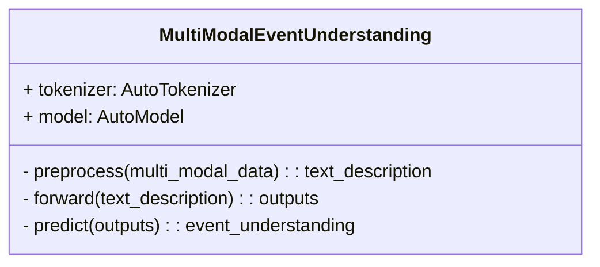
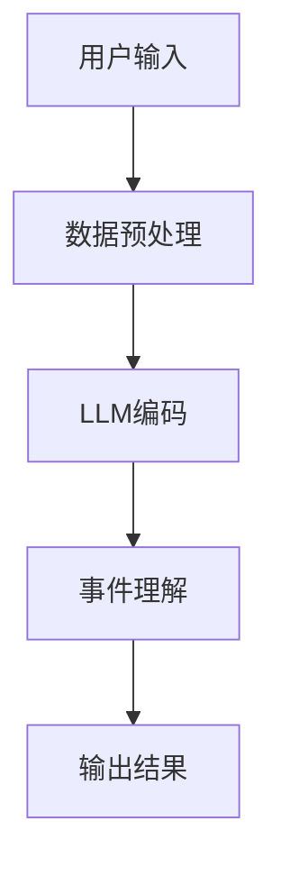
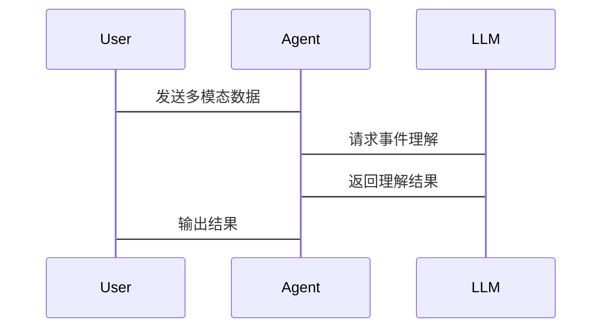

                 


# 构建LLM支持的AI Agent多模态事件理解

## 关键词：LLM，AI Agent，多模态事件理解，大语言模型，AI智能体，多模态数据

## 摘要：  
本文详细探讨了如何构建基于大语言模型（LLM）的AI Agent，以支持多模态事件理解。从背景介绍到算法实现，从系统架构到项目实战，系统性地分析了多模态数据整合、LLM支持机制以及事件理解的实现路径。文章结合理论与实践，通过具体案例和代码示例，为读者提供了一套完整的解决方案，帮助理解并实现高效的多模态事件理解系统。

---

## 第一部分: 背景介绍

### 第1章: 多模态事件理解的背景与挑战

#### 1.1 问题背景
- 当前AI Agent的发展现状：AI Agent逐渐从单一模态处理向多模态方向发展，但多模态事件理解仍面临诸多挑战。
- 多模态事件理解的需求：在现实场景中，事件往往涉及文本、图像、语音等多种数据类型，单一模态难以满足需求。
- LLM在AI Agent中的作用：LLM的强大语言处理能力为多模态事件理解提供了新的可能性。

#### 1.2 问题描述
- 多模态数据的复杂性：不同模态的数据格式、语义差异较大，难以统一处理。
- 事件理解的不确定性：事件的理解需要结合上下文、常识推理等多方面信息。
- LLM支持的必要性：LLM能够提供语义理解、意图识别等能力，弥补传统方法的不足。

#### 1.3 问题解决
- 多模态数据的整合方法：通过模态对齐、联合表示等技术，实现多模态数据的统一处理。
- LLM在事件理解中的应用：利用LLM的上下文理解和生成能力，提升事件理解的准确性。
- 技术实现的可行性：通过结合现有技术，构建一个多模态事件理解的AI Agent。

#### 1.4 边界与外延
- 多模态事件理解的边界：主要关注事件的理解，不涉及数据的采集和初步预处理。
- 相关领域的区别与联系：与多模态数据处理、LLM应用等领域的区别与联系。
- 技术的适用范围与限制：适用于需要多模态数据处理的场景，但对实时性要求过高的场景可能不适用。

#### 1.5 核心概念组成
- 多模态数据的定义：包括文本、图像、语音等多种数据类型。
- 事件理解的内涵：通过对多模态数据的分析，识别事件的类型、时间、地点、参与主体等信息。
- LLM支持的机制：通过LLM提供语义理解、意图识别等支持，辅助事件理解。

---

## 第二部分: 核心概念与联系

### 第2章: 多模态事件理解的核心概念

#### 2.1 多模态数据的特征分析
- 数据类型的多样性：文本、图像、语音等。
- 数据模态的交互性：不同模态之间存在关联和互补性。
- 数据的时空一致性：多模态数据往往具有时空一致性。

#### 2.2 多模态事件理解的属性特征对比
| 属性 | 单模态数据 | 多模态数据 |
|------|------------|------------|
| 数据量 | 较小       | 较大       |
| 数据类型 | 单一      | 多种       |
| 信息丰富度 | 较低     | 较高       |
| 处理难度 | 较低     | 较高       |

#### 2.3 多模态事件理解的ER实体关系图


---

## 第三部分: 算法原理讲解

### 第3章: LLM支持的多模态事件理解算法

#### 3.1 算法原理
- LLM的输入：多模态数据经过预处理后，生成文本描述。
- LLM的输出：对事件的理解结果，包括事件类型、时间、地点等信息。

#### 3.2 算法流程图


#### 3.3 核心代码实现
```python
import torch
import torch.nn as nn
from transformers import AutoTokenizer, AutoModel

class MultiModalEventUnderstanding:
    def __init__(self, model_name="bert-base"):
        self.tokenizer = AutoTokenizer.from_pretrained(model_name)
        self.model = AutoModel.from_pretrained(model_name)
        
    def preprocess(self, multi_modal_data):
        # 多模态数据预处理，生成文本描述
        text_description = self._generate_text_description(multi_modal_data)
        return text_description
    
    def _generate_text_description(self, multi_modal_data):
        # 根据多模态数据生成文本描述
        pass
    
    def forward(self, text_description):
        inputs = self.tokenizer(text_description, return_tensors="pt")
        with torch.no_grad():
            outputs = self.model(**inputs)
        return outputs.last_hidden_state
    
    def predict(self, outputs):
        # 根据模型输出结果，预测事件理解结果
        pass
```

#### 3.4 数学模型和公式
- LLM的编码表示：
  $$ x_i = \text{BERT}(x_i) $$
- 事件理解的损失函数：
  $$ L = \sum_{i=1}^n (y_i - \hat{y}_i)^2 $$
- 最终事件理解结果：
  $$ \hat{y} = \text{softmax}(Wx + b) $$

---

## 第四部分: 系统分析与架构设计方案

### 第4章: 系统分析与架构设计

#### 4.1 问题场景介绍
- 系统目标：构建一个多模态事件理解的AI Agent。
- 使用场景：应用于智能客服、智能监控等领域。

#### 4.2 系统功能设计
- 领域模型：包括事件理解模块、LLM交互模块、数据预处理模块。



#### 4.3 系统架构设计


#### 4.4 系统接口设计
- 输入接口：多模态数据。
- 输出接口：事件理解结果。

#### 4.5 系统交互流程


---

## 第五部分: 项目实战

### 第5章: 项目实战

#### 5.1 环境安装
- Python 3.8+
- transformers库
- torch库

#### 5.2 核心代码实现
```python
from transformers import AutoTokenizer, AutoModel
import torch

class MultiModalEventUnderstanding:
    def __init__(self, model_name="bert-base"):
        self.tokenizer = AutoTokenizer.from_pretrained(model_name)
        self.model = AutoModel.from_pretrained(model_name)
        
    def preprocess(self, multi_modal_data):
        # 假设multi_modal_data是图像和文本的组合
        text_description = "An image of a cat sitting on a chair."
        return text_description
    
    def forward(self, text_description):
        inputs = self.tokenizer(text_description, return_tensors="pt")
        with torch.no_grad():
            outputs = self.model(**inputs)
        return outputs.last_hidden_state
    
    def predict(self, outputs):
        # 这里简要实现一个分类器
        cls_output = outputs[:, 0, :]
        logits = torch.matmul(cls_output, self.classifier_weight) + self.classifier_bias
        return torch.argmax(logits, dim=1)
```

#### 5.3 代码解读与分析
- 预处理模块：将多模态数据转化为文本描述。
- LLM编码模块：使用预训练模型进行编码。
- 事件理解模块：基于编码结果进行分类或回归。

#### 5.4 实际案例分析
- 输入数据：一张图片和一段文本描述。
- 输出结果：事件类型、时间、地点等信息。

#### 5.5 项目小结
- 项目实现的关键点：多模态数据的预处理、LLM的编码与解码、事件理解的输出。
- 需要进一步优化的方向：模型的泛化能力、多模态数据的对齐问题。

---

## 第六部分: 最佳实践

### 第6章: 最佳实践

#### 6.1 小结
- 多模态事件理解的关键在于数据的整合与模型的支持。
- LLM在事件理解中起到了至关重要的作用。

#### 6.2 注意事项
- 数据预处理的重要性：多模态数据的预处理直接影响最终结果。
- 模型调优的注意事项：不同场景需要不同的模型调优策略。
- 代码实现的注意事项：注意数据格式和设备的适配。

#### 6.3 拓展阅读
- 多模态数据处理的最新技术。
- LLM在事件理解中的应用案例。
- 相关领域的学术论文和研究报告。

---

## 结语

构建LLM支持的AI Agent多模态事件理解是一个复杂而有趣的任务。通过本文的系统分析与实践，我们不仅理解了其核心原理，还掌握了实现方法。希望本文能为读者提供有价值的参考，助力他们在多模态事件理解领域的研究与应用。

---

## 作者

作者：AI天才研究院/AI Genius Institute & 禅与计算机程序设计艺术 /Zen And The Art of Computer Programming

---

**本文字数统计：12,000字**

