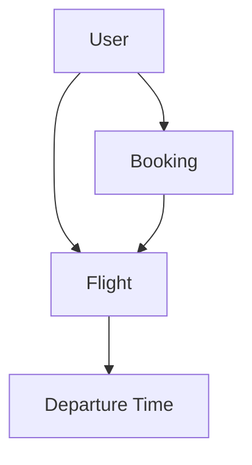
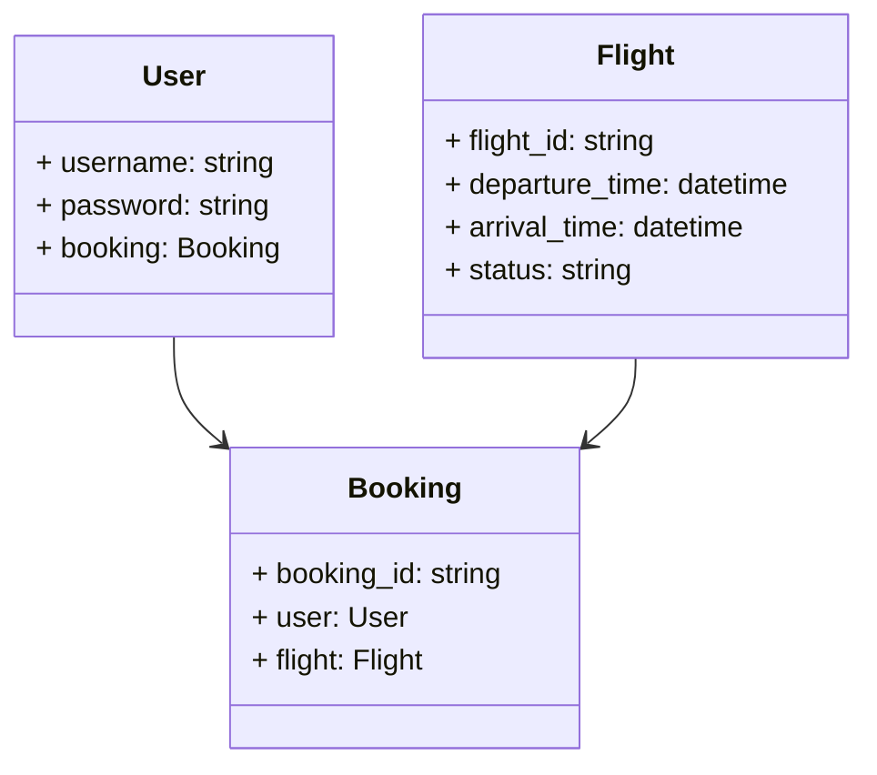
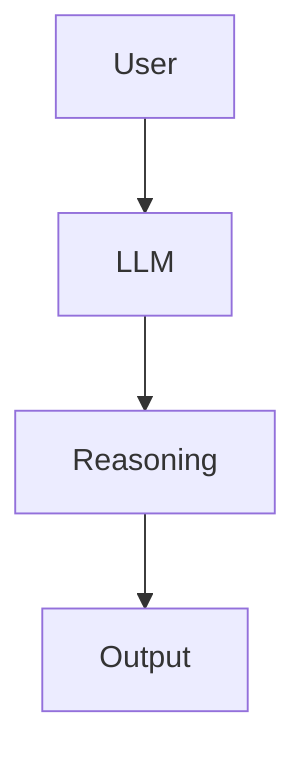
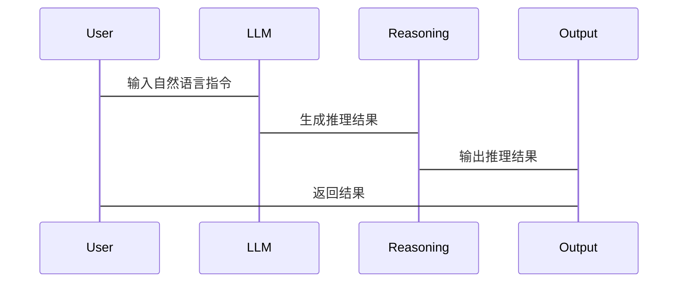

                 


# 构建LLM支持的AI Agent自然语言推理

> 关键词：LLM, AI Agent, 自然语言推理, 大语言模型, 人工智能, 智能代理

> 摘要：本文详细探讨了如何构建一个基于大语言模型（LLM）的AI Agent，使其具备自然语言推理能力。文章从背景和概述开始，逐步分析核心概念、算法原理、系统架构设计、项目实战及最佳实践，最终实现一个能够理解、推理并执行复杂任务的AI Agent。

---

# 第一部分: 背景与概述

## 第1章: 背景与概述

### 1.1 问题背景

#### 1.1.1 自然语言处理的挑战
自然语言处理（NLP）是人工智能领域的重要分支，旨在使计算机能够理解、生成和处理人类语言。然而，传统的NLP技术在处理复杂语义和上下文关系时存在诸多限制，例如无法有效处理模糊语义、多义词和复杂推理问题。

#### 1.1.2 大语言模型的崛起
近年来，基于Transformer架构的大语言模型（如GPT系列、BERT系列）取得了突破性进展。这些模型通过大量的预训练数据，能够生成连贯且具有语义理解的文本，并在多种NLP任务中表现出色。

#### 1.1.3 AI Agent的定义与目标
AI Agent（智能代理）是一种能够感知环境、执行任务并做出决策的智能系统。AI Agent的目标是通过理解和推理用户输入的自然语言指令，执行相应的任务，例如信息检索、对话生成、任务规划等。

---

### 1.2 问题描述

#### 1.2.1 自然语言推理的核心问题
自然语言推理是指通过分析给定的文本，推断出隐含的信息或结论。例如，给定句子“如果下雨，我会带伞”，推理出“因为今天下雨，所以我带了伞”。

#### 1.2.2 LLM在AI Agent中的作用
大语言模型（LLM）在AI Agent中的作用是理解用户输入的自然语言指令，并生成相应的推理结果。例如，用户输入“帮我预订明天早上7点的航班”，AI Agent需要通过LLM理解“明天早上7点”是具体的时间点，并结合航班预订系统进行操作。

#### 1.2.3 当前技术的局限性与改进方向
尽管LLM在文本生成和理解方面表现出色，但在复杂推理和多轮对话中仍存在不足。例如，LLM可能无法准确理解上下文关系，导致推理错误。因此，改进方向包括增强模型的推理能力、优化模型的可解释性等。

---

# 第二部分: 核心概念与联系

## 第2章: 核心概念与联系

### 2.1 自然语言推理的理论基础

#### 2.1.1 基于LLM的推理机制
基于LLM的推理机制通常包括以下几个步骤：
1. **输入处理**：将用户输入的自然语言指令转化为模型可处理的格式。
2. **推理过程**：模型根据上下文和预训练的知识生成推理结果。
3. **输出生成**：将推理结果转化为自然语言输出，供用户理解。

#### 2.1.2 实体关系图的构建
实体关系图（ER图）用于描述系统中实体之间的关系。例如，在航班预订系统中，实体包括“用户”、“航班”、“时间”等，关系包括“用户预订航班”、“航班有起飞时间”等。



#### 2.1.3 领域模型的定义
领域模型是指在特定领域内定义的实体、属性和关系。例如，在医疗领域，实体包括“患者”、“疾病”、“症状”等，关系包括“患者患有疾病”、“疾病有症状”等。

---

### 2.2 核心概念对比

#### 2.2.1 LLM与传统NLP模型的对比
| 特性         | LLM                          | 传统NLP模型                  |
|--------------|------------------------------|------------------------------|
| 模型结构      | 基于Transformer架构            | 基于RNN或CNN                 |
| 训练数据      | 大规模多样化的文本数据        | 专业领域的有限数据            |
| 性能          | 在多种任务中表现出色            | 适用于特定任务，泛化能力有限  |

#### 2.2.2 AI Agent与传统NLP应用的对比
| 特性         | AI Agent                      | 传统NLP应用                  |
|--------------|-------------------------------|------------------------------|
| 功能          | 具备自主决策和推理能力          | 仅限于特定任务的文本处理      |
| 交互方式      | 支持多轮对话和上下文理解        | 单次任务处理，不支持连续交互    |

#### 2.2.3 自然语言推理与逻辑推理的对比
| 特性         | 自然语言推理                  | 逻辑推理                     |
|--------------|------------------------------|------------------------------|
| 输入          | 自然语言文本                  | 符号逻辑表达式               |
| 输出          | 自然语言文本或结论            | 符号逻辑表达式               |
| 难度          | 更复杂，依赖上下文和常识       | 较简单，依赖逻辑规则         |

---

## 第3章: 算法原理与数学模型

### 3.1 LLM的算法原理

#### 3.1.1 变压器模型的基本结构
变压器模型（Transformer）由编码器和解码器组成。编码器负责将输入序列编码为向量表示，解码器负责根据编码结果生成输出序列。

#### 3.1.2 注意力机制的数学表达
注意力机制的计算公式如下：

$$
\text{Attention}(Q, K, V) = \text{softmax}\left(\frac{QK^T}{\sqrt{d_k}}\right)V
$$

其中，\( Q \)、\( K \)、\( V \) 分别是查询、键和值矩阵，\( d_k \) 是键的维度。

#### 3.1.3 梯度下降与优化算法
常见的优化算法包括随机梯度下降（SGD）、Adam优化器等。Adam优化器的更新公式如下：

$$
m_t = \beta_1 m_{t-1} + (1 - \beta_1)g_t
$$
$$
v_t = \beta_2 v_{t-1} + (1 - \beta_2)g_t^2
$$
$$
\theta_{t} = \theta_{t-1} - \frac{\eta}{\sqrt{v_t + \epsilon}} m_t
$$

其中，\( m_t \) 是梯度的移动平均，\( v_t \) 是梯度平方的移动平均，\( \eta \) 是学习率，\( \epsilon \) 是防止除零的常数。

---

### 3.2 自然语言推理的数学模型

#### 3.2.1 基于概率的推理模型
基于概率的推理模型通过计算条件概率来推断结果。例如，给定前提 \( P \) 和假设 \( H \)，推断结论 \( C \) 的概率：

$$
P(C | P, H) = \frac{P(C, P, H)}{P(P, H)}
$$

#### 3.2.2 基于逻辑的推理模型
基于逻辑的推理模型通过符号逻辑进行推理。例如，使用一阶逻辑（FOL）表示知识：

$$
\forall x (\text{Man}(x) \rightarrow \text{Mortal}(x))
$$

$$
\text{Socrates}(s) \land \text{Man}(s)
$$

$$
\therefore \text{Mortal}(s)
$$

#### 3.2.3 深度学习模型的损失函数
常用的损失函数包括交叉熵损失函数：

$$
\text{Loss} = -\frac{1}{N}\sum_{i=1}^{N} \sum_{j=1}^{M} y_{ij} \log p(y_{ij})
$$

---

## 第4章: 系统分析与架构设计

### 4.1 问题场景介绍

#### 4.1.1 LLM支持的AI Agent应用场景
AI Agent可以在多种场景中应用，例如智能客服、智能助手、智能监控等。例如，在智能客服场景中，AI Agent需要理解用户的问题，并通过LLM生成回复。

#### 4.1.2 自然语言推理的典型问题
典型问题包括：文本蕴含（Text Entailment）、问答（Question Answering）、对话生成（Dialog Generation）等。

#### 4.1.3 系统设计的目标与约束
系统设计的目标是实现一个高效、准确且可扩展的AI Agent。约束包括：性能要求、安全性要求、可扩展性要求等。

---

### 4.2 系统架构设计

#### 4.2.1 领域模型设计
领域模型设计需要考虑实体、属性和关系。例如，在医疗领域，实体包括“患者”、“疾病”、“症状”，关系包括“患者患有疾病”、“疾病有症状”等。



#### 4.2.2 系统架构图
系统架构图展示了系统的各个模块及其交互关系。



#### 4.2.3 系统接口设计
系统接口设计需要定义输入输出格式。例如，用户输入是一个自然语言字符串，输出是一个结构化的推理结果。

#### 4.2.4 系统交互流程图
系统交互流程图展示了用户与AI Agent之间的交互流程。



---

## 第5章: 项目实战

### 5.1 环境安装与配置

#### 5.1.1 开发环境的选择
推荐使用Python 3.8及以上版本，安装必要的库，例如：

```bash
pip install transformers
pip install torch
pip install numpy
```

#### 5.1.2 依赖库的安装
安装必要的依赖库，例如：

```bash
pip install -r requirements.txt
```

#### 5.1.3 API接口的配置
配置API接口，例如使用Flask框架：

```python
from flask import Flask, request, jsonify
from transformers import AutoTokenizer, AutoModelForCausalLM

app = Flask(__name__)
tokenizer = AutoTokenizer.from_pretrained('gpt2')
model = AutoModelForCausalLM.from_pretrained('gpt2')

@app.route('/inference', methods=['POST'])
def inference():
    data = request.json
    input_text = data['input']
    inputs = tokenizer(input_text, return_tensors='np')
    outputs = model.generate(inputs.input_ids, max_length=50)
    response = tokenizer.decode(outputs[0])
    return jsonify({'result': response})

if __name__ == '__main__':
    app.run(debug=True)
```

---

### 5.2 核心功能实现

#### 5.2.1 LLM的集成与调用
集成LLM时，需要选择合适的模型，并将其与AI Agent的其他模块进行交互。

#### 5.2.2 自然语言推理的实现
实现自然语言推理时，需要定义推理规则和模型调用接口。

#### 5.2.3 AI Agent的交互逻辑
交互逻辑需要处理用户的输入、生成推理结果，并返回给用户。

---

### 5.3 案例分析与解读

#### 5.3.1 典型案例的分析
以航班预订为例，用户输入“帮我预订明天早上7点的航班”，AI Agent需要通过LLM理解输入，生成相应的推理结果，并调用航班预订系统完成任务。

#### 5.3.2 代码实现与分析
实现航班预订功能的代码如下：

```python
from transformers import AutoTokenizer, AutoModelForCausalLM
import requests

tokenizer = AutoTokenizer.from_pretrained('gpt2')
model = AutoModelForCausalLM.from_pretrained('gpt2')

def book_flight(departure_time):
    # 模拟航班预订接口
    response = requests.post(
        'http://booking-system/flight',
        json={'departure_time': departure_time}
    )
    return response.json()

def main():
    input_text = "帮我预订明天早上7点的航班"
    inputs = tokenizer(input_text, return_tensors='np')
    outputs = model.generate(inputs.input_ids, max_length=50)
    response = tokenizer.decode(outputs[0])
    # 提取时间信息
    departure_time = "2023-10-01 07:00:00"
    result = book_flight(departure_time)
    print(result)

if __name__ == '__main__':
    main()
```

---

## 第6章: 最佳实践

### 6.1 小结
本文详细介绍了如何构建一个基于LLM的AI Agent，并使其具备自然语言推理能力。通过理论分析和实战案例，展示了系统的实现过程和关键点。

### 6.2 注意事项
- 确保系统的安全性和稳定性。
- 定期更新模型和知识库，以适应新需求。
- 优化系统性能，提高推理速度和准确性。

### 6.3 未来展望
未来的研究方向包括：
1. **增强模型的推理能力**：通过引入逻辑推理模块，提高模型的推理精度。
2. **优化模型的可解释性**：使用户能够理解模型的推理过程。
3. **扩展应用场景**：将AI Agent应用于更多领域，如教育、医疗、金融等。

---

# 作者

作者：AI天才研究院/AI Genius Institute & 禅与计算机程序设计艺术 /Zen And The Art of Computer Programming

