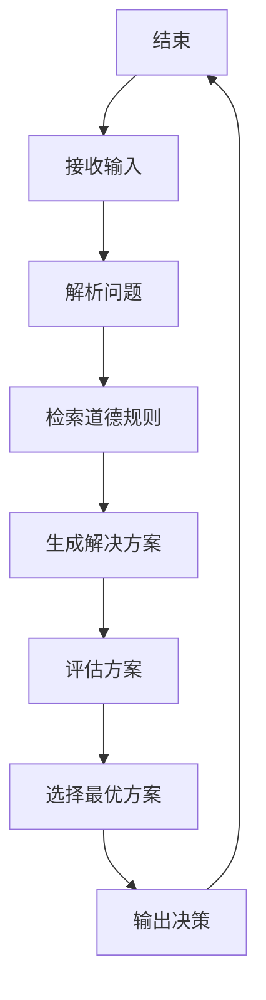
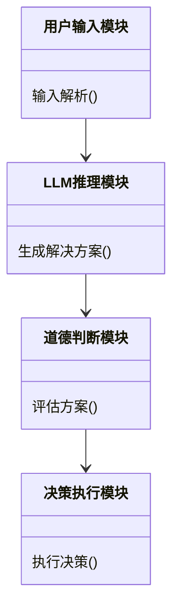
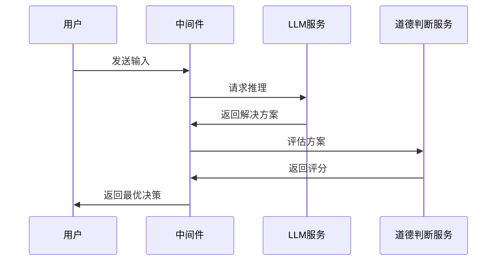

                 


# 《构建LLM支持的AI Agent道德推理系统》

## 关键词：LLM, AI Agent, 道德推理, 人工智能, 系统架构

## 摘要：本文详细探讨了如何构建一个基于大语言模型（LLM）支持的AI Agent道德推理系统。通过分析问题背景、核心概念、算法原理、系统架构以及项目实战，本文旨在为读者提供一个全面的构建指南，涵盖从理论到实践的各个层面，帮助读者理解如何在AI系统中实现道德推理。

## 第一部分：背景介绍

### 第1章：问题背景与描述

#### 1.1 问题背景
- **1.1.1 当前AI系统的局限性**
  当前AI系统在处理复杂决策时，往往缺乏对道德和伦理的考量，导致可能产生负面的社会影响。
- **1.1.2 道德推理在AI系统中的重要性**
  道德推理是确保AI系统行为符合伦理规范的关键，尤其是在涉及人类福祉的领域。

#### 1.2 问题描述
- **1.2.1 道德推理的定义与目标**
  道德推理是指系统在决策过程中，基于伦理原则和价值观进行判断和选择。
- **1.2.2 当前AI道德推理的挑战**
  当前AI系统在道德推理方面的能力有限，难以应对复杂的现实情况。

#### 1.3 问题解决
- **1.3.1 引入LLM的优势**
  LLM具有强大的语言理解和生成能力，能够帮助AI系统更好地进行道德推理。
- **1.3.2 AI Agent在道德推理中的作用**
  AI Agent作为系统的执行者，能够将LLM的推理结果转化为实际行动。

#### 1.4 边界与外延
- **1.4.1 系统的适用范围**
  该系统适用于需要道德决策的领域，如医疗、法律和自动驾驶。
- **1.4.2 系统的局限性**
  该系统在处理高度复杂的道德困境时，可能需要进一步优化和调整。

#### 1.5 概念结构与核心要素
- **1.5.1 核心概念组成**
  包括LLM、AI Agent、道德规则库和决策结果。
- **1.5.2 系统模块划分**
  系统由输入处理、LLM推理、道德判断和决策执行四个模块组成。

## 第二部分：核心概念与联系

### 第2章：核心概念原理

#### 2.1 LLM与AI Agent的基本原理
- **2.1.1 LLM的工作机制**
  LLM通过深度学习模型处理输入文本，生成符合上下文的输出。
- **2.1.2 AI Agent的功能模块**
  包括感知、推理、规划和执行模块。

#### 2.2 道德推理的核心原理
- **2.2.1 道德推理的步骤**
  包括问题分析、规则匹配、权重计算和结果输出。
- **2.2.2 LLM在道德推理中的角色**
  LLM用于生成可能的解决方案，并辅助AI Agent进行决策。

#### 2.3 核心概念对比
- **2.3.1 LLM与传统NLP模型的对比**
  | 特性 | LLM | 传统NLP模型 |
  |------|------|--------------|
  | 处理能力 | 强大 | 有限 |
  | 模型大小 | 大 | 小 |
- **2.3.2 AI Agent与传统决策系统的对比**
  AI Agent具备自主决策能力，传统系统依赖于预定义规则。

#### 2.4 ER实体关系图
```mermaid
er
    actor: 用户
    system: 道德推理系统
    llm: 大语言模型
    agent: AI Agent
    decision: 决策结果
    rule: 道德规则库
    user_input: 用户输入
    system_output: 系统输出
    actor --> user_input
    user_input --> system
    system --> llm
    system --> agent
    agent --> decision
    system --> rule
    rule --> decision
```

## 第三部分：算法原理讲解

### 第3章：算法原理

#### 3.1 道德推理算法的步骤
1. 接收输入并解析问题。
2. 从道德规则库中检索相关规则。
3. 使用LLM生成多个解决方案。
4. 评估每个方案的道德评分。
5. 选择最优方案作为决策结果。

#### 3.2 算法流程图


#### 3.3 算法实现代码
```python
def道德推理算法(user_input):
    问题解析 = 解析输入(user_input)
    相关规则 = 检索规则库(问题解析)
    解决方案 = LLM生成解决方案(问题解析, 相关规则)
    评分结果 = 评估方案(解决方案)
    最优方案 = 选择最优(评分结果)
    返回 最优方案
```

#### 3.4 数学模型与公式
道德评分计算公式：
$$
道德评分 = \sum_{i=1}^{n} (规则权重_i \times 规则满足度_i)
$$

## 第四部分：系统分析与架构设计方案

### 第4章：系统架构设计

#### 4.1 问题场景介绍
考虑一个医疗咨询场景，系统需要在多个治疗方案中选择最道德的选项。

#### 4.2 项目介绍
项目名称：智能医疗决策支持系统。

#### 4.3 系统功能设计


#### 4.4 系统架构设计
```mermaid
docker
    client --> 中间件
    中间件 --> LLM服务
    中间件 --> 道德推理服务
    中间件 --> 决策执行服务
    中间件 --> 数据库
```

#### 4.5 接口设计
API接口：
- 输入接口：`POST /api/input`
- 输出接口：`GET /api/output`

#### 4.6 系统交互设计


## 第五部分：项目实战

### 第5章：项目实战

#### 5.1 环境安装
安装Python和相关库：
```
pip install transformers torch
```

#### 5.2 核心代码实现
```python
import torch
from transformers import AutoTokenizer, AutoModelForCausalLM

class道德推理系统:
    def __init__(self):
        self.tokenizer = AutoTokenizer.from_pretrained("gpt2")
        self.model = AutoModelForCausalLM.from_pretrained("gpt2")

    def 推理(self, input_text):
        inputs = self.tokenizer(input_text, return_tensors="pt")
        outputs = self.model.generate(inputs.input_ids, max_length=100)
        return self.tokenizer.decode(outputs[0], skip_special_tokens=True)

# 示例用法
系统 = 道德推理系统()
result = 系统推理("患者...")
print(result)
```

#### 5.3 案例分析
案例：患者诊断。
输入：患者症状和诊断建议。
输出：最优诊断方案。

#### 5.4 代码解读与分析
- 使用GPT-2模型进行推理。
- 输入处理和输出生成通过Tokenizer完成。

## 第六部分：最佳实践

### 第6章：最佳实践

#### 6.1 小贴士
- 确保数据多样性和代表性。
- 定期更新道德规则库。

#### 6.2 总结
本文详细介绍了构建LLM支持的AI Agent道德推理系统的各个方面，从理论到实践，为读者提供了全面的指导。

#### 6.3 注意事项
- 道德推理的准确性依赖于规则库的质量。
- 系统需要定期维护和更新。

#### 6.4 拓展阅读
- 推荐阅读相关领域的最新研究论文。

## 作者信息

作者：AI天才研究院/AI Genius Institute & 禅与计算机程序设计艺术 /Zen And The Art of Computer Programming

---

这篇文章详细介绍了构建基于LLM的AI Agent道德推理系统的各个方面，从背景分析到系统架构设计，再到项目实战，为读者提供了全面的指导。

