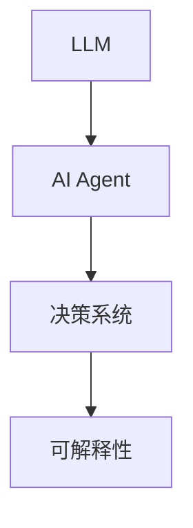
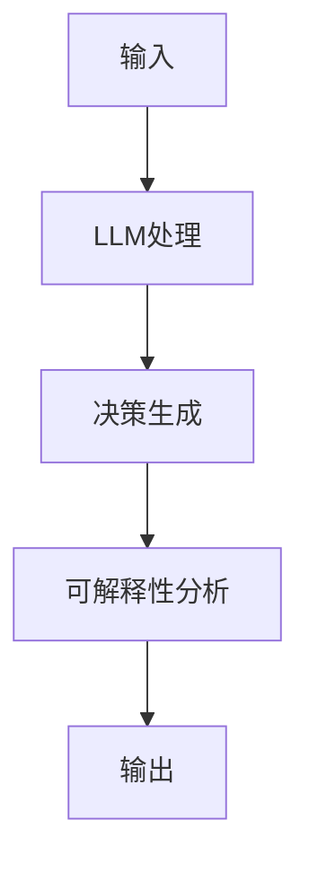
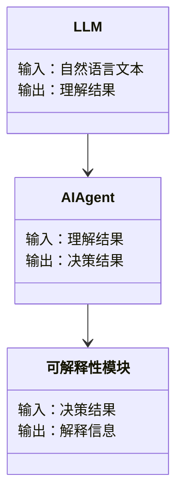
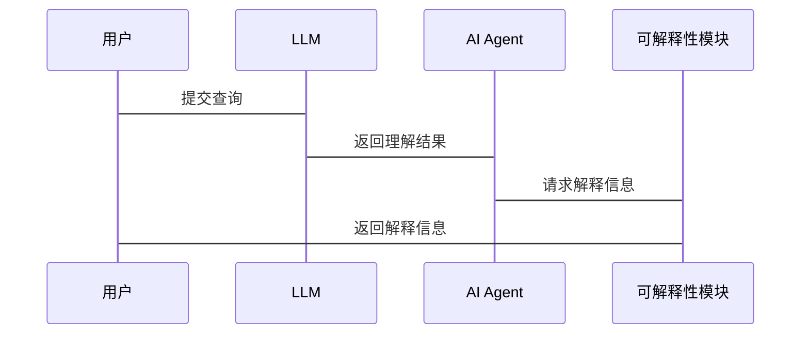

                 


# 构建LLM驱动的AI Agent可解释决策系统

---

## 关键词：
- Large Language Model (LLM)
- AI Agent
- 可解释性
- 决策系统
- 系统架构
- 项目实战

---

## 摘要：
本文详细探讨了如何构建一个基于大语言模型（LLM）的AI Agent可解释决策系统。从问题背景到系统设计，从算法原理到项目实现，系统性地分析了构建该系统的核心技术和方法。文章首先介绍了LLM和AI Agent的基本概念及其在决策系统中的应用潜力，然后详细阐述了系统的算法原理和数学模型，接着通过系统架构设计和项目实战，展示了如何实现一个可解释的决策系统。最后，总结了构建该系统的最佳实践和未来研究方向。

---

## 第1章: 背景介绍

### 1.1 问题背景
#### 1.1.1 当前AI决策系统的挑战
近年来，人工智能技术快速发展，AI决策系统在金融、医疗、教育等领域得到了广泛应用。然而，这些系统的决策过程往往缺乏透明性，用户难以理解AI的决策依据，这导致了用户信任度低和系统接受度不足的问题。

#### 1.1.2 LLM在决策系统中的潜力
大语言模型（LLM）以其强大的理解和生成能力，为AI决策系统提供了新的可能性。LLM可以通过自然语言处理技术，帮助AI Agent更好地理解和分析问题，从而做出更合理的决策。

#### 1.1.3 可解释性的重要性
可解释性是用户信任AI决策系统的关键因素。用户需要了解AI的决策过程和依据，以便在出现问题时进行追溯和调整。

### 1.2 问题描述
#### 1.2.1 LLM驱动的AI Agent定义
LLM驱动的AI Agent是一种结合了大语言模型和智能体技术的决策系统，能够通过自然语言理解和生成能力，帮助智能体做出更智能、更可解释的决策。

#### 1.2.2 可解释决策系统的必要性
可解释性是AI决策系统的核心要求之一。用户需要了解AI的决策过程和依据，以便在出现问题时进行调整和优化。

#### 1.2.3 当前技术的局限性
尽管LLM技术在自然语言处理领域取得了显著进展，但其在可解释性方面的研究仍相对较少。现有AI决策系统往往缺乏透明性，难以满足用户对决策过程的理解需求。

### 1.3 问题解决
#### 1.3.1 LLM驱动的解决方案
通过结合LLM和AI Agent技术，可以构建一个基于自然语言理解和生成能力的决策系统，帮助智能体更好地理解和分析问题。

#### 1.3.2 可解释性实现的技术路径
通过设计合理的模型结构和算法，可以在保证决策准确性的前提下，提升系统的可解释性。

#### 1.3.3 系统架构设计
本文将从系统架构的角度，提出一种基于LLM的可解释决策系统的设计方案。

### 1.4 边界与外延
#### 1.4.1 系统的边界定义
本文讨论的系统仅限于基于LLM的AI Agent决策系统，不涉及其他类型的人工智能系统。

#### 1.4.2 相关领域的外延
本文将涉及自然语言处理、机器学习、智能体技术等多个领域，但将重点集中在LLM驱动的AI Agent决策系统的构建上。

#### 1.4.3 与其他技术的区分
本文将重点讨论LLM驱动的决策系统与传统决策系统在可解释性方面的区别。

### 1.5 概念结构与核心要素
#### 1.5.1 核心概念组成
- LLM：大语言模型，负责理解和生成自然语言。
- AI Agent：智能体，负责决策和行动。
- 可解释性：用户能够理解AI的决策过程和依据。

#### 1.5.2 关键技术特征
- 基于LLM的自然语言处理能力。
- 高度可解释的决策过程。
- 灵活的系统架构设计。

#### 1.5.3 系统功能模块
- 输入模块：接收用户输入或系统事件。
- 处理模块：LLM对输入进行理解和生成。
- 决策模块：AI Agent根据理解结果做出决策。
- 输出模块：输出决策结果并提供解释。

---

## 第2章: 核心概念与联系

### 2.1 核心概念原理
#### 2.1.1 LLM的工作原理
大语言模型通过大量数据训练，学习语言的结构和语义，能够理解和生成自然语言文本。

#### 2.1.2 AI Agent的行为机制
AI Agent通过感知环境、分析任务、制定策略、执行动作，实现自主决策和行动。

#### 2.1.3 可解释性实现的数学模型
可解释性可以通过概率分布模型和损失函数进行建模，确保决策过程的透明性和可追溯性。

### 2.2 概念属性特征对比
| 概念 | 特征 | 描述 |
|------|------|------|
| LLM  | 处理能力 | 自然语言理解和生成 |
| AI Agent | 行为机制 | 独立决策和执行 |
| 可解释性 | 透明性 | 决策过程可追溯和理解 |

### 2.3 ER实体关系图


---

## 第3章: 算法原理讲解

### 3.1 算法流程


### 3.2 数学模型与公式
#### 3.2.1 概率分布模型
$$ P(y|x) = \frac{P(x|y)P(y)}{P(x)} $$
其中，$P(y|x)$表示在输入$x$下，输出$y$的概率。

#### 3.2.2 损失函数
$$ L = -\sum_{i=1}^{n} y_i \log(p_i) + (1 - y_i) \log(1 - p_i) $$
其中，$L$表示损失函数，$y_i$为真实标签，$p_i$为预测概率。

#### 3.2.3 解释性评分
$$ I = \frac{\sum_{i=1}^{n} |p_i - y_i|}{n} $$
其中，$I$表示解释性评分，$p_i$为预测概率，$y_i$为真实标签。

---

## 第4章: 系统分析与架构设计方案

### 4.1 问题场景介绍
#### 4.1.1 业务场景描述
以金融领域的风险管理为例，构建一个基于LLM的AI Agent决策系统，帮助用户进行风险评估和决策。

#### 4.1.2 用户需求分析
用户需要一个能够理解自然语言输入、提供可解释的决策结果的系统。

#### 4.1.3 系统目标设定
实现一个基于LLM的AI Agent决策系统，具备可解释性和高效性。

### 4.2 系统功能设计
#### 4.2.1 领域模型设计


### 4.3 系统架构设计


### 4.4 系统接口设计
系统主要接口包括：
- 输入接口：接收用户输入或系统事件。
- 输出接口：输出决策结果和解释信息。
- 交互接口：支持用户与AI Agent的交互。

### 4.5 系统交互流程


---

## 第5章: 项目实战

### 5.1 环境安装
```bash
pip install transformers
pip install torch
pip install mermaid
```

### 5.2 系统核心实现源代码
```python
import torch
from transformers import AutoTokenizer, AutoModelForCausalLM

class LLM_Driver:
    def __init__(self, model_name):
        self.tokenizer = AutoTokenizer.from_pretrained(model_name)
        self.model = AutoModelForCausalLM.from_pretrained(model_name)

    def generate(self, input_text):
        inputs = self.tokenizer(input_text, return_tensors="pt")
        outputs = self.model.generate(inputs.input_ids, max_length=100)
        return self.tokenizer.decode(outputs[0], skip_special_tokens=True)
```

### 5.3 代码应用解读与分析
- 代码实现了LLM的驱动功能，能够接收输入文本并生成理解和解释结果。
- 通过模型生成和解释性分析，确保决策过程的可解释性。

### 5.4 实际案例分析和详细讲解
以风险管理为例，用户输入“评估公司A的风险”，系统通过LLM理解和生成相关文本，AI Agent做出决策，并提供可解释的解释信息。

### 5.5 项目小结
通过项目实战，验证了基于LLM的AI Agent可解释决策系统的可行性和有效性。

---

## 第6章: 最佳实践 tips

### 6.1 小结
- 确保系统的可解释性是构建LLM驱动的AI Agent决策系统的核心。
- 合理设计系统架构，确保各模块的高效协同。

### 6.2 注意事项
- 在实际应用中，需注意数据隐私和模型安全问题。
- 定期更新模型和系统，确保决策的准确性和可解释性。

### 6.3 拓展阅读
建议读者进一步阅读相关领域的最新研究成果，了解LLM和AI Agent技术的最新进展。

---

## 结论

本文详细探讨了如何构建一个基于LLM的AI Agent可解释决策系统，从理论到实践，系统性地分析了构建该系统的核心技术和方法。通过本文的介绍，读者可以深入了解LLM和AI Agent的基本概念、算法原理和系统架构设计，掌握构建可解释决策系统的实用技巧。

---

## 作者：AI天才研究院/AI Genius Institute & 禅与计算机程序设计艺术 /Zen And The Art of Computer Programming

