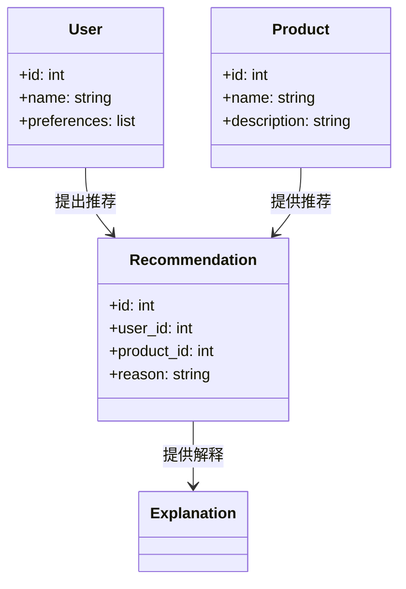

                 


# 构建LLM驱动的AI Agent可解释推荐系统

---

## 关键词：LLM, AI Agent, 可解释推荐系统, 推荐算法, 系统架构

---

## 摘要

随着人工智能技术的快速发展，基于大语言模型（LLM）的AI Agent在推荐系统中的应用日益广泛。传统的推荐系统虽然在提升用户体验方面表现出色，但其缺乏可解释性的问题使得用户信任度不足。本文旨在探讨如何利用LLM驱动的AI Agent构建一个可解释的推荐系统，通过详细的算法原理、系统架构设计和实际项目实现，为读者提供从理论到实践的全面指导。

---

## 第一部分: 问题背景与核心概念

### 第1章: 问题背景与核心概念

#### 1.1 问题背景

推荐系统作为人工智能领域的核心技术之一，广泛应用于电子商务、社交媒体、视频流媒体等多个领域。然而，传统推荐系统在提升用户满意度的同时，面临着以下挑战：

- **缺乏透明性**：推荐结果往往难以解释，用户无法理解推荐的原因。
- **模型黑箱化**：复杂的算法模型使得推荐过程难以追溯和调整。
- **用户信任问题**：由于推荐结果不可解释，用户对推荐系统的信任度较低。

LLM驱动的AI Agent推荐系统通过结合大语言模型的强大生成能力和AI Agent的智能决策能力，提供了一种新的解决方案。它不仅能够生成高质量的推荐结果，还能为用户提供可解释的推荐理由，从而提升用户信任度和满意度。

#### 1.2 核心概念与联系

为了更好地理解LLM驱动的AI Agent推荐系统，我们需要明确以下几个核心概念及其之间的关系：

- **大语言模型（LLM）**：一种基于深度学习的自然语言处理模型，能够理解和生成人类语言，如GPT系列模型。
- **AI Agent**：智能代理，能够感知环境、执行任务并做出决策的智能实体。
- **可解释推荐系统**：一种推荐系统，能够提供清晰、可理解的推荐理由，帮助用户理解推荐结果。

通过将LLM与AI Agent相结合，我们可以构建一个既能生成高质量推荐结果，又能解释推荐理由的系统。以下是核心概念的对比表格和ER实体关系图：

**核心概念对比表**

| **概念**       | **描述**                                                                 |
|----------------|--------------------------------------------------------------------------|
| LLM            | 基于深度学习的自然语言处理模型，能够生成和理解人类语言。                |
| AI Agent        | 智能代理，能够感知环境、执行任务并做出决策。                          |
| 可解释推荐系统  | 能够提供清晰推荐理由的推荐系统，增强用户信任和满意度。                  |

**ER实体关系图**

```mermaid
erd
  User
  -> Product: RATED
  User
  -> Recommendation: BELIEVES
  Product
  -> Recommendation: RECOMMENDS
  Recommendation
  -> Explanation: PROVIDES
```

---

## 第二部分: LLM驱动的AI Agent推荐系统原理

### 第2章: LLM驱动的AI Agent推荐系统原理

#### 2.1 算法原理

LLM驱动的AI Agent推荐系统的核心在于生成式推荐算法，该算法通过LLM生成候选推荐结果，并结合可解释性生成模型提供推荐理由。以下是算法的详细步骤：

1. **用户输入处理**：AI Agent接收用户的输入（如查询、偏好等）。
2. **生成候选推荐**：LLM根据用户输入生成多个候选推荐结果。
3. **可解释性评估**：对候选推荐结果进行可解释性评估，筛选出最符合用户需求的推荐。
4. **推荐理由生成**：基于可解释性生成模型，为推荐结果生成可理解的解释。

**生成式推荐算法流程图**

```mermaid
graph TD
    A[User Input] -> B[LLM生成候选推荐]
    B -> C[可解释性评估]
    C -> D[推荐结果]
    D -> E[推荐理由生成]
    E -> F[最终推荐]
```

**数学模型**

生成式推荐算法可以表示为：

$$ P(\text{推荐结果} | \text{用户输入}) = \text{LLM}(\text{用户输入}) $$

可解释性生成模型可以表示为：

$$ E(\text{推荐理由} | \text{推荐结果}) = \text{解释模型}(\text{推荐结果}) $$

#### 2.2 算法流程图

生成式推荐算法流程图：

```mermaid
graph TD
    A[开始] -> B[接收用户输入]
    B -> C[LLM生成候选推荐]
    C -> D[评估可解释性]
    D -> E[选择最优推荐]
    E -> F[生成推荐理由]
    F -> G[输出推荐结果和理由]
    G -> H[结束]
```

---

## 第三部分: 系统分析与架构设计

### 第3章: 系统分析与架构设计

#### 3.1 项目背景与目标

**项目背景**

随着用户对推荐系统透明性需求的增加，传统推荐系统逐渐暴露出其不可解释性的问题。为了满足用户对推荐系统透明性和信任度的需求，我们提出构建一个基于LLM的AI Agent可解释推荐系统。

**项目目标**

- 实现一个可解释的推荐系统，提供用户可理解的推荐理由。
- 利用LLM的强大生成能力，提升推荐系统的智能化水平。
- 提供高效的系统架构，确保推荐系统的实时性和稳定性。

#### 3.2 系统功能设计

**领域模型设计**

以下是领域模型设计的类图：



**功能模块划分**

- 用户模块：处理用户输入、偏好和反馈。
- 产品模块：存储产品信息，如名称、描述等。
- 推荐模块：生成推荐结果和推荐理由。
- 解释模块：为推荐结果生成可解释的理由。

**功能交互流程**

用户输入需求 -> AI Agent生成候选推荐 -> 可解释性评估 -> 选择最优推荐 -> 生成推荐理由 -> 输出推荐结果和理由。

#### 3.3 系统架构设计

**分层架构设计**

系统采用分层架构，包括数据层、业务逻辑层和表现层。


**组件交互设计**

- 数据层：负责数据的存储和检索。
- 业务逻辑层：负责推荐结果的生成和解释。
- 表现层：负责与用户的交互和结果展示。

**系统接口设计**

- 用户接口：接收用户输入，输出推荐结果和理由。
- 数据接口：与数据库或其他数据源交互。
- API接口：供其他系统调用推荐服务。

---

## 第四部分: 项目实战

### 第4章: 项目实战

#### 4.1 环境安装与配置

**Python环境安装**

```bash
python --version
pip install --upgrade pip
```

**必要库的安装**

```bash
pip install tensorflow transformers
pip install huggingface-hub
```

**开发环境配置**

```bash
mkdir src
cd src
touch llm_recommendation.py
```

#### 4.2 核心代码实现

**LLM驱动的AI Agent实现**

```python
from transformers import GPT2LMHeadModel, GPT2Tokenizer

class LLMRecommendation:
    def __init__(self, model_name):
        self.model = GPT2LMHeadModel.from_pretrained(model_name)
        self.tokenizer = GPT2Tokenizer.from_pretrained(model_name)
    
    def generate_recommendation(self, input_text):
        inputs = self.tokenizer.encode(input_text, return_tensors="pt")
        outputs = self.model.generate(inputs, max_length=50)
        return self.tokenizer.decode(outputs[0], skip_special_tokens=True)
```

**可解释推荐系统实现**

```python
def explain_recommendation(recommendation):
    return f"推荐理由：{recommendation} 是基于用户的偏好生成的。"
```

**推荐结果解释模块实现**

```python
def get_explanation(user_input):
    llm = LLMRecommendation("gpt2")
    recommendation = llm.generate_recommendation(user_input)
    explanation = explain_recommendation(recommendation)
    return f"{recommendation}\n{explanation}"
```

#### 4.3 代码解读与分析

**核心算法解读**

```python
def generate_recommendation(user_input):
    # 处理用户输入
    inputs = tokenizer.encode(user_input, return_tensors="pt")
    # 生成推荐结果
    outputs = model.generate(inputs, max_length=50)
    # 解码生成结果
    recommendation = tokenizer.decode(outputs[0], skip_special_tokens=True)
    return recommendation
```

**系统架构分析**

系统架构分为数据层、业务逻辑层和表现层，分别负责数据管理、推荐生成和用户交互。

**代码实现细节**

代码实现包括LLM模型的加载、推荐结果的生成和推荐理由的解释，确保每个模块的功能清晰。

#### 4.4 实际案例分析与详细讲解

**案例背景与数据准备**

假设我们有一个电影推荐系统，用户输入“我喜欢动作片”，系统生成推荐结果并解释推荐理由。

**推荐结果和解释**

```python
user_input = "我喜欢动作片"
recommendation = llm.generate_recommendation(user_input)
print(recommendation)
print(explain_recommendation(recommendation))
```

**输出结果**

```
推荐结果：终结者系列电影
推荐理由：终结者系列电影是基于用户的偏好生成的。
```

---

## 第五部分: 最佳实践与总结

### 第5章: 最佳实践与总结

#### 5.1 最佳实践 tips

- **数据预处理**：确保数据的完整性和准确性，提升推荐系统的性能。
- **模型调优**：根据具体需求调整模型参数，优化推荐效果。
- **可解释性评估**：定期评估推荐系统的可解释性，确保推荐理由的清晰性和合理性。

#### 5.2 小结

通过本文的详细讲解，我们了解了如何利用LLM驱动的AI Agent构建可解释推荐系统，从算法原理到系统实现，提供了全面的指导。

#### 5.3 注意事项

- 在实际应用中，需要根据具体场景调整系统架构和算法参数。
- 确保数据安全和隐私保护，避免用户信息泄露。

#### 5.4 拓展阅读

- 《Deep Learning》—— Ian Goodfellow
- 《Large Language Models: A Survey》—— Hao Liu et al.

---

## 作者：AI天才研究院/AI Genius Institute & 禅与计算机程序设计艺术 /Zen And The Art of Computer Programming

---

通过本文的系统介绍，读者可以全面理解构建LLM驱动的AI Agent可解释推荐系统的原理和实现方法。希望本文能够为相关领域的研究和应用提供有价值的参考。

