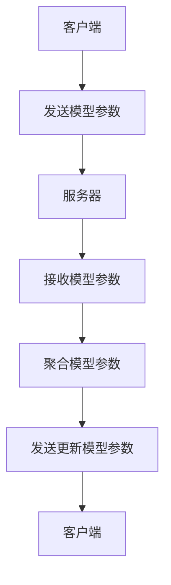
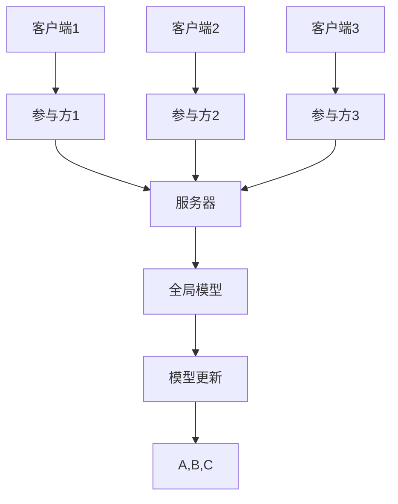
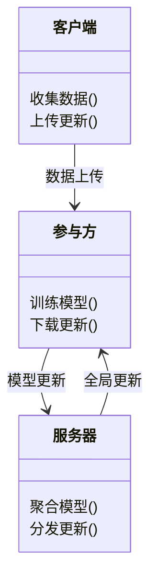

                 


# 构建LLM驱动的AI Agent隐私保护联邦学习

> 关键词：LLM、AI Agent、联邦学习、隐私保护、分布式系统

> 摘要：本文探讨如何在LLM驱动的AI Agent中实现隐私保护的联邦学习，通过详细分析系统架构、算法原理和项目实现，提出一种在保护数据隐私的前提下，实现高效协作的解决方案。

---

## 第1章：背景介绍与核心概念

### 1.1 问题背景与挑战

#### 1.1.1 当前AI Agent的发展现状

人工智能（AI）代理（Agent）近年来取得了显著进展，特别是在自然语言处理（NLP）领域，大型语言模型（LLM）如GPT-3、GPT-4的出现，使得AI Agent能够更加智能地理解和处理复杂任务。然而，随着AI Agent的应用场景越来越广泛，数据隐私问题也随之浮现。尤其是在医疗、金融等敏感领域，数据泄露的风险使得传统的集中式训练方法难以满足隐私保护的需求。

#### 1.1.2 LLM在AI Agent中的作用

LLM通过强大的自然语言理解和生成能力，赋予AI Agent处理复杂对话、执行多步推理和生成创意内容的能力。例如，在智能客服系统中，LLM驱动的AI Agent可以与用户进行自然的对话，解决复杂问题并提供建议。然而，这些能力通常依赖于大量数据的集中训练，这在隐私保护方面带来了挑战。

#### 1.1.3 联邦学习的背景与意义

联邦学习（Federated Learning）是一种分布式机器学习技术，允许多个参与方在不共享原始数据的情况下协同训练模型。通过这种方式，数据可以保留在本地，仅上传模型更新，从而在保护数据隐私的同时实现模型的联合优化。联邦学习在移动设备、物联网和医疗领域具有广泛应用潜力。

### 1.2 隐私保护的重要性

#### 1.2.1 数据隐私的现状与挑战

随着数据驱动决策的普及，数据隐私问题日益突出。数据泄露不仅可能导致经济损失，还可能引发法律纠纷和信任危机。特别是在AI Agent的应用中，用户可能会分享敏感信息，如健康状况、财务数据等，这些数据若被滥用，后果不堪设想。

#### 1.2.2 联邦学习中的隐私保护需求

在传统的集中式机器学习中，数据集中存储在单一服务器上，这为数据泄露提供了潜在风险。而联邦学习通过分布式训练，避免了数据的集中存储，从而降低了数据泄露的风险。然而，如何在联邦学习中进一步加强隐私保护，仍是需要解决的重要问题。

#### 1.2.3 LLM驱动的AI Agent中的隐私保护问题

在LLM驱动的AI Agent中，模型参数可能包含大量敏感信息。如果这些参数被恶意攻击者获取，可能导致数据泄露。因此，在联邦学习框架下，如何保护模型参数的隐私，确保每个参与方的贡献不被滥用，是构建隐私保护联邦学习的关键挑战。

---

## 第2章：核心概念与联系

### 2.1 LLM与AI Agent的关系

#### 2.1.1 LLM的基本原理

大型语言模型通过大量的文本数据训练而成，具备强大的文本生成和理解能力。LLM的核心在于其参数空间的规模，通常包含 billions甚至 trillions的参数。这些参数通过梯度下降等优化算法进行调整，以最小化预测误差。

#### 2.1.2 AI Agent的定义与功能

AI Agent是一种智能实体，能够感知环境、理解用户需求，并通过自主决策和行动实现目标。在LLM驱动的AI Agent中，LLM作为核心组件，负责处理自然语言输入，生成响应，并执行复杂任务。

#### 2.1.3 LLM如何驱动AI Agent

LLM通过提供强大的自然语言处理能力，赋予AI Agent理解和生成自然语言文本的能力。例如，在智能音箱中，LLM驱动的AI Agent可以理解用户的语音指令，执行搜索、设置提醒等任务。

### 2.2 联邦学习的原理

#### 2.2.1 联邦学习的基本概念

联邦学习是一种分布式机器学习范式，允许多个参与方在不共享数据的情况下协同训练模型。每个参与方仅上传模型更新，而不共享原始数据，从而保护数据隐私。

#### 2.2.2 联邦学习的通信机制

联邦学习通常采用加密通信机制，确保模型更新在传输过程中不被窃取或篡改。常见的通信机制包括安全通道、加密协议等。

#### 2.2.3 联邦学习的隐私保护技术

为了进一步增强隐私保护，联邦学习可以结合差分隐私（Differential Privacy）等技术，在模型更新中添加噪声，确保单个样本对模型的影响不可识别。

### 2.3 核心概念对比分析

#### 2.3.1 LLM与传统机器学习模型的对比

| 特性               | LLM                        | 传统机器学习模型          |
|--------------------|---------------------------|--------------------------|
| 数据需求           | 需要大量标注数据           | 数据量较小，类型多样       |
| 模型复杂度         | 高复杂度，参数量大         | 低复杂度，参数量小         |
| 任务能力           | 支持多种任务，如NLP         | 专注于特定任务             |

#### 2.3.2 AI Agent与传统AI系统的对比

| 特性               | AI Agent                   | 传统AI系统               |
|--------------------|---------------------------|--------------------------|
| 自主性             | 高度自主，主动决策         | 依赖外部指令，被动执行     |
| 交互能力           | 支持复杂交互，如对话         | 交互简单，如输入输出       |
| 应用场景           | 适用于需要智能交互的场景     | 适用于简单任务，如图像分类   |

#### 2.3.3 联邦学习与集中式学习的对比

| 特性               | 联邦学习                   | 集中式学习               |
|--------------------|---------------------------|--------------------------|
| 数据存储           | 数据分布在各参与方         | 数据集中存储在中心服务器   |
| 数据隐私           | 高，数据不共享             | 低，数据集中存储风险高     |
| 计算效率           | 可能较低，依赖网络通信      | 高，计算资源集中           |

---

## 第3章：算法原理讲解

### 3.1 联邦学习的基本流程

#### 3.1.1 联邦学习的通信流程（Mermaid流程图）



#### 3.1.2 联邦学习的数学模型

假设我们有 $K$ 个参与方，每个参与方有数据集 $D_i$，其中 $i \in \{1,2,...,K\}$。在联邦学习中，每个参与方在本地训练模型，生成模型更新 $\Delta \theta_i$，然后将更新上传到服务器。服务器将所有更新聚合，得到全局模型更新 $\Delta \theta$，并将其分发给所有参与方。

模型聚合过程可以表示为：
$$
\Delta \theta = \sum_{i=1}^{K} \frac{1}{K} \Delta \theta_i
$$

#### 3.1.3 联邦学习的优化策略

为了提高联邦学习的效率，可以采用以下优化策略：

1. **动态参与方选择**：根据网络状况和计算能力，动态选择参与方，减少通信开销。
2. **局部模型训练**：每个参与方仅在本地训练部分模型参数，减少通信数据量。
3. **差分隐私保护**：在模型更新中加入噪声，保护参与方的隐私。

---

## 第4章：系统架构与设计

### 4.1 系统架构概述

#### 4.1.1 系统整体架构图（Mermaid架构图）



#### 4.1.2 核心组件设计

1. **客户端**：负责收集数据，训练本地模型，并将模型更新上传到服务器。
2. **参与方**：与客户端相关联，负责实际数据的持有和局部模型的训练。
3. **服务器**：负责接收所有参与方的模型更新，聚合得到全局模型，并将更新分发给所有参与方。

### 4.2 系统功能设计

#### 4.2.1 领域模型（Mermaid类图）



#### 4.2.2 系统接口设计

1. **客户端接口**：
   - `submit_update()`: 上传模型更新到服务器。
   - `download_global_model()`: 下载全局模型。

2. **服务器接口**：
   - `aggregate_models()`: 聚合所有参与方的模型更新。
   - `push_updates()`: 将全局模型更新分发给所有参与方。

---

## 第5章：项目实战

### 5.1 环境安装

为了实现LLM驱动的AI Agent隐私保护联邦学习，我们需要以下环境：

- **Python 3.8+**
- **TensorFlow或PyTorch**
- **Flask或Django（用于服务器）**
- **加密库（如cryptography）**

### 5.2 核心代码实现

#### 5.2.1 客户端代码示例

```python
import requests

class Client:
    def __init__(self, server_url):
        self.server_url = server_url

    def collect_data(self):
        # 收集本地数据
        pass

    def train_model(self):
        # 在本地训练模型
        pass

    def submit_update(self, model_update):
        # 上传模型更新到服务器
        response = requests.post(f"{self.server_url}/submit_update", json=model_update)
        return response.json()
```

#### 5.2.2 服务器代码示例

```python
from flask import Flask, request, jsonify

app = Flask(__name__)

@app.route('/submit_update', methods=['POST'])
def aggregate_models():
    model_updates = request.json
    # 聚合模型更新
    aggregated_update = sum(model_updates) / len(model_updates)
    return jsonify({'status': 'success', 'message': '模型更新已聚合'})

if __name__ == '__main__':
    app.run(port=5000)
```

#### 5.2.3 代码解读与分析

在上述代码中，客户端负责收集数据并训练本地模型，然后将模型更新提交到服务器。服务器接收所有客户端的模型更新，进行聚合，并将全局模型更新分发给所有客户端。整个过程实现了数据的分布式训练，同时保护了数据隐私。

---

## 第6章：最佳实践与小结

### 6.1 最佳实践

1. **数据加密**：在数据传输过程中采用加密技术，确保数据不被窃取。
2. **差分隐私**：在模型更新中加入噪声，保护单个样本的隐私。
3. **访问控制**：严格控制参与方的访问权限，防止未授权访问。

### 6.2 小结

本文详细探讨了如何构建LLM驱动的AI Agent隐私保护联邦学习系统。通过分析系统架构、算法原理和项目实现，我们提出了一种在保护数据隐私的前提下，实现高效协作的解决方案。该方案不仅能够满足AI Agent的智能化需求，还能有效保护用户数据隐私。

### 6.3 注意事项

在实际应用中，需要注意以下几点：

- **性能优化**：联邦学习的通信开销较高，需要优化通信协议和计算效率。
- **模型收敛性**：联邦学习的模型收敛速度可能较慢，需要设计有效的优化策略。
- **安全防护**：加强系统安全性，防止恶意攻击和数据泄露。

### 6.4 拓展阅读

1. **《Differential Privacy》**：了解差分隐私的基本概念和应用。
2. **《Federated Learning: Challenges, Methods, and Future Directions》**：深入探讨联邦学习的挑战和未来发展方向。
3. **《Large Language Models: A Survey》**：学习大型语言模型的基本原理和最新进展。

---

## 作者

作者：AI天才研究院/AI Genius Institute & 禅与计算机程序设计艺术 /Zen And The Art of Computer Programming

