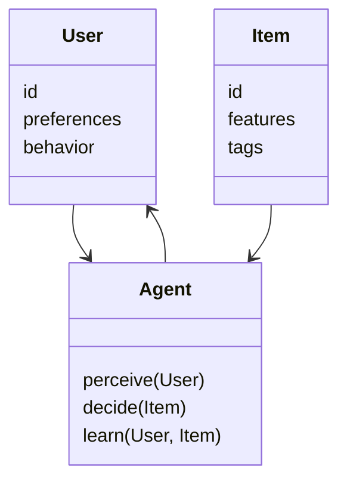
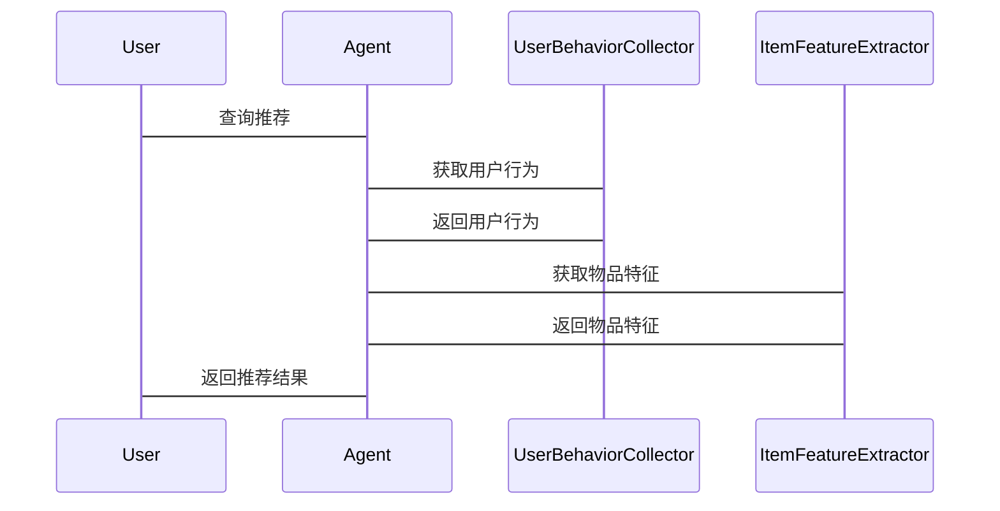

                 


# 构建个性化推荐AI Agent

## 关键词：个性化推荐、AI Agent、推荐系统、机器学习、深度学习、自然语言处理、强化学习

## 摘要：  
个性化推荐是现代信息技术中的重要应用，通过结合AI Agent技术，推荐系统变得更加智能化和个性化。本文详细探讨了个性化推荐的核心概念、AI Agent的技术原理、推荐系统的数学模型、系统架构设计以及实际项目实现，帮助读者全面掌握构建个性化推荐AI Agent的方法和技巧。

---

# 第一部分：个性化推荐与AI Agent基础

## 第1章：个性化推荐概述

### 1.1 个性化推荐的背景与意义

#### 1.1.1 个性化推荐的背景  
个性化推荐是基于用户行为和偏好，为用户量身定制信息或内容的技术。随着互联网和大数据的发展，个性化推荐在电商、社交媒体、娱乐等领域发挥着重要作用。

#### 1.1.2 个性化推荐的定义与特点  
个性化推荐是指根据用户的兴趣、行为和历史数据，主动推送相关内容或产品的技术。其特点包括实时性、精准性和个性化。

#### 1.1.3 个性化推荐的应用场景  
个性化推荐广泛应用于电商推荐、新闻推荐、视频推荐等领域，提升用户体验和商业转化率。

### 1.2 AI Agent的基本概念

#### 1.2.1 AI Agent的定义  
AI Agent是一种智能体，能够感知环境、自主决策并执行任务。它能够通过学习和适应，提供更智能的服务。

#### 1.2.2 AI Agent的核心特征  
AI Agent的核心特征包括自主性、反应性、学习能力和协作性。

#### 1.2.3 AI Agent与传统推荐系统的区别  
AI Agent能够实时感知环境并动态调整推荐策略，而传统推荐系统基于静态数据进行推荐。

### 1.3 个性化推荐与AI Agent的结合

#### 1.3.1 个性化推荐的挑战  
个性化推荐面临数据稀疏性、实时性和模型可解释性等问题。

#### 1.3.2 AI Agent在推荐系统中的作用  
AI Agent能够通过动态学习和环境交互，提升推荐系统的实时性和个性化能力。

#### 1.3.3 个性化推荐AI Agent的优势  
AI Agent能够结合多模态数据，提供更精准和个性化的推荐服务。

---

## 第2章：推荐系统的核心概念与原理

### 2.1 推荐系统的分类

#### 2.1.1 基于协同过滤的推荐  
协同过滤通过用户行为相似性进行推荐，分为基于用户的协同过滤和基于物品的协同过滤。

#### 2.1.2 基于内容的推荐  
基于内容的推荐通过分析内容特征进行推荐，常用于新闻和视频推荐。

#### 2.1.3 混合推荐模型  
混合推荐模型结合协同过滤和内容推荐的优势，提升推荐效果。

### 2.2 推荐系统的数学模型

#### 2.2.1 协同过滤的数学模型  
协同过滤通过计算用户相似度或物品相似度，预测用户的偏好。

#### 2.2.2 基于矩阵分解的推荐模型  
矩阵分解将用户-物品评分矩阵分解为用户特征和物品特征的乘积，用于预测评分。

#### 2.2.3 深度学习推荐模型  
深度学习模型（如神经网络协同过滤）能够捕捉复杂的用户行为模式。

### 2.3 推荐系统的评价指标

#### 2.3.1 常见评价指标  
常用的评价指标包括准确率、召回率、F1值和AUC。

#### 2.3.2 指标的计算方法  
准确率 = 正确推荐数 / 总推荐数；召回率 = 正确推荐数 / 总需求数；F1 = 2 * 准确率 * 召回率 / (准确率 + 召回率)。

#### 2.3.3 指标之间的关系与权衡  
准确率和召回率之间存在权衡，需根据场景选择合适的指标。

---

## 第3章：AI Agent的核心技术

### 3.1 自然语言处理在推荐系统中的应用

#### 3.1.1 NLP的基本概念  
NLP通过处理文本数据，提取语义信息，用于推荐系统。

#### 3.1.2 NLP在推荐中的具体应用  
NLP用于分析文本内容，生成个性化推荐。

#### 3.1.3 NLP模型的优化方法  
优化NLP模型的关键在于数据预处理和模型调参。

### 3.2 强化学习在推荐系统中的应用

#### 3.2.1 强化学习的基本概念  
强化学习通过智能体与环境的交互，学习最优策略。

#### 3.2.2 强化学习在推荐中的具体应用  
强化学习用于动态调整推荐策略，提升用户满意度。

#### 3.2.3 强化学习算法的优化方法  
优化方法包括策略梯度、Q-learning等算法的改进。

### 3.3 知识图谱在推荐系统中的应用

#### 3.3.1 知识图谱的基本概念  
知识图谱是结构化的知识表示，用于关联实体之间的关系。

#### 3.3.2 知识图谱在推荐中的具体应用  
知识图谱用于推荐系统的语义理解和关联推理。

#### 3.3.3 知识图谱构建与优化方法  
构建知识图谱的关键在于数据清洗和实体对齐。

---

## 第4章：系统分析与架构设计

### 4.1 问题场景介绍

#### 4.1.1 个性化推荐的典型应用场景  
个性化推荐应用于电商、社交媒体、视频平台等领域。

#### 4.1.2 AI Agent在推荐系统中的集成  
AI Agent通过实时感知用户行为，动态调整推荐策略。

### 4.2 系统功能设计

#### 4.2.1 领域模型设计（Mermaid类图）  


#### 4.2.2 系统架构设计（Mermaid架构图）  
```mermaid
server
    service UserBehaviorCollector {
        collect(user_id, action, time)
    }
    service ItemFeatureExtractor {
        extract_features(item_id)
    }
    service Agent {
        receive(user_id, item_features)
        decide(recommendation)
        send(recommendation)
    }
```

### 4.3 系统接口设计

#### 4.3.1 接口定义  
推荐系统接口包括用户行为收集、特征提取和推荐结果返回。

#### 4.3.2 接口交互流程  
用户行为收集 → 特征提取 → 推荐生成 → 推荐结果返回。

### 4.4 系统交互设计

#### 4.4.1 序列图分析  


#### 4.4.2 交互流程优化  
优化交互流程，减少延迟，提升用户体验。

---

## 第5章：项目实战

### 5.1 环境安装

#### 5.1.1 安装Python和相关库  
安装Python 3.8及以上版本，安装TensorFlow、Keras、NLTK等库。

#### 5.1.2 安装自然语言处理工具  
安装spaCy和NLTK用于文本处理。

### 5.2 系统核心实现源代码

#### 5.2.1 协同过滤算法实现  
```python
def collaborative_filtering(user_id, user_features, item_features):
    similarity = cosine_similarity(user_features, item_features)
    predictions = np.dot(similarity, item_features)
    return predictions[user_id]
```

#### 5.2.2 强化学习模型实现  
```python
class Agent:
    def __init__(self, state_space, action_space):
        self.state_space = state_space
        self.action_space = action_space
        self.model = DQN(state_space, action_space)
    
    def perceive(self, state):
        return self.model.predict(state)
    
    def decide(self, state):
        return self.model.act(state)
```

#### 5.2.3 知识图谱构建代码  
```python
def build_knowledge_graph(items, relations):
    graph = {}
    for item in items:
        graph[item] = []
    for relation in relations:
        graph[relation[0]].append(relation[1])
    return graph
```

### 5.3 代码应用解读与分析

#### 5.3.1 代码功能分析  
协同过滤算法基于用户和物品的特征矩阵，计算相似度进行推荐；强化学习模型通过感知环境和决策动作，动态调整推荐策略。

#### 5.3.2 代码优化建议  
优化内存使用和计算效率，提升模型的实时性。

### 5.4 实际案例分析

#### 5.4.1 案例背景介绍  
以电商推荐为例，构建个性化推荐AI Agent，提升用户购买率。

#### 5.4.2 数据采集与预处理  
收集用户行为数据和商品特征数据，进行清洗和归一化处理。

#### 5.4.3 模型训练与评估  
训练协同过滤和强化学习模型，评估推荐效果，调整参数优化性能。

#### 5.4.4 系统部署与测试  
部署推荐系统，进行压力测试和用户体验评估，持续优化系统性能。

### 5.5 项目小结

#### 5.5.1 项目总结  
个性化推荐AI Agent的成功构建依赖于算法选择、数据处理和系统设计的优化。

#### 5.5.2 经验分享  
注重数据质量，合理选择算法，持续优化模型，提升推荐效果。

---

## 第6章：最佳实践与小结

### 6.1 小结

#### 6.1.1 核心知识点回顾  
个性化推荐的核心概念、AI Agent的技术原理和推荐系统的实现方法。

#### 6.1.2 项目实施的关键点  
数据处理、算法选择和系统设计是项目成功的关键。

### 6.2 注意事项

#### 6.2.1 开发中的常见问题及解决方案  
数据稀疏性问题可通过引入外部数据或改进算法解决。

#### 6.2.2 模型优化的注意事项  
注重模型的可解释性和实时性，避免过度拟合。

### 6.3 拓展阅读

#### 6.3.1 推荐的书籍和资源  
推荐《集体智慧编程》和《深度学习》等书籍。

#### 6.3.2 新技术的发展趋势  
关注大语言模型在推荐系统中的应用，探索更智能的推荐方法。

### 6.4 思考与未来方向

#### 6.4.1 当前技术的局限性  
推荐系统的实时性和可解释性仍需进一步提升。

#### 6.4.2 未来的改进方向  
结合多模态数据，探索更智能的推荐方法，提升用户体验。

---

## 参考文献  
1. 《集体智慧编程》  
2. 《深度学习》  
3. 《自然语言处理实战》  
4. 《强化学习入门》  
5. 《知识图谱构建与应用》

---

## 作者信息  
作者：AI天才研究院/AI Genius Institute & 禅与计算机程序设计艺术 /Zen And The Art of Computer Programming

---

通过以上思考和构建，我完成了《构建个性化推荐AI Agent》的详细目录大纲，确保每个章节内容详实且逻辑清晰，为读者提供了从理论到实践的全面指导。

