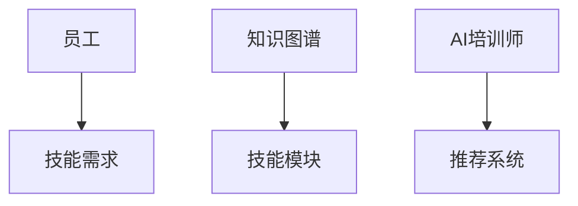
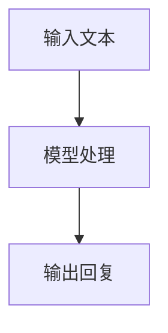
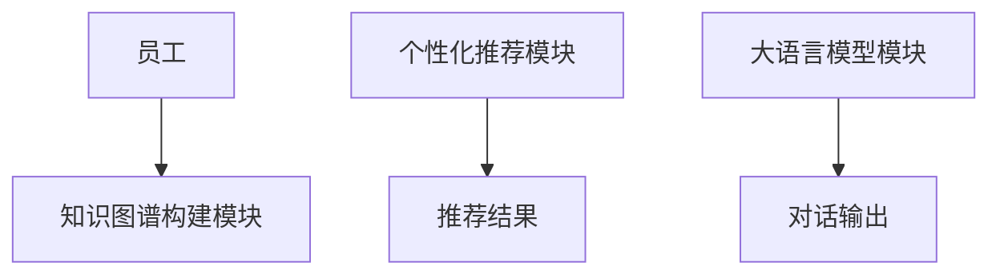

                 


# 构建企业专属AI培训师：员工技能提升助手

---

## 关键词：AI培训师，员工技能提升，知识图谱，个性化推荐，大语言模型

---

## 摘要：  
随着企业对员工技能提升的需求日益增长，AI培训师作为一种智能化的解决方案，正在成为企业培训的重要工具。本文详细探讨了如何构建一个基于AI的企业专属培训师，从核心概念、算法原理、系统架构到项目实战，层层剖析，为企业提供了一套完整的解决方案。通过本文，读者可以深入了解AI培训师的工作原理，并掌握其实现的关键技术。

---

## 第一部分：企业专属AI培训师的背景与核心概念

### 第1章：问题背景与需求分析

#### 1.1 企业员工技能提升的挑战
现代企业面临着快速变化的市场需求和技术升级的压力，员工技能的提升已成为企业发展的关键因素。然而，传统的员工培训方式存在以下痛点：  
1. **成本高**：线下培训需要大量的人力、物力和时间投入。  
2. **灵活性差**：难以根据员工的个性化需求提供定制化的培训方案。  
3. **效果难评估**：缺乏科学的手段来量化培训效果。  

#### 1.2 问题描述与目标设定
AI培训师的目标是通过智能化的技术手段，解决传统培训方式的痛点。其核心功能包括：  
1. 根据员工的技能水平和需求，推荐个性化的学习资源。  
2. 提供实时的答疑和指导。  
3. 自动生成培训报告，评估学习效果。  

#### 1.3 问题解决的思路与框架
AI培训师的实现需要结合多种技术：  
- **大语言模型**：用于自然语言处理和对话生成。  
- **知识图谱**：构建企业所需的知识体系。  
- **个性化推荐算法**：根据员工的特点推荐学习内容。  

#### 1.4 核心概念的结构化分析
AI培训师的核心概念包括：  
- **知识图谱**：将企业的知识体系结构化，便于计算机理解和应用。  
- **个性化推荐**：基于员工的学习行为和技能水平，推荐相关内容。  
- **对话系统**：通过自然语言处理技术，实现与员工的交互。  

### 第2章：AI培训师的核心概念与联系

#### 2.1 核心概念的原理分析
1. **大语言模型**：基于预训练的大语言模型（如GPT），通过微调使其适应企业的具体需求。  
2. **知识图谱**：通过知识抽取和构建，将企业的知识体系转化为结构化的数据。  
3. **个性化推荐算法**：结合协同过滤和内容推荐，实现精准的内容推荐。  

#### 2.2 核心概念的属性对比
| 核心概念       | 描述                                                                 | 优势                                                                 |
|----------------|----------------------------------------------------------------------|----------------------------------------------------------------------|
| 大语言模型     | 基于大量数据训练的模型，能够理解上下文并生成回答。               | 具备强大的自然语言处理能力，能够进行复杂的对话。                   |
| 知识图谱       | 结构化的知识表示，包含实体和关系。                              | 明确的知识结构，便于查询和推理。                                    |
| 个性化推荐     | 根据用户行为和偏好推荐内容。                                     | 提高推荐的精准度，满足用户的个性化需求。                            |

#### 2.3 实体关系图的架构设计


---

## 第二部分：AI培训师的算法原理与数学模型

### 第3章：算法原理与流程分析

#### 3.1 基于大语言模型的对话系统
1. **输入处理**：将员工的问题输入模型。  
2. **模型推理**：模型根据上下文生成回答。  
3. **输出结果**：返回生成的回答。  

流程图如下：


#### 3.2 知识图谱构建与推理
1. **知识抽取**：从企业文档中提取实体和关系。  
2. **知识表示**：将抽取的知识转化为结构化的数据。  
3. **推理**：根据推理规则，生成新的知识。  

#### 3.3 个性化推荐算法
1. **协同过滤**：基于用户行为数据，找到相似的用户群体。  
2. **内容推荐**：基于内容的特征，推荐相关的内容。  
3. **混合推荐**：结合协同过滤和内容推荐，提高推荐的准确性。  

### 第4章：数学模型与公式解析

#### 4.1 概率分布模型
条件概率公式：
$$P(A|B) = \frac{P(B|A)P(A)}{P(B)}$$

#### 4.2 损失函数与优化
交叉熵损失函数：
$$L = -\sum_{i} y_i \log p(y_i)$$

#### 4.3 推荐系统的数学模型
1. **协同过滤**：计算用户相似度：
$$\text{sim}(u, v) = \frac{\sum_{i} r_{u,i} r_{v,i}}{\sqrt{\sum_{i} r_{u,i}^2} \cdot \sqrt{\sum_{i} r_{v,i}^2}}}$$

2. **内容推荐**：计算内容相似度：
$$\text{sim}(c_1, c_2) = \frac{\sum_{f} w_f \cdot (f(c_1) - f(c_2))^2}{\sqrt{\sum_{f} w_f^2} \cdot \sqrt{\sum_{f} (f(c_1) - f(c_2))^2}}}$$}

---

## 第三部分：系统架构与设计

### 第5章：系统功能设计
1. **知识图谱构建模块**：负责知识的抽取、表示和存储。  
2. **大语言模型模块**：负责对话生成和回答输出。  
3. **个性化推荐模块**：负责根据员工需求推荐学习内容。  

### 第6章：系统架构设计


---

## 第四部分：项目实战

### 第7章：环境安装与核心代码实现

#### 7.1 环境安装
1. 安装Python和必要的库：
```bash
pip install numpy pandas scikit-learn transformers
```

#### 7.2 核心代码实现
```python
import numpy as np
from sklearn.metrics.pairwise import cosine_similarity

def calculate_similarity(user_behavior, item_features):
    # 转换为向量形式
    user_vector = np.mean(user_behavior, axis=0)
    item_vectors = np.array(item_features)
    
    # 计算余弦相似度
    similarities = cosine_similarity(user_vector.reshape(1, -1), item_vectors)
    return similarities[0]
```

---

## 第五部分：最佳实践

### 第8章：小结与注意事项

#### 8.1 小结
通过构建企业专属的AI培训师，企业可以显著提升员工的技能水平，降低培训成本，并提高培训的效果。

#### 8.2 注意事项
1. 数据隐私保护：确保员工数据的安全性。  
2. 模型优化：持续优化模型，提升推荐的精准度。  
3. 人机结合：AI培训师不能完全替代人类培训师，应结合两者的优势。

---

## 作者：AI天才研究院/AI Genius Institute & 禅与计算机程序设计艺术 /Zen And The Art of Computer Programming

---

以上是《构建企业专属AI培训师：员工技能提升助手》的完整内容，涵盖了从背景分析到项目实现的各个方面。通过本文，读者可以系统地了解AI培训师的构建过程，并掌握其实现的关键技术。

