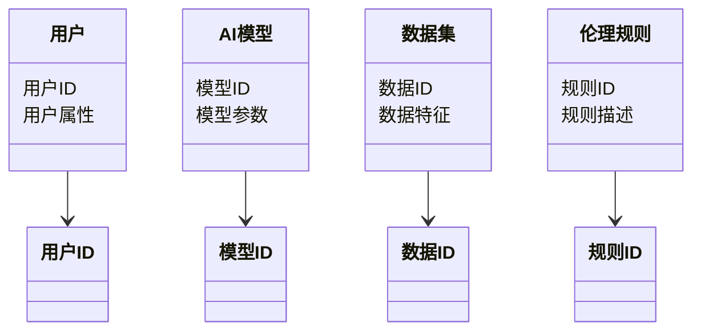

                 


# 构建企业级AI伦理顾问：确保AI应用的道德合规

> 关键词：AI伦理顾问, 企业级AI应用, 伦理合规, 偏见检测, 可解释性, 透明性, 责任归属

> 摘要：随着人工智能技术的快速发展，企业在应用AI技术时面临越来越多的伦理挑战。构建一个企业级AI伦理顾问系统，能够帮助企业识别和解决AI应用中的伦理问题，确保AI系统的公平性、透明性和可追溯性。本文将详细探讨AI伦理顾问的核心概念、算法原理、系统架构设计以及实际应用案例。

---

# 《构建企业级AI伦理顾问：确保AI应用的道德合规》

> 作者：AI天才研究院/AI Genius Institute & 禅与计算机程序设计艺术 /Zen And The Art of Computer Programming

---

## 目录

### 第一部分: AI伦理顾问的背景与核心概念

### 第二部分: AI伦理的核心概念与联系

### 第三部分: AI伦理顾问的算法原理

### 第四部分: AI伦理顾问的系统分析与架构设计

### 第五部分: AI伦理顾问的项目实战

### 第六部分: AI伦理顾问的最佳实践

---

## 第一部分: AI伦理顾问的背景与核心概念

### 1.1 AI伦理顾问的背景与问题背景

#### 1.1.1 人工智能与伦理的基本概念

人工智能（AI）是指模拟人类智能的系统或机器，能够执行复杂的任务，如学习、推理、决策和自然语言处理。随着AI技术的快速发展，其应用范围不断扩大，涵盖医疗、金融、交通、教育等多个领域。然而，AI系统的决策过程可能引入伦理问题，例如偏见、不公平对待和透明性不足。

#### 1.1.2 企业级AI应用的伦理挑战

企业在应用AI技术时，面临以下伦理挑战：
- **偏见与不公平性**：AI系统可能因为训练数据中的偏差，导致不公平的结果，例如招聘系统对某些群体的歧视。
- **透明性与可解释性**：复杂的AI模型（如深度学习模型）通常被视为“黑箱”，用户难以理解其决策过程。
- **责任与可追溯性**：当AI系统引发错误或损害时，确定责任主体和追溯决策过程是复杂的。

#### 1.1.3 AI伦理顾问的定义与作用

AI伦理顾问是一个智能系统，用于评估和指导企业AI应用的伦理合规性。其作用包括：
- **检测偏见**：识别AI系统中的偏见和不公平性。
- **评估透明性**：确保AI系统的决策过程是透明和可解释的。
- **制定伦理规则**：为企业AI应用提供伦理指导和建议。

### 1.2 问题背景与问题描述

#### 1.2.1 当前AI技术的快速发展与伦理问题

AI技术的快速发展为企业带来了巨大的机会，但也引发了一系列伦理问题。例如，自动驾驶汽车在紧急情况下的决策可能涉及生命伦理；AI招聘系统可能因为数据偏差导致就业歧视。

#### 1.2.2 企业AI应用中的伦理风险

企业AI应用中的伦理风险包括：
- **数据偏见**：AI系统可能基于有偏见的数据做出不公平的决策。
- **用户隐私**：AI系统可能滥用用户数据，侵犯隐私。
- **责任归属**：当AI系统引发错误时，难以确定责任主体。

#### 1.2.3 伦理合规的重要性与紧迫性

伦理合规是企业在AI时代的核心竞争力之一。合规的AI系统能够增强用户信任，降低法律风险，并提升企业的社会形象。随着全球对AI伦理的监管趋严，企业必须重视AI伦理合规，否则可能面临罚款、诉讼甚至市场禁入。

### 1.3 问题解决与边界

#### 1.3.1 AI伦理顾问的目标与范围

AI伦理顾问的目标是帮助企业识别和解决AI应用中的伦理问题。其范围包括：
- **偏见检测**：分析AI系统的行为，识别潜在的偏见。
- **透明性评估**：评估AI系统的决策过程是否透明。
- **伦理规则制定**：为企业AI应用制定伦理准则和规范。

#### 1.3.2 企业AI伦理合规的边界

企业AI伦理合规的边界包括：
- **数据范围**：仅限于企业内部使用的数据。
- **应用范围**：仅限于企业的AI应用场景。
- **合规范围**：仅限于企业AI应用的伦理合规。

#### 1.3.3 AI伦理顾问的适用场景与限制

AI伦理顾问适用于以下场景：
- **企业内部AI系统评估**：帮助企业评估内部AI系统的伦理合规性。
- **AI产品开发指导**：为企业提供AI产品开发的伦理指导。
- **AI政策制定**：帮助企业制定AI相关政策和规范。

### 1.4 核心概念与结构

#### 1.4.1 AI伦理的核心要素

AI伦理的核心要素包括：
- **公平性**：确保AI系统的决策公平，无偏见。
- **透明性**：确保AI系统的决策过程透明，可解释。
- **责任归属**：明确AI系统决策的责任主体。

#### 1.4.2 AI伦理顾问的系统结构

AI伦理顾问的系统结构包括：
- **数据采集模块**：采集AI系统的输入数据和输出结果。
- **偏见检测模块**：检测AI系统中的偏见和不公平性。
- **透明性评估模块**：评估AI系统的透明性。
- **伦理规则制定模块**：制定AI应用的伦理规则和规范。

#### 1.4.3 系统的核心功能模块

系统的核心功能模块包括：
- **数据采集模块**：采集AI系统的输入数据和输出结果。
- **偏见检测模块**：检测AI系统中的偏见和不公平性。
- **透明性评估模块**：评估AI系统的透明性。
- **伦理规则制定模块**：制定AI应用的伦理规则和规范。

---

### 第二部分: AI伦理的核心概念与联系

### 2.1 核心概念原理

#### 2.1.1 公平性与偏见检测

公平性是指AI系统的决策对所有用户公平，无偏见。偏见检测是通过分析AI系统的决策结果，识别潜在的偏见。

#### 2.1.2 透明性与可解释性

透明性是指AI系统的决策过程透明，可解释。可解释性是通过解释AI系统的决策过程，增强用户对AI系统的信任。

#### 2.1.3 责任与可追溯性

责任是指明确AI系统决策的责任主体。可追溯性是通过记录AI系统的决策过程，追溯决策的来源。

### 2.2 概念属性特征对比表

| 概念    | 定义                                                                 | 目标                           |
|---------|----------------------------------------------------------------------|--------------------------------|
| 公平性  | 确保AI系统的决策公平，无偏见                                           | 减少偏见和不公平性               |
| 透明性  | 确保AI系统的决策过程透明，可解释                                       | 增强用户信任                   |
| 责任    | 明确AI系统决策的责任主体                                             | 确定责任归属                   |

### 2.3 ER实体关系图

```mermaid
er
  actor: 用户
  model: AI模型
  data: 数据集
  rule: 伦理规则
  advisor: AI伦理顾问系统
  actor --> model: 使用
  model --> data: 训练
  advisor --> rule: 执行
  actor --> advisor: 请求评估
  model --> advisor: 提供决策
```

---

### 第三部分: AI伦理顾问的算法原理

### 3.1 算法原理

#### 3.1.1 偏见检测算法

偏见检测算法用于识别AI系统中的偏见。常见的偏见检测算法包括统计方法和机器学习方法。

#### 3.1.2 透明性评估算法

透明性评估算法用于评估AI系统的透明性。常见的透明性评估算法包括可解释性分析和模型解释技术。

#### 3.1.3 责任归属算法

责任归属算法用于确定AI系统决策的责任主体。常见的责任归属算法包括因果推断和责任分配模型。

### 3.2 算法实现

#### 3.2.1 偏见检测算法实现

以下是一个偏见检测算法的Python代码示例：

```python
import pandas as pd
from sklearn.metrics import classification_report

def detect_bias(model, X, y_true):
    y_pred = model.predict(X)
    report = classification_report(y_true, y_pred)
    return report
```

#### 3.2.2 透明性评估算法实现

以下是一个透明性评估算法的Python代码示例：

```python
def explain_model(model, X):
    import shap
    explainer = shap.TreeExplainer(model)
    shap_values = explainer.shap_values(X)
    return shap_values
```

#### 3.2.3 责任归属算法实现

以下是一个责任归属算法的Python代码示例：

```python
def assign_responsibility(model, X, y):
    import eli5
    explanation = eli5.explain_model(model, X, y)
    return explanation
```

### 3.3 算法原理的数学模型

#### 3.3.1 偏见检测的数学模型

偏见检测的数学模型可以用概率论中的条件概率来表示。例如，计算某个群体在AI系统中的被拒绝概率：

$$ P(\text{拒绝} | \text{群体}) = \frac{\text{群体中被拒绝的数量}}{\text{群体总数}} $$

#### 3.3.2 透明性评估的数学模型

透明性评估的数学模型可以用信息论中的熵来表示。例如，计算AI系统决策的不确定性：

$$ H = -\sum p \log p $$

#### 3.3.3 责任归属的数学模型

责任归属的数学模型可以用因果推断中的因果图来表示。例如，确定AI系统决策的责任主体：

$$ P(\text{责任主体} | \text{决策}) = \frac{P(\text{决策} | \text{责任主体}) \cdot P(\text{责任主体})}{P(\text{决策})} $$

---

### 第四部分: AI伦理顾问的系统分析与架构设计

### 4.1 系统分析

#### 4.1.1 问题场景介绍

问题场景：企业希望确保其AI系统的决策公平、透明和可追溯。

#### 4.1.2 系统介绍

系统介绍：AI伦理顾问是一个智能系统，用于评估和指导企业AI应用的伦理合规性。

### 4.2 系统设计

#### 4.2.1 领域模型设计



#### 4.2.2 系统架构设计


#### 4.2.3 系统接口设计

系统接口设计包括：
- 数据采集接口
- 偏见检测接口
- 透明性评估接口
- 责任归属接口

#### 4.2.4 系统交互设计

系统交互设计包括：
- 用户请求评估
- 系统处理评估
- 系统返回结果

---

### 第五部分: AI伦理顾问的项目实战

### 5.1 环境安装

#### 5.1.1 安装Python和相关库

```bash
python --version
pip install numpy
pip install pandas
pip install scikit-learn
pip install shap
pip install eli5
```

### 5.2 系统核心实现

#### 5.2.1 偏见检测模块实现

```python
import numpy as np
from sklearn.linear_model import LogisticRegression

# 创建数据集
X = np.random.randn(100, 2)
y = np.random.randint(2, size=100)

# 训练模型
model = LogisticRegression().fit(X, y)

# 检测偏见
print(classification_report(y, model.predict(X)))
```

#### 5.2.2 透明性评估模块实现

```python
import shap

# 解释模型
explainer = shap.TreeExplainer(model)
shap_values = explainer.shap_values(X)
shap.summary_plot(shap_values, X, plot_type="bar")
```

#### 5.2.3 责任归属模块实现

```python
import eli5

# 可视化解释
eli5.show_weights(model, target_names=["0", "1"])
```

### 5.3 实际案例分析

#### 5.3.1 案例介绍

案例介绍：某企业希望评估其AI招聘系统是否存在性别偏见。

#### 5.3.2 数据分析

数据分析：通过偏见检测模块，发现AI招聘系统对女性候选人的拒绝率高于男性。

#### 5.3.3 问题解决

问题解决：通过调整模型参数和增加性别相关的特征，减少偏见。

### 5.4 项目小结

项目小结：通过实际案例分析，验证了AI伦理顾问系统在检测偏见和评估透明性方面的有效性。

---

### 第六部分: AI伦理顾问的最佳实践

### 6.1 最佳实践

#### 6.1.1 关键点总结

关键点总结：
- 定期评估AI系统的伦理合规性。
- 采用透明和可解释的AI模型。
- 建立明确的责任分配机制。

#### 6.1.2 注意事项

注意事项：
- 确保数据的多样性和代表性。
- 定期更新伦理规则和规范。
- 建立用户反馈机制。

#### 6.1.3 拓展阅读

拓展阅读：
- "AI Ethics: The Trolley Problem and the Three Laws of Robotics" by Nick Bostrom
- "Ethics of AI" by Francesca
- "Fairness and bias in machine learning" by Moritz Hardt

---

### 总结

构建企业级AI伦理顾问是一个复杂但重要的任务。通过本文的详细讲解，读者可以了解AI伦理的核心概念、算法原理、系统架构设计以及实际应用案例。希望本文能够为企业在AI伦理合规方面提供有价值的指导和帮助。

---

### 参考文献

1. Bostrom, N. (2003). *AI Ethics: The Trolley Problem and the Three Laws of Robotics*.
2. Hardt, M., & et al. (2016). *Inequality and Causality: Bias in Machine Learning*.

