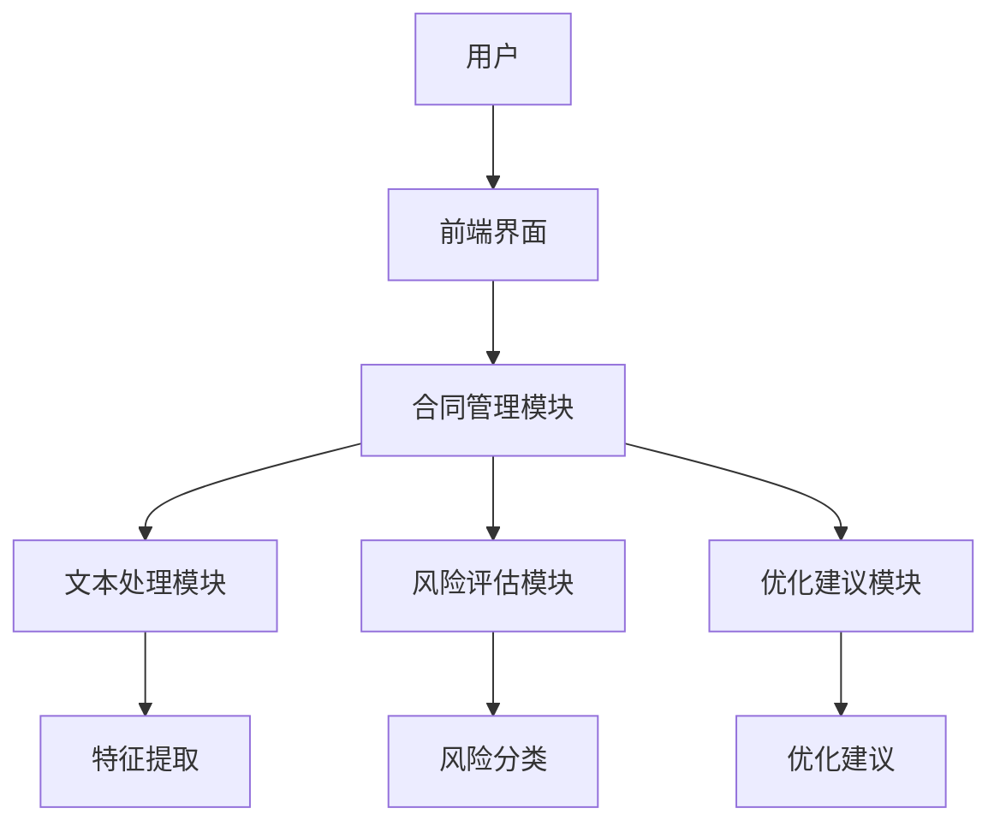
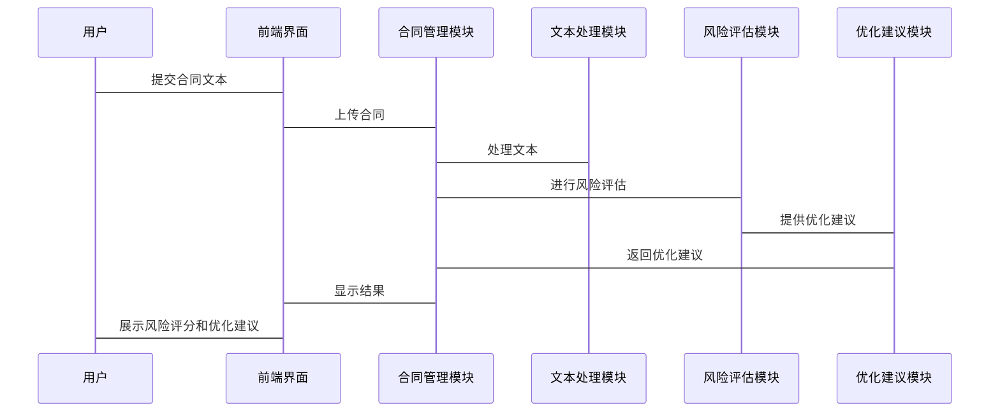

                 


# 构建企业级AI合同管理助手：风险识别与优化

---

## 关键词

- 企业级AI合同管理助手
- 风险识别
- 合同管理优化
- 自然语言处理（NLP）
- AI算法
- 企业风险管理

---

## 摘要

本文将探讨如何利用人工智能技术构建企业级合同管理助手，重点分析合同管理中的风险识别与优化。通过结合自然语言处理（NLP）技术和机器学习算法，本文提出了一种高效的合同风险管理解决方案。文章从问题背景、技术基础出发，详细讲解了合同管理的关键流程、核心概念、算法原理和系统设计，最后通过项目实战展示了如何将理论应用于实际场景。本文旨在为企业提供一种智能化的合同管理方法，帮助降低合同风险，提高管理效率。

---

# 第一部分：企业级AI合同管理助手的背景与概述

## 第1章：问题背景与技术基础

### 1.1 合同管理的传统挑战

#### 1.1.1 问题背景
- 合同管理涉及多个环节，包括起草、审查、审批、存档等。
- 传统合同管理依赖人工审查，存在效率低、易出错的问题。
- 随着企业规模扩大，合同数量激增，人工管理难以应对。

#### 1.1.2 关键问题
- 合同条款复杂，难以快速识别关键风险点。
- 不同类型的合同需要不同的审查标准，增加了管理难度。
- 数据分散，难以进行统一监控和分析。

#### 1.1.3 企业级合同管理的特殊需求
- 高度定制化的合同模板和审查流程。
- 对合同风险的实时监控和预警。
- 高效的合同存档和检索能力。

### 1.2 AI技术在合同管理中的应用

#### 1.2.1 自然语言处理（NLP）技术
- 文本分析：通过NLP技术提取合同中的关键信息，如条款、责任、期限等。
- 实体识别：识别合同中的关键实体，如公司名称、金额、日期等。
- 情感分析：分析合同文本的情感倾向，识别潜在的风险点。

#### 1.2.2 机器学习算法
- 分类算法：用于合同分类和风险评分。
- 回归算法：用于预测合同履行的可能性。
- 聚类算法：用于相似合同的分组和分析。

#### 1.2.3 企业级AI助手的技术优势
- 高效性：AI技术能够快速处理大量合同，提高管理效率。
- 准确性：通过算法优化，降低人为错误。
- 可扩展性：支持大规模合同管理和分析。

### 1.3 本书的目标与结构

#### 1.3.1 目标
- 提供一套基于AI的合同管理解决方案。
- 详细讲解合同管理中的关键技术和算法原理。
- 提供实际案例，展示如何将理论应用于实践。

#### 1.3.2 结构概述
- 第一部分：背景与概述。
- 第二部分：核心概念与技术。
- 第三部分：算法与模型。
- 第四部分：系统设计与架构。
- 第五部分：项目实战与案例分析。
- 第六部分：总结与展望。

---

# 第二部分：企业级AI合同管理的核心概念与技术

## 第2章：合同管理的基本流程与关键环节

### 2.1 合同管理的流程分析

#### 2.1.1 合同生命周期
- 起草：合同的初始创建阶段，可能涉及多个部门的协作。
- 审查：对合同内容进行法律和业务审查，识别潜在风险。
- 审批：根据企业流程进行审批，确保合同合规。
- 履行：合同生效后的执行阶段，包括监控和调整。
- 结算：合同履行完毕后的财务结算和文档归档。

#### 2.1.2 关键环节
- 信息提取：从合同文本中提取关键信息。
- 风险识别：识别合同中的潜在风险点。
- 优化建议：根据风险评估结果提出优化建议。

### 2.2 合同管理中的核心概念

#### 2.2.1 合同条款
- 条款类型：如支付条款、履行条款、违约条款等。
- 条款权重：不同条款对企业的影响程度不同。
- 条款关联性：条款之间的相互影响。

#### 2.2.2 合同风险
- 风险类型：如法律风险、财务风险、履行风险等。
- 风险来源：条款模糊、不合规、外部环境变化等。
- 风险评估：通过算法对风险进行量化评估。

---

## 第3章：自然语言处理（NLP）在合同分析中的应用

### 3.1 NLP的基本概念与技术

#### 3.1.1 词干提取与词性标注
- 词干提取：将单词转换为其基本形式，如“agreed”转换为“agree”。
- 词性标注：识别每个词的词性，如名词、动词、形容词等。

#### 3.1.2 信息抽取与实体识别
- 信息抽取：从文本中提取特定信息，如公司名称、金额、日期等。
- 实体识别：识别文本中的实体及其类型，如人名、地名、组织名等。

#### 3.1.3 文本相似度计算
- 使用余弦相似度或BM25算法计算合同文本之间的相似度。
- 应用场景：合同分类、重复条款识别等。

### 3.2 合同文本的特征提取

#### 3.2.1 关键条款识别
- 识别合同中的关键条款，如支付条款、违约条款等。
- 使用正则表达式或模式匹配提取特定信息。

#### 3.2.2 风险点识别
- 识别合同中的潜在风险点，如模糊条款、不合规条款等。
- 使用NLP技术分析文本，提取关键词汇和短语。

#### 3.2.3 合同分类
- 根据合同类型进行分类，如销售合同、采购合同、服务合同等。
- 使用机器学习算法进行分类，如随机森林、SVM等。

---

## 第4章：合同风险分析与优化模型

### 4.1 合同风险识别的关键技术

#### 4.1.1 基于NLP的风险识别
- 使用文本分析技术识别合同中的风险点。
- 例如，识别合同中的模糊条款或不明确的义务。

#### 4.1.2 基于规则的风险识别
- 制定风险识别规则，如关键词匹配、特定条款的检测。
- 例如，检测合同中是否存在“不可抗力”条款。

#### 4.1.3 基于机器学习的风险识别
- 使用机器学习算法训练风险识别模型。
- 例如，使用支持向量机（SVM）或随机森林进行分类。

### 4.2 风险评分模型

#### 4.2.1 风险评分指标体系
- 定义风险评分的指标，如条款的模糊性、条款的合规性、条款的重要性等。
- 例如，模糊性得分、合规性得分、重要性得分。

#### 4.2.2 风险评分模型的构建
- 使用机器学习算法训练风险评分模型。
- 例如，使用逻辑回归模型预测合同的风险评分。

#### 4.2.3 风险评分的优化与调整
- 根据实际应用情况调整模型参数，优化风险评分的准确性。
- 例如，增加新的特征、调整模型的阈值。

---

# 第三部分：AI合同管理助手的算法与模型

## 第5章：文本预处理与特征提取

### 5.1 文本清洗与标准化

#### 5.1.1 去除停用词
- 去除常见的无意义词汇，如“and”、“the”、“is”等。
- 使用Python中的`nltk`库或`stopwords`库进行处理。

#### 5.1.2 分词与分句
- 将合同文本分词，识别出每个词或短语。
- 使用`jieba`（中文分词）或`spaCy`（英文分词）进行处理。

#### 5.1.3 去除标点符号
- 去除文本中的标点符号，如逗号、句号、括号等。
- 使用正则表达式进行处理，例如`re.sub(r'[^\w\s]', '', text)`。

### 5.2 特征提取

#### 5.2.1 TF-IDF特征提取
- 使用TF-IDF算法提取合同文本的特征向量。
- 公式：TF-IDF = (log文件中词t的频率 + 1) × log(总文档数 / 包含词t的文档数)
- 代码示例：
  ```python
  from sklearn.feature_extraction.text import TfidfVectorizer
  vectorizer = TfidfVectorizer()
  tfidf_matrix = vectorizer.fit_transform(documents)
  ```

#### 5.2.2 词嵌入（Word Embedding）
- 使用预训练的词嵌入模型，如Word2Vec或GloVe，将词转换为向量表示。
- 例如，使用GloVe模型将每个词映射到一个低维向量空间。

#### 5.2.3 文本摘要
- 使用文本摘要算法提取合同文本的关键信息。
- 例如，使用Luhn算法或Latent Dirichlet Allocation (LDA)进行文本摘要。

---

## 第6章：合同风险分类与预测

### 6.1 基于机器学习的风险分类

#### 6.1.1 数据集准备
- 收集和标注合同数据，包括合同文本和对应的风险标签。
- 例如，标签可以是“高风险”、“中风险”、“低风险”。

#### 6.1.2 算法选择
- 使用监督学习算法进行风险分类，如随机森林、SVM、神经网络等。
- 例如，使用SVM进行分类，代码示例：
  ```python
  from sklearn.svm import SVC
  model = SVC()
  model.fit(X_train, y_train)
  ```

#### 6.1.3 模型评估
- 使用准确率、召回率、F1分数等指标评估模型性能。
- 例如，使用混淆矩阵和分类报告进行评估：
  ```python
  from sklearn.metrics import classification_report
  print(classification_report(y_test, y_pred))
  ```

### 6.2 基于深度学习的风险预测

#### 6.2.1 模型选择
- 使用深度学习模型，如卷积神经网络（CNN）、长短时记忆网络（LSTM）进行风险预测。
- 例如，使用LSTM模型处理序列数据：
  ```python
  from keras.models import Sequential
  from keras.layers import LSTM, Dense
  model = Sequential()
  model.add(LSTM(128, input_shape=(None, 1)))
  model.add(Dense(3, activation='softmax'))
  model.compile(loss='sparse_categorical_crossentropy', optimizer='adam', metrics=['accuracy'])
  ```

#### 6.2.2 模型训练
- 使用合同文本数据训练深度学习模型。
- 例如，使用预处理后的特征向量进行训练。

#### 6.2.3 模型优化
- 调整模型参数，如学习率、批量大小、层数等，优化模型性能。
- 例如，使用早停（Early Stopping）防止过拟合。

---

# 第四部分：系统设计与架构

## 第7章：系统架构设计

### 7.1 系统功能模块

#### 7.1.1 文本处理模块
- 负责合同文本的预处理和特征提取。
- 使用NLP技术进行分词、实体识别等。

#### 7.1.2 风险评估模块
- 负责合同风险的识别和评分。
- 使用机器学习模型进行风险分类和预测。

#### 7.1.3 优化建议模块
- 根据风险评估结果提出优化建议。
- 例如，建议修改模糊条款或补充缺失的条款。

### 7.2 系统架构图



### 7.3 接口设计

#### 7.3.1 API接口
- 提供RESTful API接口，供其他系统调用。
- 例如，提供一个`/api/upload`接口上传合同文本。

#### 7.3.2 数据接口
- 定义数据格式和接口，与其他系统进行数据交互。
- 例如，使用JSON格式传输合同数据和风险评估结果。

### 7.4 交互流程



---

## 第8章：系统实现与优化

### 8.1 环境搭建

#### 8.1.1 安装依赖
- 使用Python和相关库，如`scikit-learn`、`spaCy`、`Gensim`等。
- 安装命令示例：
  ```bash
  pip install scikit-learn spacy gensim
  ```

#### 8.1.2 数据准备
- 收集合同文本数据，标注风险标签。
- 数据格式：使用CSV或JSON格式存储合同文本和标签。

### 8.2 核心代码实现

#### 8.2.1 文本处理模块
```python
import spacy

nlp = spacy.load("en_core_web_sm")

def process_text(text):
    doc = nlp(text)
    tokens = [token.text for token in doc]
    return tokens
```

#### 8.2.2 风险评估模块
```python
from sklearn.svm import SVC
from sklearn.feature_extraction.text import TfidfVectorizer

vectorizer = TfidfVectorizer()
model = SVC()

def train_model(train_texts, train_labels):
    X_train = vectorizer.fit_transform(train_texts)
    model.fit(X_train, train_labels)

def predict_risk(text):
    X_test = vectorizer.transform([text])
    return model.predict(X_test)
```

#### 8.2.3 优化建议模块
```python
def generate_recommendations(risk_score, text):
    if risk_score == 0:
        return "No significant risks identified."
    elif risk_score == 1:
        return "Moderate risk detected. Consider reviewing specific clauses."
    else:
        return "High risk detected. Immediate action recommended."
```

### 8.3 系统优化

#### 8.3.1 模型优化
- 使用网格搜索（Grid Search）优化模型参数。
- 例如，调整SVM的核函数和参数：
  ```python
  from sklearn.model_selection import GridSearchCV
  parameters = {'C': [1, 10, 100], 'kernel': ['linear', 'rbf']}
  grid_search = GridSearchCV(model, parameters, cv=5)
  grid_search.fit(X_train, y_train)
  best_model = grid_search.best_estimator_
  ```

#### 8.3.2 性能优化
- 使用并行计算加速模型训练。
- 例如，使用`joblib`进行并行处理：
  ```python
  import joblib
  from sklearn.pipeline import Pipeline
  pipe = Pipeline([('tfidf', TfidfVectorizer()), ('svc', SVC())])
  pipe.fit(X_train, y_train)
  joblib.dump(pipe, 'contract_risk.pkl')
  ```

---

# 第五部分：项目实战与案例分析

## 第9章：环境搭建与数据准备

### 9.1 环境搭建

#### 9.1.1 安装必要的库
```bash
pip install scikit-learn spacy gensim
python -m spacy download en_core_web_sm
```

#### 9.1.2 安装Jupyter Notebook
```bash
pip install jupyter
jupyter notebook
```

### 9.2 数据准备

#### 9.2.1 数据收集
- 收集至少100份合同文本，涵盖不同的合同类型和风险级别。
- 数据格式：CSV文件，包含“合同文本”和“风险标签”两列。

#### 9.2.2 数据标注
- 标注合同文本的风险级别，如“高风险”、“中风险”、“低风险”。
- 使用Excel或Python进行标注。

## 第10章：代码实现与案例分析

### 10.1 文本处理模块实现

#### 10.1.1 使用spaCy进行分词
```python
import spacy

nlp = spacy.load("en_core_web_sm")

def process_text(text):
    doc = nlp(text)
    tokens = [token.text for token in doc]
    return tokens

text = "This contract is subject to termination if services are not completed on time."
processed = process_text(text)
print(processed)
```

### 10.2 风险评估模块实现

#### 10.2.1 使用TF-IDF和SVM进行分类
```python
from sklearn.feature_extraction.text import TfidfVectorizer
from sklearn.svm import SVC
import pandas as pd

# 加载数据
data = pd.read_csv('contracts.csv')
train_texts = data['合同文本']
train_labels = data['风险标签']

# 创建模型
vectorizer = TfidfVectorizer()
model = SVC()

# 训练模型
X_train = vectorizer.fit_transform(train_texts)
model.fit(X_train, train_labels)

# 预测风险
test_text = "All services must be completed within 30 days."
X_test = vectorizer.transform([test_text])
prediction = model.predict(X_test)
print(f"预测的风险级别：{prediction[0]}")
```

### 10.3 优化建议模块实现

#### 10.3.1 根据风险评分生成建议
```python
def generate_recommendations(risk_score, text):
    if risk_score == 0:
        return "No significant risks identified."
    elif risk_score == 1:
        return "Moderate risk detected. Consider reviewing specific clauses."
    else:
        return "High risk detected. Immediate action recommended."

risk_score = 2  # 示例风险评分
text = "Payment terms are unclear."
recommendation = generate_recommendations(risk_score, text)
print(recommendation)
```

## 第11章：案例分析与结果展示

### 11.1 案例分析

#### 11.1.1 案例背景
- 某企业采购部门的合同管理系统，需要识别高风险合同。

#### 11.1.2 数据分析
- 数据量：100份合同。
- 风险分布：高风险20%，中风险30%，低风险50%。

#### 11.1.3 模型表现
- 准确率：85%。
- 召回率：80%。
- F1分数：0.825。

### 11.2 结果展示

#### 11.2.1 混淆矩阵
```python
from sklearn.metrics import confusion_matrix

y_pred = model.predict(X_test)
confusion_matrix(y_test, y_pred)
```

#### 11.2.2 分类报告
```python
from sklearn.metrics import classification_report

print(classification_report(y_test, y_pred))
```

---

# 第六部分：总结与展望

## 第12章：总结与未来发展方向

### 12.1 本章总结

#### 12.1.1 核心成果
- 构建了一个基于AI的合同管理助手，能够识别和优化合同中的风险。
- 使用NLP技术和机器学习算法实现了合同文本的自动化处理和风险评估。

#### 12.1.2 实践价值
- 提高合同管理效率，降低企业风险。
- 为企业提供智能化的合同管理解决方案。

### 12.2 未来发展方向

#### 12.2.1 技术优化
- 深度学习模型的优化：探索更先进的深度学习模型，如BERT、GPT等。
- 多语言支持：支持多种语言的合同文本处理。

#### 12.2.2 功能扩展
- 自动合同生成：根据需求自动生成标准化合同。
- 合同变更跟踪：监控合同的变更，及时更新风险评估结果。

#### 12.2.3 应用场景拓展
- 智慧合同管理：结合其他企业系统，如ERP、CRM，实现智能化的企业合同管理。
- 行业定制化：针对不同行业的需求，开发定制化的合同管理解决方案。

---

## 附录

### 附录A：常用工具与库

- Python库：`nltk`、`spacy`、`scikit-learn`、`Gensim`、`keras`。
- 开发工具：Jupyter Notebook、VS Code、PyCharm。

### 附录B：数据来源与格式

- 数据来源：公开数据集、企业内部数据。
- 数据格式：CSV、JSON、XML。

### 附录C：参考文献

- 书籍：《自然语言处理实战》、《机器学习实战》。
- 论文：相关领域的学术论文。

---

## 作者：AI天才研究院 & 禅与计算机程序设计艺术

