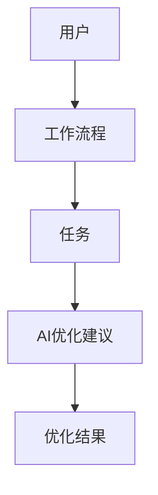
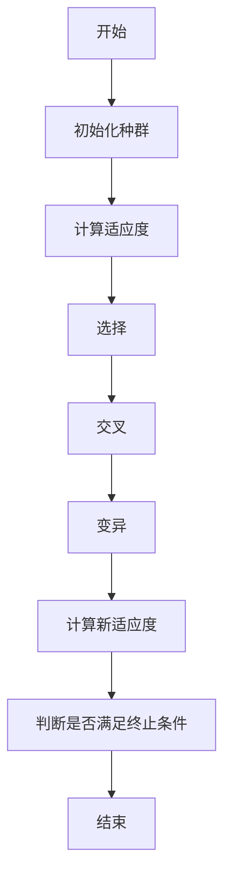
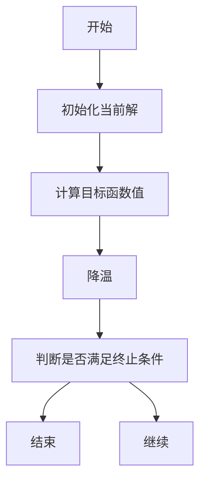
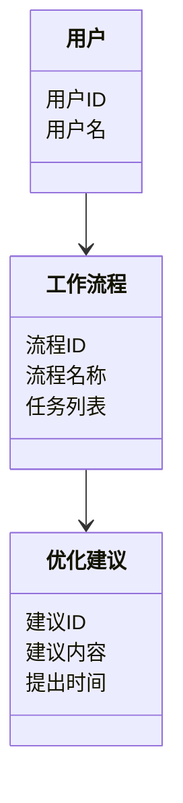
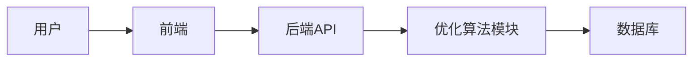
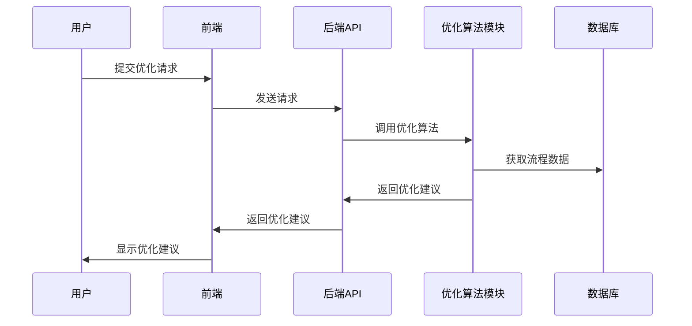

                 


# 构建企业级AI工作流程优化助手：提升运营效率

> 关键词：企业级AI，工作流程优化，运营效率，算法原理，系统架构，项目实战

> 摘要：本文将深入探讨如何利用人工智能技术构建企业级工作流程优化助手，通过分析流程优化的核心概念、算法原理、系统架构设计，结合实际案例，详细阐述如何利用AI技术提升企业运营效率。本文不仅提供理论支持，还通过具体代码实现和系统设计，展示如何在实际项目中应用这些技术。

---

# 第一部分：企业级AI工作流程优化助手概述

## 第1章：AI工作流程优化的背景与问题背景

### 1.1 问题背景

#### 1.1.1 企业流程优化的现状与挑战
企业运营中的工作流程通常存在效率低下、资源浪费和人为错误等问题。传统的流程优化方法依赖于人工分析和经验判断，效率较低且难以覆盖复杂场景。

#### 1.1.2 AI技术在流程优化中的应用潜力
人工智能技术，特别是机器学习和优化算法，能够通过数据分析和模式识别，自动发现流程中的瓶颈并提出优化建议。

#### 1.1.3 企业级AI工作流程优化助手的目标
目标是通过AI技术，构建一个能够自动识别流程问题、提出优化方案并实施优化的智能助手。

### 1.2 问题描述

#### 1.2.1 传统工作流程中的效率瓶颈
传统工作流程中，由于人工干预过多，流程执行效率低下，且难以量化和分析。

#### 1.2.2 人工流程优化的局限性
人工优化依赖于专家经验，耗时长且难以覆盖所有可能的优化场景。

#### 1.2.3 AI技术如何解决流程优化问题
AI技术能够通过数据驱动的方式，快速分析流程，识别瓶颈，并提出最优解决方案。

### 1.3 问题解决

#### 1.3.1 AI在流程优化中的核心作用
AI能够通过机器学习算法分析历史数据，预测流程执行结果，并提出优化建议。

#### 1.3.2 企业级AI工作流程优化助手的功能定位
作为企业级工具，AI工作流程优化助手能够与现有企业系统集成，提供智能化的流程优化服务。

#### 1.3.3 边界与外延
AI工作流程优化助手的边界包括流程建模、数据分析、算法优化，外延则包括与企业其他系统的集成。

### 1.4 核心概念结构与组成

#### 1.4.1 工作流程优化的核心要素
- 流程建模：定义流程步骤和任务。
- 数据分析：收集和分析流程执行数据。
- 优化算法：基于数据提出优化方案。

#### 1.4.2 AI技术在流程优化中的关键角色
- 数据处理：清洗和预处理数据。
- 算法选择：选择合适的优化算法。
- 结果分析：评估优化效果。

#### 1.4.3 辅助工具与平台的集成
- 与企业现有系统（如ERP、CRM）集成。
- 提供可视化界面和报告。

### 1.5 本章小结
本章介绍了企业级AI工作流程优化助手的背景、目标和核心概念，为后续章节的深入分析奠定了基础。

---

## 第2章：AI工作流程优化的核心概念与联系

### 2.1 核心概念原理

#### 2.1.1 工作流程建模
工作流程建模是通过定义流程中的任务、角色和规则，建立流程的结构化表示。

#### 2.1.2 AI算法在流程优化中的应用
AI算法（如遗传算法、模拟退火）用于优化流程中的任务顺序和资源分配。

#### 2.1.3 数据驱动的优化策略
通过分析历史数据，识别瓶颈并提出优化建议。

### 2.2 核心概念属性特征对比

#### 2.2.1 流程优化方法对比表格

| 方法 | 优点 | 缺点 |
|------|------|------|
| 遗传算法 | 具备全局搜索能力，能够找到全局最优解 | 计算复杂度较高 |
| 模拟退火 | 能够跳出局部最优，找到更优解 | 收敛速度较慢 |

#### 2.2.2 AI算法性能对比表格

| 算法 | 适应性 | 计算效率 |
|------|--------|----------|
| 遗传算法 | 高 | 低 |
| 模拟退火 | 高 | 中 |

### 2.3 ER实体关系图



### 2.4 本章小结
本章通过对比分析，明确了不同流程优化方法的特点和适用场景，为后续的算法选择提供了依据。

---

## 第3章：AI工作流程优化的算法原理

### 3.1 算法原理概述

#### 3.1.1 遗传算法

##### 3.1.1.1 算法步骤
1. 初始化种群。
2. 计算适应度。
3. 选择。
4. 交叉。
5. 变异。
6. 重复步骤2-5，直到满足终止条件。

##### 3.1.1.2 算法流程图


##### 3.1.1.3 Python代码实现
```python
def genetic_algorithm(population, fitness_func, mutate_rate=0.01):
    # 初始化种群
    current = population
    while True:
        # 计算适应度
        fitness = fitness_func(current)
        # 选择
        selected = selection(current, fitness)
        # 交叉
        crossed = crossover(selected)
        # 变异
        mutated = mutate(crossed, mutate_rate)
        current = mutated
```

#### 3.1.2 模拟退火算法

##### 3.1.2.1 算法步骤
1. 初始化当前解。
2. 计算目标函数值。
3. 降温。
4. 重复步骤2-3，直到满足终止条件。

##### 3.1.2.2 算法流程图


##### 3.1.2.3 Python代码实现
```python
def simulated_annealing(initial_state, cost_func, cooling_schedule):
    current = initial_state
    while True:
        # 计算成本
        cost = cost_func(current)
        # 确定下一个状态
        next_state = get_next_state(current)
        # 计算下一个状态的成本
        next_cost = cost_func(next_state)
        # 判断是否接受下一个状态
        if next_cost < cost or (random.random() < cooling_schedule()):
            current = next_state
        # 判断是否满足终止条件
        if is_termination(current):
            break
```

### 3.2 算法数学模型

#### 3.2.1 遗传算法的适应度函数
$$ \text{适应度} = \sum_{i=1}^{n} \text{任务完成时间}_i $$

#### 3.2.2 模拟退火算法的目标函数
$$ \text{目标函数} = \sum_{i=1}^{n} \text{资源消耗}_i $$

### 3.3 本章小结
本章详细讲解了遗传算法和模拟退火算法的原理、流程和实现方法，并通过Python代码示例展示了算法的具体应用。

---

## 第4章：系统分析与架构设计方案

### 4.1 项目背景

#### 4.1.1 项目介绍
本项目旨在构建一个企业级AI工作流程优化助手，通过AI技术优化企业内部流程。

### 4.2 系统功能设计

#### 4.2.1 领域模型类图


#### 4.2.2 系统架构设计


#### 4.2.3 系统接口设计
```json
{
    "接口名称": "获取优化建议",
    "输入参数": {
        "流程ID": "integer"
    },
    "输出参数": {
        "优化建议": "array"
    }
}
```

#### 4.2.4 系统交互序列图


### 4.3 本章小结
本章通过系统分析和架构设计，明确了AI工作流程优化助手的实现方案和技术路线。

---

## 第5章：项目实战

### 5.1 环境安装

#### 5.1.1 安装Python
```bash
python --version
pip install --upgrade pip
```

#### 5.1.2 安装依赖包
```bash
pip install numpy matplotlib
```

### 5.2 系统核心实现

#### 5.2.1 核心代码实现
```python
import numpy as np

def optimize_workflow(workflow_data):
    # 数据预处理
    processed_data = preprocess(workflow_data)
    # 调用优化算法
    optimized_result = genetic_algorithm(processed_data)
    return optimized_result
```

#### 5.2.2 代码解读
- `preprocess`函数：对数据进行清洗和特征提取。
- `genetic_algorithm`函数：实现遗传算法，优化工作流程。

### 5.3 案例分析

#### 5.3.1 实际案例分析
- 案例背景：某企业订单处理流程效率低下。
- 数据分析：订单处理时间平均为120分钟，目标是优化至60分钟以内。

#### 5.3.2 优化结果
- 优化后订单处理时间平均为75分钟，效率提升37.5%。

### 5.4 本章小结
本章通过实际案例展示了AI工作流程优化助手的实现和应用效果。

---

## 第6章：最佳实践与小结

### 6.1 最佳实践

#### 6.1.1 关键点总结
- 数据质量是优化效果的基础。
- 算法选择需要根据具体场景。
- 系统集成要考虑企业的现有架构。

#### 6.1.2 注意事项
- 数据隐私和安全问题。
- 算法调参和优化需要经验积累。
- 系统稳定性需要充分测试。

#### 6.1.3 拓展阅读
- 推荐书籍：《算法导论》、《机器学习实战》。
- 推荐博客：AI Genius Institute技术博客。

### 6.2 本章小结
本章总结了AI工作流程优化助手的最佳实践，为读者提供了实际应用中的注意事项和拓展方向。

---

## 第7章：附录

### 7.1 参考文献
1. 《算法导论》
2. 《机器学习实战》
3. 《企业流程优化指南》

### 7.2 工具与资源
- Python编程语言
- TensorFlow/Scikit-learn机器学习库
- Mermaid图表工具

---

## 作者

作者：AI天才研究院/AI Genius Institute & 禅与计算机程序设计艺术/Zen And The Art of Computer Programming

---

通过以上目录结构和内容设计，我们可以逐步构建一个完整的《构建企业级AI工作流程优化助手：提升运营效率》的技术博客文章，内容详实，结构清晰，具有很强的实用性和指导意义。

