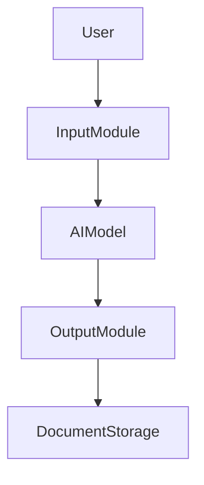

                 


# 构建企业级AI文档助手：自动化报告与提案生成

## 关键词：AI文档助手，自然语言处理，生成式AI，大语言模型，企业级系统

## 摘要：本文系统地探讨了构建企业级AI文档助手的各个方面，包括背景、核心概念、算法原理、系统架构、项目实战以及最佳实践。通过详细的分析和实际案例，本文揭示了如何利用生成式AI技术实现自动化报告和提案生成，为企业文档管理提供高效解决方案。

---

# 第1章：构建企业级AI文档助手的背景与需求

## 1.1 问题背景

### 1.1.1 传统文档生成的痛点
传统文档生成过程繁琐，依赖人工操作，效率低下且容易出错。企业文档种类繁多，格式和内容要求严格，人工编写不仅耗时，还可能因为疏忽导致信息错误。

### 1.1.2 AI技术如何解决文档生成问题
生成式AI技术，尤其是大语言模型（LLM），能够自动生成符合特定格式和内容要求的文档。AI文档助手通过自然语言处理技术，理解用户需求并生成高质量的文本，显著提高了文档生成的效率和准确性。

### 1.1.3 企业级文档助手的独特需求
企业文档助手需要支持多语言、多格式、多场景的文档生成，同时确保文档内容的准确性和一致性。此外，企业级系统需要高可用性和安全性，以满足复杂业务环境的需求。

## 1.2 问题描述

### 1.2.1 文档生成的自动化需求
企业需要自动化生成报告、提案、合同等文档，以减少人工干预，提高效率。AI文档助手能够快速响应用户需求，生成符合企业标准的文档。

### 1.2.2 企业文档的标准化与个性化平衡
企业文档需要遵循严格的格式和内容规范，但同时也要支持个性化定制。AI文档助手通过参数化输入和模板定制，实现了标准化与个性化的平衡。

### 1.2.3 多场景支持的必要性
AI文档助手需要支持多种场景，如市场报告、法律合同、技术文档等。不同场景有不同的生成逻辑和格式要求，AI系统需要具备灵活性和适应性。

## 1.3 问题解决

### 1.3.1 AI文档助手的核心功能
- 文档生成：根据用户输入生成指定格式的文档。
- 内容优化：自动调整内容结构，确保逻辑清晰。
- 格式转换：支持多种文档格式的转换和输出。

### 1.3.2 自然语言处理技术的作用
自然语言处理技术帮助AI文档助手理解用户需求，提取关键信息，并生成符合语境的文本。例如，使用分词、实体识别和句法分析等技术来提高生成质量。

### 1.3.3 企业级AI文档助手的边界与外延
企业级AI文档助手的边界在于其功能模块和应用场景。外延则包括与其他企业系统的集成，如CRM、ERP等，以实现数据互通和流程自动化。

## 1.4 核心概念结构与组成

### 1.4.1 系统架构的核心要素
- 用户交互界面：收集用户需求并展示生成结果。
- AI生成引擎：负责文本生成和格式处理。
- 文档存储与管理：存储生成的文档并提供版本控制。

### 1.4.2 功能模块的划分
- 用户输入模块：接收用户的文档生成请求。
- 内容生成模块：根据输入生成文本。
- 格式处理模块：调整文本格式以符合企业标准。
- 输出模块：将生成的文档输出为指定格式。

### 1.4.3 系统输入与输出的定义
- 输入：用户提供的文档类型、内容关键词、格式要求等。
- 输出：生成的文档，可能包括文本、表格、图表等形式。

## 1.5 本章小结
本章介绍了构建企业级AI文档助手的背景、需求和核心概念。通过分析传统文档生成的痛点和AI技术的优势，明确了AI文档助手的功能和架构。下一章将深入探讨核心概念和技术原理。

---

# 第2章：AI文档助手的核心概念与技术原理

## 2.1 核心概念解析

### 2.1.1 自然语言处理（NLP）的定义与作用
自然语言处理是研究如何让计算机理解和生成人类语言的技术。在AI文档助手中，NLP用于解析用户需求、提取关键词和生成文本。

### 2.1.2 生成式AI的原理与特点
生成式AI通过生成模型（如GPT）生成文本。其特点包括生成速度快、内容多样性以及可定制性。

### 2.1.3 大语言模型（LLM）的应用场景
大语言模型广泛应用于文本生成、翻译、问答等领域。在AI文档助手中，LLM用于生成高质量的文档内容。

## 2.2 核心技术对比

### 2.2.1 不同NLP技术的对比分析
- 生成式AI vs. 基于规则的生成：生成式AI更灵活，但可能缺乏准确性；基于规则的生成更可靠，但灵活性较差。
- 单模态 vs. 多模态：多模态模型能够处理文本、图像等多种数据，生成更丰富的文档。

### 2.2.2 生成式AI与传统文本生成方法的区别
生成式AI通过深度学习模型生成文本，传统方法基于规则或模板生成文本。生成式AI在多样性和灵活性方面具有优势。

### 2.2.3 企业级AI文档助手的技术优势
企业级AI文档助手结合了生成式AI和NLP技术，能够处理复杂的文档生成需求，同时支持多语言和多格式输出。

## 2.3 ER实体关系图

```mermaid
er
    actor: 用户
    document: 文档
    model: AI模型
    rules: 文档规范
    actor --> document: 提交请求
    document --> model: 加工处理
    model --> document: 生成结果
    actor --> rules: 提供规范
    rules --> model: 指导生成
```

## 2.4 本章小结
本章详细解析了AI文档助手的核心概念和技术原理，通过对比分析和ER图展示了系统架构。下一章将探讨生成式AI的算法原理和数学模型。

---

# 第3章：生成式AI的算法原理与数学模型

## 3.1 生成式AI的基本原理

### 3.1.1 Transformer模型的工作流程
Transformer模型由编码器和解码器组成，编码器将输入文本转换为向量表示，解码器生成输出文本。

### 3.1.2 文本生成的数学模型
文本生成基于概率分布，模型通过最大化条件概率来生成文本。

## 3.2 生成式AI的训练过程

### 3.2.1 基于Transformer的训练流程
1. 输入文本通过编码器生成上下文表示。
2. 解码器根据上下文生成输出概率分布。
3. 使用交叉熵损失函数优化模型参数。

### 3.2.2 微调与迁移学习
在预训练模型的基础上，通过微调适应特定领域的文档生成任务。

## 3.3 算法实现

### 3.3.1 Python代码实现
```python
import torch
import torch.nn as nn
import torch.optim as optim

class TransformerModel(nn.Module):
    def __init__(self, vocab_size):
        super(TransformerModel, self).__init__()
        # 定义编码器和解码器层
        self.encoder = nn.Embedding(vocab_size, d_model)
        self.decoder = nn.Embedding(vocab_size, d_model)
        # 定义全连接层
        self.fc = nn.Linear(d_model, vocab_size)
    
    def forward(self, x):
        encoded = self.encoder(x)
        decoded = self.decoder(encoded)
        output = self.fc(decoded)
        return output

# 初始化模型和优化器
model = TransformerModel(vocab_size)
optimizer = optim.Adam(model.parameters(), lr=0.001)
criterion = nn.CrossEntropyLoss()

# 训练过程
for epoch in range(num_epochs):
    for batch in batches:
        outputs = model(batch)
        loss = criterion(outputs, batch_labels)
        loss.backward()
        optimizer.step()
```

### 3.3.2 数学模型与公式
文本生成的概率分布可以表示为：
$$ P(y|x) = \prod_{i=1}^{n} P(y_i|y_{<i}, x) $$

损失函数使用交叉熵损失：
$$ \mathcal{L} = -\sum_{i=1}^{n} \sum_{y=1}^{V} y_i \log P(y|x) $$

其中，$V$是词表大小，$y_i$是输出的第$i$个词的概率。

## 3.4 本章小结
本章通过数学模型和代码示例详细讲解了生成式AI的算法原理。下一章将探讨系统架构和项目实战。

---

# 第4章：AI文档助手的系统架构与项目实战

## 4.1 系统架构设计

### 4.1.1 系统功能设计
- 用户输入模块：接收用户的文档类型和内容需求。
- 文档生成模块：调用生成式AI模型生成文本。
- 格式转换模块：将生成的文本转换为指定格式。

### 4.1.2 系统架构图


## 4.2 项目实战

### 4.2.1 环境安装
安装必要的Python库，如`torch`、`transformers`等。

### 4.2.2 核心功能实现
实现文档生成模块，包括文本生成和格式转换功能。

### 4.2.3 案例分析
以市场报告生成为例，展示AI文档助手的实际应用。

## 4.3 本章小结
本章通过系统架构设计和项目实战，展示了AI文档助手的实现过程。下一章将总结最佳实践和注意事项。

---

# 第5章：最佳实践与注意事项

## 5.1 最佳实践

### 5.1.1 模型选择与优化
选择合适的生成式模型，并通过微调优化性能。

### 5.1.2 文档规范管理
建立严格的文档规范，确保生成内容的准确性和一致性。

### 5.1.3 系统安全与稳定性
确保系统具备高可用性和安全性，防止数据泄露和系统崩溃。

## 5.2 注意事项

### 5.2.1 数据隐私问题
处理敏感数据时，需遵守相关法律法规，确保数据隐私。

### 5.2.2 模型泛化能力
模型应具备良好的泛化能力，以应对不同场景的文档生成需求。

### 5.2.3 系统可扩展性
系统设计应具备可扩展性，便于未来功能的添加和性能的提升。

## 5.3 本章小结
本章总结了构建企业级AI文档助手的最佳实践和注意事项，为实际应用提供了指导。

---

# 作者：AI天才研究院 & 禅与计算机程序设计艺术

通过以上目录结构，文章内容将系统地讲解构建企业级AI文档助手的各个方面，从背景需求到技术实现，再到项目实战和最佳实践，帮助读者全面掌握相关知识。

