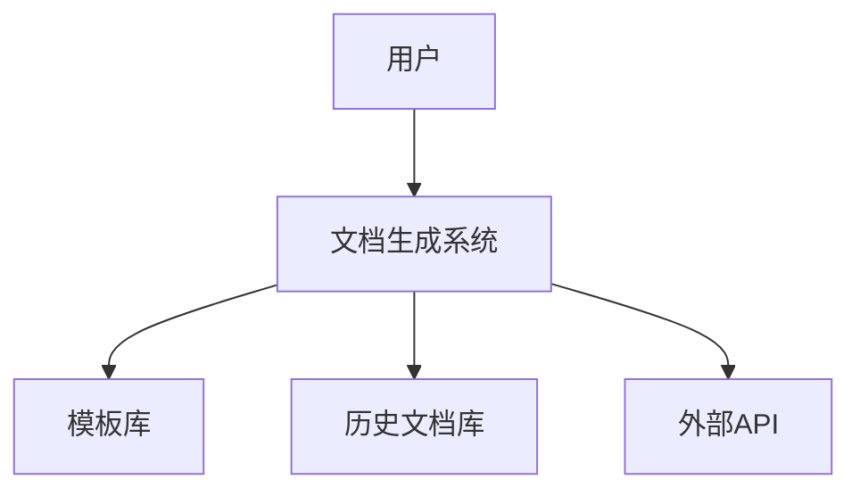
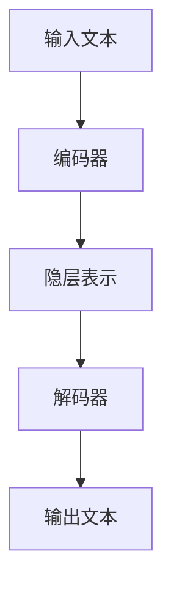
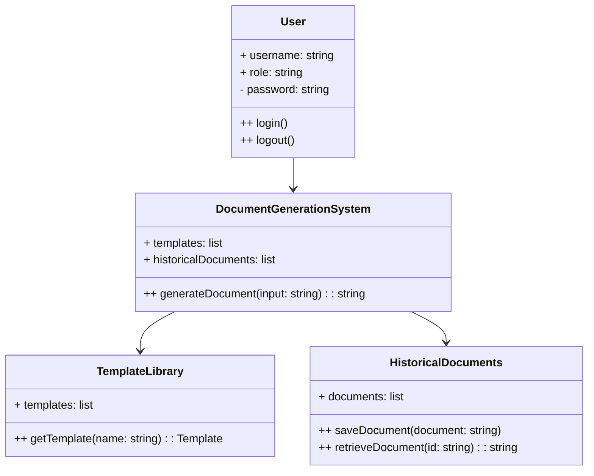

                 


# 构建企业级AI文档助手：自动生成报告与提案

## 关键词：AI文档助手、生成式AI、自然语言处理、企业文档生成、深度学习

## 摘要：本文详细探讨了构建企业级AI文档助手的技术与实践。从问题背景到核心概念，从算法原理到系统架构，再到项目实战和最佳实践，全面解析了如何利用生成式AI和自然语言处理技术，实现高效、智能的文档自动生成，为企业提升效率和竞争力提供解决方案。

---

# 第一部分: 企业级AI文档助手的背景与核心概念

## 第1章: 问题背景与需求分析

### 1.1 问题背景
#### 1.1.1 传统文档生成的痛点
在企业运营中，文档生成是一项耗时且繁琐的任务。传统的文档生成依赖人工操作，存在以下痛点：
- **效率低下**：员工需要手动编写和调整文档内容，尤其是在处理大量重复性任务时，效率极低。
- **一致性差**：不同人员的撰写风格和内容规范可能存在差异，导致文档一致性不足。
- **错误率高**：人工操作容易出现疏忽，比如数据输入错误或格式不统一。
- **资源浪费**：企业需要投入大量人力资源来完成文档生成任务，增加了运营成本。

#### 1.1.2 AI技术在文档生成中的优势
随着生成式AI和自然语言处理（NLP）技术的快速发展，AI文档助手能够显著提升文档生成的效率和质量：
- **自动化处理**：AI可以快速生成结构化文档，减少人工干预。
- **一致性高**：AI严格遵循预设的模板和风格，确保文档格式和内容的一致性。
- **降低错误率**：通过算法优化，AI生成的文档准确性更高，减少人为错误。
- **节省资源**：AI文档助手能够显著减少人力资源投入，降低运营成本。

#### 1.1.3 企业级文档生成的需求
企业级文档生成需要满足以下需求：
- **高可用性**：文档生成系统必须稳定运行，支持高并发请求。
- **定制化能力**：系统需支持多种文档类型和格式，满足不同业务场景的需求。
- **数据安全**：处理企业敏感数据时，系统需具备强大的数据保护机制。
- **可扩展性**：系统架构应具备良好的扩展性，以应对未来业务增长。

### 1.2 问题描述
#### 1.2.1 文档生成的典型场景
企业级文档生成的典型场景包括：
- **销售报告**：根据销售数据自动生成销售报告，帮助管理层进行决策。
- **市场分析**：基于市场数据生成市场分析报告，支持市场策略制定。
- **项目提案**：根据项目需求快速生成项目提案，提高投标效率。

#### 1.2.2 企业级文档生成的核心挑战
构建企业级AI文档助手面临以下挑战：
- **数据多样性**：企业文档类型繁多，涵盖销售、市场、项目管理等多个领域，需要系统具备多场景适应能力。
- **模型训练数据**：高质量的训练数据对企业文档生成的准确性至关重要，数据获取和清洗成本较高。
- **模型可解释性**：生成式AI的黑箱特性使得模型的可解释性较差，影响用户对生成内容的信任度。
- **系统集成**：文档生成系统需要与企业现有的信息化系统无缝集成，确保数据流通畅。

#### 1.2.3 问题的边界与外延
企业级AI文档生成的边界包括：
- **输入限制**：系统支持的输入格式和数据类型有限，超出范围的内容无法处理。
- **生成范围**：文档生成的长度和复杂度受到模型能力的限制。
- **应用场景**：当前主要适用于结构化的报告和提案生成，不适合需要高度创意的内容生成。

### 1.3 问题解决与目标设定
#### 1.3.1 AI文档助手的核心目标
AI文档助手的核心目标是：
- **自动化生成**：快速生成高质量文档，减少人工干预。
- **高度定制化**：支持多种文档类型和格式，满足不同业务需求。
- **数据安全**：确保文档生成过程中的数据安全，防止信息泄露。
- **可扩展性**：系统架构具备良好的扩展性，支持未来的业务发展。

#### 1.3.2 解决方案的可行性分析
解决方案的可行性分析如下：
- **技术可行性**：生成式AI和NLP技术已经较为成熟，能够支持企业级文档生成。
- **数据可行性**：企业内部通常积累了大量历史文档数据，可以用于模型训练和优化。
- **成本可行性**：虽然初期投入较大，但长期来看，AI文档生成能够显著降低人力成本，具备较好的成本效益。

#### 1.3.3 相关技术的选型与整合
构建企业级AI文档助手需要整合以下技术：
- **生成式AI模型**：如GPT系列模型，用于文本生成。
- **自然语言处理技术**：如分词、实体识别等，用于文档结构化处理。
- **机器学习框架**：如TensorFlow或PyTorch，用于模型训练和部署。

### 1.4 本章小结
本章从问题背景出发，分析了传统文档生成的痛点和AI技术的优势，明确了企业级文档生成的需求和挑战。通过问题描述和解决方案的探讨，为后续的技术实现奠定了基础。

---

## 第2章: AI文档助手的核心概念与联系

### 2.1 核心概念原理
#### 2.1.1 生成式AI的定义与原理
生成式AI是一种基于深度学习的AI技术，能够生成新的文本、图像等内容。其原理是通过训练模型学习数据的分布，然后根据输入生成符合分布的新内容。

#### 2.1.2 自然语言处理的关键技术
自然语言处理技术包括以下关键步骤：
- **文本预处理**：如分词、去除停用词等。
- **特征提取**：如词袋模型、词嵌入等。
- **模型训练**：如RNN、LSTM、Transformer等。

#### 2.1.3 企业文档生成的流程
企业文档生成的流程包括：
1. **数据输入**：用户输入生成文档的关键词或模板。
2. **内容生成**：AI模型根据输入生成文本内容。
3. **格式调整**：系统将生成的内容格式化为指定的文档格式。
4. **输出结果**：生成的文档输出给用户。

### 2.2 核心概念对比分析
#### 2.2.1 生成式AI与传统NLP技术对比
| 特性               | 生成式AI                          | 传统NLP技术                     |
|--------------------|-----------------------------------|---------------------------------|
| 核心任务           | 生成新的文本内容                 | 理解和分析现有文本               |
| 输入要求           | 需要明确的输入，如关键词或模板   | 需要结构化的输入，如分词结果     |
| 输出形式           | 自然语言文本                     | 结构化数据或摘要                 |
| 应用场景           | 文档生成、内容创作               | 信息提取、情感分析               |

#### 2.2.2 文档生成与文本摘要的差异
| 特性               | 文档生成                          | 文本摘要                          |
|--------------------|-----------------------------------|---------------------------------|
| 核心任务           | 根据模板生成完整文档             | 简化文本内容，提取关键信息        |
| 输入要求           | 需要模板或关键词                 | 需要完整的文本                   |
| 输出形式           | 完整文档                          | 简短摘要                         |
| 应用场景           | 报告生成、提案撰写                | 信息快速浏览、知识管理           |

#### 2.2.3 企业级文档生成的特征分析
企业级文档生成具有以下特征：
- **高可靠性**：生成的内容必须准确无误，符合企业标准。
- **高效率**：支持快速生成，满足企业对时效性的要求。
- **可定制化**：支持多种文档类型和格式，满足不同业务需求。

### 2.3 实体关系图（ER图）


### 2.4 本章小结
本章通过对比分析，明确了生成式AI与传统NLP技术的差异，以及企业文档生成的特征。通过ER图展示了系统的核心实体及其关系，为后续的系统设计奠定了基础。

---

## 第3章: 生成式AI的算法原理与数学模型

### 3.1 生成式AI的算法原理
#### 3.1.1 变量定义与输入输出关系
生成式AI模型的输入输出关系如下：
- **输入**：用户输入的关键词或模板。
- **输出**：生成的文本内容。

#### 3.1.2 概率分布建模
生成式AI通过概率分布建模，学习数据的分布特征。模型的目标是最大化生成文本的概率：
$$ P(y|x) $$
其中，\( x \) 是输入，\( y \) 是生成的文本。

#### 3.1.3 模型训练与推理过程
模型的训练过程包括：
1. **数据预处理**：对训练数据进行清洗和标注。
2. **模型训练**：使用训练数据更新模型参数，最小化损失函数。
3. **推理过程**：根据输入生成文本内容。

### 3.2 算法流程图


### 3.3 数学模型与公式
#### 3.3.1 最大似然估计
生成式AI的目标是最大化生成文本的概率，即最大化以下损失函数：
$$ \mathcal{L}(\theta) = -\sum_{i=1}^{N} \log P(y_i|x_i; \theta) $$
其中，\( \theta \) 是模型参数，\( N \) 是训练数据的数量。

#### 3.3.2 交叉熵损失函数
交叉熵损失函数用于衡量生成文本与真实标签之间的差异：
$$ H(y, y') = -\sum_{i=1}^{N} y_i \log y'_i $$
其中，\( y \) 是真实标签，\( y' \) 是生成的预测标签。

### 3.4 本章小结
本章详细讲解了生成式AI的算法原理和数学模型，通过流程图和公式推导，帮助读者理解模型的工作机制。

---

## 第4章: 系统分析与架构设计

### 4.1 系统分析
#### 4.1.1 问题场景介绍
系统需要支持以下场景：
- **用户输入**：用户输入关键词或模板。
- **内容生成**：系统根据输入生成文本内容。
- **格式调整**：系统将生成的内容格式化为指定的文档格式。
- **输出结果**：生成的文档输出给用户。

#### 4.1.2 项目介绍
本项目旨在构建一个企业级AI文档助手，能够自动生成销售报告、市场分析等文档。

### 4.2 系统功能设计
#### 4.2.1 领域模型类图


#### 4.2.2 系统架构图
```mermaid
graph TD
    User[用户] --> API Gateway[API网关]
    API Gateway --> DocumentService[文档生成服务]
    DocumentService --> TemplateService[模板服务]
    DocumentService --> HistoryService[历史文档服务]
```

#### 4.2.3 接口设计
系统接口设计包括：
- **输入接口**：用户通过API输入关键词或模板。
- **输出接口**：系统返回生成的文档内容。

#### 4.2.4 交互流程
用户与系统的交互流程如下：
1. 用户通过API输入关键词或模板。
2. 系统调用生成式AI模型生成文本内容。
3. 系统将生成的内容格式化为指定的文档格式。
4. 系统返回生成的文档给用户。

### 4.3 本章小结
本章通过系统分析和架构设计，明确了系统的核心功能和模块关系，为后续的系统实现奠定了基础。

---

## 第5章: 项目实战

### 5.1 环境安装
#### 5.1.1 安装Python
```bash
# 安装Python
sudo apt-get install python3
```

#### 5.1.2 安装TensorFlow
```bash
# 安装TensorFlow
pip install tensorflow
```

#### 5.1.3 安装PyTorch
```bash
# 安装PyTorch
pip install torch
```

### 5.2 系统核心实现
#### 5.2.1 加载预训练模型
```python
import torch
from transformers import GPT2LMHeadModel, GPT2Tokenizer

# 加载预训练模型
model_name = "gpt2-large"
model = GPT2LMHeadModel.from_pretrained(model_name)
tokenizer = GPT2Tokenizer.from_pretrained(model_name)
```

#### 5.2.2 文本生成函数
```python
def generate_document(prompt, max_length=500):
    # 编码输入
    inputs = tokenizer.encode(prompt, return_tensors='pt')
    # 生成文本
    outputs = model.generate(inputs, max_length=max_length, do_sample=True)
    # 解码输出
    generated_text = tokenizer.decode(outputs[0], skip_special_tokens=True)
    return generated_text
```

### 5.3 代码应用解读与分析
#### 5.3.1 加载预训练模型
通过`from_pretrained`方法加载预训练模型，包括模型权重和分词器。

#### 5.3.2 文本生成函数
`generate_document`函数接收输入提示和最大长度，调用模型生成文本内容。

### 5.4 实际案例分析
#### 5.4.1 销售报告生成
用户输入关键词“2023年Q1销售数据”，系统生成销售报告。

#### 5.4.2 市场分析报告生成
用户输入关键词“市场竞争分析”，系统生成市场分析报告。

### 5.5 项目小结
本章通过项目实战，展示了如何使用Python和深度学习框架实现企业级AI文档生成系统。

---

## 第6章: 最佳实践

### 6.1 关键点总结
- **数据质量**：高质量的训练数据是模型生成准确文本的关键。
- **模型选择**：选择合适的生成式AI模型，根据业务需求进行优化。
- **性能优化**：通过并行计算和模型剪枝等技术提升生成效率。

### 6.2 小结
构建企业级AI文档助手是一项复杂的系统工程，需要结合生成式AI、NLP技术和系统架构设计。

### 6.3 注意事项
- **数据安全**：确保文档生成过程中数据的安全性。
- **模型可解释性**：提高模型的可解释性，增强用户信任。
- **系统稳定性**：确保系统稳定运行，支持高并发请求。

### 6.4 拓展阅读
- **生成式AI**：深入学习生成式AI的相关技术，如Transformer模型。
- **自然语言处理**：进一步研究NLP技术，如文本摘要和信息抽取。
- **系统架构设计**：学习企业级系统的架构设计，如微服务架构。

---

## 作者：AI天才研究院/AI Genius Institute & 禅与计算机程序设计艺术 /Zen And The Art of Computer Programming

---

以上是《构建企业级AI文档助手：自动生成报告与提案》的技术博客文章内容，希望对您有所帮助！

