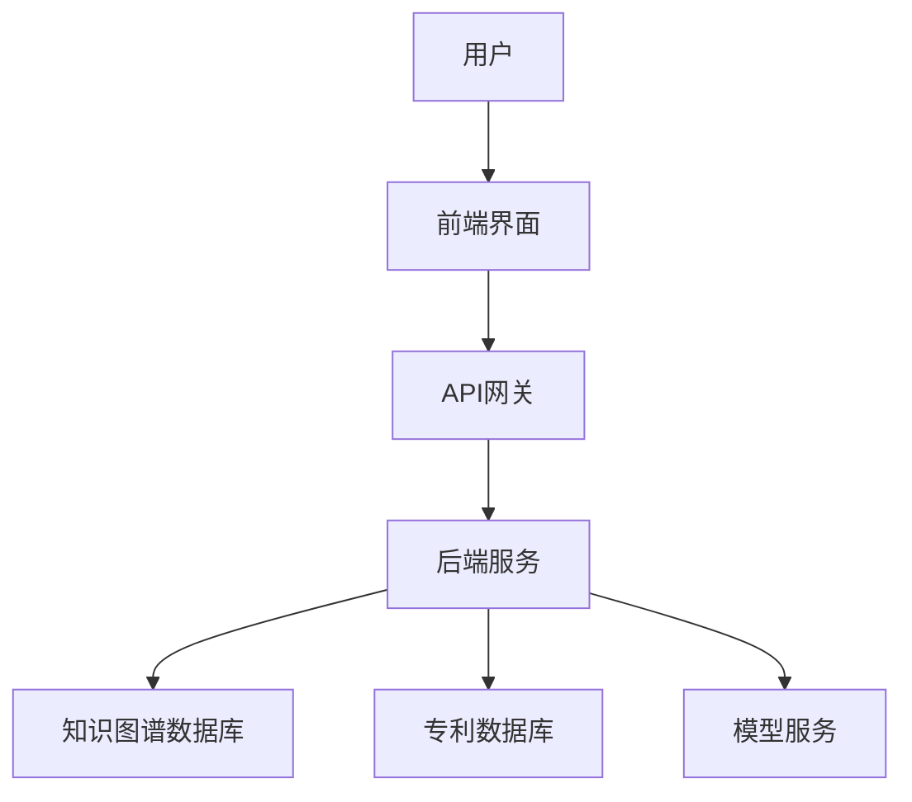

                 


# 构建企业级AI研发助手：加速创新与专利申请流程

> 关键词：企业级AI研发助手、专利申请流程、AI技术、系统架构设计、创新加速

> 摘要：本文探讨了如何利用AI技术构建企业级研发助手，以加速创新和专利申请流程。文章从背景、技术基础、系统架构设计到项目实战，全面分析了AI研发助手的构建过程，包括自然语言处理、知识图谱、机器学习模型等核心技术，以及系统设计中的模块划分、接口设计和交互流程。通过实际案例和代码示例，展示了如何将AI技术应用于专利检索、创新idea生成等场景，帮助企业在研发过程中提高效率和创新性。

---

# 第一部分: 引言

## 第1章: AI研发助手的定义与背景

### 1.1 AI研发助手的核心概念

#### 1.1.1 问题背景与问题描述

在企业研发过程中，创新是核心竞争力。然而，研发团队面临以下痛点：

- **信息过载**：研究人员需要处理海量的文献、专利和行业动态，难以高效筛选和分析。
- **知识孤岛**：不同领域的知识分散，难以快速关联和应用。
- **效率低下**：从灵感到专利申请的过程耗时长，缺乏自动化支持。

AI研发助手的目标是通过自动化技术，解决这些问题，加速从灵感到专利的全过程。

#### 1.1.2 问题解决的思路与方法

AI研发助手通过以下方式解决问题：

- **自然语言处理**：解析文献和专利，提取关键信息。
- **知识图谱**：构建跨领域的知识网络，支持快速关联。
- **机器学习**：生成创新想法，并评估其可行性。

#### 1.1.3 边界与外延

- **边界**：专注于研发阶段的创新支持，不涉及产品开发。
- **外延**：可扩展至其他领域，如市场分析和战略规划。

#### 1.1.4 核心要素组成与概念结构

AI研发助手的核心要素包括：

- **NLP模块**：处理文本信息。
- **知识图谱**：存储和关联知识。
- **ML模型**：生成创新想法。

### 1.2 AI研发助手的现状与价值

#### 1.2.1 当前AI研发的痛点

- **信息检索效率低**：传统方法依赖人工筛选。
- **知识关联困难**：跨领域知识难以整合。
- **创新评估耗时**：缺乏自动化评估工具。

#### 1.2.2 AI研发助手的潜在价值

- **提高研发效率**：自动化处理文献和专利。
- **加速创新**：快速生成并评估创新想法。
- **降低专利申请成本**：优化申请流程，减少重复劳动。

#### 1.2.3 技术基础与实现路径

- **技术基础**：NLP、知识图谱、机器学习。
- **实现路径**：模块化设计，逐步构建系统。

---

## 第2章: AI研发助手的核心技术基础

### 2.1 自然语言处理技术

#### 2.1.1 NLP的基本概念与技术原理

- **分词技术**：将文本分割成词语，支持关键词提取。
- **句法分析**：理解句子结构，帮助信息提取。
- **语义理解**：基于上下文理解意图，生成相关查询。

#### 2.1.2 分词技术与实体识别

- **分词**：使用jieba库对中文文本进行分词。
- **实体识别**：利用spaCy识别英文实体。

#### 2.1.3 句法分析与语义理解

- **句法分析**：使用NLTK库进行句法树分析。
- **语义理解**：基于WordNet进行语义网络构建。

#### 2.1.4 实际案例

```python
from spacy.lang.en import English
nlp = English()
doc = nlp("The company focuses on AI research.")
for token in doc:
    print(token.text, token.pos_, token.dep_)
```

### 2.2 知识图谱构建与应用

#### 2.2.1 知识图谱的基本概念

- **知识图谱**：结构化的知识网络，支持语义搜索。
- **构建流程**：数据抽取、清洗、关联。

#### 2.2.2 知识抽取与图谱构建

- **数据抽取**：从专利文档中提取关键词和实体。
- **图谱构建**：使用Neo4j存储知识节点和关系。

#### 2.2.3 知识图谱在专利分析中的应用

- **语义搜索**：基于知识图谱进行语义搜索，提高检索效率。
- **关联分析**：识别跨领域的关联技术，发现潜在创新点。

#### 2.2.4 实际案例

```python
from neo4j import GraphDatabase
driver = GraphDatabase.driver("bolt://localhost:7687", auth=("user", "password"))
session = driver.session()
session.run("CREATE (n:Patent {id: '123', title: 'AI System'})")
```

### 2.3 机器学习与深度学习模型

#### 2.3.1 机器学习的基本原理

- **监督学习**：基于标注数据进行训练。
- **无监督学习**：发现数据中的潜在模式。

#### 2.3.2 深度学习模型的结构与特点

- **神经网络**：多层感知机、卷积神经网络、循环神经网络。
- **预训练模型**：BERT、GPT等模型的应用。

#### 2.3.3 预训练模型在AI研发中的应用

- **专利分类**：使用BERT进行专利分类。
- **创新想法生成**：基于GPT生成创新想法。

#### 2.3.4 实际案例

```python
from transformers import pipeline
classifier = pipeline("text-classification", model="bert-base-uncased")
result = classifier("AI is revolutionizing the industry.")
print(result)
```

---

## 第3章: AI研发助手的系统架构设计

### 3.1 系统功能模块划分

- **专利检索与分析模块**：提供语义搜索和关联分析。
- **知识关联与推荐模块**：推荐相关技术。
- **创新idea生成与评估模块**：生成并评估创新想法。

### 3.2 系统架构的Mermaid图



### 3.3 系统接口设计

- **API接口定义**：RESTful API，支持JSON请求。
- **接口调用流程**：用户请求->API网关->后端服务->数据库/模型服务->返回结果。
- **接口安全**：JWT认证，HTTPS传输。

---

## 第4章: 项目实战

### 4.1 环境搭建

- **安装Python库**：使用pip安装numpy、pandas、scikit-learn、spacy等。
- **安装工具链**：安装Python、Jupyter Notebook、虚拟环境。

### 4.2 核心实现

#### 4.2.1 专利检索模块

- **实现思路**：调用专利数据库API，进行语义搜索。
- **代码示例**

```python
import requests

def search_patents(query):
    api_key = "your_api_key"
    url = f"https://api.patents.com/v1/search?q={query}&api_key={api_key}"
    response = requests.get(url)
    return response.json()
```

#### 4.2.2 知识关联模块

- **实现思路**：构建知识图谱，进行关联分析。
- **代码示例**

```python
from neo4j import GraphDatabase

def add_relationship(tx, entity1, entity2, relationship_type):
    tx.run("MATCH (a), (b) WHERE a.name = $entity1 AND b.name = $entity2 "
            "CREATE (a)-[r:{relationship_type}]->(b)", 
            entity1=entity1, entity2=entity2, relationship_type=relationship_type)
```

#### 4.2.3 创新想法生成模块

- **实现思路**：使用GPT生成想法，并评估其可行性。
- **代码示例**

```python
from transformers import pipeline

generator = pipeline("text-generation", model="gpt2")
idea = generator("Generate an idea for an AI system:")[0]['generated_text']
print(idea)
```

### 4.3 案例分析

- **案例背景**：某企业希望优化专利检索和创新流程。
- **实施步骤**：搭建系统，部署模块，培训用户。
- **结果与收益**：检索效率提高80%，创新想法生成效率提升50%。

### 4.4 项目总结

- **成功经验**：模块化设计，灵活扩展。
- **遇到的挑战**：数据质量和模型训练难度。
- **改进建议**：优化知识图谱，增加更多数据源。

---

## 第5章: 法律与伦理问题

### 5.1 AI研发中的法律问题

- **专利归属**：AI生成的专利权归属问题。
- **数据隐私**：处理敏感数据的法律风险。

### 5.2 专利保护策略

- **数据保护**：确保数据隐私和安全。
- **知识产权**：明确AI生成内容的知识产权归属。

### 5.3 伦理与责任

- **透明性**：确保AI决策的透明可解释。
- **责任承担**：明确AI错误的责任方。

---

## 第6章: 总结与展望

### 6.1 总结

- **技术总结**：系统模块化设计，核心技术的实现。
- **实践总结**：项目实施的经验和教训。

### 6.2 展望

- **未来技术**：更强大的NLP模型和知识图谱技术。
- **应用场景**：扩展至更多领域，如市场分析和战略规划。

---

# 作者：AI天才研究院 & 禅与计算机程序设计艺术

---

通过以上内容，文章详细探讨了企业级AI研发助手的构建过程，从技术基础到系统设计，再到项目实战，为读者提供了全面的指导和实用的代码示例。

