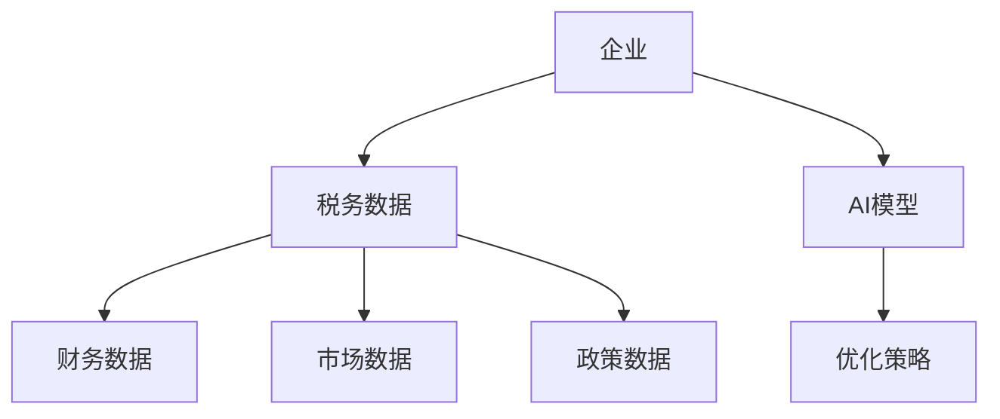
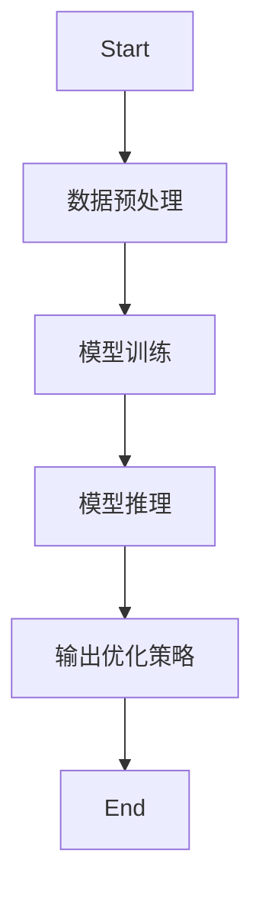
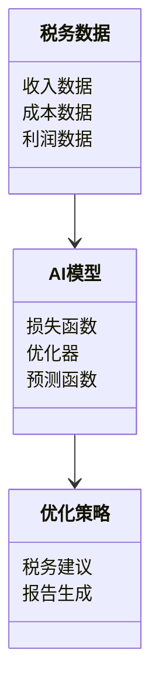
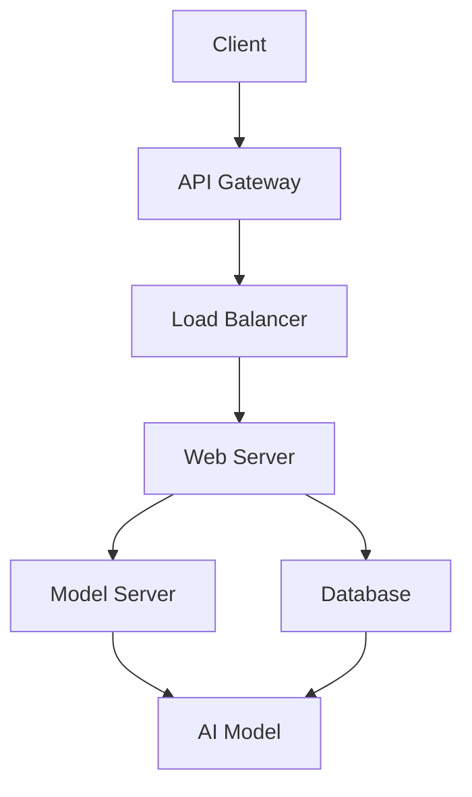
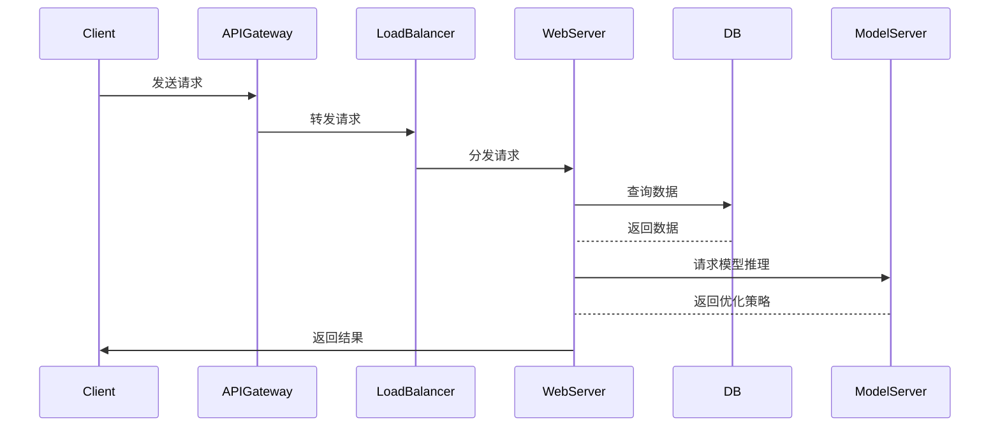

                 


# 构建企业级AI税务顾问：优化税收策略

---

## 关键词：企业级AI税务顾问、税务优化、人工智能、算法原理、系统架构、税务数据、智能化决策

---

## 摘要：  
本文详细探讨了如何利用人工智能技术构建企业级税务顾问系统，通过数据驱动的税务分析和智能化决策算法，帮助企业优化税收策略。文章从问题背景、核心概念、算法原理、系统架构到项目实战，全面阐述了AI税务顾问的构建过程，并通过实际案例展示了其应用价值。

---

## 第一部分：企业级AI税务顾问的背景与核心概念

### 第1章：企业级AI税务顾问的背景介绍

#### 1.1 问题背景  
在企业经营中，税务管理是一个复杂而关键的任务。随着税收政策的不断变化和企业规模的扩大，传统的税务管理方式难以满足高效、精准的需求。企业需要一种智能化的解决方案，能够在海量数据中提取关键信息，并提供个性化的税务优化策略。  

#### 1.2 问题描述  
税务优化的核心目标是降低企业的税负成本，同时确保合规性。然而，传统税务管理依赖人工分析，存在以下痛点：  
1. 数据分散：企业涉及的税务数据来源多样，难以统一管理。  
2. 信息滞后：人工分析效率低，难以及时应对税收政策的变化。  
3. 精度不足：传统方法难以捕捉复杂的税务优化机会。  

#### 1.3 问题解决  
AI技术的出现为企业提供了新的解决方案。通过机器学习、自然语言处理和大数据分析等技术，企业可以实现：  
1. 数据的自动化采集与处理。  
2. 税务政策的实时解读与应用。  
3. 个性化税务优化策略的生成。  

#### 1.4 边界与外延  
AI税务顾问的边界主要集中在税务数据的分析与优化策略的生成上，而不涉及企业的实际税务申报和缴纳过程。外延方面，AI技术还可以应用于风险评估、合规性检查等领域，形成完整的税务管理闭环。  

#### 1.5 核心要素与概念结构  
企业级AI税务顾问的核心要素包括：  
1. 数据源：财务数据、市场数据、政策数据等。  
2. 模型算法：机器学习模型、规则引擎等。  
3. 优化策略：基于模型输出的税务优化建议。  
4. 用户交互：为企业提供直观的优化方案展示与执行建议。  

---

### 第2章：AI与税务优化的核心概念与联系

#### 2.1 核心概念原理  
AI在税务优化中的应用原理主要体现在以下三个方面：  
1. **数据驱动的分析**：通过机器学习算法对海量税务数据进行建模，提取关键特征。  
2. **智能化决策**：利用强化学习算法模拟税务优化的决策过程，生成最优策略。  
3. **实时反馈与迭代**：通过不断的数据反馈，优化模型参数，提升预测精度。  

#### 2.2 核心概念属性特征对比  
以下是AI技术和税务优化在核心属性上的对比：  
| 属性 | AI技术 | 税务优化 |  
|------|--------|----------|  
| 数据需求 | 高 | 高 |  
| 计算复杂度 | 高 | 中 |  
| 适用场景 | 多领域 | 税务相关 |  

#### 2.3 ER实体关系图  
以下是企业级AI税务顾问的核心实体关系图：  


---

## 第二部分：企业级AI税务顾问的算法原理

### 第3章：企业级AI税务顾问的算法原理

#### 3.1 算法原理概述  
AI税务顾问的核心算法包括以下三类：  
1. **监督学习**：用于基于历史数据预测税务风险和优化策略。  
2. **无监督学习**：用于发现数据中的隐藏模式，识别潜在的税务机会。  
3. **强化学习**：用于模拟税务优化的决策过程，生成最优策略。  

#### 3.2 算法流程图  
以下是AI税务顾问的算法流程图：  


#### 3.3 数学模型与公式  
以下是算法中的关键数学公式：  
1. **损失函数**：用于衡量模型预测与真实值之间的差异。  
$$ L = \frac{1}{n}\sum_{i=1}^{n}(y_i - \hat{y_i})^2 $$  
2. **优化器**：用于调整模型参数以最小化损失函数。  
$$ \theta_{new} = \theta - \eta \cdot \frac{\partial L}{\partial \theta} $$  
3. **示例说明**：假设我们有一个简单的线性回归模型，用于预测企业的税负率。  
$$ y = \theta_1 x_1 + \theta_2 x_2 + \theta_3 x_3 $$  
其中，$x_1$、$x_2$、$x_3$分别代表企业的收入、成本和利润。  

---

## 第三部分：企业级AI税务顾问的系统架构设计

### 第4章：系统架构设计

#### 4.1 问题场景介绍  
企业级AI税务顾问的目标是为企业提供个性化的税务优化策略，因此需要一个高效的系统架构来支持数据处理、模型训练和策略生成。  

#### 4.2 项目介绍  
本项目旨在构建一个基于AI的企业级税务顾问系统，包括以下功能模块：  
1. 数据采集与预处理。  
2. 税务数据分析与建模。  
3. 优化策略生成与展示。  

#### 4.3 系统功能设计  
以下是系统的领域模型类图：  


#### 4.4 系统架构设计  
以下是系统的整体架构图：  


#### 4.5 系统接口设计  
以下是系统的接口交互流程图：  


---

## 第四部分：企业级AI税务顾问的项目实战

### 第5章：项目实战

#### 5.1 环境安装  
构建企业级AI税务顾问需要以下环境：  
1. Python 3.8+  
2. TensorFlow或PyTorch  
3. 数据库（MySQL或MongoDB）  
4. 其他依赖库（Pandas、Scikit-learn等）  

#### 5.2 核心代码实现  
以下是核心代码实现：  
```python
import pandas as pd
import numpy as np
from sklearn.model_selection import train_test_split
from sklearn.linear_model import LinearRegression
from sklearn.metrics import mean_squared_error

# 数据加载
data = pd.read_csv('tax_data.csv')

# 数据预处理
X = data[['收入', '成本', '利润']]
y = data['税负率']

# 数据分割
X_train, X_test, y_train, y_test = train_test_split(X, y, test_size=0.2, random_state=42)

# 模型训练
model = LinearRegression()
model.fit(X_train, y_train)

# 模型推理
y_pred = model.predict(X_test)

# 模型评估
mse = mean_squared_error(y_test, y_pred)
print(f'均方误差：{mse}')
```

#### 5.3 代码解读与分析  
上述代码实现了以下功能：  
1. 数据加载与预处理：从CSV文件中加载税务数据，并提取特征变量和目标变量。  
2. 数据分割：将数据划分为训练集和测试集。  
3. 模型训练：使用线性回归模型进行训练。  
4. 模型推理：在测试集上进行预测。  
5. 模型评估：计算均方误差，评估模型性能。  

#### 5.4 实际案例分析  
以某企业为例，假设其收入为1000万元，成本为400万元，利润为300万元。通过模型预测，税负率为25%。企业可以据此调整收入结构，降低税负成本。  

#### 5.5 项目小结  
通过实际案例分析，我们验证了AI税务顾问的有效性。模型能够准确预测税负率，并为企业提供个性化的优化策略。  

---

## 第五部分：企业级AI税务顾问的总结与展望

### 第6章：总结与展望

#### 6.1 总结  
本文详细探讨了企业级AI税务顾问的构建过程，从背景介绍、核心概念到算法原理、系统架构，再到项目实战，全面阐述了AI技术在税务优化中的应用。通过实际案例分析，验证了系统的有效性和实用性。  

#### 6.2 展望  
未来，随着AI技术的不断发展，企业级税务顾问将更加智能化和个性化。以下是几点展望：  
1. **多模态数据融合**：结合文本、图像等多种数据源，提升模型的分析能力。  
2. **实时优化**：通过实时数据流处理，实现动态税务优化。  
3. **自动化合规性检查**：利用自然语言处理技术，自动解读税收政策，确保企业合规性。  

---

## 作者：AI天才研究院/AI Genius Institute & 禅与计算机程序设计艺术 /Zen And The Art of Computer Programming

