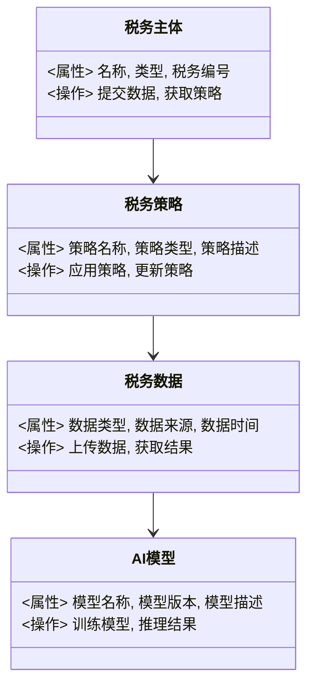
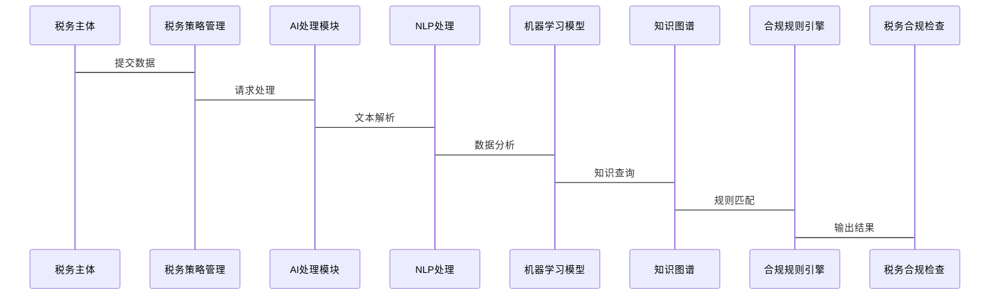

                 


# 构建企业级AI税务顾问：优化税收策略与合规

> 关键词：企业级AI税务顾问, 税务优化, 合规策略, AI技术, 机器学习, 自然语言处理, 知识图谱

> 摘要：本文将详细介绍如何构建一个企业级AI税务顾问系统，通过优化税收策略和确保合规性，帮助企业在复杂多变的税务环境中实现高效的税务管理。文章将从背景介绍、核心概念、算法原理、系统架构到项目实战进行全面解析，结合实际案例和最佳实践，为企业提供切实可行的解决方案。

---

## 第1章: AI税务顾问的背景与问题背景

### 1.1 AI税务顾问的背景介绍

#### 1.1.1 税务优化与合规的背景

随着全球化和数字化的深入发展，企业的税务管理面临着日益复杂的挑战。企业需要在遵守法律法规的前提下，最大限度地优化税收策略，降低税负成本。然而，传统的人工税务管理方式效率低下，容易出错，且难以应对多样化的税务场景。AI技术的引入为企业提供了新的解决方案。

#### 1.1.2 企业税务管理的痛点与挑战

企业在税务管理中通常面临以下痛点：
- 税务法规复杂多变，难以及时更新和适应。
- 税务数据分散，缺乏统一的管理平台。
- 税务计算和申报需要大量人工操作，容易出错。
- 缺乏智能化的税务策略优化工具。

#### 1.1.3 AI技术在税务领域的应用潜力

AI技术可以通过以下方式提升税务管理：
- 自然语言处理（NLP）技术可以用于解析复杂的税务法规和文档。
- 机器学习算法可以用于预测税务风险和优化税收策略。
- 知识图谱技术可以构建税务知识库，支持智能查询和决策。

### 1.2 问题背景与问题描述

#### 1.2.1 传统税务管理的局限性

传统税务管理依赖人工操作，效率低、成本高，且容易出现错误。此外，不同地区的税务法规差异大，人工管理难以覆盖所有场景。

#### 1.2.2 税务合规与优化的复杂性

税务合规涉及多个维度，包括税率计算、税务申报、税务风险评估等。优化税收策略需要综合考虑多种因素，例如选择最优的税务结构、避免税务风险等。

#### 1.2.3 企业税务顾问的需求与痛点

企业需要专业的税务顾问来制定和实施税务策略，但传统的人工顾问方式成本高、效率低，难以满足企业的需求。

### 1.3 问题解决与边界

#### 1.3.1 AI税务顾问的核心目标

AI税务顾问的核心目标是通过智能化技术，帮助企业实现税务合规与优化，降低税负成本，提高税务管理效率。

#### 1.3.2 解决方案的边界与外延

AI税务顾问的解决方案主要聚焦于税务优化和合规策略的制定，不涉及企业的其他业务领域。同时，解决方案需要与企业的财务系统、税务申报系统等外部系统进行集成。

#### 1.3.3 核心要素与组成结构

AI税务顾问的核心要素包括：
- 数据采集与处理模块
- 税务知识库
- AI算法模型
- 税务策略优化模块
- 税务合规检查模块

---

## 第2章: 核心概念与联系

### 2.1 核心概念原理

#### 2.1.1 税务优化的核心原理

税务优化的核心在于通过分析企业的财务数据，识别潜在的税务节省机会，例如通过合理分配收入和成本，选择最优的税务结构等。

#### 2.1.2 合规策略的实现机制

合规策略的实现需要确保企业的税务行为符合相关法律法规。通过建立税务知识库和规则引擎，AI系统可以自动识别合规风险，并提出改进建议。

#### 2.1.3 AI技术在税务中的应用原理

AI技术通过自然语言处理、机器学习等技术，将复杂的税务法规转化为可执行的规则，并结合企业的实际情况，制定个性化的税务策略。

### 2.2 核心概念属性对比

以下表格对比了税务优化与合规策略的核心属性：

| 属性 | 税务优化 | 合规策略 |
|------|---------|----------|
| 目标 | 最小化税负成本 | 确保税务行为合法合规 |
| 方法 | 数据分析、机器学习 | 规则引擎、知识库查询 |
| 输入 | 企业财务数据 | 税务法规、企业数据 |
| 输出 | 优化建议 | 合规检查结果 |

### 2.3 ER实体关系图

以下是税务主体、税务策略、税务数据和AI模型的实体关系图：

```mermaid
er
  entity 税务主体 {
    key: 实体ID
    属性: 名称, 类型, 税务编号
  }
  entity 税务策略 {
    key: 策略ID
    属性: 策略名称, 策略类型, 策略描述
  }
  entity 税务数据 {
    key: 数据ID
    属性: 数据类型, 数据来源, 数据时间
  }
  entity AI模型 {
    key: 模型ID
    属性: 模型名称, 模型版本, 模型描述
  }
  税务主体 -[拥有]-> 税务策略
  税务策略 -[适用]-> 税务数据
  税务数据 -[输入]-> AI模型
```

---

## 第3章: 技术基础与算法原理

### 3.1 自然语言处理（NLP）技术

#### 3.1.1 NLP在税务文档处理中的应用

NLP技术可以用于解析税务法规文档、财务报表等文本数据，提取关键信息。

#### 3.1.2 常见的NLP算法与模型

常用的NLP算法包括分词（Tokenization）、实体识别（NER）、文本分类（Text Classification）等。

#### 3.1.3 NLP在税务咨询中的具体实现

例如，使用BERT模型对税务法规进行语义分析，提取关键条款。

### 3.2 机器学习与深度学习

#### 3.2.1 机器学习在税务预测中的应用

机器学习可以用于预测税务风险、识别税务异常等。

#### 3.2.2 深度学习模型在税务分类中的应用

例如，使用LSTM模型对税务文档进行分类。

#### 3.2.3 算法选择与优化策略

根据具体场景选择合适的算法，并通过交叉验证进行模型优化。

### 3.3 知识图谱与规则引擎

#### 3.3.1 税务知识图谱的构建

构建税务知识图谱，包括税务法规、税率、优惠政策等。

#### 3.3.2 规则引擎在税务合规中的应用

规则引擎可以根据企业的财务数据，自动判断是否符合税务法规。

---

## 第4章: 系统架构设计

### 4.1 系统功能设计

#### 4.1.1 领域模型设计

以下是领域模型的类图：



#### 4.1.2 系统架构设计

以下是系统架构图：

```mermaid
container 税务主体 {
  component 税务数据采集
  component 税务策略管理
}
container AI处理模块 {
  component NLP处理
  component 机器学习模型
  component 知识图谱
}
container 税务合规检查 {
  component 合规规则引擎
  component 合规结果输出
}
```

#### 4.1.3 系统接口设计

以下是系统接口设计图：



---

## 第5章: 项目实战

### 5.1 环境搭建

#### 5.1.1 安装Python环境

使用Anaconda或virtualenv创建虚拟环境，并安装所需的Python包，例如numpy、pandas、scikit-learn等。

### 5.2 系统核心实现

#### 5.2.1 数据预处理代码

```python
import pandas as pd
import numpy as np

def preprocess_data(data):
    # 假设data是Pandas DataFrame
    # 去除缺失值
    data.dropna(inplace=True)
    # 标准化处理
    data = (data - data.mean()) / data.std()
    return data
```

#### 5.2.2 AI模型训练代码

```python
from sklearn.model

