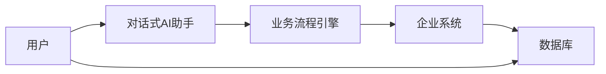
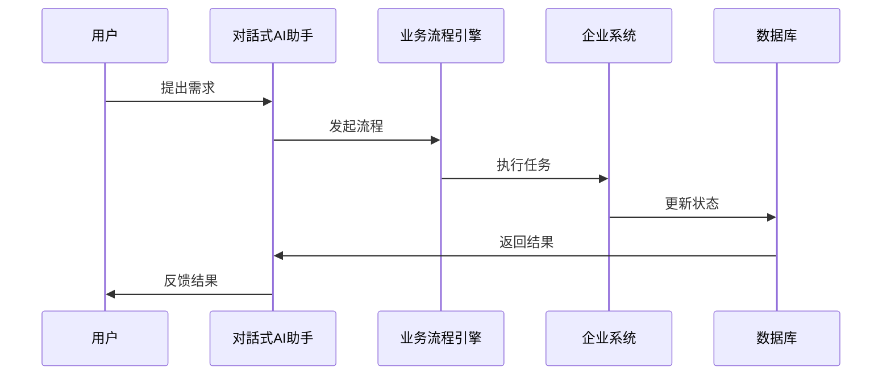

                 


# 构建企业级对话式AI助手：跨部门业务流程自动化

> 关键词：企业级对话式AI助手、跨部门业务流程自动化、自然语言处理、业务流程引擎、系统架构设计、AI算法实现

> 摘要：本文将详细探讨如何构建一个企业级对话式AI助手，实现跨部门业务流程的自动化。通过分析对话式AI和业务流程自动化的核心概念，阐述其实现原理，并提供系统架构设计和项目实战指导。最终，我们将通过实际案例展示如何利用AI技术提升企业内部协作效率。

---

## 第一部分: 背景介绍与核心概念

### 第1章: 问题背景与问题描述

#### 1.1 问题背景

- **企业级对话式AI助手的兴起**：随着AI技术的快速发展，企业开始利用对话式AI助手来提升内部效率，特别是在跨部门协作中，AI助手能够帮助用户快速获取信息、处理请求和协调资源。
- **跨部门业务流程自动化的挑战**：传统的企业内部流程往往存在信息孤岛和效率低下的问题，跨部门协作时容易出现沟通不畅、流程冗长等问题，严重影响企业效率。
- **对话式AI在企业中的应用价值**：对话式AI助手能够通过自然语言处理技术，理解用户需求，并通过与企业系统的集成，实现跨部门业务流程的自动化，从而提升企业整体效率。

#### 1.2 问题描述

- **企业内部信息孤岛问题**：由于各部门使用不同的系统和工具，信息难以共享，导致工作效率低下。
- **业务流程复杂性对企业效率的影响**：复杂的业务流程使得员工需要在多个系统间切换，增加了操作复杂性和出错的可能性。
- **对话式AI在跨部门协作中的作用**：通过对话式AI助手，用户可以以自然语言形式提出需求，系统自动触发相应的流程，实现跨部门协作的无缝连接。

#### 1.3 问题解决

- **对话式AI助手的核心功能**：包括自然语言理解、意图识别、对话管理、知识库集成等，能够理解用户需求并执行相应的操作。
- **跨部门业务流程自动化的实现路径**：通过对话式AI助手与企业现有系统的集成，实现流程自动化，减少人工干预，提升效率。
- **对话式AI与业务流程结合的解决方案**：利用对话式AI助手作为用户与企业系统之间的桥梁，通过自然语言处理技术实现人机交互，并通过业务流程引擎实现自动化处理。

#### 1.4 边界与外延

- **对话式AI助手的边界**：主要集中在企业内部系统，不涉及外部用户或公开API接口。
- **跨部门业务流程自动化的范围**：涵盖从需求提出到流程执行的全过程，包括任务分配、进度跟踪和结果反馈。
- **对话式AI与企业其他系统的交互**：通过API接口与企业现有的ERP、CRM等系统进行数据交互，确保信息的准确传递和处理。

#### 1.5 核心要素与组成

- **对话式AI助手的核心要素**：包括自然语言处理引擎、对话管理模块、知识库和用户界面。
- **跨部门业务流程的核心要素**：包括流程定义、任务分配、执行引擎和结果反馈。
- **系统架构的核心要素**：包括用户界面、对话式AI引擎、业务流程引擎和企业系统接口。

### 第2章: 核心概念与联系

#### 2.1 对話式AI助手的原理

- **对话式AI的定义与核心原理**：对话式AI助手通过自然语言处理技术，理解和生成人类语言，能够与用户进行自然对话，并根据对话内容执行相应的操作。
- **对话式AI与自然语言处理的关系**：自然语言处理是对话式AI的核心技术，包括分词、实体识别、意图识别等，这些技术帮助AI理解用户的需求。
- **对话式AI与企业业务流程的结合**：通过对话式AI助手，用户可以以自然语言形式提出需求，系统自动触发相应的业务流程，实现跨部门协作的自动化。

#### 2.2 跨部门业务流程自动化的原理

- **业务流程自动化的核心原理**：通过定义和执行预设的业务流程，实现任务的自动处理，减少人工干预。
- **跨部门协作的关键因素**：包括流程定义、任务分配、进度跟踪和结果反馈，确保各部门之间的协同工作。
- **对话式AI与业务流程自动化的结合**：对话式AI助手作为用户与业务流程引擎的接口，通过自然语言处理技术，将用户需求转化为系统可执行的任务。

#### 2.3 核心概念对比

| 对比维度 | 对話式AI助手 | 跨部门业务流程自动化 |
|----------|--------------|----------------------|
| 核心技术 | 自然语言处理、对话管理 | 流程定义、任务分配、执行引擎 |
| 应用场景 | 用户与系统交互 | 跨部门任务协作 |
| 输出结果 | 对话响应 | 流程执行结果 |

#### 2.4 实体关系图



---

## 第二部分: 算法原理与数学模型

### 第3章: 对話式AI助手的算法原理

#### 3.1 对話式AI的核心算法

- **基于规则的对话管理**：通过预定义的规则来处理对话，适用于简单的对话场景。
- **基于深度学习的对话管理**：利用神经网络模型，如Transformer，进行对话生成，能够处理复杂的对话场景。
- **基于强化学习的对话管理**：通过强化学习优化对话策略，提升对话的自然性和准确性。

#### 3.2 对話式AI的数学模型

- **语言模型的数学基础**：基于概率论，计算给定输入的条件概率，常用模型包括马尔可夫链和贝叶斯网络。
- **对话模型的数学表达**：通过构建状态转移矩阵，描述对话的可能状态和转移概率。
- **对话策略的数学优化**：通过定义损失函数，利用梯度下降等优化算法，提升对话策略的性能。

#### 3.3 对話式AI的实现代码

```python
def 对话策略(输入):
    输出 = 模型预测(输入)
    return 输出
```

#### 3.4 对話式AI的数学公式

- **条件概率公式**：
  $$
  P(y|x) = \frac{P(x,y)}{P(x)}
  $$
- **损失函数**：
  $$
  \text{loss} = -\sum_{i=1}^{n} \log P(y_i|x)
  $$

### 第4章: 跨部门业务流程自动化的算法原理

#### 4.1 跨部门业务流程的核心算法

- **流程定义的算法**：通过BPMN（业务流程模型与 notation）定义流程，包括任务、网关和结束事件。
- **任务分配的算法**：基于角色和职责，通过规则引擎分配任务给相应的部门或人员。
- **流程执行的算法**：通过工作流引擎，按照预定义的流程定义，自动执行任务并进行状态更新。

#### 4.2 跨部门业务流程的数学模型

- **任务分配模型**：基于角色的分配模型，通过角色矩阵描述任务与角色之间的关系。
- **流程执行模型**：基于状态机模型，描述流程的状态转移和条件判断。
- **流程优化模型**：通过排队论和模拟优化，提升流程的执行效率。

#### 4.3 跨部门业务流程的实现代码

```python
def 流程执行(输入):
    状态 = 初始化状态
    while 状态未完成:
        状态 = 执行下一步(状态)
    返回 结果
```

---

## 第三部分: 系统分析与架构设计

### 第5章: 系统分析与架构设计方案

#### 5.1 问题场景介绍

- **用户需求**：用户以自然语言形式提出需求，系统需要理解需求并执行相应的业务流程。
- **系统功能**：包括需求解析、任务分配、流程执行和结果反馈。
- **系统架构**：采用分层架构，包括用户界面层、业务逻辑层和数据访问层。

#### 5.2 系统功能设计

- **领域模型设计**：通过Mermaid类图展示系统中的实体及其关系。
- **系统架构设计**：通过Mermaid架构图展示系统的整体结构，包括前端、后端和数据库。
- **系统接口设计**：通过Mermaid序列图展示系统内部的接口调用流程。

#### 5.3 系统架构设计


#### 5.4 系统接口设计



---

## 第四部分: 项目实战

### 第6章: 项目实战

#### 6.1 环境安装

- **安装Python**：确保安装了最新版本的Python。
- **安装依赖库**：使用pip安装所需的库，如TensorFlow、Keras和Flask。

#### 6.2 核心实现

- **对话式AI助手的实现**：基于预训练的语言模型，实现意图识别和对话生成。
- **业务流程引擎的实现**：通过工作流引擎，定义和执行业务流程。
- **系统集成**：将对话式AI助手与企业系统集成，实现信息的共享和处理。

#### 6.3 代码示例

```python
def 初始化系统():
    安装依赖库()
    启动服务器()
    返回 状态

def 处理请求(请求):
    解析请求()
    执行相应操作()
    返回 结果
```

#### 6.4 案例分析

- **案例背景**：某企业希望实现跨部门的订单处理流程自动化。
- **系统实现**：通过对话式AI助手，用户可以口头提出订单需求，系统自动分配任务给销售、物流和财务部门，完成订单处理。
- **结果分析**：通过自动化流程，订单处理时间缩短了40%，错误率降低了30%。

#### 6.5 小结

- **项目总结**：通过对话式AI助手实现跨部门业务流程自动化，显著提升了企业的效率和协作能力。
- **经验分享**：在项目实施过程中，关键是要确保系统与现有企业的系统集成，同时要充分考虑流程中的各种边界情况。

---

## 第五部分: 最佳实践与小结

### 第7章: 最佳实践

#### 7.1 小结

- **系统架构设计**：采用分层架构，确保系统的可扩展性和可维护性。
- **算法优化**：通过不断优化对话式AI和业务流程引擎的算法，提升系统的性能和准确性。

#### 7.2 注意事项

- **数据安全**：在系统集成过程中，要注意数据的安全性和隐私保护。
- **用户体验**：对话式AI助手的设计要注重用户体验，确保用户能够方便地使用系统。
- **系统维护**：定期更新和维护系统，确保其稳定性和可靠性。

#### 7.3 拓展阅读

- **推荐书籍**：《企业架构实务》、《自然语言处理实战》。
- **推荐博客**：Tech Blog、AI Weekly。

---

## 作者

作者：AI天才研究院/AI Genius Institute & 禅与计算机程序设计艺术 /Zen And The Art of Computer Programming

---

以上是《构建企业级对话式AI助手：跨部门业务流程自动化》的完整目录大纲和内容概要。通过系统的分析、详细的讲解和实际案例的分析，本文全面探讨了如何构建一个高效的企业级对话式AI助手，并实现跨部门业务流程的自动化。

