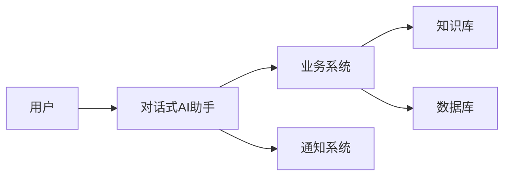

                 

# 构建企业级对话式AI助手：跨部门业务流程自动化与协同

---

## 关键词：
- 企业级对话式AI助手
- 跨部门业务流程
- 自动化与协同
- 对話流模型
- NLP技术
- 知识库检索
- 系统架构设计

---

## 摘要：
本文系统地探讨了构建企业级对话式AI助手的核心技术与方法，重点分析了跨部门业务流程自动化与协同的关键挑战与解决方案。通过结合自然语言处理（NLP）、对话流模型和知识库检索等技术，本文详细阐述了如何实现高效的业务流程自动化，并通过系统架构设计、算法原理和项目实战，展示了如何在企业环境中构建一个高效、可靠的对话式AI助手。

---

# 第一部分: 企业级对话式AI助手的背景与核心概念

## 第1章: 问题背景与描述

### 1.1 问题背景

#### 1.1.1 传统企业业务流程的痛点
- **低效性**：传统业务流程依赖人工操作，效率低，容易出错。
- **孤岛化**：跨部门协作困难，信息传递不畅，导致重复劳动。
- **不灵活**：业务流程难以快速响应变化，适应性差。
- **用户体验差**：用户在与企业交互时，常常需要与多个系统打交道，体验不佳。

#### 1.1.2 对話式AI助手的出现与需求
- AI助手的出现为企业提供了一种高效、智能的交互方式。
- 用户可以通过自然语言与企业系统交互，提升体验。
- 跨部门协作可以通过AI助手实现信息共享和流程自动化。

#### 1.1.3 跨部门协同的挑战与机遇
- **挑战**：跨部门协同需要统一的接口和标准，数据孤岛问题突出。
- **机遇**：通过AI助手实现跨部门的自动化协同，提升企业效率。

### 1.2 问题描述

#### 1.2.1 业务流程自动化的核心问题
- 如何将复杂的业务流程转化为可自动化的规则。
- 如何确保自动化流程的准确性和稳定性。

#### 1.2.2 对話式AI助手的功能需求
- 多轮对话能力。
- 意图识别与知识库检索。
- 跨部门协作能力。

#### 1.2.3 跨部门协同的复杂性与解决方案
- 复杂性：不同部门的业务逻辑差异大。
- 解决方案：通过统一的AI助手平台实现跨部门协同。

---

## 第2章: 核心概念与联系

### 2.1 对話式AI助手的工作原理

#### 2.1.1 自然语言处理（NLP）基础
- 语言理解（NLU）：将自然语言转化为计算机可处理的结构。
- 语言生成（NLG）：将计算机处理的结果转化为自然语言。

#### 2.1.2 对話流模型
- 基于规则的对话流：通过预定义的规则控制对话流程。
- 基于机器学习的对话流：通过模型学习对话模式。
- 混合模型：结合规则和机器学习的优势。

#### 2.1.3 知识库与意图识别
- 知识库：存储业务相关的知识和数据。
- 意图识别：通过分析用户输入，确定用户的意图。

### 2.2 核心概念对比分析

#### 2.2.1 对話式AI与传统IVR的对比
| 对比维度 | 对話式AI助手 | 传统IVR |
|----------|--------------|----------|
| 智能性   | 高            | 低        |
| 可扩展性 | 高            | 低        |
| 用户体验 | 好            | 差        |

#### 2.2.2 跨部门协同与单部门流程的对比
| 对比维度       | 跨部门协同 | 单部门流程 |
|----------------|------------|------------|
| 复杂性         | 高          | 低          |
| 协调性         | 高          | 低          |
| 信息共享       | 高          | 低          |

#### 2.2.3 业务流程自动化与半自动化对比
| 对比维度       | 全自动化   | 半自动化   |
|----------------|------------|------------|
| 稳定性         | 高          | 中          |
| 适应性         | 高          | 中          |
| 人工干预       | 无          | 有          |

### 2.3 实体关系图

---

## 总结与小结

通过以上分析，我们可以看到，构建企业级对话式AI助手需要结合NLP技术、对话流模型和知识库检索等多方面的知识。同时，跨部门业务流程的自动化与协同需要通过统一的平台和标准化的接口来实现。在后续章节中，我们将深入探讨这些技术的核心算法与系统架构设计。

---

接下来的章节将详细介绍算法原理、系统架构设计和项目实战等内容，帮助读者全面掌握构建企业级对话式AI助手的方法与实践。

