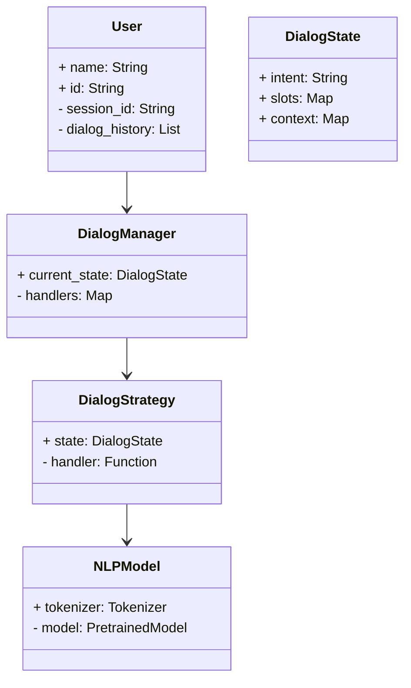
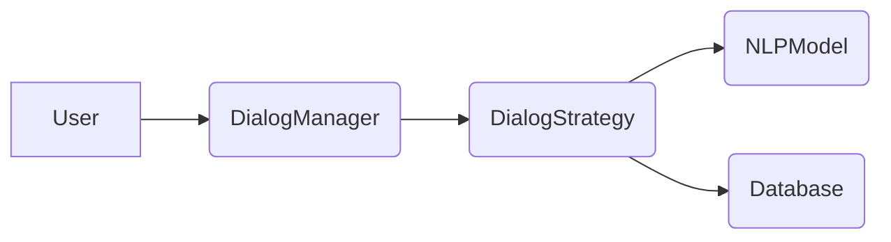
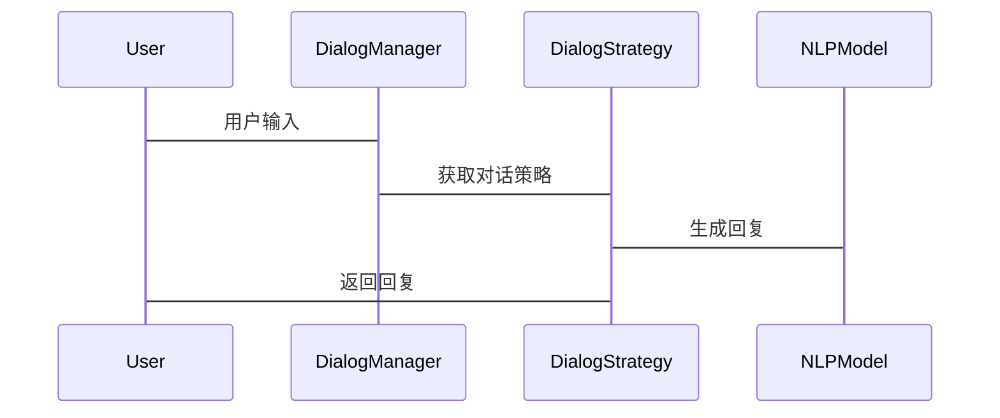

                 


# 构建企业级对话系统：上下文感知与多轮交互管理

## 关键词
- 对话系统
- 上下文感知
- 多轮交互
- 自然语言处理
- 对话状态跟踪
- 系统架构设计

## 摘要
在当今快速发展的数字化时代，企业级对话系统的需求日益增长。这些系统需要具备上下文感知能力和高效的多轮交互管理能力，以提供个性化的用户体验。本文将深入探讨构建企业级对话系统的各个方面，从核心概念到算法原理，再到系统架构设计，最后通过实际案例展示如何在实践中应用这些理论。通过本文，读者将能够全面理解并掌握构建高效、智能的企业级对话系统的方法。

---

# 第1章: 对话系统的概述

## 1.1 对话系统的定义与核心要素
### 1.1.1 对话系统的定义
对话系统是一种能够理解和生成自然语言的计算机系统，它通过多轮交互帮助用户完成特定任务或提供信息。企业级对话系统特别关注在复杂场景下提供高效、准确的服务。

### 1.1.2 对话系统的核心要素
- **自然语言处理（NLP）**：理解和生成人类语言的能力。
- **对话状态跟踪（DST）**：维护当前对话的状态，包括用户意图、上下文信息等。
- **对话策略**：决定如何生成合适的回复以引导对话走向目标。
- **上下文管理**：理解和管理对话中的上下文信息，以提供连贯的交互体验。

### 1.1.3 上下文感知与多轮交互的定义
- **上下文感知**：系统能够理解当前对话的上下文信息，并根据这些信息生成合适的回复。
- **多轮交互**：用户与系统之间进行多轮对话，每一轮对话都基于前一轮的信息进行。

## 1.2 企业级对话系统的背景与需求
### 1.2.1 企业级对话系统的应用场景
- 客户服务：解答用户问题，处理订单。
- 电子商务：推荐产品，辅助购买决策。
- 健康咨询：提供医疗建议，预约医生。
- 教育培训：提供学习指导，解答疑问。

### 1.2.2 多轮交互的重要性
- 提供更自然的用户体验。
- 处理复杂任务，如预约、订单处理等。
- 需要上下文信息来准确理解用户意图。

### 1.2.3 上下文感知的必要性
- 理解用户意图需要上下文信息。
- 提供连贯的对话体验。
- 处理复杂场景，如对话中断后恢复。

## 1.3 对话系统的核心目标
### 1.3.1 提供高效的交互体验
- 快速响应用户请求。
- 准确理解用户意图。

### 1.3.2 实现精准的意图识别
- 通过上下文感知准确识别用户意图。
- 处理歧义和模糊表达。

### 1.3.3 管理复杂的上下文信息
- 维护对话状态。
- 管理上下文信息，确保连贯性。

---

# 第2章: 对话系统的构成与核心概念

## 2.1 对话状态与上下文的关系
### 2.1.1 对话状态的定义
对话状态是指当前对话的进展情况，包括用户的意图、已输入的信息等。

### 2.1.2 上下文的定义与作用
上下文是指在对话中所有相关的信息和背景知识，用于帮助系统理解当前对话的语境。

### 2.1.3 对话状态与上下文的关系
- 对话状态依赖于上下文信息。
- 上下文信息影响对话状态的更新。

## 2.2 对话策略与交互逻辑
### 2.2.1 对话策略的定义
对话策略是指系统在对话过程中选择下一步行动的规则。

### 2.2.2 交互逻辑的核心要素
- 用户意图识别。
- 系统回复生成。
- 对话状态更新。

### 2.2.3 对话策略与交互逻辑的关联
- 对话策略指导交互逻辑的执行。
- 交互逻辑实现对话策略的目标。

## 2.3 对话系统的实体与关系
### 2.3.1 实体识别与提取
- 实体识别：从文本中提取关键实体。
- 实体提取：将实体从文本中抽取出来。

### 2.3.2 实体关系的建立
- 实体关系：描述实体之间的关联。
- 关系抽取：从文本中提取实体之间的关系。

### 2.3.3 实体关系在对话系统中的应用
- 理解用户意图。
- 管理上下文信息。
- 生成合适的回复。

---

# 第3章: 对话系统的算法原理

## 3.1 自然语言处理模型
### 3.1.1 基于规则的对话系统
- 基于规则的系统：通过预定义的规则来生成回复。
- 优点：简单易懂，适合特定场景。
- 缺点：难以处理复杂场景。

### 3.1.2 基于统计的对话系统
- 基于统计的系统：通过统计学习方法生成回复。
- 优点：能够处理复杂场景。
- 缺点：需要大量数据支持。

### 3.1.3 基于深度学习的对话系统
- 基于深度学习的系统：使用神经网络模型生成回复。
- 优点：能够学习复杂的语言模式。
- 缺点：需要大量数据和计算资源。

## 3.2 对话状态跟踪算法
### 3.2.1 基于马尔可夫链的状态跟踪
- 马尔可夫链：一种概率模型，用于预测下一个状态。
- 优点：简单易懂。
- 缺点：难以处理复杂的上下文信息。

### 3.2.2 基于注意力机制的状态跟踪
- 注意力机制：用于关注重要的上下文信息。
- 优点：能够处理长序列数据。
- 缺点：计算复杂度较高。

### 3.2.3 基于序列到序列模型的状态跟踪
- 序列到序列模型：用于将输入序列映射为输出序列。
- 优点：能够生成多样化的回复。
- 缺点：需要大量的训练数据。

## 3.3 对话生成算法
### 3.3.1 基于模板的对话生成
- 基于模板的系统：通过预定义的模板生成回复。
- 优点：简单易懂，适合特定场景。
- 缺点：缺乏灵活性。

### 3.3.2 基于生成对抗网络的对话生成
- 生成对抗网络：由生成器和判别器组成，用于生成逼真的回复。
- 优点：能够生成多样化的回复。
- 缺点：需要大量的训练数据。

### 3.3.3 基于预训练语言模型的对话生成
- 预训练语言模型：如GPT系列，用于生成自然的对话回复。
- 优点：生成能力强，能够处理复杂场景。
- 缺点：计算资源消耗大。

---

# 第4章: 对话系统的数学模型与公式

## 4.1 自然语言处理的核心公式
### 4.1.1 语言模型的交叉熵
$$ H_{\text{cross}} = -\frac{1}{N} \sum_{i=1}^{N} \sum_{t=1}^{T} \log p(x_t) $$
其中，$N$ 是句子数量，$T$ 是句子长度，$p(x_t)$ 是第 $t$ 个词的概率。

## 4.2 对话状态跟踪的核心公式
### 4.2.1 基于马尔可夫链的状态跟踪
$$ P(s_t | s_{t-1}) $$
其中，$s_t$ 是当前状态，$s_{t-1}$ 是前一个状态。

### 4.2.2 基于注意力机制的状态跟踪
$$ \alpha_t = \text{softmax}(W_a s_{t}^{\top} s_{t-1}) $$
其中，$\alpha_t$ 是注意力权重，$W_a$ 是注意力权重矩阵。

## 4.3 对话生成的核心公式
### 4.3.1 基于序列到序列模型的生成
$$ P(y_t | y_{<t}, x) $$
其中，$y_t$ 是生成的词，$y_{<t}$ 是之前生成的词，$x$ 是输入序列。

---

# 第5章: 对话系统的系统架构设计

## 5.1 系统架构概述
### 5.1.1 系统的基本架构
- 前端：负责用户交互。
- 后端：负责处理对话逻辑和生成回复。
- 数据库：存储对话历史和上下文信息。

### 5.1.2 领域模型类图


### 5.1.3 系统架构图


## 5.2 接口与交互设计
### 5.2.1 系统接口设计
- 用户输入接口：接收用户的输入。
- 系统输出接口：生成回复并返回给用户。

### 5.2.2 交互流程设计


---

# 第6章: 项目实战——构建企业级对话系统

## 6.1 项目背景与需求分析
### 6.1.1 项目背景
- 构建一个能够处理客户服务的对话系统。
- 系统需要支持多轮交互，具备上下文感知能力。

### 6.1.2 需求分析
- 用户信息管理：记录用户的基本信息和对话历史。
- 对话状态管理：维护对话状态，包括用户意图和上下文信息。
- 自然语言处理：实现意图识别和实体提取。

## 6.2 系统环境与工具安装
### 6.2.1 系统环境
- 操作系统：Linux/Windows/macOS
- 开发工具：Python、Jupyter Notebook、VS Code
- 依赖管理工具：pip

### 6.2.2 工具安装
```bash
pip install numpy
pip install scikit-learn
pip install transformers
pip install pytorch
```

## 6.3 系统核心代码实现
### 6.3.1 对话状态管理
```python
class DialogState:
    def __init__(self):
        self.intent = None
        self.slots = {}
        self.context = {}
```

### 6.3.2 对话策略实现
```python
class DialogStrategy:
    def __init__(self, nlp_model):
        self.nlp_model = nlp_model
        self.handlers = {}

    def handle_intent(self, intent, dialog_state):
        if intent in self.handlers:
            self.handlers[intent](intent, dialog_state)
        else:
            pass
```

### 6.3.3 自然语言处理模型
```python
from transformers import AutoTokenizer, AutoModelForSeq2Seq

class NLPModel:
    def __init__(self, model_name):
        self.tokenizer = AutoTokenizer.from_pretrained(model_name)
        self.model = AutoModelForSeq2Seq.from_pretrained(model_name)

    def generate_response(self, input_text):
        inputs = self.tokenizer(input_text, return_tensors="pt")
        outputs = self.model.generate(inputs.input_ids)
        response = self.tokenizer.decode(outputs[0], skip_special_tokens=True)
        return response
```

## 6.4 系统功能与交互流程
### 6.4.1 系统功能
- 用户输入处理。
- 对话状态更新。
- 回复生成。

### 6.4.2 交互流程
1. 用户输入问题。
2. 系统解析用户意图。
3. 系统生成回复。
4. 系统返回回复。

## 6.5 项目小结
- 实现了一个具备上下文感知能力的对话系统。
- 使用了自然语言处理模型和对话状态跟踪算法。
- 系统能够支持多轮交互，提供高效的用户体验。

---

# 第7章: 总结与展望

## 7.1 全文总结
- 本文详细探讨了构建企业级对话系统的核心概念和算法原理。
- 提出了系统架构设计和实现方法。
- 通过实际案例展示了如何在实践中应用这些理论。

## 7.2 未来展望
- 探索更先进的自然语言处理模型，如大语言模型（LLM）。
- 提升对话系统的上下文感知能力，支持更复杂的场景。
- 研究多模态对话系统，结合视觉信息提供更丰富的交互体验。

## 7.3 最佳实践 Tips
- 在实际应用中，结合具体场景选择合适的算法。
- 定期更新对话系统的训练数据，提升准确率。
- 注意保护用户隐私，确保数据安全。

---

# 作者：AI天才研究院/AI Genius Institute & 禅与计算机程序设计艺术 /Zen And The Art of Computer Programming

