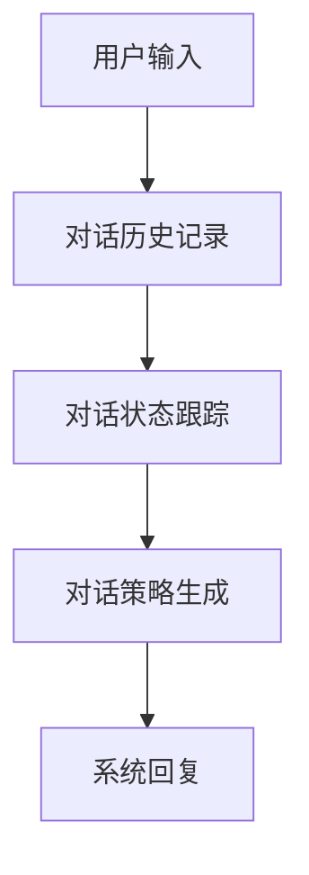
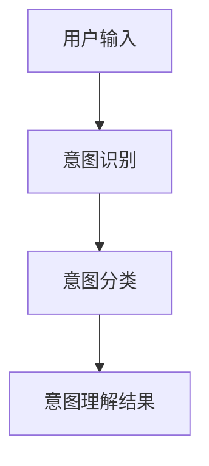
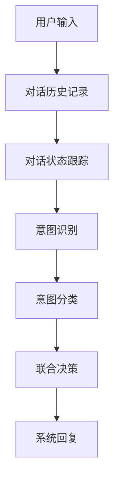
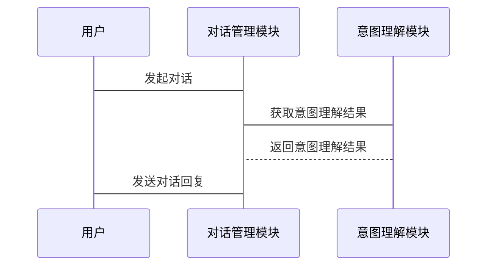

                 


# 构建企业级对话系统：多轮对话管理与意图理解的深度整合

> 关键词：企业级对话系统，多轮对话管理，意图理解，深度整合，对话系统架构

> 摘要：本文深入探讨了构建企业级对话系统的多轮对话管理与意图理解的深度整合。从背景介绍到核心概念，从算法原理到系统架构设计，再到项目实战，全面分析了企业级对话系统的构建过程，展示了如何通过深度整合多轮对话管理和意图理解来提升对话系统的性能和用户体验。文章最后总结了最佳实践和未来发展方向。

---

## 第一部分: 企业级对话系统的背景与核心概念

### 第1章: 背景介绍

#### 1.1 问题背景

##### 1.1.1 当前对话系统的发展现状

近年来，随着自然语言处理（NLP）技术的快速发展，对话系统已经从简单的关键词匹配逐渐发展为基于深度学习的复杂系统。企业级对话系统作为一种重要的对话系统类型，广泛应用于客户服务、智能助手、在线教育等领域。然而，现有的对话系统在处理多轮对话和意图理解方面仍存在诸多挑战，如对话上下文理解不足、意图识别精度不高、对话流程管理复杂等问题。

##### 1.1.2 企业级对话系统的必要性

企业级对话系统需要处理复杂的业务逻辑和多样化的用户需求。传统的单轮对话系统难以应对多轮对话中的上下文依赖问题，而意图理解的准确性直接影响用户体验。因此，构建一个能够高效管理多轮对话并准确理解用户意图的企业级对话系统显得尤为重要。

##### 1.1.3 多轮对话管理与意图理解的整合需求

多轮对话管理和意图理解是对话系统中的两大核心模块。多轮对话管理负责跟踪对话状态和历史记录，而意图理解则负责识别用户的深层需求。两者的深度整合能够使对话系统更加智能化，能够更好地理解用户需求并提供个性化的服务。

#### 1.2 问题描述

##### 1.2.1 多轮对话管理的挑战

多轮对话管理需要处理对话的上下文信息，包括对话历史、当前状态等。如何高效地跟踪和管理这些信息，同时保持对话的连贯性是多轮对话管理的主要挑战。

##### 1.2.2 意图理解的复杂性

意图理解不仅需要识别用户的表面需求，还需要理解用户的深层意图。在复杂的对话场景中，用户的需求可能通过多种方式表达，如何准确识别这些意图是意图理解的核心挑战。

##### 1.2.3 企业级对话系统的边界与外延

企业级对话系统的边界包括业务逻辑、数据接口、用户权限等方面。其外延则涉及系统的扩展性、可维护性、安全性等。明确系统的边界和外延有助于更好地进行系统设计和优化。

#### 1.3 核心概念

##### 1.3.1 多轮对话管理的定义与特点

多轮对话管理是指在对话过程中，系统能够跟踪对话的状态和历史记录，理解用户的上下文信息，并根据这些信息生成合适的回复。其特点包括上下文依赖性、对话连贯性、动态性等。

##### 1.3.2 意图理解的定义与特点

意图理解是指系统能够识别用户在对话中的深层需求，理解用户的意图。其特点包括多样性、上下文依赖性、实时性等。

##### 1.3.3 两者的整合方式与优势

多轮对话管理和意图理解的整合可以通过联合建模、协同学习等方式实现。整合的优势在于能够提高对话系统的智能化水平，提升用户体验。

---

### 第2章: 核心概念与联系

#### 2.1 多轮对话管理的原理

##### 2.1.1 对话状态跟踪

对话状态跟踪是多轮对话管理的核心任务之一。系统需要根据对话历史和当前输入，更新对话状态，以便更好地理解用户的需求。

##### 2.1.2 对话历史记录

对话历史记录是多轮对话管理的重要依据。系统需要存储和管理对话历史，以便在后续对话中进行上下文理解。

##### 2.1.3 上下文管理

上下文管理是指系统能够根据对话的上下文信息，动态调整对话策略。这包括对用户情绪、意图的识别和管理。

#### 2.2 意图理解的原理

##### 2.2.1 意图识别

意图识别是意图理解的核心任务之一。系统需要通过分析用户的输入，识别出用户的意图类别。

##### 2.2.2 意图分类

意图分类是将识别出的意图进行分类，以便系统能够根据意图类别生成相应的回复。

##### 2.2.3 意图理解的上下文依赖性

意图理解不仅仅依赖于当前输入，还需要考虑对话的上下文信息。上下文依赖性使得意图理解更加复杂和具有挑战性。

#### 2.3 多轮对话与意图理解的联系

##### 2.3.1 对话流程中的意图识别

在多轮对话中，意图识别需要考虑对话的上下文信息，动态调整意图识别策略。

##### 2.3.2 意图理解对对话管理的反馈机制

意图理解的结果可以作为对话管理的反馈，帮助系统调整对话策略，优化对话流程。

##### 2.3.3 两者的协同工作模式

多轮对话管理和意图理解需要协同工作，共同完成对话任务。协同工作模式包括信息共享、策略调整、反馈优化等。

---

#### 2.4 核心概念对比与ER实体关系图

##### 2.4.1 核心概念对比

| 对比维度 | 多轮对话管理 | 意图理解 |
|----------|--------------|----------|
| 核心任务 | 对话状态跟踪 | 意图识别 |
| 输入数据 | 对话历史 | 用户输入 |
| 输出结果 | 对话状态 | 意图类别 |

##### 2.4.2 ER实体关系图

```mermaid
erd
  entity 用户 {
    key: 用户ID
    属性: 用户名称, 用户权限, 用户状态
  }

  entity 对话历史 {
    key: 对话ID
    属性: 对话内容, 对话时间, 对话状态
  }

  entity 对话管理模块 {
    key: 对话管理ID
    属性: 对话策略, 对话结果
  }

  entity 意图理解模块 {
    key: 意图ID
    属性: 意图类别, 意图描述
  }

  关系 用户 - 对话历史: 用户发起对话
  关系 用户 - 对话管理模块: 用户与对话管理模块交互
  关系 对话管理模块 - 对话历史: 对话管理模块记录对话历史
  关系 对话管理模块 - 意图理解模块: 对话管理模块调用意图理解模块
```

---

### 第3章: 算法原理

#### 3.1 多轮对话管理算法

##### 3.1.1 基于序列到序列模型的对话管理

序列到序列模型（Sequence-to-Sequence, Seq2Seq）是一种常用的对话管理算法。它通过编码器将对话历史编码为一个固定长度的向量，然后通过解码器生成回复。

##### 3.1.2 基于强化学习的对话管理

强化学习（Reinforcement Learning, RL）是一种通过奖励机制优化对话策略的方法。系统在与用户的对话中不断调整策略，以获得最大的奖励。

##### 3.1.3 基于树状结构的对话管理

树状结构对话管理是一种基于树状结构的对话管理方法。它通过构建对话树，将对话过程分解为多个可能的分支，从而实现高效的对话管理。

#### 3.2 意图理解算法

##### 3.2.1 基于词袋模型的意图分类

词袋模型（Bag-of-Words, BoW）是一种常用的意图分类方法。它将用户输入的文本转换为词袋表示，然后通过分类器进行意图分类。

##### 3.2.2 基于深度学习的意图分类

深度学习模型（如LSTM、Transformer）能够捕捉文本中的上下文信息，从而提高意图分类的准确性。

##### 3.2.3 基于预训练模型的意图分类

预训练模型（如BERT、GPT）通过大规模的数据训练，能够更好地理解文本的语义信息，从而提高意图分类的精度。

#### 3.3 多轮对话与意图理解的联合建模

##### 3.3.1 联合建模的基本原理

联合建模是指同时对多轮对话管理和意图理解进行建模，以便更好地捕捉两者的相互关系。

##### 3.3.2 模型的训练与优化

联合建模的训练过程需要同时优化对话管理和意图理解的目标函数，通常采用端到端的训练方法。

##### 3.3.3 模型的评估与验证

模型的评估通常采用准确率、召回率、F1值等指标。验证过程可以通过交叉验证、测试集验证等方式进行。

---

#### 3.4 算法流程图

##### 3.4.1 多轮对话管理算法流程图



##### 3.4.2 意图理解算法流程图



##### 3.4.3 联合建模流程图



---

### 第4章: 数学模型与公式

#### 4.1 多轮对话管理的数学模型

##### 4.1.1 对话状态表示的向量空间模型

对话状态可以用一个向量表示，向量的维度对应对话的状态特征。

$$ s_t = [s_1, s_2, ..., s_n] $$

其中，$s_t$ 表示当前对话状态，$s_i$ 表示第$i$个状态特征。

##### 4.1.2 对话历史记录的序列模型

对话历史可以表示为一个序列，序列中的每个元素表示一个对话回合。

$$ h_t = [h_1, h_2, ..., h_m] $$

其中，$h_t$ 表示当前对话历史，$h_i$ 表示第$i$个对话回合的内容。

##### 4.1.3 上下文管理的图模型

上下文管理可以通过图模型表示，节点表示对话内容，边表示对话的上下文关系。

$$ C = (V, E) $$

其中，$V$ 表示节点集合，$E$ 表示边集合。

#### 4.2 意图理解的数学模型

##### 4.2.1 意图分类的线性模型

意图分类可以使用线性回归模型，目标函数如下：

$$ \min_{\theta} \sum_{i=1}^n (y_i - \theta x_i)^2 $$

其中，$y_i$ 表示真实意图标签，$\theta$ 表示模型参数，$x_i$ 表示输入特征。

##### 4.2.2 意图分类的深度学习模型

深度学习模型的目标函数通常采用交叉熵损失函数：

$$ L = -\sum_{i=1}^n y_i \log(p_i) $$

其中，$p_i$ 表示预测的概率，$y_i$ 表示真实标签。

##### 4.2.3 预训练模型的数学表示

预训练模型通常采用自监督学习，目标函数如下：

$$ L = \sum_{i=1}^n \text{CE}(p_i, y_i) $$

其中，$\text{CE}$ 表示交叉熵损失函数。

#### 4.3 联合建模的数学公式

##### 4.3.1 对话管理与意图理解的联合概率模型

联合概率模型可以表示为：

$$ P(y, s | x) = P(y | s, x) \cdot P(s | x) $$

其中，$y$ 表示意图标签，$s$ 表示对话状态，$x$ 表示输入文本。

##### 4.3.2 联合建模的损失函数

联合建模的损失函数可以表示为：

$$ L = \text{CE}(y, y_{\text{pred}}) + \text{MSE}(s, s_{\text{pred}}) $$

其中，$\text{CE}$ 表示交叉熵损失，$\text{MSE}$ 表示均方误差损失。

##### 4.3.3 联合优化的数学推导

联合优化的目标是最小化损失函数：

$$ \min_{\theta} L = \min_{\theta} \text{CE}(y, y_{\text{pred}}) + \text{MSE}(s, s_{\text{pred}}) $$

---

### 第5章: 系统分析与架构设计

#### 5.1 系统功能设计

##### 5.1.1 对话管理模块的功能设计

对话管理模块负责跟踪对话状态和历史记录，生成对话回复。主要功能包括对话历史记录、对话状态跟踪、对话策略生成等。

##### 5.1.2 意图理解模块的功能设计

意图理解模块负责识别用户的意图，分类意图类别。主要功能包括意图识别、意图分类、意图理解结果输出等。

##### 5.1.3 两者的协同功能设计

两者的协同功能包括信息共享、策略调整、反馈优化等。协同功能的设计需要确保对话管理和意图理解能够高效配合，共同完成对话任务。

#### 5.2 系统架构设计

##### 5.2.1 分层架构设计

系统架构采用分层设计，包括数据层、业务逻辑层、用户界面层等。每一层负责不同的功能，确保系统的模块化和可维护性。

##### 5.2.2 模块化设计

模块化设计将系统划分为多个功能模块，如对话管理模块、意图理解模块、用户界面模块等。每个模块独立开发和维护，便于系统的扩展和优化。

##### 5.2.3 高可用性设计

高可用性设计确保系统能够在故障情况下依然保持正常运行。通常采用负载均衡、冗余设计等技术实现高可用性。

#### 5.3 系统接口设计

##### 5.3.1 对话管理模块的接口设计

对话管理模块提供以下接口：获取对话历史、更新对话状态、生成对话回复等。

##### 5.3.2 意图理解模块的接口设计

意图理解模块提供以下接口：识别意图、分类意图、返回意图理解结果等。

##### 5.3.3 联合模块的接口设计

联合模块需要对话管理模块和意图理解模块之间的接口设计，确保两者的协同工作。

#### 5.4 系统交互流程图

##### 5.4.1 系统交互流程图



---

### 第6章: 项目实战

#### 6.1 环境安装

##### 6.1.1 开发环境的选择

推荐使用Python 3.8及以上版本，安装必要的开发工具，如Jupyter Notebook、PyCharm等。

##### 6.1.2 依赖库的安装

安装必要的Python库，如TensorFlow、Keras、numpy、pandas等。

##### 6.1.3 开发工具的配置

配置开发环境，确保所有依赖库和工具能够正常运行。

#### 6.2 核心代码实现

##### 6.2.1 对话管理模块的实现

对话管理模块的代码实现：

```python
class DialogManager:
    def __init__(self):
        self.dialog_history = []
        self.dialog_state = {}

    def update_dialog_history(self, user_input):
        self.dialog_history.append(user_input)

    def get_dialog_state(self):
        return self.dialog_state
```

##### 6.2.2 意图理解模块的实现

意图理解模块的代码实现：

```python
from tensorflow.keras import models, layers

class IntentClassifier:
    def __init__(self, vocab_size):
        self.model = self.build_model(vocab_size)

    def build_model(self, vocab_size):
        model = models.Sequential()
        model.add(layers.Embedding(vocab_size, 100))
        model.add(layers.LSTM(64, return_sequences=False))
        model.add(layers.Dense(1, activation='sigmoid'))
        model.compile(loss='binary_crossentropy', optimizer='adam', metrics=['accuracy'])
        return model
```

##### 6.2.3 联合建模的实现

联合建模的代码实现：

```python
from tensorflow.keras import Input, Model
import numpy as np

def build_model(vocab_size, intent_size):
    input_layer = Input(shape=(None, vocab_size))
    lstm_layer = layers.LSTM(64, return_sequences=False)(input_layer)
    dialog_state_layer = layers.Dense(32, activation='relu')(lstm_layer)
    intent_layer = layers.Dense(intent_size, activation='softmax')(dialog_state_layer)
    model = Model(inputs=input_layer, outputs=intent_layer)
    model.compile(loss='sparse_categorical_crossentropy', optimizer='adam', metrics=['accuracy'])
    return model
```

#### 6.3 代码应用解读与分析

##### 6.3.1 对话管理模块的代码解读

对话管理模块的代码实现了对话历史记录和对话状态的管理。通过类`DialogManager`可以方便地添加对话历史和获取对话状态。

##### 6.3.2 意图理解模块的代码解读

意图理解模块的代码实现了一个基于LSTM的意图分类模型。模型通过词袋向量化输入，输出意图的概率分布。

##### 6.3.3 联合建模的代码解读

联合建模的代码实现了同时对对话管理和意图理解进行建模。模型通过LSTM捕捉对话的上下文信息，并输出意图的概率分布。

#### 6.4 实际案例分析

##### 6.4.1 案例分析

以客服对话场景为例，用户输入“我的订单在哪里？”，系统需要识别用户的意图是查询订单状态，并根据对话历史生成回复。

##### 6.4.2 详细讲解

通过分析用户输入和对话历史，系统首先更新对话历史，然后识别用户的意图，最后生成回复。整个过程展示了多轮对话管理和意图理解的深度整合。

#### 6.5 项目小结

##### 6.5.1 项目总结

通过项目实战，我们实现了企业级对话系统的多轮对话管理和意图理解的深度整合。系统能够高效处理对话流程，准确识别用户意图。

##### 6.5.2 项目中的注意事项

在项目实施过程中，需要注意对话历史的管理、意图理解的准确性以及系统的可扩展性。同时，还需要考虑系统的性能优化和用户体验设计。

---

## 第七章: 最佳实践与未来展望

### 7.1 最佳实践

#### 7.1.1 系统设计建议

在系统设计中，建议采用模块化设计和分层架构，确保系统的可维护性和可扩展性。同时，需要注意系统的高可用性和安全性。

#### 7.1.2 开发实践

在开发过程中，建议使用成熟的深度学习框架（如TensorFlow、Keras）和NLP工具（如spaCy、NLTK）来提高开发效率。同时，还需要注重代码的可读性和可维护性。

#### 7.1.3 测试与优化

在系统测试阶段，需要进行功能测试、性能测试和用户体验测试。通过测试发现系统中的问题，并进行优化。

### 7.2 小结

企业级对话系统的构建是一个复杂的过程，需要综合考虑多轮对话管理、意图理解、系统架构设计等多个方面。通过深度整合这两者，可以显著提升对话系统的性能和用户体验。

### 7.3 注意事项

在实际应用中，需要注意对话系统的实时性、准确性以及系统的可扩展性。同时，还需要关注用户隐私和数据安全问题。

### 7.4 拓展阅读

推荐读者阅读以下书籍和论文，以深入了解相关领域的最新研究成果：

1. 《深度学习》—— Ian Goodfellow
2. 《自然语言处理入门》—— 余力
3. 《对话系统：原理与实践》—— 王伟

---

## 作者：AI天才研究院/AI Genius Institute & 禅与计算机程序设计艺术 /Zen And The Art of Computer Programming

---

**摘要**：本文详细探讨了构建企业级对话系统的多轮对话管理与意图理解的深度整合。从背景介绍到核心概念，从算法原理到系统架构设计，再到项目实战，全面分析了企业级对话系统的构建过程。文章最后总结了最佳实践和未来发展方向，为企业级对话系统的构建提供了宝贵的参考和指导。

--- 

**注**：由于篇幅限制，以上内容为文章的初步框架和部分章节内容。完整的文章将包含每个章节的详细内容和完整的代码实现。

