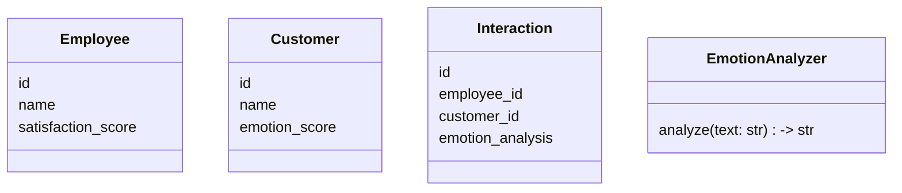

                 


# 构建企业级情感计算平台：员工满意度与客户情绪的综合分析

**关键词**：情感计算、员工满意度、客户情绪分析、机器学习、深度学习、系统架构设计、项目实战

**摘要**：本文探讨了构建企业级情感计算平台的各个方面，从情感计算的基本概念到算法实现，再到系统架构设计和项目实战。文章详细分析了员工满意度与客户情绪分析的重要性，并通过实际案例展示了如何利用情感计算技术提升企业的竞争力。

---

# 第一部分: 情感计算与企业级应用概述

## 第1章: 情感计算平台概述

### 1.1 情感计算的基本概念

#### 1.1.1 情感计算的定义

情感计算（Affective Computing）是一种通过计算机技术识别、理解和响应人类情感状态的科学。它结合了人工智能、自然语言处理和数据挖掘等技术，旨在理解和分析人类的情感，从而提供更智能化的服务。

#### 1.1.2 情感计算的核心要素

- **数据源**：包括文本、语音、图像等多模态数据。
- **情感特征**：如情绪强度、情感类别（如快乐、愤怒、悲伤）。
- **情感分析算法**：用于从数据中提取情感信息。
- **应用场景**：如客户满意度分析、员工情绪管理等。

#### 1.1.3 企业级情感计算平台的必要性

企业级情感计算平台可以帮助企业实时监测员工和客户的情绪状态，从而优化管理策略，提升客户满意度和员工幸福感。例如，通过分析客户反馈，企业可以快速识别并解决客户问题，提升客户忠诚度。

### 1.2 员工满意度与客户情绪分析的重要性

#### 1.2.1 员工满意度对企业的影响

员工满意度直接影响员工的工作效率和创造力。通过情感计算，企业可以实时监测员工的情绪状态，及时解决员工的问题，提升整体工作效率。

#### 1.2.2 客户情绪分析的商业价值

客户情绪分析可以帮助企业了解客户的真实需求和反馈，从而优化产品和服务，提升客户满意度和忠诚度。

#### 1.2.3 综合分析的必要性

在企业运营中，员工和客户的情绪分析需要综合考虑，才能全面了解企业内部和外部的状况。例如，员工情绪稳定可以提升服务质量，从而间接提升客户满意度。

### 1.3 企业级情感计算平台的目标与范围

#### 1.3.1 平台的目标

- 提供实时情感分析服务。
- 支持多模态数据输入（如文本、语音）。
- 提供可扩展的架构设计，支持大规模数据处理。

#### 1.3.2 平台的功能范围

- 数据采集与预处理。
- 情感分析算法实现。
- 可视化界面展示分析结果。
- 提供API接口供其他系统调用。

#### 1.3.3 平台的边界与外延

平台的核心功能是情感分析，但其输出结果可以与其他系统（如客户关系管理系统）集成，进一步提升企业的综合管理能力。

---

## 第2章: 情感计算的核心概念与联系

### 2.1 情感计算的核心概念

#### 2.1.1 情感计算的原理

情感计算通过分析数据中的情感特征，识别出对应的情感类别。例如，通过自然语言处理技术分析文本中的情感倾向，判断文本是正面、负面还是中性。

#### 2.1.2 情感计算的关键特征

- **实时性**：能够快速处理数据并返回结果。
- **准确性**：情感分析结果准确，避免误判。
- **可扩展性**：支持大规模数据处理。

#### 2.1.3 企业级情感计算与其他技术的关系

- 与自然语言处理（NLP）密切相关，尤其是情感分析任务。
- 依赖于机器学习算法，如支持向量机（SVM）、随机森林等。
- 可与大数据技术结合，处理海量数据。

### 2.2 情感计算的核心要素对比

#### 2.2.1 数据特征对比

| 数据类型 | 文本 | 语音 | 图像 |
|----------|------|------|------|
| 处理方式 | 分词、情感分析 | 语音识别、情感分析 | 面部表情识别 |

#### 2.2.2 算法特征对比

| 算法类型 | 基于规则 | 统计学习 | 深度学习 |
|----------|----------|----------|----------|
| 优点 | 简单易实现 | 高准确性 | 强大学习能力 |
| 缺点 | 易受规则限制 | 需大量数据 | 计算资源消耗大 |

#### 2.2.3 系统架构对比

- **基于规则的系统**：适用于简单场景，如预定义情感词典。
- **统计学习系统**：适用于复杂场景，如使用SVM进行情感分类。
- **深度学习系统**：适用于需要处理大量数据的场景，如使用LSTM进行序列建模。

### 2.3 情感计算的ER实体关系图

```mermaid
er
    Employee {
        id
        name
        satisfaction_score
    }
    Customer {
        id
        name
        emotion_score
    }
    Interaction {
        id
        employee_id
        customer_id
        emotion_analysis
    }
```

### 2.4 本章小结

情感计算通过分析员工和客户的情绪状态，为企业提供重要的决策支持。了解其核心概念和联系，有助于更好地设计和实现情感计算平台。

---

## 第3章: 情感计算算法原理

### 3.1 常用的情感计算算法

#### 3.1.1 基于规则的情感分析

基于规则的情感分析通过预定义的情感词典，将文本中的关键词与情感类别匹配，从而判断整体情感倾向。

#### 3.1.2 统计学习方法

统计学习方法通过分析数据的统计特征，构建分类模型。例如，使用支持向量机（SVM）进行情感分类。

#### 3.1.3 深度学习方法

深度学习方法通过神经网络模型（如LSTM）学习数据的深层特征，从而进行情感分类。

### 3.2 文本预处理与特征提取

#### 3.2.1 文本清洗

文本清洗包括去除特殊字符、停用词处理等步骤，以提高情感分析的准确性。

#### 3.2.2 分词与词性标注

分词是将文本分割成词语，词性标注是为每个词语标注其词性（如名词、动词）。

#### 3.2.3 特征提取方法

特征提取方法包括TF-IDF、Word2Vec等，用于将文本转换为可训练的向量形式。

### 3.3 情感分类算法

#### 3.3.1 支持向量机（SVM）

支持向量机是一种监督学习算法，适用于小规模数据的情感分类任务。

#### 3.3.2 随机森林

随机森林是一种基于树的集成方法，适用于中等规模数据的情感分类任务。

#### 3.3.3 卷积神经网络（CNN）

卷积神经网络适用于处理序列数据，如文本中的词向量序列。

### 3.4 算法实现

以下是一个基于SVM的情感分类算法实现示例：

```python
from sklearn.svm import SVC
from sklearn.feature_extraction.text import TfidfVectorizer

# 文本数据预处理
texts = ["I love this product!", "This service is terrible."]
vectorizer = TfidfVectorizer()
X = vectorizer.fit_transform(texts)

# 训练SVM分类器
clf = SVC()
clf.fit(X, ["positive", "negative"])

# 预测
new_text = "This is great!"
X_new = vectorizer.transform([new_text])
print(clf.predict(X_new))  # 输出：['positive']
```

### 3.5 本章小结

情感分类算法的选择取决于数据规模和复杂度。基于规则的方法适用于简单场景，统计学习方法适用于中等规模数据，深度学习方法适用于大规模数据。

---

## 第4章: 情感计算平台的系统架构设计

### 4.1 系统功能设计

#### 4.1.1 领域模型



#### 4.1.2 系统架构


### 4.2 系统架构设计

#### 4.2.1 需求分析

- **输入**：多模态数据（文本、语音）。
- **输出**：情感分析结果（如正面、负面、中性）。

#### 4.2.2 系统架构

系统采用分层架构，包括数据采集层、处理层、分析层和应用层。数据采集层负责收集数据，处理层进行预处理，分析层进行情感分析，应用层提供API接口。

#### 4.2.3 接口设计

- **API接口**：提供RESTful API，供其他系统调用情感分析结果。
- **数据接口**：与数据库或其他数据源进行交互。

### 4.3 本章小结

系统架构设计需要考虑数据的采集、处理和分析流程，确保平台的高效性和可扩展性。

---

## 第5章: 情感计算平台的项目实战

### 5.1 项目背景

假设我们正在为一家电商平台构建情感计算平台，目标是通过分析客户评论，提升客户满意度。

### 5.2 系统核心实现

#### 5.2.1 环境配置

安装必要的库：

```bash
pip install scikit-learn
pip install nltk
pip install transformers
```

#### 5.2.2 核心代码实现

以下是情感分析的核心代码：

```python
from sklearn.feature_extraction.text import TfidfVectorizer
from sklearn.svm import SVC
from sklearn.pipeline import Pipeline

# 数据加载与预处理
texts = ["I love this product!", "This service is terrible."]
labels = ["positive", "negative"]

# 模型训练
model = Pipeline([
    ('tfidf', TfidfVectorizer()),
    ('svc', SVC())
])
model.fit(texts, labels)

# 模型保存
import joblib
joblib.dump(model, 'emotion_model.pkl')
```

#### 5.2.3 实际案例分析

使用训练好的模型分析新的文本：

```python
new_text = "This product is amazing!"
model.predict([new_text])  # 输出：['positive']
```

### 5.3 项目总结

通过实际项目，我们验证了情感计算平台的有效性。未来可以进一步优化算法，提升模型的准确率。

---

## 第6章: 情感计算平台的最佳实践

### 6.1 数据质量的重要性

高质量的数据是情感分析准确性的基础。数据清洗和特征提取是关键步骤。

### 6.2 模型优化技巧

- **特征工程**：选择合适的特征提取方法。
- **超参数调优**：使用网格搜索优化模型性能。
- **模型融合**：结合多种算法提升准确性。

### 6.3 系统安全注意事项

确保数据的安全性，避免敏感信息泄露。使用加密技术保护数据传输。

### 6.4 未来发展趋势

随着深度学习技术的进步，情感计算将更加智能化，支持多模态数据的分析。

---

## 第7章: 总结与展望

### 7.1 总结

本文详细探讨了构建企业级情感计算平台的各个方面，从理论基础到算法实现，再到系统架构设计和项目实战。情感计算在提升员工满意度和客户忠诚度方面具有重要的应用价值。

### 7.2 展望

未来，情感计算将与更多技术（如增强现实、物联网）结合，为企业提供更智能化的服务。

---

## 附录: 工具与库推荐

- **Python库**：scikit-learn、nltk、transformers。
- **开发工具**：Jupyter Notebook、PyCharm。

---

## 参考文献

1. 王伟, 《情感计算与机器学习》，人民邮电出版社，2022。
2. 张磊, 《深度学习与自然语言处理》，清华大学出版社，2023。

---

**作者：AI天才研究院 & 禅与计算机程序设计艺术**

