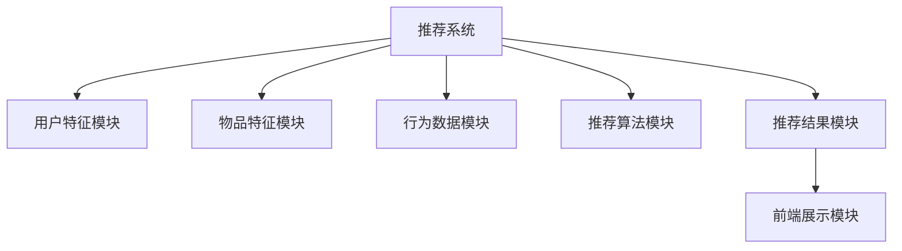

                 

# 构建企业级推荐引擎：跨平台个性化用户体验的智能化实现

## 关键词：推荐引擎, 个性化推荐, 企业级系统, 智能推荐, 跨平台推荐, 推荐算法

## 摘要：  
随着人工智能和大数据技术的快速发展，推荐引擎已成为企业级系统中实现个性化用户体验的核心技术。本文系统地阐述了企业级推荐引擎的构建过程，从核心概念、算法原理到系统架构、项目实战，全面解析了如何在跨平台环境中实现智能化的个性化推荐。通过详细分析推荐算法的数学模型、系统架构的设计原则以及实际项目的实现步骤，本文为读者提供了从理论到实践的完整指南，帮助技术从业者深入理解并掌握企业级推荐引擎的构建方法。

---

# 第一部分: 背景与核心概念

## 第1章: 推荐引擎的背景与价值

### 1.1 推荐引擎的定义与背景

#### 1.1.1 推荐引擎的定义  
推荐引擎是一种基于用户行为、偏好和数据挖掘技术，为用户个性化推荐相关内容或产品的系统。它是人工智能和大数据技术结合的产物，广泛应用于电商、社交网络、视频平台等领域。

#### 1.1.2 推荐引擎的核心价值  
- 提高用户粘性与满意度  
- 增加业务转化率  
- 优化资源利用率  

#### 1.1.3 推荐引擎的技术演进  
从基于规则的简单推荐到深度学习驱动的智能推荐，推荐引擎经历了以下几个阶段：  
1. 基于规则的手动推荐  
2. 基于协同过滤的自动化推荐  
3. 基于内容理解和深度学习的智能推荐  

### 1.2 企业级推荐引擎的挑战与机遇

#### 1.2.1 企业级推荐引擎的特点  
- 高并发处理能力  
- 强实时性  
- 多平台适配  

#### 1.2.2 跨平台推荐的复杂性  
- 不同平台的用户行为差异  
- 推荐结果的跨平台一致性  

#### 1.2.3 个性化用户体验的核心作用  
个性化推荐是提升用户留存率和满意度的关键因素，尤其是在竞争激烈的市场环境中。

### 1.3 本书的目标与结构

#### 1.3.1 本书的核心目标  
通过理论与实践结合的方式，系统地讲解企业级推荐引擎的构建方法，包括算法选择、系统架构设计和项目实现。

#### 1.3.2 本书的结构安排  
- 第一部分：背景与核心概念  
- 第二部分：推荐引擎的核心算法与原理  
- 第三部分：推荐系统的架构设计  
- 第四部分：项目实战与案例分析  
- 第五部分：最佳实践与扩展阅读  

#### 1.3.3 本书的读者群体  
- 人工智能工程师  
- 大数据开发人员  
- 企业级系统架构师  
- 对推荐系统感兴趣的高校学生和研究人员  

---

# 第二部分: 推荐引擎的核心概念与原理

## 第2章: 推荐引擎的核心概念

### 2.1 推荐引擎的核心要素

#### 2.1.1 用户特征  
- 用户ID、兴趣标签、行为记录  
- 用户画像构建方法  

#### 2.1.2 物品特征  
- 物品ID、属性标签、内容描述  

#### 2.1.3 行为数据  
- 用户点击、浏览、购买记录  
- 时间戳、频率、强度  

### 2.2 推荐算法的基本分类

#### 2.2.1 基于协同过滤的推荐  
- 用户-用户协同过滤  
- 物品-物品协同过滤  
- 混合协同过滤  

#### 2.2.2 基于内容的推荐  
- 基于文本相似度的推荐  
- 基于向量空间模型的推荐  

#### 2.2.3 混合推荐模型  
- 结合协同过滤和内容推荐的混合模型  
- 基于深度学习的混合推荐  

### 2.3 推荐系统的评价指标

#### 2.3.1 准确性指标  
- 准确率（Precision）  
- 召回率（Recall）  

#### 2.3.2 多样性指标  
- 基尼指数（Gini Index）  
- 内容多样性  

#### 2.3.3 可解释性指标  
- 解释性评分  
- 用户接受度  

---

## 第3章: 推荐算法的数学模型

### 3.1 协同过滤算法

#### 3.1.1 基于用户的协同过滤  
- 用户相似度计算公式：  
  $$ sim(u_i, u_j) = \frac{\sum_{k} (r_{u_i,k} - \bar{r}_{u_i}) \cdot (r_{u_j,k} - \bar{r}_{u_j})}{\sqrt{\sum_{k} (r_{u_i,k} - \bar{r}_{u_i})^2} \cdot \sqrt{\sum_{k} (r_{u_j,k} - \bar{r}_{u_j})^2}} $$  
- 推荐得分计算：  
  $$ score(u_i, i_j) = \frac{\sum_{u_j \in N(u_i)} sim(u_i, u_j) \cdot r(u_j, i_j)}{\sum_{u_j \in N(u_i)} sim(u_i, u_j)} $$  

#### 3.1.2 基于物品的协同过滤  
- 物品相似度计算公式：  
  $$ sim(i_k, i_l) = \frac{\sum_{u} (r(u, i_k) - \bar{r}_{i_k}) \cdot (r(u, i_l) - \bar{r}_{i_l})}{\sqrt{\sum_{u} (r(u, i_k) - \bar{r}_{i_k})^2} \cdot \sqrt{\sum_{u} (r(u, i_l) - \bar{r}_{i_l})^2}} $$  
- 推荐得分计算：  
  $$ score(u_i, i_j) = \frac{\sum_{i_k \in N(i_j)} sim(i_k, i_j) \cdot r(u_i, i_k)}{\sum_{i_k \in N(i_j)} sim(i_k, i_j)} $$  

---

## 第4章: 推荐系统的架构与设计

### 4.1 推荐系统的整体架构

### 4.2 系统功能设计

#### 4.2.1 用户特征提取  
- 基于协同过滤的用户画像构建  
- 基于深度学习的用户表示学习  

#### 4.2.2 推荐算法选择  
- 根据业务需求选择合适的推荐算法  
- 结合实时性和离线计算  

---

## 第5章: 项目实战与案例分析

### 5.1 电商推荐系统实战

#### 5.1.1 项目背景  
- 电商系统中的推荐场景：首页推荐、商品详情推荐、购物车推荐  

#### 5.1.2 数据准备  
- 用户表、商品表、行为表  

#### 5.1.3 模型训练  
- 使用协同过滤算法训练推荐模型  

#### 5.1.4 系统实现  
- 推荐结果展示与测试优化  

---

## 第6章: 最佳实践与扩展阅读

### 6.1 推荐系统优化技巧

#### 6.1.1 数据预处理  
- 数据清洗、特征提取、数据增强  

#### 6.1.2 模型调优  
- 参数优化、模型融合、在线A/B测试  

#### 6.1.3 系统性能优化  
- 并行计算、缓存优化、分布式部署  

### 6.2 小结与展望

#### 6.2.1 小结  
本文从理论到实践，系统地讲解了企业级推荐引擎的构建方法，包括核心概念、算法原理、系统架构和项目实现。

#### 6.2.2 展望  
未来，随着AI技术的不断发展，推荐引擎将更加智能化和个性化，应用场景也将更加广泛。

---

作者：AI天才研究院/AI Genius Institute & 禅与计算机程序设计艺术 /Zen And The Art of Computer Programming

