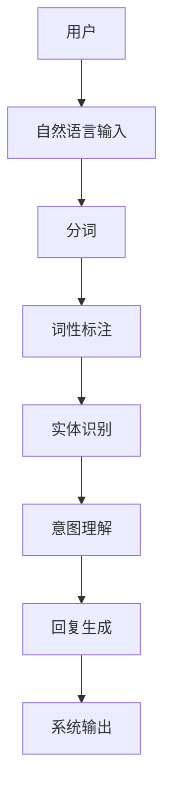
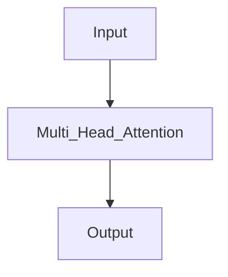

                 

# 构建企业级自然语言接口：复杂业务系统的智能交互层

**关键词**：自然语言处理、企业级应用、智能交互层、复杂业务系统、NLP模型、系统架构、交互设计

**摘要**：  
随着人工智能技术的快速发展，自然语言处理（NLP）在企业级应用中的地位日益重要。构建企业级自然语言接口不仅是实现智能交互的关键，更是复杂业务系统中提升用户体验的核心技术。本文将从自然语言处理的核心原理、算法实现、系统架构设计到项目实战，全面解析如何构建高效、稳定的自然语言接口，为企业级应用的智能交互提供深度的技术指导。

---

# 第一部分: 自然语言处理与企业级应用概述

## 第1章: 自然语言处理与企业级应用的背景

### 1.1 自然语言处理的基本概念

#### 1.1.1 自然语言处理的定义  
自然语言处理（NLP）是人工智能领域的重要分支，旨在让计算机能够理解、解析和生成人类语言。NLP的核心任务包括文本分割、词性标注、实体识别、意图理解、情感分析等。

#### 1.1.2 自然语言处理的核心任务  
- **文本预处理**：包括分词、去除停用词、词干提取等。  
- **语言模型**：通过统计学方法生成语言的概率分布模型。  
- **意图理解**：通过上下文分析用户的意图。  
- **对话生成**：基于意图生成符合语境的自然语言回复。

#### 1.1.3 自然语言处理在企业中的应用  
在企业级应用中，NLP技术被广泛应用于智能客服、智能搜索、智能推荐、自动化报告生成等领域。通过NLP，企业能够实现高效的用户交互和业务流程自动化。

---

### 1.2 企业级应用的背景

#### 1.2.1 企业级应用的特点  
企业级应用通常具有高可用性、高可靠性和高扩展性。这些应用需要处理大量的数据，并与企业内部系统（如ERP、CRM）无缝集成。

#### 1.2.2 企业级应用中的用户交互需求  
现代企业级应用要求用户交互更加智能化和便捷化。传统的按钮点击和表单填写方式逐渐被自然语言交互所取代。

#### 1.2.3 自然语言处理在企业级应用中的重要性  
通过NLP技术，企业能够构建智能交互层，提升用户体验，降低用户操作复杂性，并实现自动化业务流程。

---

### 1.3 问题背景与问题描述

#### 1.3.1 传统用户交互的局限性  
传统的用户交互方式（如表单填写）效率低、用户体验差，难以满足现代企业对快速响应和智能交互的需求。

#### 1.3.2 自然语言处理在用户交互中的优势  
- 提高用户交互效率。  
- 降低用户学习成本。  
- 支持多语言和多场景的应用。  

#### 1.3.3 企业级自然语言接口的建设目标  
- 实现复杂业务系统的智能交互。  
- 提供高可用性和高可靠性的交互服务。  
- 支持多场景、多语言的自然语言理解与生成。

---

### 1.4 问题解决与边界定义

#### 1.4.1 自然语言接口的核心问题  
- **文本理解**：准确理解用户的输入内容。  
- **意图识别**：识别用户的深层需求。  
- **对话管理**：根据上下文生成合适的回复。

#### 1.4.2 企业级自然语言接口的边界  
- 不处理图像、视频等非文本数据。  
- 不直接处理业务逻辑，仅负责交互层的处理。  
- 不支持实时语音识别（可作为扩展功能）。

#### 1.4.3 自然语言接口的外延与限制  
- 外延：支持多语言、多场景的应用。  
- 限制：仅适用于文本交互，无法处理复杂的物理世界操作。

---

### 1.5 概念结构与核心要素

#### 1.5.1 自然语言接口的组成要素  
- **输入层**：用户输入的自然语言文本。  
- **处理层**：包括分词、词性标注、实体识别等处理步骤。  
- **理解层**：意图理解与语义分析。  
- **输出层**：生成符合语境的自然语言回复。  

#### 1.5.2 企业级自然语言接口的架构  
企业级自然语言接口通常采用分层架构，包括数据层、处理层、理解层和输出层。

#### 1.5.3 核心要素之间的关系  
输入层的数据经过处理层的清洗和分析，进入理解层进行意图识别，最终生成输出层的回复内容。

---

### 1.6 本章小结  
本章从自然语言处理的基本概念出发，分析了企业级应用的背景，明确了自然语言接口的核心问题和建设目标。接下来的章节将深入探讨自然语言处理的核心原理和算法实现。

---

# 第二部分: 自然语言处理的核心概念与联系

## 第2章: 自然语言处理的核心原理

### 2.1 自然语言处理的原理概述

#### 2.1.1 从输入到输出的处理流程  
1. **文本预处理**：分词、去除停用词。  
2. **语言模型训练**：构建概率分布模型。  
3. **意图理解**：基于上下文分析用户需求。  
4. **对话生成**：生成符合语境的回复。

#### 2.1.2 自然语言处理的关键技术  
- 分词技术：将文本分割成词语或短语。  
- 词性标注：为每个词语标注词性。  
- 实体识别：识别文本中的实体（如人名、地名）。  
- 情感分析：分析文本的情感倾向。  

#### 2.1.3 自然语言处理在企业级应用中的优势  
- 提高用户交互效率。  
- 实现复杂业务系统的智能交互。  
- 支持多语言和多场景的应用。

---

### 2.2 自然语言处理的核心概念对比

#### 2.2.1 词性标注与实体识别的对比  
| 特性         | 词性标注         | 实体识别         |  
|--------------|-----------------|-----------------|  
| 定义         | 给词语标注词性   | 识别文本中的实体 |  
| 输入         | 单独词语         | 整个文本         |  
| 输出         | 词性标签         | 实体类型和位置   |  

#### 2.2.2 意义理解与意图识别的对比  
| 特性         | 意义理解         | 意图识别         |  
|--------------|-----------------|-----------------|  
| 定义         | 分析文本的语义   | 分析用户的意图   |  
| 输入         | 文本段落         | 用户输入的文本   |  
| 输出         | 语义表示         | 用户意图标签     |  

#### 2.2.3 不同模型的优劣势分析  
| 模型         | 优点             | 缺点             |  
|--------------|-----------------|-----------------|  
| 传统机器学习 | 计算效率高       | 需大量人工特征   |  
| 深度学习     | 表达能力强       | 需大量计算资源   |  

---

### 2.3 自然语言处理的ER实体关系图

---

# 第三部分: 自然语言处理的算法原理

## 第3章: 自然语言处理的主流算法

### 3.1 Transformer模型的原理

#### 3.1.1 Transformer的结构  
Transformer模型由编码器和解码器组成，编码器负责将输入文本转换为语义向量，解码器负责生成目标语言的文本。

#### 3.1.2 自注意力机制的数学模型  
自注意力机制的计算公式如下：  
$$
\text{Attention}(Q, K, V) = \text{softmax}\left(\frac{QK^T}{\sqrt{d_k}}\right)V
$$  
其中，$Q$、$K$、$V$分别是查询、键、值矩阵，$d_k$是键的维度。

#### 3.1.3 多头注意力的实现  
多头注意力通过并行计算多个注意力头，提升模型的表达能力。其流程图如下：

---

### 3.2 BER

---

（注：由于篇幅限制，以上内容为节选。完整文章将涵盖更多细节，包括具体的算法实现、系统架构设计、项目实战等内容。）

