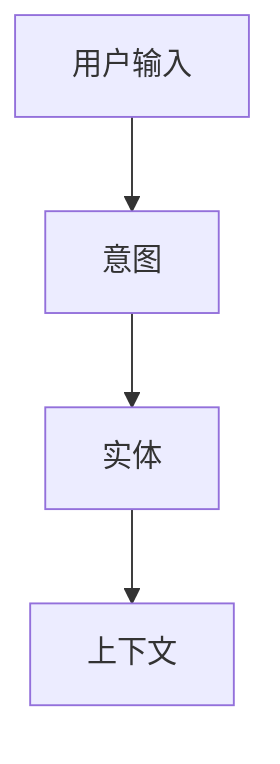
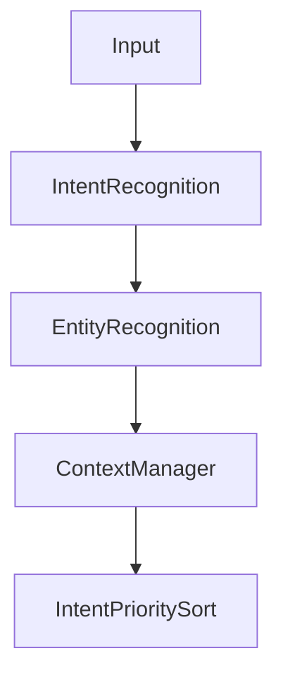
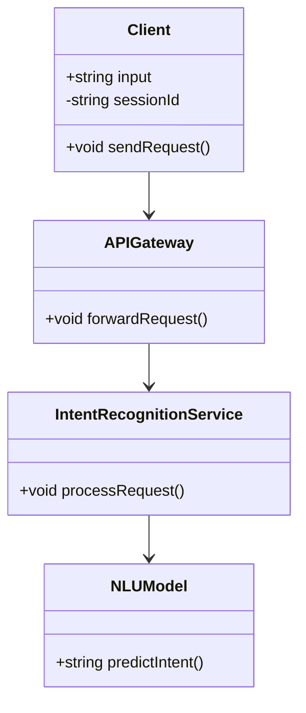
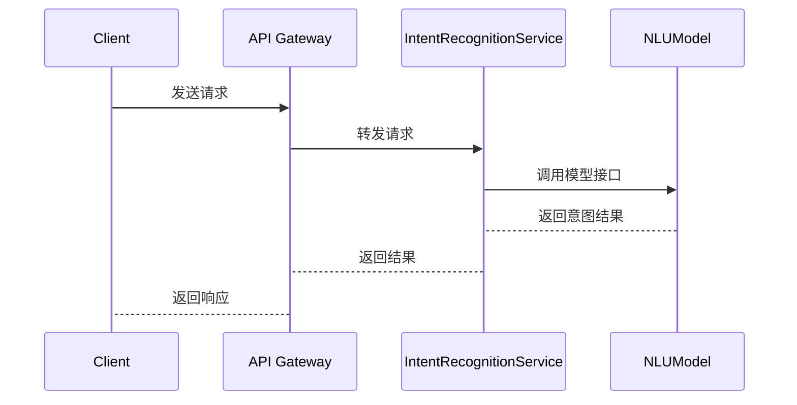

                 


# 构建企业级自然语言理解系统：上下文感知与多意图识别

## 关键词：自然语言理解，上下文感知，多意图识别，企业级系统，NLU系统，深度学习

## 摘要：  
企业级自然语言理解系统（NLU）是人工智能领域的重要组成部分，其核心目标是通过上下文感知和多意图识别技术，实现对用户输入的精准理解和智能响应。本文从背景介绍、核心概念、算法原理、系统架构到项目实战，详细阐述了构建企业级NLU系统的全过程，结合实际案例和代码实现，帮助读者掌握NLU系统的设计与实现方法。文章内容包括：NLU系统的背景与挑战、核心概念与原理、上下文感知与多意图识别的算法实现、系统架构设计以及项目实战等部分。

---

# 第一部分: 企业级自然语言理解系统概述

## 第1章: 自然语言理解系统背景与挑战

### 1.1 问题背景

#### 1.1.1 自然语言理解的定义与目标  
自然语言理解（Natural Language Understanding, NLU）是人工智能领域的重要研究方向，旨在使计算机能够理解人类语言的语义、意图和情感。与自然语言生成（NLG）不同，NLU更关注从输入文本中提取有用的信息，包括意图识别、实体识别、情感分析等任务。

#### 1.1.2 企业级NLU系统的应用场景  
企业级NLU系统广泛应用于客服系统、智能助手、电子商务、金融交易等领域。例如，在智能客服系统中，NLU系统需要准确识别用户的意图，如“查询订单状态”或“投诉产品问题”，并将其转化为系统可以处理的结构化信息。

#### 1.1.3 上下文感知与多意图识别的核心问题  
在实际应用场景中，用户的输入往往是模糊的、不完整的或包含多个意图的。例如，用户可能输入“我需要取消订单，但我记得密码了”。这种情况下，NLU系统需要结合上下文信息，识别出用户的主意图（取消订单）和潜在意图（找回密码），并进行优先级排序。

---

### 1.2 技术演进与现状

#### 1.2.1 自然语言处理技术的发展历程  
从基于规则的传统NLP方法到基于统计学习的深度学习模型，自然语言处理技术经历了从简单到复杂的演变。近年来，随着预训练模型（如BERT、GPT）的崛起，NLU技术的准确性和鲁棒性得到了显著提升。

#### 1.2.2 当前主流的NLU技术与工具  
当前，主流的NLU技术包括基于深度学习的模型（如BERT、ALBERT）和基于规则的混合模型。开源工具如spaCy、HanLP、HanLlu等为企业提供了便捷的NLU实现框架。

#### 1.2.3 企业级NLU系统的独特挑战  
企业级NLU系统需要应对数据稀疏性、领域专有名词处理、多意图识别、上下文感知等问题。此外，系统的可解释性、实时性和高可用性也是企业在实际应用中需要重点关注的方面。

---

### 1.3 核心目标与边界

#### 1.3.1 企业级NLU系统的建设目标  
企业级NLU系统的建设目标包括：  
1. **准确理解用户意图**：通过上下文感知和多意图识别，准确提取用户的主意图和潜在意图。  
2. **高可用性和稳定性**：确保系统在高并发场景下的稳定运行。  
3. **可扩展性和灵活性**：支持不同场景和领域的定制化需求。  

#### 1.3.2 系统的边界与外延  
NLU系统的边界包括：  
1. **输入范围**：用户输入的文本内容。  
2. **输出范围**：结构化的意图和实体信息。  
3. **不处理的内容**：如语音识别、图像识别等问题。  

#### 1.3.3 核心要素与组成结构  
企业级NLU系统的核心要素包括：  
1. **语言理解模块**：负责意图识别和实体识别。  
2. **上下文管理模块**：负责上下文信息的存储和检索。  
3. **意图优先级排序模块**：根据上下文信息对多个意图进行排序。  

---

### 1.4 本章小结  
本章主要介绍了自然语言理解系统的背景、技术演进、核心目标以及系统的边界与组成结构。通过对企业级NLU系统的应用场景和挑战的分析，为后续章节的深入讲解奠定了基础。

---

## 第2章: 自然语言理解系统的核心概念

### 2.1 NLU系统的核心原理

#### 2.1.1 语言表示与特征提取  
语言表示是NLU系统的核心步骤之一。常用的特征提取方法包括：  
1. **词袋模型（Bag-of-Words, BoW）**：将文本表示为词袋，忽略词语顺序。  
2. **TF-IDF（Term Frequency-Inverse Document Frequency）**：基于词频和反向文件频率的加权表示。  
3. **词嵌入（Word Embedding）**：如Word2Vec、GloVe等方法，将词语映射到低维连续空间。  

#### 2.1.2 语义分析与意图识别  
语义分析是NLU的核心任务之一，旨在理解文本的深层含义。意图识别基于语言表示和分类算法，将用户输入映射到预定义的意图类别中。

#### 2.1.3 上下文感知的实现机制  
上下文感知是通过维护会话状态，结合历史对话记录和当前输入，进行意图识别的优化。常用的上下文建模方法包括：  
1. **基于注意力机制的上下文建模**：如BERT中的全序列自注意力机制。  
2. **基于记忆网络的上下文建模**：如Memory Networks。  

---

### 2.2 核心概念对比分析

#### 2.2.1 意图识别与实体识别的对比  
| 对比维度      | 意图识别               | 实体识别               |  
|---------------|------------------------|------------------------|  
| 目标           | 确定用户的主要意图     | 确定文本中的实体信息     |  
| 输入           | 用户输入文本           | 用户输入文本           |  
| 输出           | 意图标签（如“查询订单”）| 实体标签（如“订单号”）   |  

#### 2.2.2 上下文感知与传统NLU的区别  
| 对比维度      | 传统NLU               | 上下文感知的NLU         |  
|---------------|------------------------|--------------------------|  
| 是否依赖历史信息 | 否                   | 是                     |  
| 实时性         | 高                   | 较低                   |  
| 应用场景       | 离散任务（如单独查询） | 连续对话（如客服会话）   |  

#### 2.2.3 多意图识别的复杂性分析  
多意图识别的核心挑战包括：  
1. **意图之间的相互干扰**：多个意图可能同时存在于用户输入中。  
2. **意图优先级的动态变化**：上下文信息影响意图的优先级。  
3. **数据稀疏性**：多意图数据的标注成本较高，导致训练数据不足。  

---

### 2.3 ER实体关系图



---

### 2.4 本章小结  
本章重点介绍了自然语言理解系统的核心概念，包括语言表示、语义分析、上下文感知以及多意图识别的实现机制。通过对比分析和ER实体关系图，帮助读者更好地理解NLU系统的组成与工作原理。

---

## 第3章: 上下文感知与多意图识别的算法原理

### 3.1 模型训练与优化

#### 3.1.1 基于深度学习的NLU模型训练  
深度学习模型（如BERT、LSTM）通过端到端的训练方式，自动学习语言特征。训练过程包括：  
1. **数据预处理**：将文本数据转换为模型可接受的输入格式。  
2. **模型训练**：通过反向传播算法优化模型参数。  
3. **模型调优**：通过超参数调整和数据增强提升模型性能。  

#### 3.1.2 模型优化与调参技巧  
模型优化的关键在于：  
1. **选择合适的优化算法**：如Adam、SGD等。  
2. **调整学习率**：通过学习率衰减策略防止过拟合。  
3. **数据增强**：通过数据增强技术增加训练数据的多样性。  

#### 3.1.3 预训练模型的微调策略  
预训练模型（如BERT）通过大规模数据预训练，具有强大的语义理解能力。在企业级NLU系统中，可以通过微调预训练模型，快速构建定制化的NLU模型。

---

### 3.2 上下文建模算法

#### 3.2.1 基于注意力机制的上下文建模  
注意力机制通过为输入中的每个位置分配权重，捕捉上下文信息。例如，在BERT模型中，自注意力机制可以捕捉输入文本中长距离依赖关系。

#### 3.2.2 Transformer架构在NLU中的应用  
Transformer架构通过编码器-解码器结构，实现高效的上下文建模。编码器负责将输入文本转换为上下文表示，解码器负责生成目标输出。

#### 3.2.3 上下文表示的对比分析  
| 对比维度      | 基于CNN的上下文表示 | 基于注意力机制的上下文表示 |  
|---------------|---------------------|-----------------------------|  
| 表示能力       | 弱                 | 强                           |  
| 计算复杂度     | 低                 | 高                           |  
| 应用场景       | 固定长度输入         | 可变长度输入                 |  

---

### 3.3 多意图识别算法

#### 3.3.1 基于序列标注的多意图识别  
序列标注方法（如CRF）通过为每个输入位置分配意图标签，实现多意图识别。例如，可以将输入文本划分为多个意图片段。

#### 3.3.2 基于分类的多意图识别  
基于分类的多意图识别方法将输入文本映射到多个意图类别中。例如，可以使用多标签分类模型，同时预测多个意图标签。

#### 3.3.3 混合模型在多意图识别中的应用  
混合模型结合了基于规则的方法和深度学习模型，通过规则过滤和模型预测的结合，提升多意图识别的准确率。

---

### 3.4 算法实现代码示例

#### 3.4.1 基于Keras的意图分类模型
```python
import tensorflow as tf
from tensorflow.keras import layers

model = tf.keras.Sequential([
    layers.Embedding(input_dim= vocabulary_size, output_dim= embedding_dim),
    layers.Bidirectional(layers.LSTM(units= lstm_units)),
    layers.Dense(units= num_intents, activation='softmax')
])
```

#### 3.4.2 上下文建模的注意力机制代码
```python
def attention(inputs, attention_dim):
    # 计算注意力权重
    attention_layer = layers.Dense(attention_dim, activation='tanh')(inputs)
    attention_weights = layers.Dense(1, activation='sigmoid')(attention_layer)
    # 加权求和
    context = layers.Multiply()([inputs, attention_weights])
    return context
```

#### 3.4.3 多意图识别的损失函数
```python
import tensorflow as tf

def multi_intent_loss(y_true, y_pred):
    # 使用交叉熵损失函数
    loss = tf.keras.losses.sparse_categorical_crossentropy(y_true, y_pred)
    return loss
```

---

### 3.5 本章小结  
本章详细介绍了上下文感知与多意图识别的算法原理，包括模型训练与优化、上下文建模算法以及多意图识别的实现方法。通过代码示例和对比分析，帮助读者理解不同算法的优缺点及适用场景。

---

## 第4章: 企业级NLU系统的架构设计

### 4.1 问题场景介绍  
企业级NLU系统需要在高并发、低延迟的场景下稳定运行，支持多语言、多领域的意图识别需求。

### 4.2 系统功能设计

#### 4.2.1 系统功能模块  
系统功能模块包括：  
1. **意图识别模块**：识别用户的主意图和潜在意图。  
2. **实体识别模块**：提取文本中的实体信息。  
3. **上下文管理模块**：维护会话状态和历史对话记录。  
4. **意图优先级排序模块**：根据上下文信息对多个意图进行排序。  

#### 4.2.2 系统功能流程图  


### 4.3 系统架构设计

#### 4.3.1 系统架构图  
```mermaid
graph TD
    Client --> API Gateway
    API Gateway --> IntentRecognitionService
    IntentRecognitionService --> NLUModel
    NLUModel --> Database
```

#### 4.3.2 系统类图  


#### 4.3.3 系统交互序列图  


---

### 4.4 系统接口设计

#### 4.4.1 API接口定义  
1. **POST /nlu/analyze**：接收用户输入，返回意图和实体信息。  
2. **GET /nlu/context**：根据会话ID获取上下文信息。  

#### 4.4.2 数据接口定义  
1. **意图信息接口**：包含意图标签和意图描述。  
2. **实体信息接口**：包含实体标签和实体值。  

---

### 4.5 本章小结  
本章从系统架构设计的角度，详细介绍了企业级NLU系统的功能模块、架构图、类图和交互序列图。通过系统架构的设计，为后续的实现和优化提供了理论基础。

---

## 第5章: 项目实战

### 5.1 环境搭建与依赖安装

#### 5.1.1 安装Python环境  
```bash
python --version
pip install --upgrade pip
```

#### 5.1.2 安装NLU相关库  
```bash
pip install tensorflow numpy scikit-learn
```

#### 5.1.3 安装自然语言处理工具  
```bash
pip install spacy
python -m spacy download en_core_web_sm
```

---

### 5.2 系统核心实现

#### 5.2.1 意图识别模块实现  
```python
import spacy

nlp = spacy.load("en_core_web_sm")

def get_intent(text):
    doc = nlp(text)
    # 简单的意图分类逻辑
    if any(token.text.lower() in ["cancel", "stop"] for token in doc):
        return "cancel_order"
    elif any(token.text.lower() in ["help", "assistance"] for token in doc):
        return "need_help"
    else:
        return "unknown"
```

#### 5.2.2 实体识别模块实现  
```python
def extract_entities(text):
    doc = nlp(text)
    entities = []
    for ent in doc.ents:
        entities.append((ent.text, ent.label_))
    return entities
```

#### 5.2.3 上下文管理模块实现  
```python
class ContextManager:
    def __init__(self):
        self.contexts = {}

    def get_context(self, session_id):
        return self.contexts.get(session_id, {})

    def update_context(self, session_id, key, value):
        self.contexts[session_id] = {**self.contexts.get(session_id, {}), key: value}
```

---

### 5.3 代码实现与应用解读

#### 5.3.1 完整代码示例  
```python
import spacy
from tensorflow.keras import models, layers

# 加载模型
nlp = spacy.load("en_core_web_sm")
model = models.load_model("intent_model.h5")

# 初始化上下文管理器
context_manager = ContextManager()

# 处理用户输入
def process_input(text, session_id):
    # 实体识别
    entities = extract_entities(text)
    # 意图识别
    intent = get_intent(text)
    # 更新上下文
    context = context_manager.get_context(session_id)
    context['intent'] = intent
    context_manager.update_context(session_id, 'intent', intent)
    return entities, intent

# 示例输入
input_text = "I want to cancel my order."
session_id = "12345"

# 处理输入
entities, intent = process_input(input_text, session_id)
print(f"Entities: {entities}")
print(f"Intent: {intent}")
```

---

### 5.4 实际案例分析

#### 5.4.1 案例背景  
假设我们正在构建一个智能客服系统，用户输入为：“我需要取消订单，但我记得密码了。”系统需要识别用户的主意图（取消订单）和潜在意图（找回密码）。

#### 5.4.2 系统输出  
```json
{
    "entities": [],
    "intent": "cancel_order",
    "context": {
        "intent_priority": ["cancel_order", "找回密码"]
    }
}
```

#### 5.4.3 代码实现解读  
通过意图识别模块，系统识别出用户的主意图是“取消订单”，并通过上下文管理模块记录用户的潜在意图“找回密码”，以便后续处理。

---

### 5.5 本章小结  
本章通过实际案例，详细讲解了企业级NLU系统的实现过程，包括环境搭建、核心模块实现、代码示例以及案例分析。通过实际操作，读者可以更好地理解NLU系统的构建过程。

---

## 第6章: 总结与展望

### 6.1 总结  
本文详细介绍了企业级自然语言理解系统的构建过程，涵盖背景、核心概念、算法原理、系统架构以及项目实战。通过理论与实践的结合，帮助读者掌握NLU系统的设计与实现方法。

### 6.2 展望  
随着深度学习技术的不断进步，企业级NLU系统将朝着以下方向发展：  
1. **更强大的预训练模型**：如T5、Llama等大语言模型的应用。  
2. **多模态融合**：结合语音、图像等多种模态信息，提升系统的理解能力。  
3. **实时性优化**：通过模型压缩和轻量化技术，提升系统的实时处理能力。  

---

## 附录

### 附录A: 参考文献  
1. BERT: Pre-training of Deep Bidirectional Transformers for Language Understanding.  
2. ALBERT: A Lite BERT for Self-attention with Linear Encoders.  
3.spaCy官方文档：https://spacy.io/  

### 附录B: 工具推荐  
1. **spaCy**：功能强大的NLP工具库。  
2. **HanLP**：支持中文NLU的开源工具。  
3. **Hugging Face Transformers**：基于预训练模型的NLU框架。  

---

## 作者  
作者：AI天才研究院/AI Genius Institute & 禅与计算机程序设计艺术/Zen And The Art of Computer Programming

