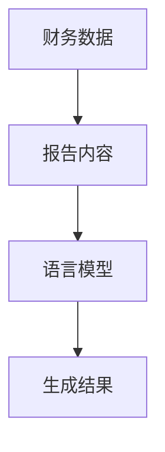
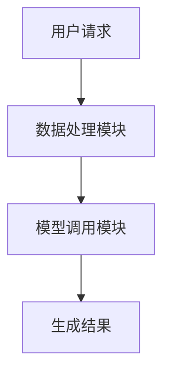
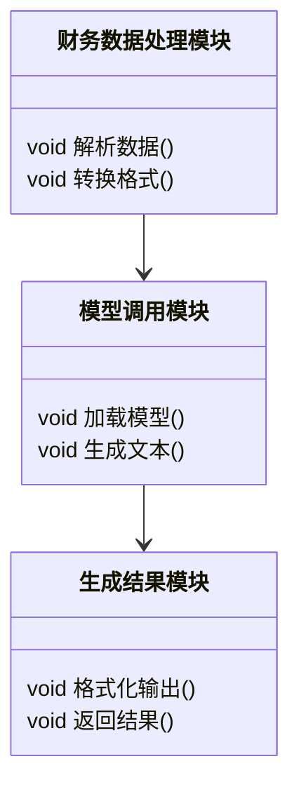
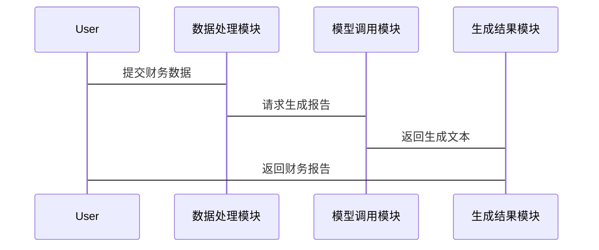

                 


# 构建企业级自然语言生成报告系统：多语言财务报告自动化

> **关键词：** 自然语言生成、多语言模型、企业级系统、财务报告、深度学习

> **摘要：** 本文详细探讨了如何构建一个企业级的自然语言生成（NLG）系统，用于自动生成多语言财务报告。文章从问题背景出发，分析了传统财务报告生成的痛点，提出了基于预训练语言模型的解决方案。通过系统架构设计、算法原理、项目实战等多方面的详细阐述，为读者提供了一套完整的构建方法和实现方案。

---

## 第1章 问题背景与需求分析

### 1.1 问题背景

#### 1.1.1 传统财务报告生成的痛点
传统的财务报告生成过程依赖人工操作，存在效率低、成本高、易出错等问题。财务数据的复杂性（如多语言支持、数据多样性等）使得人工生成报告的效率难以满足企业的需求。

#### 1.1.2 自然语言生成技术的兴起
随着深度学习技术的快速发展，自然语言生成技术（NLG）逐渐成熟。它能够通过预训练模型生成高质量的文本内容，为自动化报告生成提供了可能。

#### 1.1.3 多语言财务报告的需求
全球化背景下，企业需要支持多种语言的财务报告，以满足跨国业务的需求。传统的翻译工具难以应对财务报告的专业性和准确性要求，而基于模型的多语言生成技术成为更优的选择。

### 1.2 问题描述

#### 1.2.1 财务报告生成的复杂性
财务报告通常包含大量专业术语和结构化数据，需要确保生成的文本既准确又符合格式要求。

#### 1.2.2 多语言支持的挑战
不同语言的语法结构、文化差异等因素增加了多语言生成的复杂性。如何在保持内容准确性的同时，适应不同语言的表达习惯是关键。

#### 1.2.3 企业级系统的可靠性要求
企业级系统需要高可用性、高扩展性和高安全性，这对自然语言生成系统的架构设计提出了更高要求。

### 1.3 问题解决思路

#### 1.3.1 自然语言生成技术的应用
利用预训练语言模型（如GPT系列）进行微调，使其适应财务报告生成任务。

#### 1.3.2 多语言模型的构建
通过多任务学习或数据增强技术，训练一个多语言模型，使其能够生成多种语言的财务报告。

#### 1.3.3 企业级系统的架构设计
设计一个模块化、可扩展的系统架构，确保系统的可靠性和高效性。

### 1.4 系统的边界与外延

#### 1.4.1 系统的功能边界
- **输入：** 财务数据、模板、目标语言
- **输出：** 自动生成的财务报告
- **功能：** 数据处理、模型调用、结果生成

#### 1.4.2 系统的外部接口
- **数据接口：** 与企业财务系统对接
- **用户接口：** 提供API或Web界面供用户调用

#### 1.4.3 系统的扩展性设计
支持多种语言的扩展、多种报告模板的扩展，以及模型的持续优化。

---

## 第2章 核心概念与联系

### 2.1 自然语言生成（NLG）原理

#### 2.1.1 NLG的基本概念
自然语言生成是将结构化数据转化为自然语言文本的过程。它依赖于预训练语言模型的上下文理解和生成能力。

#### 2.1.2 基于预训练模型的生成原理
预训练模型通过大量数据的训练，掌握了语言的语义和语法结构。在微调阶段，模型通过特定任务的数据训练，生成符合需求的文本。

#### 2.1.3 多语言模型的特殊性
多语言模型需要在多种语言之间共享参数，同时又能够区分不同语言的语法和表达习惯。

### 2.2 核心概念对比表

| **核心概念** | **单语言模型** | **多语言模型** |
|--------------|----------------|----------------|
| **训练数据** | 单一语言数据    | 多种语言数据    |
| **生成能力** | 仅支持一种语言  | 支持多种语言    |
| **模型复杂性** | 较低           | 较高           |

### 2.3 ER实体关系图



---

## 第3章 算法原理与数学模型

### 3.1 预训练模型的微调

#### 3.1.1 微调的目标函数
$$ \text{Loss} = -\sum_{i=1}^{n} \log P(w_i|w_{<i}) $$

#### 3.1.2 优化器的选择
$$ \text{Adam} = \text{优化器} $$

### 3.2 多语言模型的训练策略

#### 3.2.1 多任务学习
$$ \text{Loss} = \lambda_1 L_1 + \lambda_2 L_2 $$

#### 3.2.2 数据增强技术
通过数据增强技术（如随机替换、同义词替换等）提高模型的泛化能力。

### 3.3 生成过程的数学模型

#### 3.3.1 解码过程
$$ y_{t} = \text{argmax}(P(y_t|y_{<t}, x)) $$

#### 3.3.2 模型评估指标
$$ \text{BLEU} = \text{指标} $$

---

## 第4章 系统架构与设计

### 4.1 系统架构设计



### 4.2 系统功能设计



### 4.3 系统接口设计



---

## 第5章 项目实战

### 5.1 环境安装

#### 5.1.1 安装依赖
```bash
pip install transformers
pip install torch
pip install numpy
```

#### 5.1.2 环境配置
```bash
export PYTHONPATH=$PYTHONPATH:.
```

### 5.2 系统核心实现

#### 5.2.1 数据处理模块

```python
import torch
from transformers import AutoTokenizer, AutoModelForCausalLM

class FinancialDataProcessor:
    def __init__(self, model_name):
        self.tokenizer = AutoTokenizer.from_pretrained(model_name)
        self.model = AutoModelForCausalLM.from_pretrained(model_name)
    
    def process_data(self, input_data):
        # 数据处理逻辑
        pass
```

#### 5.2.2 模型调用模块

```python
class ModelInvoker:
    def __init__(self, processor):
        self.processor = processor
    
    def generate_report(self, input_data):
        processed_data = self.processor.process_data(input_data)
        # 调用模型生成报告
        pass
```

### 5.3 实际案例分析

#### 5.3.1 案例背景
假设我们有一个财务数据集，包含收入、支出、利润等信息，目标生成一份英文和中文的财务报告。

#### 5.3.2 案例实现

```python
def generate_multi_language_report(data, target_languages):
    for lang in target_languages:
        processor = FinancialDataProcessor(lang_model)
        report = processor.generate_report(data)
        print(f"{lang}: {report}")
```

#### 5.3.3 案例分析
通过多语言模型的训练和调用，生成准确且符合语言习惯的财务报告。

---

## 第6章 最佳实践与小结

### 6.1 最佳实践

#### 6.1.1 模型选择
选择适合任务的预训练模型，如GPT系列。

#### 6.1.2 数据处理
确保数据的多样性和质量，避免过偏的数据对模型的影响。

#### 6.1.3 模型优化
通过调参和微调，提高模型的生成效果。

### 6.2 小结

本文详细探讨了如何构建一个企业级的自然语言生成报告系统，用于多语言财务报告的自动生成。通过系统架构设计、算法原理、项目实战等部分的阐述，为读者提供了一套完整的解决方案。

### 6.3 注意事项

- 模型的可解释性需要进一步优化。
- 数据隐私保护是系统设计的重要部分。
- 持续优化模型性能以适应业务需求。

### 6.4 拓展阅读

- 《Deep Learning》
- 《Natural Language Processing with PyTorch》
- 《Effective Pretrained Model Adaptation》

---

**作者：AI天才研究院/AI Genius Institute & 禅与计算机程序设计艺术/Zen And The Art of Computer Programming**

