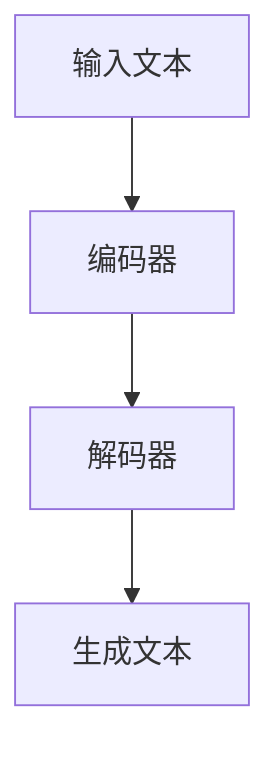
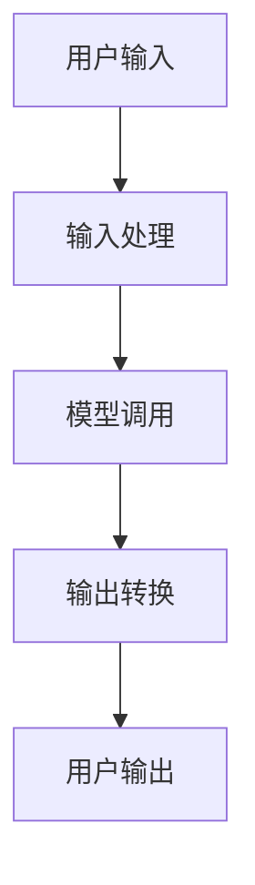
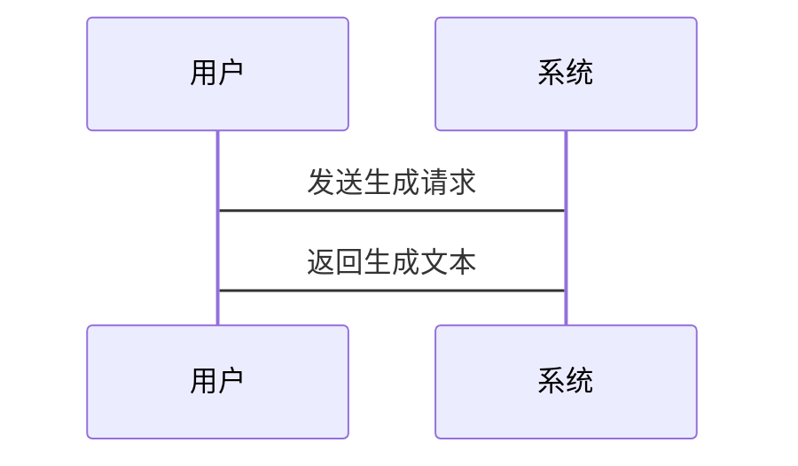

                 


# 构建企业级自然语言生成系统：多语种、多风格报告自动化

> 关键词：自然语言生成，企业级系统，多语种，多风格，自动化报告，NLP，深度学习

> 摘要：本文系统地介绍了如何构建一个企业级自然语言生成系统，涵盖从多语种支持到多风格文本生成的全生命周期。文章首先分析了自然语言生成技术的背景与核心概念，然后深入探讨了生成模型的算法原理，接着详细讲解了多语种与多风格生成的技术实现，最后通过项目实战展示了系统的架构设计与实现细节。本文旨在为企业技术负责人和开发者提供一份从理论到实践的全面指南，帮助他们高效构建具备多语言和多风格支持的自动化报告生成系统。

---

# 第一部分: 企业级自然语言生成系统概述

# 第1章: 自然语言生成系统背景与概念

## 1.1 问题背景与问题描述

### 1.1.1 传统文档生成的痛点
- **人工效率低**：企业报告、文档生成通常依赖人工编写，耗时且成本高。
- **一致性差**：不同作者的风格不统一，导致文档质量参差不齐。
- **灵活性不足**：面对不同的语言和风格需求时，难以快速响应和调整。

### 1.1.2 自然语言生成技术的出现
- **技术进步**：深度学习技术的发展使得自然语言生成（NLG）成为可能。
- **应用场景**：企业级应用中，NLG技术可以自动化生成报告、摘要、邮件等文本内容。

### 1.1.3 企业级应用的需求与挑战
- **需求**：多语种支持、多种风格切换、高生成效率、结果一致性。
- **挑战**：模型的泛化能力、多语言切换的稳定性、生成内容的可解释性。

## 1.2 自然语言生成系统的核心概念

### 1.2.1 自然语言生成（NLG）的定义
- **NLG**：将结构化数据或特定输入转化为自然语言文本的过程。
- **生成过程**：从输入到输出，包括编码、解码、生成三个主要阶段。

### 1.2.2 多语种与多风格生成的必要性
- **多语种**：支持多种语言输出，满足国际化企业的需求。
- **多风格**：根据不同的场景和受众，生成不同语气和格式的文本。

### 1.2.3 企业级系统的特性与目标
- **特性**：高可用性、可扩展性、可定制化。
- **目标**：实现自动化、智能化的文本生成，降低人工成本，提升效率。

## 1.3 本章小结
本章通过分析传统文档生成的痛点，引出了自然语言生成技术的应用价值，并详细阐述了企业级自然语言生成系统的特性与目标。

---

# 第二部分: 自然语言生成系统的算法原理

# 第2章: 自然语言生成的核心算法

## 2.1 预训练语言模型原理

### 2.1.1 Transformer架构的简介
- **Transformer**：由编码器和解码器组成，通过自注意力机制捕捉文本中的语义信息。
- **自注意力机制**：计算输入序列中每个词与其他词的相关性，生成位置权重。

### 2.1.2 注意力机制的数学模型
$$\text{Attention}(Q,K,V) = \text{softmax}(\frac{QK^T}{\sqrt{d_k}})V$$

### 2.1.3 预训练任务与目标函数
$$\text{Loss} = -\sum_{i=1}^{n}\log p(x_i|x_{<i})$$

## 2.2 微调与适应企业需求

### 2.2.1 任务特定的微调策略
- **微调**：在预训练模型的基础上，针对特定任务进行进一步训练。
- **策略**：保持编码器的权重不变，仅微调解码器的权重。

### 2.2.2 参数初始化与冻结策略
- **初始化**：加载预训练模型的权重。
- **冻结策略**：冻结编码器的权重，仅微调解码器的权重。

### 2.2.3 多任务学习的应用
- **多任务学习**：同时训练多个任务，共享模型参数，提升模型的泛化能力。

## 2.3 算法流程图


## 2.4 本章小结
本章详细介绍了自然语言生成的核心算法，包括Transformer架构、注意力机制和预训练模型的微调策略。

---

# 第三部分: 多语种与多风格生成技术

# 第3章: 多语种自然语言生成

## 3.1 多语种模型的构建

### 3.1.1 多语言模型的架构设计
- **多语言模型**：通过共享参数，同时支持多种语言的生成。
- **语言标识符**：在输入时添加语言标识符，指导模型生成对应语言的文本。

### 3.1.2 跨语言迁移学习的策略
- **迁移学习**：利用预训练的多语言模型，进行跨语言的微调。
- **策略**：保持编码器的共享参数，针对目标语言微调解码器的参数。

### 3.1.3 跨语言词表对齐技术
- **词表对齐**：通过构建跨语言的词表映射，提升模型在不同语言之间的生成能力。

## 3.2 多语种生成的实现细节

### 3.2.1 語言标识符的设计
- **语言标识符**：在输入时添加语言标识符，如语言代码或标签。
- **实现方式**：在编码器输入中加入语言向量。

### 3.2.2 語言间的语义对齐
- **语义对齐**：通过预训练模型的自注意力机制，实现跨语言语义的对齐。

### 3.2.3 跨语言训练数据的平衡
- **数据平衡**：在训练过程中，保证不同语言的数据分布均衡。

## 3.3 本章小结
本章详细介绍了多语种自然语言生成技术的实现细节，包括多语言模型的架构设计和跨语言迁移学习的策略。

---

# 第四部分: 企业级系统架构与实现

# 第4章: 系统架构设计

## 4.1 系统功能模块划分

### 4.1.1 输入处理模块
- **输入处理**：接收用户的输入，解析请求参数。
- **功能**：解析输入文本、语言标识符、风格参数。

### 4.1.2 模型调用模块
- **模型调用**：根据输入参数，调用对应的生成模型。
- **功能**：模型选择、参数传递、结果获取。

### 4.1.3 输出格式转换模块
- **输出转换**：将生成的文本格式化为指定的输出格式。
- **功能**：文本校对、格式调整、结果输出。

## 4.2 系统架构图


## 4.3 接口设计与交互流程

### 4.3.1 RESTful API设计
- **API设计**：提供RESTful API接口，支持HTTP请求。
- **请求格式**：JSON格式，包含输入文本、语言标识符、风格参数。

### 4.3.2 微服务架构实现
- **微服务架构**：将系统划分为多个微服务，实现模块化设计。
- **服务划分**：输入处理服务、模型调用服务、输出转换服务。

### 4.3.3 请求-响应流程图


## 4.4 本章小结
本章详细介绍了企业级自然语言生成系统的架构设计，包括功能模块划分、系统架构图和接口设计。

---

# 第五部分: 项目实战与优化

# 第5章: 项目实战

## 5.1 环境搭建与依赖安装

### 5.1.1 安装Python与相关库
- **安装Python**：Python 3.8及以上版本。
- **安装库**：`transformers`, `torch`, `mermaid`, `pylatex`

### 5.1.2 配置GPU加速环境
- **GPU配置**：安装NVIDIA显卡驱动和CUDA toolkit。
- **环境配置**：设置`CUDA_VISIBLE_DEVICES`环境变量。

### 5.1.3 下载预训练模型
- **模型下载**：从Hugging Face下载预训练的多语言模型。

## 5.2 核心代码实现

### 5.2.1 模型加载与初始化
```python
from transformers import AutoModelForMaskedLM, AutoTokenizer

model_name = "facebook/multi-qa"
model = AutoModelForMaskedLM.from_pretrained(model_name)
tokenizer = AutoTokenizer.from_pretrained(model_name)
```

### 5.2.2 模型调用与生成
```python
def generate_text(input_text, language='zh', style='formal'):
    inputs = tokenizer.encode(input_text, return_tensors='pt')
    outputs = model.generate(inputs, max_length=50, do_sample=True)
    generated_text = tokenizer.decode(outputs[0], skip_special_tokens=True)
    return generated_text
```

### 5.2.3 输出格式转换
```python
def format_output(generated_text, output_format='json'):
    if output_format == 'json':
        return json.dumps({'result': generated_text})
    else:
        return generated_text
```

## 5.3 本章小结
本章通过实际项目案例，详细介绍了企业级自然语言生成系统的环境搭建和核心代码实现。

---

# 第六部分: 总结与展望

# 第6章: 总结与展望

## 6.1 本章小结
- **总结**：本文详细介绍了企业级自然语言生成系统的构建过程，包括算法原理、系统架构和项目实战。
- **展望**：未来的研究方向包括多语言模型的优化、生成内容的可解释性提升以及多模态生成技术的探索。

---

# 参考文献

[1] Vaswani, A., et al. "Attention Is All You Need." arXiv preprint arXiv:1706.03798, 2017.

[2] Brown, T., et al. "Language Models Are Few-Shot Learners." arXiv preprint arXiv:2003.02958, 2020.

[3] Devlin, J., et al. "BERT: Pre-training of deep bidirectional transformers for language understanding." arXiv preprint arXiv:1810.04699, 2018.

---

作者：AI天才研究院/AI Genius Institute & 禅与计算机程序设计艺术/Zen And The Art of Computer Programming

