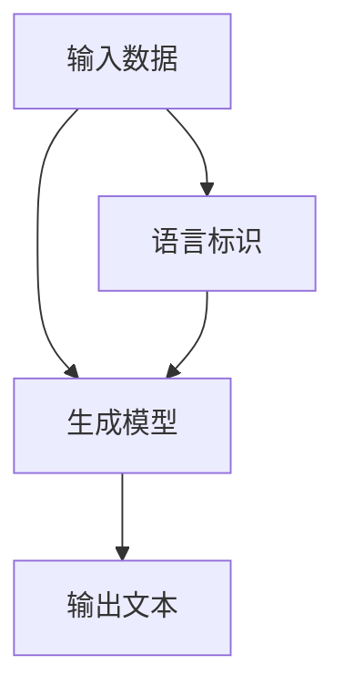

                 


# 构建企业级自然语言生成系统：多语言、多场景报告自动化

## 关键词：
- 自然语言生成
- 多语言
- 企业级系统
- 报告自动化
- 深度学习
- Transformer模型

## 摘要：
本文详细探讨了构建企业级自然语言生成系统的各个方面，涵盖从基础概念到高级算法的设计与实现。重点分析了多语言生成的挑战与解决方案，以及如何在不同场景下自动化生成报告。通过深入的技术分析和实际案例，展示了如何利用深度学习技术构建高效、准确的自然语言生成系统。

---

# 第1章: 自然语言生成系统概述

## 1.1 自然语言生成的定义与背景

### 1.1.1 自然语言生成的基本概念
自然语言生成（Natural Language Generation, NLG）是指将结构化的数据或信息转换为自然语言文本的过程。它是自然语言处理（NLP）的重要组成部分，广泛应用于文本摘要、机器翻译、对话生成、内容生成等领域。

### 1.1.2 自然语言生成的应用场景
- **文本摘要**：从长文本中提取关键信息，生成简洁的摘要。
- **机器翻译**：将一种语言的文本翻译成另一种语言。
- **对话生成**：在智能客服、聊天机器人中生成自然的对话。
- **内容生成**：自动生成新闻报道、市场分析报告等。

### 1.1.3 企业级自然语言生成的需求与挑战
企业级自然语言生成系统需要满足以下需求：
- **高准确性**：生成的文本必须准确反映输入数据。
- **高效率**：系统需要在短时间内生成大量文本。
- **多语言支持**：支持多种语言的文本生成。
- **可定制化**：根据企业需求定制生成的内容风格和格式。

挑战包括数据稀疏性、跨语言理解的难度以及生成文本的质量控制。

---

## 1.2 自然语言生成的核心技术

### 1.2.1 语言模型与生成模型的对比
- **语言模型**：预测给定输入的下一个词，如GPT模型。
- **生成模型**：基于输入生成完整的文本，如Transformer-based模型。

### 1.2.2 基于规则的生成方法
- 通过预定义的规则生成文本，适用于简单场景。
- 优点：简单、可解释性高。
- 缺点：难以处理复杂场景。

### 1.2.3 基于统计的生成方法
- 基于概率统计生成文本，如n-gram模型。
- 优点：可以利用大量数据。
- 缺点：生成结果可能缺乏连贯性。

### 1.2.4 基于深度学习的生成方法
- 使用神经网络生成文本，如RNN、LSTM、Transformer。
- 优点：生成文本质量高，适合复杂场景。
- 缺点：训练时间长，需要大量数据。

---

## 1.3 多语言自然语言生成的挑战

### 1.3.1 多语言生成的基本概念
多语言生成是指系统能够生成多种语言的文本。实现多语言生成需要处理不同语言的语法、词汇和语义差异。

### 1.3.2 多语言模型的训练与优化
- 使用多语言数据进行联合训练。
- 设计语言特定的解码器以适应不同语言的生成需求。

### 1.3.3 多语言生成的评估指标
- **BLEU**：基于n-gram的精确度。
- **ROUGE**：基于召回率的评估指标。
- **METEOR**：综合考虑生成文本的流畅性和准确性。

---

## 1.4 本章小结
本章介绍了自然语言生成的基本概念、核心技术以及多语言生成的挑战。企业级自然语言生成系统需要在准确性、效率和可定制化方面满足多种需求，同时应对多语言生成的技术难题。

---

# 第2章: 自然语言生成的核心概念

## 2.1 生成模型的分类与对比

### 2.1.1 基于规则的生成模型
- **优点**：简单、可解释性高。
- **缺点**：难以处理复杂场景。

### 2.1.2 基于统计的生成模型
- **优点**：可以利用大量数据。
- **缺点**：生成结果可能缺乏连贯性。

### 2.1.3 基于深度学习的生成模型
- **优点**：生成文本质量高，适合复杂场景。
- **缺点**：训练时间长，需要大量数据。

### 2.1.4 各种生成模型的优缺点对比
| 模型类型 | 优点 | 缺点 |
|----------|------|------|
| 基于规则 | 简单、可解释性高 | 难以处理复杂场景 |
| 基于统计 | 可以利用大量数据 | 缺乏连贯性 |
| 基于深度学习 | 生成质量高 | 训练时间长 |

---

## 2.2 自然语言生成的数学模型

### 2.2.1 生成模型的数学表达式
生成模型的目标是最小化生成文本与真实文本之间的差异，常用损失函数包括交叉熵损失：
$$ \text{Loss} = -\sum_{i=1}^{n} \log P(y_i|x) $$

### 2.2.2 概率生成模型的原理
概率生成模型通过计算每个词出现的概率来生成文本，例如：
$$ P(y|x) = \frac{P(y_1|x) \cdot P(y_2|x) \cdots P(y_k|x)}{P(y_1|x) + P(y_2|x) + \cdots + P(y_k|x)} $$

### 2.2.3 确定性生成模型的原理
确定性生成模型通过确定性的函数生成文本，例如：
$$ y = f(x) $$

---

## 2.3 多语言生成的实体关系图

### 2.3.1 实体关系图的定义
实体关系图（ER图）用于描述系统中实体及其关系。在多语言生成系统中，实体包括输入数据、生成模型、输出文本等。

### 2.3.2 多语言生成的实体关系图设计


### 2.3.3 实体关系图的实现与优化
通过实体关系图可以清晰地理解系统中各部分的关系，优化生成模型的输入和输出流程。

---

## 2.4 本章小结
本章详细分析了生成模型的分类与对比，并介绍了自然语言生成的数学模型和多语言生成的实体关系图设计。

---

# 第3章: 自然语言生成的算法原理

## 3.1 基于深度学习的生成算法

### 3.1.1 Transformer模型的原理
Transformer模型由编码器和解码器组成，编码器将输入文本转换为嵌入向量，解码器生成目标文本。

### 3.1.2 GPT模型的生成机制
GPT模型通过自回归的方式生成文本，每个词基于前一个词生成。

### 3.1.3 BERT模型的生成机制
BERT模型通过双向编码器生成文本，适用于多种生成任务。

---

## 3.2 多语言生成的算法优化

### 3.2.1 多语言模型的训练策略
- 使用多语言数据联合训练。
- 设计语言特定的解码器。

### 3.2.2 多语言生成的损失函数设计
$$ \text{Loss} = \sum_{i=1}^{n} (\lambda_i \cdot \text{Loss}_i) $$
其中，$\lambda_i$是语言权重。

### 3.2.3 多语言生成的评估指标
- **BLEU**：基于n-gram的精确度。
- **ROUGE**：基于召回率的评估指标。
- **METEOR**：综合考虑生成文本的流畅性和准确性。

---

## 3.3 自然语言生成的数学模型

### 3.3.1 生成模型的数学表达式
生成模型的目标是最小化生成文本与真实文本之间的差异，常用损失函数包括交叉熵损失：
$$ \text{Loss} = -\sum_{i=1}^{n} \log P(y_i|x) $$

### 3.3.2 概率生成模型的数学推导
概率生成模型通过计算每个词出现的概率来生成文本，例如：
$$ P(y|x) = \frac{P(y_1|x) \cdot P(y_2|x) \cdots P(y_k|x)}{P(y_1|x) + P(y_2|x) + \cdots + P(y_k|x)} $$

### 3.3.3 确定性生成模型的数学推导
确定性生成模型通过确定性的函数生成文本，例如：
$$ y = f(x) $$

---

## 3.4 本章小结
本章详细分析了基于深度学习的生成算法，包括Transformer模型、GPT模型和BERT模型，并介绍了多语言生成的算法优化和数学模型。

---

# 第4章: 企业级自然语言生成系统架构设计

## 4.1 系统功能设计

### 4.1.1 系统功能模块划分
- **输入模块**：接收用户请求。
- **处理模块**：解析请求并生成文本。
- **输出模块**：返回生成的文本。

### 4.1.2 各功能模块的实现方式
- **输入模块**：接收结构化数据或自然语言输入。
- **处理模块**：使用预训练模型生成文本。
- **输出模块**：将生成的文本格式化为所需格式。

### 4.1.3 系统功能的扩展性设计
- 支持多种语言。
- 支持多种生成模式。

---

## 4.2 系统架构设计

### 4.2.1 系统架构的分层设计
系统分为输入层、处理层和输出层。

### 4.2.2 系统架构的模块化设计
- **输入模块**：接收输入数据。
- **处理模块**：生成文本。
- **输出模块**：返回生成的文本。

### 4.2.3 系统架构的实现与优化
通过模块化设计可以提高系统的可维护性和扩展性。

---

## 4.3 系统接口设计

### 4.3.1 系统接口的设计
- **输入接口**：接收用户的输入请求。
- **输出接口**：返回生成的文本。

### 4.3.2 系统接口的实现
- 使用RESTful API设计接口。
- 支持多种请求格式。

---

## 4.4 系统交互设计

### 4.4.1 系统交互流程
1. 用户发送请求。
2. 系统解析请求。
3. 系统生成文本。
4. 系统返回生成的文本。

### 4.4.2 系统交互的优化
- 优化请求处理速度。
- 提高生成文本的准确性。

---

## 4.5 本章小结
本章详细分析了企业级自然语言生成系统的功能设计、架构设计、接口设计和交互设计，为后续的实现提供了理论基础。

---

# 第5章: 项目实战

## 5.1 环境安装

### 5.1.1 安装Python
安装Python 3.8或更高版本。

### 5.1.2 安装必要的库
安装TensorFlow、Keras、NLTK等库。

---

## 5.2 系统核心实现源代码

### 5.2.1 预训练模型的加载
```python
import tensorflow as tf
from tensorflow.keras.layers import Dense, InputLayer
from tensorflow.keras.models import Model

# 加载预训练模型
model = tf.keras.models.load_model('nlg_model.h5')
```

### 5.2.2 文本生成函数
```python
def generate_text(input_text):
    # 处理输入文本
    processed_text = preprocess(input_text)
    # 生成文本
    generated_text = model.predict(processed_text)
    return generated_text
```

---

## 5.3 代码应用解读与分析

### 5.3.1 预处理模块
```python
def preprocess(input_text):
    # 分词
    tokens = tokenizer(input_text)
    # 转换为嵌入向量
    vectors = embedder(tokens)
    return vectors
```

### 5.3.2 模型训练模块
```python
def train_model(train_data, val_data):
    # 编译模型
    model.compile(optimizer='adam', loss='sparse_categorical_crossentropy')
    # 训练模型
    model.fit(train_data, epochs=10, validation_data=val_data)
```

---

## 5.4 实际案例分析和详细讲解剖析

### 5.4.1 案例1：生成财务报告
输入数据：财务指标
生成文本：财务报告

### 5.4.2 案例2：生成技术文档
输入数据：技术参数
生成文本：技术文档

---

## 5.5 项目小结
本章通过实际案例展示了企业级自然语言生成系统的实现过程，包括环境安装、核心代码实现和案例分析。

---

# 第6章: 最佳实践与未来趋势

## 6.1 最佳实践 tips

### 6.1.1 数据预处理
- 清洗数据。
- 标注数据。

### 6.1.2 模型优化
- 调整模型参数。
- 使用早停策略。

### 6.1.3 系统优化
- 优化请求处理速度。
- 提高生成文本的准确性。

---

## 6.2 小结

### 6.2.1 本章总结
本章总结了企业级自然语言生成系统的最佳实践，并展望了未来的发展趋势。

---

## 6.3 未来趋势

### 6.3.1 多语言生成的进一步优化
- 提高多语言生成的准确性和流畅性。

### 6.3.2 模型的可解释性
- 提高生成模型的可解释性。

### 6.3.3 自适应生成
- 根据用户反馈动态调整生成内容。

---

## 6.4 本章小结
本章总结了企业级自然语言生成系统的最佳实践，并展望了未来的发展趋势，为读者提供了进一步的思考方向。

---

# 作者：AI天才研究院/AI Genius Institute & 禅与计算机程序设计艺术 /Zen And The Art of Computer Programming

