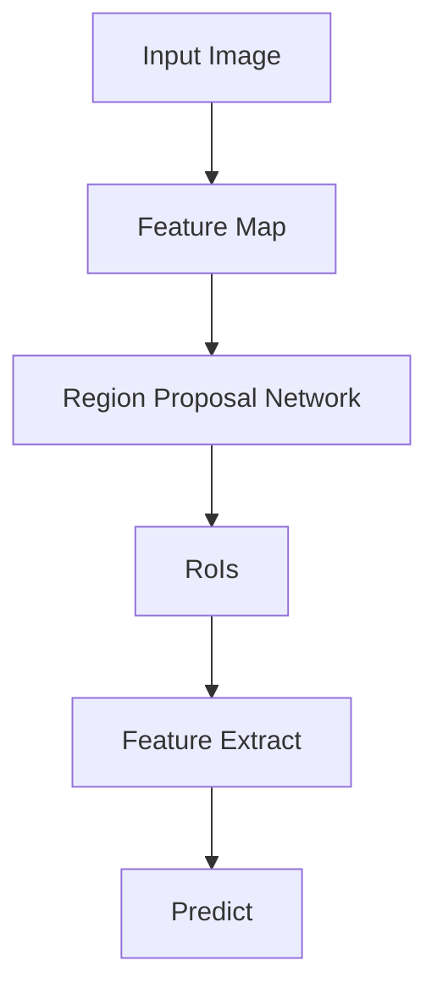
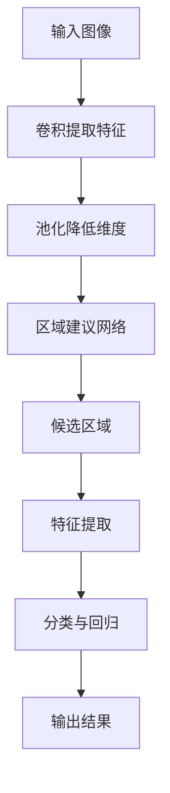
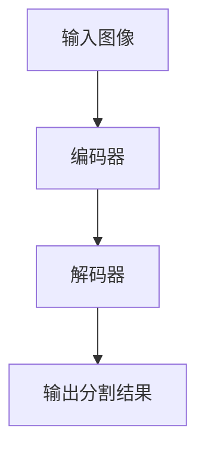
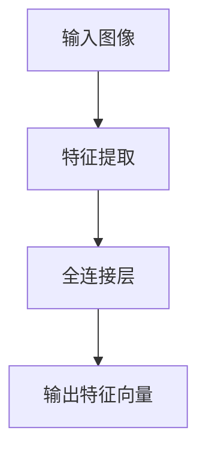
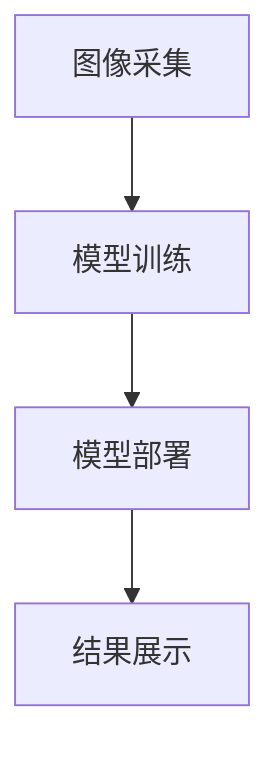
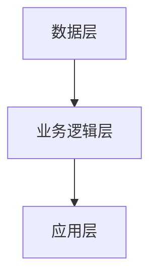
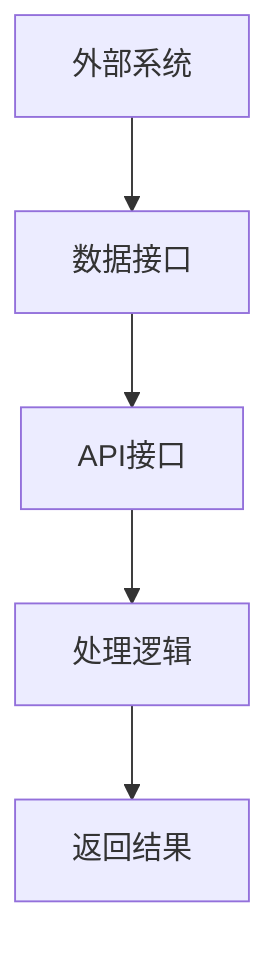

                 


# 构建企业级计算机视觉平台：从质检到安防的全面应用

## 关键词：企业级计算机视觉平台、计算机视觉、图像处理、深度学习、目标检测、系统架构、项目实战

## 摘要：  
随着人工智能技术的快速发展，计算机视觉在企业级应用中的重要性日益凸显。本文从企业级计算机视觉平台的背景、核心概念、算法原理、系统架构设计到实际项目案例，全面解析了如何构建一个高效、可靠的计算机视觉平台。文章结合工业质检和安防监控两大应用场景，详细探讨了平台的构建过程，包括系统功能设计、架构选型、接口设计及算法实现等关键环节，为企业级计算机视觉平台的建设和优化提供了深度的理论支持和实践指导。

---

# 第一部分: 引言

## 第1章: 企业级计算机视觉平台的背景与意义

### 1.1 计算机视觉的定义与应用领域

计算机视觉（Computer Vision）是人工智能领域的重要分支，旨在通过计算机模拟人类视觉系统的能力，对图像或视频进行分析和理解。其主要应用领域包括：

- **工业制造**：如缺陷检测、质量控制。
- **安防监控**：如人脸识别、行为分析。
- **医疗健康**：如医学影像分析。
- **智能交通**：如车牌识别、交通监控。

### 1.2 企业级计算机视觉平台的背景

随着工业智能化和数字化转型的推进，企业对自动化和智能化的需求日益增加。计算机视觉技术能够帮助企业实现生产效率的提升和成本的降低。企业级计算机视觉平台通过整合多种视觉技术，为企业提供统一的解决方案，满足复杂场景下的需求。

### 1.3 企业级平台的特点与挑战

- **特点**：
  - 高可用性：确保系统在复杂环境下的稳定运行。
  - 高扩展性：支持多种应用场景和数据规模。
  - 高效性：通过优化算法和硬件配置，提升处理速度。

- **挑战**：
  - 数据量大：企业级平台需要处理海量数据。
  - 多场景支持：需要适应不同的应用场景和需求。
  - 系统集成：需要与其他企业级系统（如ERP、MES）无缝集成。

---

# 第二部分: 核心概念与联系

## 第2章: 计算机视觉的核心概念与技术

### 2.1 图像处理与计算机视觉的关系

图像处理是计算机视觉的基础，主要涉及对图像的采集、处理和分析。计算机视觉则在此基础上，通过算法实现对图像的高层次理解，如物体识别、场景重建等。

| 技术 | 描述 | 应用场景 |
|------|------|----------|
| 图像增强 | 提高图像质量 | 低光环境下的图像优化 |
| 图像分割 | 将图像分成不同区域 | 医疗影像分析 |
| 目标检测 | 检测图像中的目标物体 | 工业质检中的缺陷检测 |

### 2.2 常见计算机视觉技术对比

以下是几种常见计算机视觉技术的对比：

| 技术 | 特点 | 应用场景 |
|------|------|----------|
| 目标检测 | 高精度定位 | 工业质检 |
| 图像分割 | 精细区域划分 | 医疗影像分析 |
| 人脸识别 | 高精度识别 | 安防监控 |

### 2.3 实体关系图（ER图）架构

以下是企业级计算机视觉平台的实体关系图：

```mermaid
er
    actor: 用户
    role: 管理员
    entity: 图像数据
    entity: 检测结果
    entity: 系统日志
    actor --> entity: 提交图像
    actor --> entity: 查看结果
    role --> entity: 管理日志
```

---

# 第三部分: 算法原理讲解

## 第3章: 常见计算机视觉算法原理

### 3.1 基于CNN的目标检测算法

#### 3.1.1 卷积神经网络（CNN）的基本原理

卷积神经网络通过卷积操作提取图像特征，再通过池化操作降低计算量。以下是CNN的基本结构：

- **卷积层**：提取图像特征。
- **池化层**：降低特征维度。
- **全连接层**：分类输出。

#### 3.1.2 目标检测算法（如Faster R-CNN）的流程

Faster R-CNN的流程如下：

1. **提取特征**：通过CNN提取图像特征图。
2. **生成建议框**：通过区域建议网络生成候选区域。
3. **分类与回归**：对每个候选区域进行分类和回归。

以下是Faster R-CNN的流程图：



#### 3.1.3 算法流程图

以下是目标检测算法的流程图：



### 3.2 图像分割算法

#### 3.2.1 U-Net网络结构

U-Net是一种经典的图像分割网络，由编码器和解码器组成。以下是U-Net的结构图：



#### 3.2.2 图像分割的数学模型

图像分割的数学模型如下：

$$
p(y|x) = \arg\max_{y} P(y|x)
$$

其中，$x$ 是输入图像，$y$ 是分割结果。

#### 3.2.3 分割算法的实现步骤

1. **数据预处理**：对图像进行归一化处理。
2. **模型训练**：使用U-Net网络进行训练。
3. **模型推理**：对输入图像进行分割。

以下是U-Net的实现代码示例：

```python
import torch
import torch.nn as nn
import torch.nn.functional as F

class UNet(nn.Module):
    def __init__(self, in_channels=3, out_channels=2):
        super(UNet, self).__init__()
        # 编码器部分
        self.encoder = nn.Sequential(
            nn.Conv2d(in_channels, 64, kernel_size=3, padding=1),
            nn.ReLU(),
            nn.Conv2d(64, 128, kernel_size=3, padding=1),
            nn.ReLU(),
            nn.MaxPool2d(2, 2)
        )
        # 解码器部分
        self.decoder = nn.Sequential(
            nn.ConvTranspose2d(128, 64, kernel_size=2, stride=2),
            nn.Conv2d(64, 64, kernel_size=3, padding=1),
            nn.ReLU(),
            nn.Conv2d(64, out_channels, kernel_size=1)
        )

    def forward(self, x):
        x = self.encoder(x)
        x = self.decoder(x)
        return x
```

### 3.3 人脸识别算法

#### 3.3.1 基于深度学习的人脸识别模型

常用的人脸识别模型包括FaceNet、DeepFace等。以下是FaceNet的结构图：



#### 3.3.2 人脸识别的数学公式

人脸识别的数学公式如下：

$$
d(x, y) = \sum_{i=1}^{n} (x_i - y_i)^2
$$

其中，$x$ 和 $y$ 是两个特征向量，$n$ 是特征维度。

#### 3.3.3 算法实现代码示例

以下是人脸识别模型的实现代码示例：

```python
import torch
import torch.nn as nn
import torch.nn.functional as F

class FaceNet(nn.Module):
    def __init__(self, embedding_dim=128):
        super(FaceNet, self).__init__()
        self.encoder = nn.Sequential(
            nn.Conv2d(3, 64, kernel_size=3, padding=1),
            nn.ReLU(),
            nn.Conv2d(64, 128, kernel_size=3, padding=1),
            nn.ReLU(),
            nn.MaxPool2d(2, 2)
        )
        self.decoder = nn.Sequential(
            nn.ConvTranspose2d(128, 64, kernel_size=2, stride=2),
            nn.Conv2d(64, embedding_dim, kernel_size=1)
        )

    def forward(self, x):
        x = self.encoder(x)
        x = self.decoder(x)
        return x
```

---

# 第四部分: 系统分析与架构设计

## 第4章: 企业级计算机视觉平台的系统架构

### 4.1 系统功能设计

企业级计算机视觉平台的功能模块包括：

- **图像采集**：负责图像的采集和预处理。
- **模型训练**：负责模型的训练和优化。
- **模型部署**：负责模型的部署和应用。
- **结果展示**：负责结果的可视化和展示。

以下是系统功能模块的交互流程：



### 4.2 系统架构设计

企业级计算机视觉平台的架构设计包括：

- **分层架构**：将系统分为数据层、业务逻辑层和应用层。
- **微服务架构**：将功能模块拆分为独立的服务。

以下是系统架构图：



### 4.3 接口设计与交互流程

企业级计算机视觉平台的接口设计包括：

- **数据接口**：负责数据的输入和输出。
- **API接口**：负责与外部系统的交互。

以下是接口交互流程：



---

# 第五部分: 项目实战

## 第5章: 项目实战

### 5.1 工业质检项目

#### 5.1.1 项目背景

工业质检是企业级计算机视觉平台的重要应用之一。以下是工业质检的环境配置：

```bash
安装依赖：
pip install torch torchvision numpy
```

以下是工业质检的实现代码示例：

```python
import torch
import torch.nn as nn
import torch.nn.functional as F

class QualityChecker(nn.Module):
    def __init__(self):
        super(QualityChecker, self).__init__()
        self.conv1 = nn.Conv2d(3, 64, kernel_size=3, padding=1)
        self.conv2 = nn.Conv2d(64, 128, kernel_size=3, padding=1)
        self.fc1 = nn.Linear(128*64*64, 128)
        self.fc2 = nn.Linear(128, 2)

    def forward(self, x):
        x = F.relu(self.conv1(x))
        x = F.relu(self.conv2(x))
        x = x.view(-1, 128*64*64)
        x = F.relu(self.fc1(x))
        x = self.fc2(x)
        return x
```

#### 5.1.2 项目小结

工业质检项目通过计算机视觉技术实现了对产品质量的高效检测，显著提升了生产效率和产品质量。

### 5.2 安防监控项目

#### 5.2.1 项目背景

安防监控是企业级计算机视觉平台的另一个重要应用。以下是安防监控的环境配置：

```bash
安装依赖：
pip install torch torchvision numpy
```

以下是安防监控的实现代码示例：

```python
import torch
import torch.nn as nn
import torch.nn.functional as F

class SecurityMonitor(nn.Module):
    def __init__(self):
        super(SecurityMonitor, self).__init__()
        self.conv1 = nn.Conv2d(3, 64, kernel_size=3, padding=1)
        self.conv2 = nn.Conv2d(64, 128, kernel_size=3, padding=1)
        self.fc1 = nn.Linear(128*64*64, 128)
        self.fc2 = nn.Linear(128, 2)

    def forward(self, x):
        x = F.relu(self.conv1(x))
        x = F.relu(self.conv2(x))
        x = x.view(-1, 128*64*64)
        x = F.relu(self.fc1(x))
        x = self.fc2(x)
        return x
```

#### 5.2.2 项目小结

安防监控项目通过计算机视觉技术实现了对视频监控的智能化分析，显著提升了安防效率和安全性。

---

# 第六部分: 最佳实践

## 第6章: 最佳实践

### 6.1 小结

企业级计算机视觉平台的构建需要综合考虑技术、系统架构和实际应用场景。通过本文的分析和实践，我们可以看到，计算机视觉技术在工业质检和安防监控中的应用前景广阔。

### 6.2 注意事项

- **数据质量**：确保数据的多样性和代表性。
- **算法优化**：不断优化算法以提升性能。
- **系统集成**：确保系统与其他企业级系统无缝集成。

### 6.3 拓展阅读

- 《深度学习实战》
- 《计算机视觉算法解析》
- 《企业级系统架构设计》

---

# 结语

企业级计算机视觉平台的构建是一个复杂的系统工程，需要综合运用多种技术手段和方法。通过本文的分析和实践，我们可以看到，计算机视觉技术在企业级应用中的潜力巨大。未来，随着技术的不断发展，企业级计算机视觉平台将在更多领域发挥重要作用。

---

# 作者

**作者：AI天才研究院 / AI Genius Institute**  
**禅与计算机程序设计艺术 / Zen And The Art of Computer Programming**

