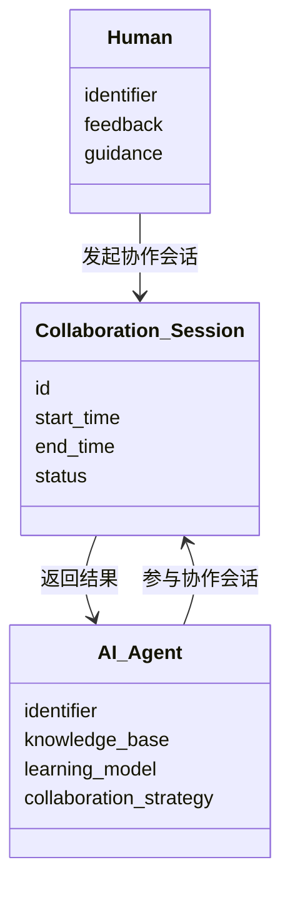

                 


# 构建具有人机协作学习能力的AI Agent系统

## 关键词：AI Agent，人机协作学习，机器学习，协作机制，系统架构

## 摘要：本文详细探讨了构建具有人机协作学习能力的AI Agent系统的各个方面，包括其核心概念、算法原理、系统架构设计以及项目实战。通过理论与实践相结合的方式，本文为读者提供了一个全面理解该技术的框架。

---

## 第1章: AI Agent与人机协作学习概述

### 1.1 AI Agent的基本概念

#### 1.1.1 AI Agent的定义与特点
- **定义**: AI Agent是一种能够感知环境并采取行动以实现目标的智能实体。
- **特点**: 自主性、反应性、社交能力、学习能力。

#### 1.1.2 人机协作学习的基本概念
- **定义**: 人类与机器之间通过互动共同学习和提高的过程。
- **核心要素**: 人类的指导、机器的学习能力、实时反馈。

#### 1.1.3 AI Agent与人机协作学习的关系
- AI Agent作为执行者，通过人机协作学习提升其智能水平和任务执行能力。

### 1.2 人机协作学习的背景与意义
- **背景**: 随着AI技术的发展，人机协作学习的需求日益增长。
- **意义**: 提高AI系统的适应性和智能性，增强人机互动的效率和效果。

### 1.3 人机协作学习的核心问题
- **协作目标的定义与分解**: 明确协作任务的目标，并将其分解为可执行的子任务。
- **协作过程中的信息交互**: 确保人类与机器之间的信息流畅通且有效。
- **协作效果的评估与反馈**: 建立有效的评估机制，并根据反馈调整协作策略。

---

## 第2章: 协作学习机制的原理与实现

### 2.1 协作学习的基本原理
#### 2.1.1 协作学习的定义与分类
- **定义**: 两个或多个实体通过协作完成共同任务的过程。
- **分类**: 基于任务协作、基于知识协作。

#### 2.1.2 协作学习的核心要素
- **共同目标**: 协作各方的共同目标。
- **信息共享**: 协作各方之间的信息交流。
- **角色分配**: 明确各参与方的职责和角色。

#### 2.1.3 协作学习的数学模型
- **模型**: $C = \{c_1, c_2, ..., c_n\}$，其中$c_i$表示第i个协作实体。
- **目标函数**: $f(C) = \max \sum_{i=1}^{n} v_i$，其中$v_i$表示第i个实体的价值贡献。

### 2.2 人机协作学习的协作机制
#### 2.2.1 协作流程
1. 人类发起任务请求。
2. AI Agent接收请求并理解任务目标。
3. 人类提供初始指导或反馈。
4. AI Agent执行任务并实时调整策略。
5. 任务完成，总结经验。

#### 2.2.2 协作过程中的信息交互模型
- **信息流**: 从人类到AI Agent的指令，从AI Agent到人类的执行结果反馈。

#### 2.2.3 反馈机制
- **实时反馈**: 在协作过程中，AI Agent根据人类的反馈调整行为。
- **事后反馈**: 任务完成后，AI Agent总结经验教训。

### 2.3 协作学习的系统架构
#### 2.3.1 系统架构的模块划分
- **用户界面模块**: 人机交互的入口。
- **AI Agent模块**: 执行任务的核心。
- **协作学习引擎**: 负责任务分解和协作策略的制定。

#### 2.3.2 系统架构的ER实体关系图
```mermaid
er
actor(AI Agent) {
  + identifier: string
  + knowledge_base: string
  + learning_model: string
  + collaboration_strategy: string
}

actor(Human) {
  + identifier: string
  + feedback: string
  + guidance: string
}

collaboration_session: {
  + id: integer
  + start_time: datetime
  + end_time: datetime
  + status: string
}

关系:
Human --> collaboration_session: 发起协作会话
AI Agent --> collaboration_session: 参与协作会话
```

---

## 第3章: 协作学习算法的数学模型与实现

### 3.1 强化学习算法

#### 3.1.1 强化学习的基本原理
- **定义**: 通过试错方法，智能体在环境中通过与环境交互来最大化累计奖励。
- **核心要素**: 状态、动作、奖励、策略。

#### 3.1.2 Q-learning算法
- **公式**: $$Q(s, a) = Q(s, a) + \alpha [r + \max_{a'} Q(s', a') - Q(s, a)]$$
- **实现步骤**: 初始化Q表，选择动作，执行动作，更新Q值。

#### 3.1.3 Q-learning算法的Python实现
```python
import numpy as np

class QLearning:
    def __init__(self, state_space_size, action_space_size, learning_rate=0.1, gamma=0.99):
        self.Q = np.zeros((state_space_size, action_space_size))
        self.alpha = learning_rate
        self.gamma = gamma

    def choose_action(self, state, epsilon=0.1):
        if np.random.random() < epsilon:
            return np.random.randint(0, self.Q.shape[1])
        return np.argmax(self.Q[state, :])

    def update_Q(self, state, action, reward, next_state):
        self.Q[state, action] = self.Q[state, action] + self.alpha * (reward + self.gamma * np.max(self.Q[next_state, :]) - self.Q[state, action])
```

### 3.2 监督学习算法

#### 3.2.1 监督学习的基本原理
- **定义**: 通过标记的数据训练模型，使其能够预测新数据的标签。
- **核心算法**: 线性回归、支持向量机、神经网络。

#### 3.2.2 协作学习算法
- **集成学习**: 结合多个学习器的预测结果，提高准确率。

---

## 第4章: 系统分析与架构设计

### 4.1 系统架构设计
#### 4.1.1 系统功能设计
- **领域模型**: 用Mermaid类图展示各模块之间的关系。


#### 4.1.2 系统架构的Mermaid架构图


---

## 第5章: 项目实战

### 5.1 环境搭建
- **工具安装**: 安装Python、TensorFlow、Mermaid工具等。

### 5.2 核心代码实现
```python
class Collaboration_Learner:
    def __init__(self, state_space, action_space):
        self.state_space = state_space
        self.action_space = action_space
        self.Q = np.zeros((state_space, action_space))

    def train(self, environment):
        for episode in range(1000):
            state = environment.reset()
            done = False
            while not done:
                action = self.choose_action(state)
                next_state, reward, done = environment.step(action)
                self.update_Q(state, action, reward, next_state)
```

### 5.3 案例分析
- **案例描述**: 一个简单的对话协作任务。
- **代码解读**: 解释代码的功能和实现细节。

### 5.4 项目总结
- **经验总结**: 在项目实施过程中遇到的问题及解决方案。
- **优化建议**: 如何进一步优化系统性能和协作效果。

---

## 第6章: 最佳实践与总结

### 6.1 设计原则
- **模块化设计**: 各模块独立，便于维护和扩展。
- **可扩展性**: 系统应具备良好的扩展性，以适应未来的功能需求。

### 6.2 注意事项
- **数据安全**: 确保协作过程中数据的安全性。
- **用户体验**: 设计良好的用户界面，提升用户体验。

### 6.3 未来趋势
- **多模态协作**: 结合视觉、听觉等多种交互方式，提升协作效果。
- **自适应学习**: 系统能够根据环境变化自动调整协作策略。

---

## 作者：AI天才研究院 & 禅与计算机程序设计艺术

---

通过以上结构，我们可以系统地构建一个具有人机协作学习能力的AI Agent系统，从理论到实践，全面覆盖各个关键点，确保系统的设计和实现既科学又实用。

