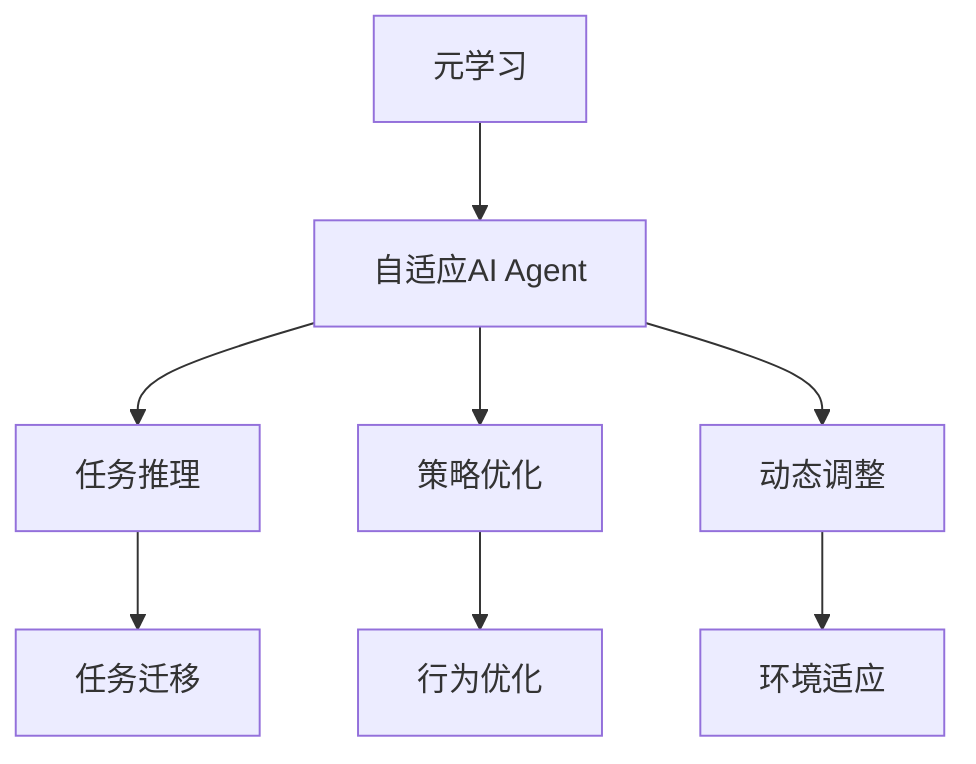
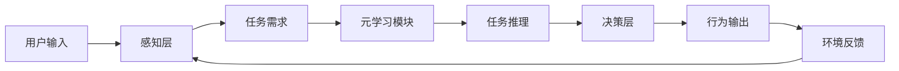

                 


# 构建具有元学习能力的自适应AI Agent

## 关键词：元学习，自适应AI Agent，算法，系统架构，项目实战

## 摘要：  
本文将详细探讨如何构建一个具有元学习能力的自适应AI Agent。通过分析元学习与自适应AI Agent的核心概念、算法原理、系统架构以及实际案例，我们将揭示如何通过元学习赋予AI Agent自适应能力，使其能够在复杂多变的环境中自主学习和适应新任务。本文结合理论与实践，提供详细的算法实现和系统设计，帮助读者全面理解并掌握这一前沿技术。

---

# 第一部分: 元学习与自适应AI Agent的背景与核心概念

## 第1章: 元学习与自适应AI Agent概述

### 1.1 元学习的基本概念

#### 1.1.1 元学习的定义与特点
元学习（Meta-Learning）是一种机器学习范式，旨在通过学习如何学习来提高模型的泛化能力。与传统机器学习不同，元学习的目标是通过训练少量数据，快速适应新任务，而不是在单个任务上进行大量训练。其特点包括：
- **快速适应性**：能够在新任务上快速调整，减少对大量数据的依赖。
- **任务多样性**：适用于多任务学习场景，能够在不同任务之间共享知识。
- **元优化**：通过优化元参数，提高模型的迁移能力。

#### 1.1.2 元学习的核心目标与应用场景
元学习的核心目标是通过元训练（meta-training）过程，学习一种策略或参数，使得模型在面对新任务时能够快速适应。其主要应用场景包括：
- **多任务学习**：在多个相关任务之间共享学习成果。
- **零样本学习**：在没有训练数据的情况下，通过元学习掌握新任务。
- **自适应AI Agent**：通过元学习提升AI Agent的自适应能力，使其能够在动态环境中快速调整策略。

#### 1.1.3 元学习与传统机器学习的对比
传统的机器学习算法专注于单任务学习，而元学习则关注如何在多个任务之间共享学习成果。具体区别如下：
- **训练目标**：传统机器学习通过大量数据训练单任务模型；元学习通过少量数据训练元模型，以适应新任务。
- **应用场景**：传统机器学习适用于任务明确、数据充足的场景；元学习适用于任务多样、数据稀少的场景。
- **学习效率**：传统机器学习需要大量数据和时间；元学习通过元训练提高学习效率。

### 1.2 自适应AI Agent的定义与特点

#### 1.2.1 自适应AI Agent的定义
自适应AI Agent是一种能够根据环境变化和任务需求动态调整自身行为的智能体。它通过感知环境、学习新知识和优化决策过程，实现在复杂动态环境中的自主适应。

#### 1.2.2 自适应AI Agent的核心能力
自适应AI Agent的核心能力包括：
- **感知与理解**：通过传感器或接口感知环境状态。
- **学习与记忆**：从经验中学习并存储知识，以便快速适应新任务。
- **决策与推理**：基于当前状态和目标，做出最优决策。
- **动态调整**：根据反馈调整行为策略，以适应环境变化。

#### 1.2.3 自适应AI Agent与传统AI Agent的区别
传统AI Agent通常依赖于预定义的规则和静态知识库，而自适应AI Agent能够通过学习和调整行为策略，实现实时适应。具体区别如下：
- **知识来源**：传统AI Agent依赖预定义规则；自适应AI Agent通过学习动态调整知识。
- **行为策略**：传统AI Agent策略固定；自适应AI Agent策略动态优化。
- **适应能力**：传统AI Agent适应能力有限；自适应AI Agent能够快速适应新环境。

### 1.3 元学习与自适应AI Agent的关系

#### 1.3.1 元学习在自适应AI Agent中的作用
元学习通过赋予自适应AI Agent在多个任务之间共享知识的能力，使其能够快速适应新任务。具体作用包括：
- **任务迁移**：通过元学习，AI Agent能够快速将已有任务的知识迁移到新任务。
- **策略优化**：元学习帮助AI Agent优化其决策策略，提高适应能力。
- **动态调整**：元学习使得AI Agent能够根据环境反馈动态调整行为策略。

#### 1.3.2 自适应AI Agent如何利用元学习进行任务迁移
自适应AI Agent通过元学习，能够在多个任务之间共享学习成果，从而实现任务迁移。具体方式包括：
- **元训练**：在多个相关任务上进行训练，学习通用策略。
- **快速适应**：在新任务上，利用元学习的知识快速调整策略。
- **动态优化**：通过元学习的优化算法，动态调整AI Agent的行为参数。

#### 1.3.3 元学习与自适应AI Agent的协同进化
元学习与自适应AI Agent的结合，使得AI Agent不仅能够适应新任务，还能够通过不断学习和优化，实现能力的持续提升。这种协同进化的过程包括：
- **元模型优化**：通过元训练优化元模型，提升AI Agent的适应能力。
- **任务多样性**：通过多任务学习，扩展AI Agent的知识库。
- **动态调整**：根据环境反馈，动态优化AI Agent的行为策略。

---

## 第2章: 元学习与自适应AI Agent的核心概念与联系

### 2.1 元学习的核心原理

#### 2.1.1 元学习的数学模型
元学习的数学模型通常包括元参数和任务参数两个层次。元参数用于控制任务参数的更新，任务参数用于具体任务的优化。公式表示如下：

$$
\theta_{meta} = \{\theta_{meta}^{(1)}, \theta_{meta}^{(2)}, ..., \theta_{meta}^{(n)}\}
$$

其中，$\theta_{meta}$表示元参数，用于控制任务参数的更新。任务参数$\theta$的更新公式为：

$$
\theta_{t+1} = \theta_t + \alpha \nabla_{\theta_t} \mathcal{L}_t
$$

其中，$\alpha$是学习率，$\mathcal{L}_t$是任务损失。

#### 2.1.2 元学习的算法框架
元学习的算法框架通常包括两个阶段：元训练和任务推理。在元训练阶段，模型通过多个任务的梯度更新元参数；在任务推理阶段，模型利用元参数快速适应新任务。常见的元学习算法包括模型无关元学习（MAML）和基于梯度的元学习（Reptile）。

#### 2.1.3 元学习的优化目标
元学习的优化目标是通过优化元参数，使得模型在新任务上的泛化能力最大化。这可以通过以下公式表示：

$$
\arg \min_{\theta_{meta}} \mathbb{E}_{t \sim P(t)} \mathcal{L}_t(\theta_t)
$$

其中，$\theta_t$是任务参数，$\theta_{meta}$是元参数，$\mathcal{L}_t$是任务损失函数。

### 2.2 自适应AI Agent的核心原理

#### 2.2.1 自适应AI Agent的感知与决策机制
自适应AI Agent通过感知环境、分析任务需求和调整行为策略，实现动态适应。其感知机制包括传感器输入、状态表示和环境建模。决策机制包括策略选择、动作规划和行为优化。

#### 2.2.2 自适应AI Agent的学习与记忆机制
自适应AI Agent通过学习新知识、优化记忆存储和更新知识库，实现快速适应。学习机制包括监督学习、强化学习和迁移学习。记忆机制包括 episodic memory 和 semantic memory。

#### 2.2.3 自适应AI Agent的动态调整能力
自适应AI Agent通过动态调整行为策略、优化参数和反馈机制，实现持续适应。动态调整能力包括实时反馈、在线学习和自适应优化。

### 2.3 元学习与自适应AI Agent的联系

#### 2.3.1 元学习如何赋予AI Agent自适应能力
元学习通过赋予AI Agent快速适应新任务的能力，使其能够在复杂环境中灵活调整策略。具体体现为：
- **任务迁移能力**：通过元学习，AI Agent能够快速将已有任务的知识迁移到新任务。
- **策略优化能力**：通过元学习的优化算法，AI Agent能够动态调整其决策策略。
- **动态适应能力**：通过元学习的快速推理能力，AI Agent能够在动态环境中实时调整行为。

#### 2.3.2 自适应AI Agent如何利用元学习进行任务迁移
自适应AI Agent通过元学习，能够在多个任务之间共享知识，从而实现任务迁移。具体方式包括：
- **多任务学习**：通过在多个相关任务上进行训练，学习通用策略。
- **快速推理**：在新任务上，利用元学习的知识快速调整策略。
- **动态优化**：通过元学习的优化算法，动态优化AI Agent的行为参数。

#### 2.3.3 元学习与自适应AI Agent的协同进化
元学习与自适应AI Agent的结合，使得AI Agent不仅能够适应新任务，还能够通过不断学习和优化，实现能力的持续提升。这种协同进化的过程包括：
- **元模型优化**：通过元训练优化元模型，提升AI Agent的适应能力。
- **任务多样性**：通过多任务学习，扩展AI Agent的知识库。
- **动态调整**：根据环境反馈，动态优化AI Agent的行为策略。

---

## 第3章: 元学习与自适应AI Agent的核心概念对比与实体关系

### 3.1 元学习与自适应AI Agent的核心概念对比

| **核心概念** | **元学习** | **自适应AI Agent** |
|--------------|------------|---------------------|
| **目标**     | 快速适应新任务 | 在动态环境中自主调整行为 |
| **学习方式** | 元训练，学习如何学习 | 实时感知、学习和调整 |
| **应用领域** | 多任务学习，零样本学习 | 自动驾驶，智能助手，机器人控制 |

### 3.2 元学习与自适应AI Agent的实体关系



---

## 第4章: 元学习与自适应AI Agent的算法原理讲解

### 4.1 元学习算法

#### 4.1.1 模型无关的元学习算法（MAML）
MAML（Model-Agnostic Meta-Learning）是一种基于梯度的元学习算法，适用于任何类型的模型。其核心思想是通过优化模型参数的更新规则，使得模型在新任务上的损失函数最小化。MAML的优化过程如下：

1. **元训练阶段**：在多个任务上训练模型，计算每个任务的梯度，并更新元参数。
2. **任务推理阶段**：在新任务上，利用元参数快速调整模型参数，得到任务特定的参数。

MAML的优化公式为：

$$
\theta_{meta} = \theta_{meta} - \alpha \nabla_{\theta_{meta}} \mathcal{L}_{task}
$$

其中，$\alpha$是学习率，$\mathcal{L}_{task}$是任务损失。

#### 4.1.2 基于梯度的元学习算法（Reptile）
Reptile是一种简单有效的元学习算法，适用于参数化模型。其优化过程如下：

1. **元训练阶段**：在多个任务上训练模型，计算每个任务的梯度，并更新模型参数。
2. **任务推理阶段**：在新任务上，直接使用元训练得到的模型参数进行推理。

Reptile的优化公式为：

$$
\theta_{t+1} = \theta_t - \alpha \nabla_{\theta_t} \mathcal{L}_{task}
$$

其中，$\alpha$是学习率，$\mathcal{L}_{task}$是任务损失。

---

### 4.2 自适应AI Agent的算法实现

#### 4.2.1 自适应AI Agent的感知与决策算法
自适应AI Agent的感知与决策算法包括：
- **感知层**：通过传感器或接口获取环境信息，生成状态表示。
- **决策层**：基于状态表示和任务目标，选择最优动作。

#### 4.2.2 自适应AI Agent的学习与记忆算法
自适应AI Agent的学习与记忆算法包括：
- **监督学习**：通过标记数据进行分类或回归任务。
- **强化学习**：通过与环境交互，学习最优策略。
- **迁移学习**：将已有任务的知识迁移到新任务。

#### 4.2.3 自适应AI Agent的动态调整算法
自适应AI Agent的动态调整算法包括：
- **实时反馈**：根据环境反馈实时调整行为策略。
- **在线学习**：在运行时动态更新模型参数。
- **自适应优化**：通过元学习优化模型参数，提高适应能力。

---

## 第5章: 元学习与自适应AI Agent的系统分析与架构设计

### 5.1 系统架构设计



### 5.2 接口设计
自适应AI Agent的接口设计包括：
- **输入接口**：接收环境信息和用户指令。
- **输出接口**：输出决策动作和反馈信息。
- **元学习接口**：与元学习模块交互，获取任务推理结果。

### 5.3 交互流程
自适应AI Agent的交互流程包括：
1. **感知环境**：通过传感器或接口获取环境信息。
2. **分析任务需求**：根据环境信息和任务目标，生成任务需求。
3. **元学习推理**：利用元学习模块快速适应新任务。
4. **决策与执行**：根据推理结果做出决策，并执行动作。
5. **反馈与优化**：根据环境反馈优化决策策略。

---

## 第6章: 元学习与自适应AI Agent的项目实战

### 6.1 环境安装
需要安装的环境包括：
- **Python**：推荐使用3.6及以上版本。
- **深度学习框架**：如TensorFlow或PyTorch。
- **Mermaid图生成工具**：用于绘制流程图和类图。

### 6.2 核心代码实现

#### 6.2.1 元学习模块实现
以下是一个基于MAML的元学习算法实现示例：

```python
import tensorflow as tf

class MAML:
    def __init__(self, model, meta_learning_rate=0.001):
        self.model = model
        self.meta_learning_rate = meta_learning_rate
        self.optimizer = tf.keras.optimizers.Adam(meta_learning_rate)
    
    def meta_train(self, tasks, inner_learning_rate=0.1, num_inner_steps=5):
        for task in tasks:
            for inner_step in range(num_inner_steps):
                with tf.GradientTape() as tape:
                    loss = self.model.compute_loss(task)
                gradients = tape.gradient(loss, self.model.trainable_weights)
                inner_update = [w - inner_learning_rate * g for w, g in zip(self.model.trainable_weights, gradients)]
                self.model.trainable_weights = inner_update
            meta_gradients = tape.gradient(loss, self.model.meta_trainable_weights)
            self.optimizer.apply_gradients(meta_gradients, self.model.meta_trainable_weights)
```

#### 6.2.2 自适应AI Agent实现
以下是一个简单的自适应AI Agent实现示例：

```python
class AdaptiveAIAgent:
    def __init__(self, model):
        self.model = model
        self.sensors = []
        self.actuators = []
    
    def perceive(self, environment):
        state = []
        for sensor in self.sensors:
            state.append(sensor.measure(environment))
        return state
    
    def decide(self, state, goal):
        return self.model.predict(state, goal)
    
    def act(self, action):
        for actuator in self.actuators:
            actuator.execute(action)
```

### 6.3 实际案例分析
以下是一个简单的任务生成器实现示例：

```python
class TaskGenerator:
    def __init__(self, task_types):
        self.task_types = task_types
    
    def generate_task(self):
        task = {}
        for type in self.task_types:
            task[type] = self.generate_data(type)
        return task
    
    def generate_data(self, task_type):
        if task_type == 'classification':
            return self.generate_classification_data()
        elif task_type == 'regression':
            return self.generate_regression_data()
    
    def generate_classification_data(self):
        # 生成分类任务数据
        pass
    
    def generate_regression_data(self):
        # 生成回归任务数据
        pass
```

---

## 第7章: 元学习与自适应AI Agent的最佳实践与小结

### 7.1 最佳实践
- **选择合适的元学习算法**：根据任务需求选择MAML或Reptile等算法。
- **设计合理的系统架构**：确保感知、决策和学习模块的高效协作。
- **优化超参数**：通过实验调整学习率和训练步数，提高模型性能。
- **监控与反馈**：实时监控系统运行状态，根据反馈优化决策策略。

### 7.2 小结
通过本文的详细讲解，我们了解了如何构建具有元学习能力的自适应AI Agent。从元学习的核心原理到自适应AI Agent的系统架构，再到实际项目的实现，我们展示了如何通过元学习赋予AI Agent自适应能力，使其能够在复杂多变的环境中快速适应新任务。

---

## 作者：AI天才研究院/AI Genius Institute & 禅与计算机程序设计艺术 /Zen And The Art of Computer Programming

---

通过本文的系统讲解和实践示例，我们希望读者能够全面理解并掌握构建具有元学习能力的自适应AI Agent的方法和技巧。未来，随着人工智能技术的不断发展，元学习与自适应AI Agent的研究和应用将更加广泛，为人类社会带来更多的创新和进步。

